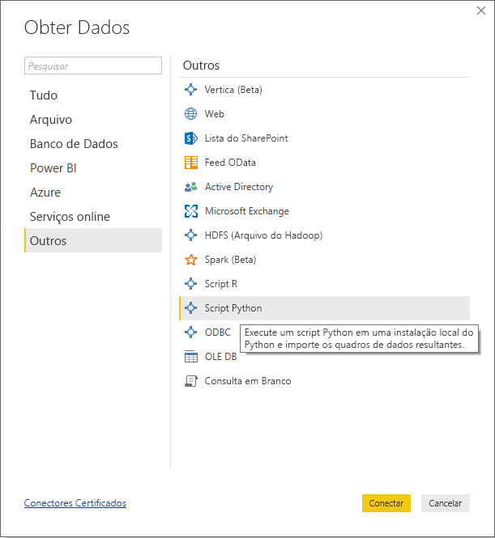
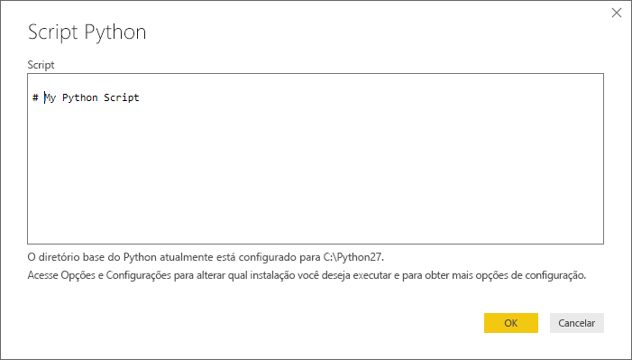
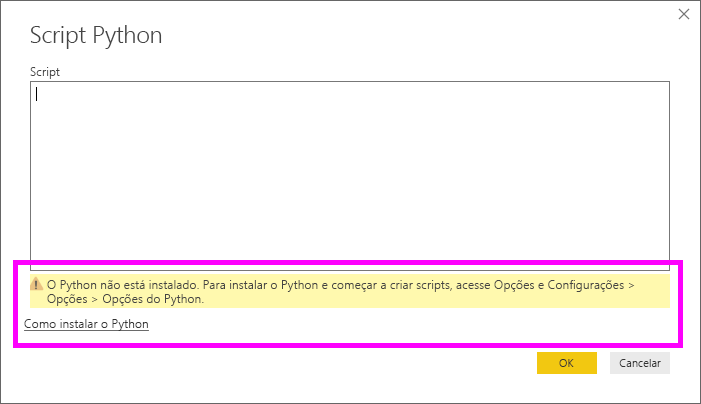
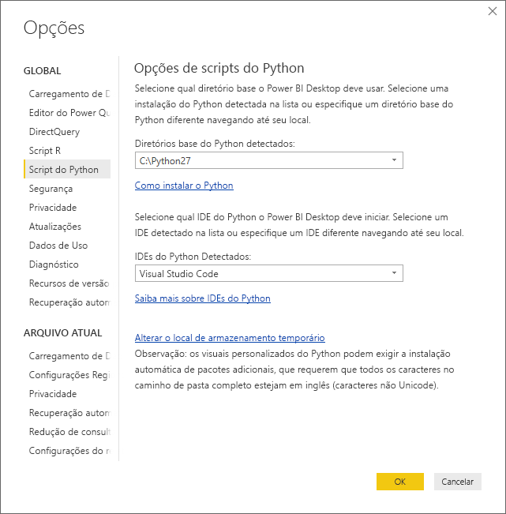

# <a name="run-python-scripts-in-power-bi-desktop"></a>Executar scripts do Python no Power BI Desktop
É possível executar scripts do Python diretamente no **Power BI Desktop** e importar os conjuntos de dados resultantes para um modelo de dados do Power BI Desktop.

## <a name="install-python"></a>Instalar o Python
Para executar scripts do Python no Power BI Desktop, você precisa instalar o **Python** em seu computador local. Você pode baixar e instalar o **Python** gratuitamente em vários locais, incluindo a [página de download do Python Oficial](https://www.python.org/) e o [Anaconda](https://anaconda.org/anaconda/python/). A versão atual do script Python no Power BI Desktop dá suporte a caracteres Unicode, bem como espaços (caracteres vazios) no caminho de instalação.

### <a name="install-required-python-packages"></a>Instalar pacotes necessários do Python
A integração entre o Power BI e o Python exige a instalação de dois pacotes do Python (Pandas e Matplotlib).  Usando a ferramenta de linha de comando PIP, instale os dois pacotes a seguir.

```
pip install pandas
pip install matplotlib
```

## <a name="run-python-scripts"></a>Executar scripts Python
Com apenas algumas etapas no Power BI Desktop, é possível executar scripts do Python e criar um modelo de dados, por meio do qual você pode criar relatórios e compartilhá-los no serviço do Power BI.

### <a name="prepare-a-python-script"></a>Preparar um script do Python
Para executar um script do Python no Power BI Desktop, crie o script em seu ambiente de desenvolvimento local do Python e certifique-se de que ele é executado com êxito.

Para executar o script no Power BI Desktop, verifique se o script é executado com êxito em um workspace novo e modificado. Isso significa que todos os pacotes e dependências devem ser explicitamente carregados e executados.

Ao preparar e executar um script Python no Power BI Desktop, existem algumas limitações:

* Somente os quadros de dados do Pandas são importados, portanto, verifique se os dados que você deseja importar para o Power BI são representados em um quadro de dados
* Qualquer script Python que é executado por mais de 30 minutos expira
* Chamadas interativas no script Python, como aguardar a entrada do usuário, interrompem a execução do script
* Ao definir o diretório de trabalho dentro do script Python, é *necessário* definir um caminho completo para o diretório de trabalho, em vez de um caminho relativo
* No momento, não há suporte para tabelas aninhadas (tabela de tabelas) 

### <a name="run-your-python-script-and-import-data"></a>Executar o script Python e importar dados
1. No Power BI Desktop, o conector de dados de Script Python é encontrado em **Obter Dados**. Para executar o Script Python, selecione **Obter Dados &gt; Mais...** e, em seguida, selecione **Outros &gt; Script Python**, como mostrado na imagem a seguir:
   
   
2. Se o Python estiver instalado no computador local, a versão mais recente instalada será selecionada como o mecanismo do Python. Basta copiar o script na janela de script e selecionar **OK**.
   
   
3. Se o Python não estiver instalado, não for identificado, ou se houver várias instalações no seu computador local, o aviso será exibido.
   
   
   
   As configurações de instalação do Python estão localizadas centralmente na seção Script Python do diálogo Opções. Para especificar as configurações de instalação do Python, selecione **Arquivo > Opções e configurações** e, em seguida, **Opções > Script Python**. Se houver várias instalações do Python disponíveis, será exibido um menu suspenso que permite selecionar qual instalação será usada. Você também pode selecionar **Outros** e fornecer o caminho personalizado.
   
   
4. Selecione **OK** para executar o Script Python. Quando o script é executado com êxito, você pode escolher os quadros de dados resultantes para adicionar ao modelo do Power BI.

### <a name="refresh"></a>Atualizar
É possível atualizar um script Python no Power BI Desktop. Quando você atualiza um script Python, o Power BI Desktop o executa novamente no ambiente do Power BI Desktop.

## <a name="next-steps"></a>Próximas etapas
Dê uma olhada nas informações adicionais a seguir sobre o Python no Power BI.

* [Criar Visuais do Python no Power BI Desktop](desktop-python-visuals.md)
* [Usar um IDE do Python externo com o Power BI](desktop-python-ide.md)
