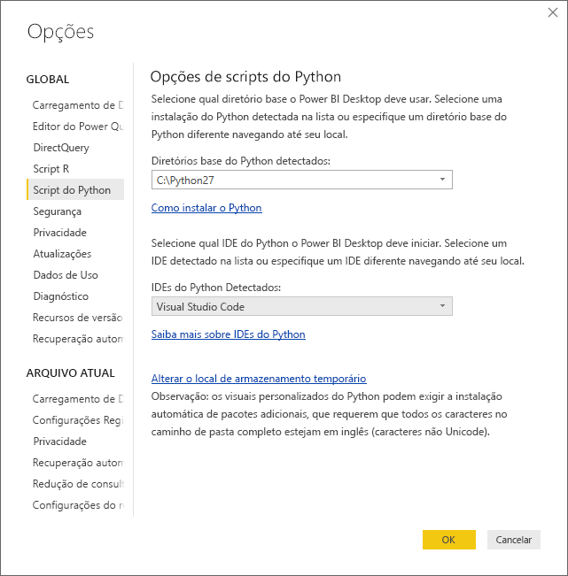
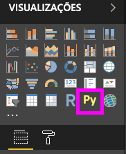
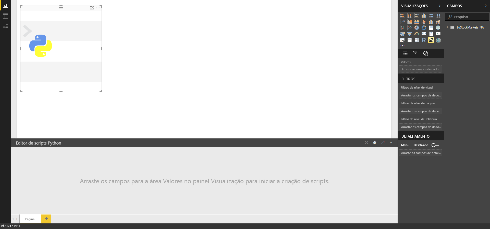
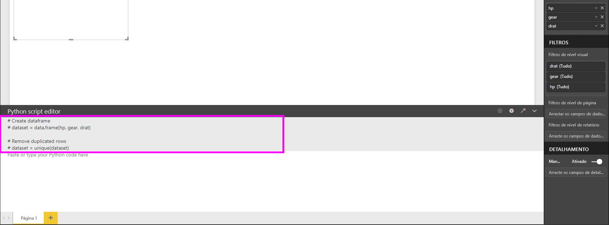
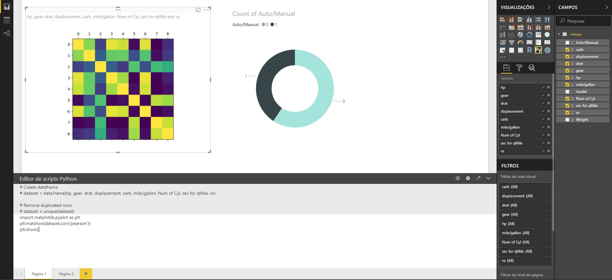
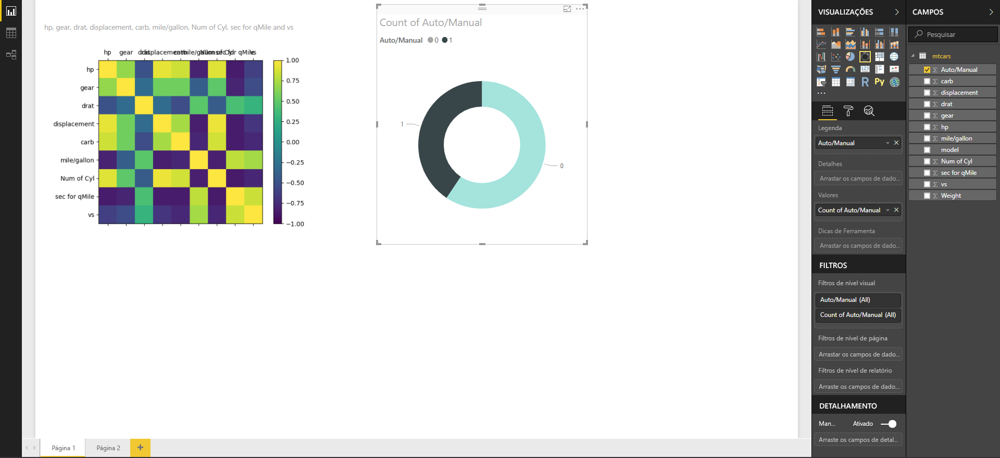
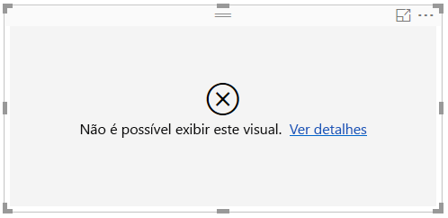

# Criar visuais do Power BI usando Python
Com o **Power BI Desktop**, é possível usar o **Python** para visualizar seus dados.

## Instalar o Python
O **Power BI Desktop** não inclui, implanta ou instala o mecanismo **Python**. Para executar scripts Python no **Power BI Desktop**, é necessário instalar o **Python** em seu computador local separadamente. Você pode baixar e instalar o **Python** gratuitamente em vários locais, incluindo a [página de download do Python Oficial](https://www.python.org/) e o [Anaconda](https://anaconda.org/anaconda/python/). A versão atual do script Python no Power BI Desktop dá suporte a caracteres Unicode, bem como espaços (caracteres vazios) no caminho de instalação.

## Habilitar visuais do Python
Para habilitar visuais do Python, selecione **Arquivo > Opções e configurações > Opções** e, na página **Opções** exibida, verifique se sua instalação local do Python está especificada na seção **Script do Python** da janela **Opções**, conforme mostrado na imagem a seguir. Na imagem a seguir, a instalação local do caminho do Python é **C:\Python27**, e esse caminho é explicitamente fornecido na caixa de texto. Verifique se o caminho que ele exibe reflete corretamente a instalação local do Python que você deseja que o **Power BI Desktop** use.
   
   

Depois que você especifica a instalação do Python, está pronto para começar a criar visuais do Python.

## Criar Visuais do Python no Power BI Desktop
1. Selecione o ícone **Visual do Python** no painel **Visualização**, como mostrado na imagem a seguir para adicionar um visual do Python.
   
   

   Quando você adiciona um visual do Python a um relatório, o **Power BI Desktop** faz o seguinte:
   
   - Uma imagem do visual do Python no espaço reservado aparece na tela de relatório.
   
   - O **editor de script Python** aparece na parte inferior do painel central.
   
   

2. Em seguida, adicione os campos que deseja consumir no seu script Python à seção **Valores** em **Campos** também, como faria com qualquer outro visual do **Power BI Desktop**. 
    
    Somente os campos que foram adicionados aos **Campos** estão disponíveis para seu script Python. Você pode adicionar novos campos ou remover campos desnecessários de **Campos** enquanto trabalha em seu script Python no **editor de scripts Python do Power BI Desktop**. O **Power BI Desktop** detecta automaticamente os campos que você adicionou ou removeu.
   
   > [!NOTE]
   > O tipo de agregação padrão para visuais do Python é *não resumir*.
   > 
   > 
   
3. Agora você pode usar os dados selecionados para plotar. 

    Ao selecionar campos, o **editor de script Python** gera um código de associação de script Python com suporte com base em suas seleções na seção cinza na parte superior do painel do editor. Ao selecionar ou remover campos adicionais, o suporte de código no editor de script Python é automaticamente gerado ou removido adequadamente.
   
   No exemplo mostrado na imagem a seguir, três campos foram selecionados: hp, preparar e drat. Como resultado dessas seleções, o editor de script Python gerou o seguinte código de associação:
   
   * Um dataframe chamado **dataset** foi criado
     * Esse dataframe é composto por diferentes campos selecionados pelo usuário
   * A agregação padrão é *não resumir*
   * Semelhantes aos elementos visuais de tabela, os campos são agrupados e as linhas duplicadas aparecem somente uma vez
   
   
   
   > [!TIP]
   > Em certos casos, talvez você não queira que ocorra um agrupamento automático, ou talvez queira exibir todas as linhas, incluindo duplicatas. Nesse caso, você pode adicionar um campo de índice ao conjunto de dados que faz com que todas as linhas sejam consideradas exclusivas, impedindo o agrupamento.
   > 
   > 
   
   O dataframe gerado é chamado de **conjunto de dados**, e você pode acessar as colunas selecionadas por seus respectivos nomes. Por exemplo, acesse o campo de engrenagem escrevendo *dataset["gear"]* em seu script Python.

4. Com o dataframe gerado automaticamente pelos campos selecionados, você está pronto para escrever um script Python que resulta em plotar ao dispositivo padrão do Python. Quando o script for concluído, selecione **Executar** na barra de título **editor de script Python** (**Executar** está no lado direito da barra de título).
   
    Ao selecionar **Executar**, o **Power BI Desktop** identifica a plotagem e a apresenta na tela. Uma vez que o processo é executado em sua instalação local do Python, certifique-se de pacotes necessários estão instalados.
   
   O **Power BI Desktop** plota novamente o visual quando qualquer um dos seguintes eventos ocorre:
   
   * Ao selecionar **Executar** na barra de título **Editor de script Python**
   * Sempre que ocorre uma alteração de dados, devido à atualização de dados, filtragem ou realce

    A imagem a seguir mostra um exemplo de código de plotagem a correlação, e plota as correlações entre atributos de tipos diferentes de carros.

    

5. Para obter uma exibição ampliada das visualizações, você pode minimizar a **editor de script Python**. E, claro, como outros visuais no **Power BI Desktop**, é possível cruzar o filtro da plotagem de correlação ao selecionar somente carros do tipo esporte no visual de rosca (o visual redondo à direita, na imagem de exemplo acima).

    

6. Você também pode modificar o script Python para personalizar o visual e aproveitar o poder do Python, adicionando parâmetros ao comando de plotagem.

    O comando original de plotagem era o seguinte:

    plt.matshow(dataset.corr('pearson'))

    Com algumas alterações ao script Python, o comando agora é o seguinte:

    plt.matshow(dataset.corr('kendall'))

    Como resultado, o visual do Python agora plota usando o coeficiente de correlação Kendall Tau, conforme mostrado na imagem a seguir.

    

    Ao executar um script Python que resulta em um erro, o visual do Python não é plotado e uma mensagem de erro é exibida na tela. Para obter detalhes sobre o erro, selecione **Ver detalhes** no erro do visual do Python na tela.

    

    > **Segurança de scripts Python:** visuais do Python são criados com base em scripts Python, que podem conter códigos com riscos de segurança ou privacidade. Ao tentar exibir ou interagir com um visual do Python pela primeira vez, o usuário recebe uma mensagem de aviso de segurança. Habilite visuais do Python somente se você confiar no autor e na fonte ou após examinar e compreender o script Python.
    > 
    > 

## Limitações conhecidas
Os visuais do Python no **Power BI Desktop** apresentam algumas limitações:

* Limitações de tamanho de dados – os dados usados pelo visual do Python para plotar são limitados a 150 mil linhas. Se mais de 150.000 linhas forem selecionadas, somente as primeiras 150.000 linhas serão usadas e uma mensagem será exibida na imagem.
* Limite de tempo de cálculo – se um cálculo do visual do Python exceder 5 minutos, a execução atingirá o tempo limite, resultando em um erro.
* Relacionamentos – assim como acontece com outros visuais do Power BI Desktop, se os campos de dados de tabelas diferentes sem uma relação definida entre eles forem selecionados, ocorrerá um erro.
* Visuais do Python são atualizados após atualizações de dados, filtragem e realce. No entanto, a própria imagem não é interativa e não pode ser a origem da filtragem cruzada.
* Visuais do Python respondem ao realce de outros elementos visuais, mas você não pode clicar em elementos no visual do Python para fazer filtragem cruzada de outros elementos.
* Somente plotagens realizadas no dispositivo de vídeo padrão do Python são exibidos corretamente na tela. Evite o uso explícito de um dispositivo de vídeo diferente do Python.

## Próximas etapas
Dê uma olhada nas informações adicionais a seguir sobre o Python no Power BI.

* [Como executar de scripts do Python no Power BI Desktop](desktop-python-scripts.md)
* [Usar um IDE do Python externo com o Power BI](desktop-python-ide.md)

