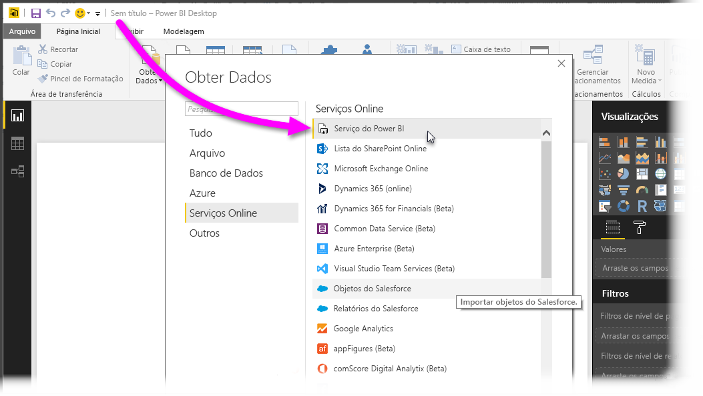
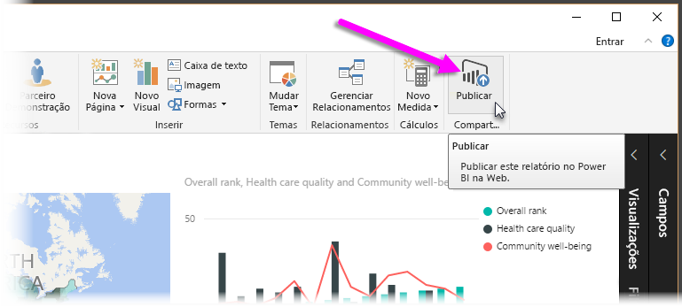
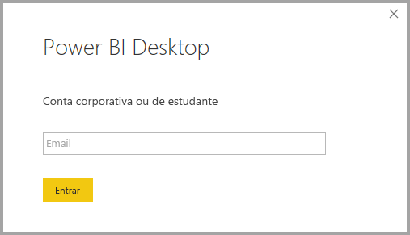
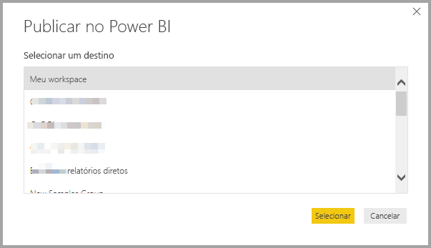
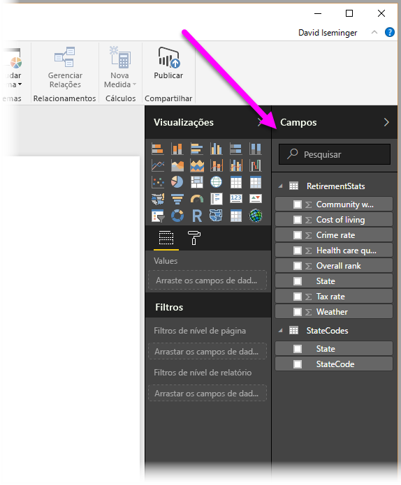

# Conectar-se a conjuntos de dados no serviço do Power BI no Power BI Desktop
Você pode estabelecer uma conexão dinâmica a um conjunto de dados compartilhado no serviço do Power BI e criar vários relatórios diferentes com base no mesmo conjunto de dados. Isso significa que você pode criar seu modelo de dados perfeito no Power BI Desktop e publicá-lo no serviço do Power BI. Em seguida, você e outros usuários podem criar vários relatórios diferentes (em arquivos .pbix separados) usando esse mesmo Common Data Service e salvá-los em workspaces diferentes. Esse recurso é chamado de **conexão dinâmica do serviço do Power BI**.

São inúmeras as vantagens encontradas nesse recurso, incluindo práticas recomendadas, que discutiremos ao longo deste artigo. Há também algumas considerações e limitações, portanto, certifique-se de ler todo o conteúdo relacionado, que está disponível no fim deste artigo.

## Uso da conexão dinâmica ao serviço do Power BI para gerenciamento do ciclo de vida do relatório
Um desafio causado pela popularidade do Power BI é a proliferação de relatórios, dashboards e modelos de dados subjacentes. Eis o porquê: é fácil criar relatórios atraentes no **Power BI Desktop** e depois compartilhar ([publicar](desktop-upload-desktop-files.md)) esses relatórios no **serviço do Power BI**, bem como criar excelentes dashboards a partir dos conjuntos de dados. Visto que muitas pessoas estavam agindo dessa forma, usando com frequência os mesmos (ou quase os mesmos) conjuntos de dados, saber qual relatório se baseou em qual conjunto de dados (e o quão atual cada conjunto de dados é) tornou-se um desafio. A **conexão dinâmica ao serviço do Power BI** lida com esse desafio e torna mais fácil e consistente criar, compartilhar e expandir a partir de relatórios e dashboards de conjuntos de dados comuns.

### Crie um conjunto de dados que todos possam usar e compartilhe-o
Digamos que Anna (uma analista de negócios) pertence à sua equipe e é ótima na criação de modelos de dados muito bem feitos (geralmente chamados de conjuntos de dados). Com sua competência, Anna pode criar conjuntos de dados e relatórios e compartilhar os relatórios no **serviço do Power BI**.

Todos adoram seus relatórios e conjuntos de dados, e é aí que o problema começa: cada membro do grupo tentará criar *sua própria versão* do conjunto de dados e depois compartilhar seus próprios relatórios com a equipe. De repente, surge uma infinidade de relatórios (de diferentes conjuntos de dados) no workspace da equipe no **serviço do Power BI**. Qual deles é o mais recente? Os conjuntos de dados eram os mesmos ou quase os mesmos? Quais eram as diferenças? Com o recurso de **conexão dinâmica ao serviço do Power BI**, tudo isso pode mudar para melhor. Na próxima seção, veremos como os demais membros da equipe podem usar o conjunto de dados publicado de Anna em seus próprios relatórios e workspaces e usar o mesmo conjunto de dados consistente, verificado e publicado para criar seus próprios relatórios exclusivos.

### Conectar-se a um conjunto de dados do serviço do Power BI usando uma conexão dinâmica
Depois de criar o relatório (e o conjunto de dados no qual se baseou), Anna o publica no **serviço do Power BI**, que será exibido no workspace da sua equipe no serviço do Power BI. Se ela o salvar em um *novo workspace de experiência*, então ela poderá definir a permissão de build para torná-lo disponível para visualização e uso por todas as pessoas dentro e fora de seu workspace.

Para saber mais sobre novos workspaces de experiência, confira [Workspaces de aplicativo](service-new-workspaces.md).

Outros membros dentro e fora do workspace podem agora estabelecer uma conexão dinâmica com o modelo de dados compartilhado de Anna (usando o recurso de **conexão dinâmica ao serviço do Power BI**) e criar seus próprios relatórios exclusivos usando o *conjunto de dados original* em *seus novos workspaces de experiência*.

Na imagem a seguir, veja como Anna cria relatórios no **Power BI Desktop** e os publica (inclui o modelo de dados correspondente) no **serviço do Power BI**. Em seguida, os demais membros poderão se conectar a seu modelo de dados usando a **conexão dinâmica ao serviço do Power BI** e criar seus próprios relatórios exclusivos em seus próprios workspaces com base no conjunto de dados de Anna.

> [!NOTE]
> Se você salvar seu conjunto de dados em um [workspace compartilhado clássico](service-create-workspaces.md), somente os membros desse workspace poderão criar relatórios no seu conjunto de dados. Para estabelecer uma conexão dinâmica ao serviço do Power BI, o conjunto de dados ao qual você se conecta deve estar em um workspace compartilhado em que você é membro.
> 
> 

## Passo a passo sobre como usar a conexão dinâmica ao serviço do Power BI
Agora que sabemos o quanto a **conexão dinâmica ao serviço do Power BI** é útil e como você pode usá-la como abordagem para melhores práticas de gerenciamento do ciclo de vida do relatório, vejamos as etapas necessárias para transformar os magníficos relatórios de Anna (e o conjunto de dados) em um conjunto de dados compartilhado que seus colegas de equipe do Power BI poderão usar.

### Publicar um relatório do Power BI e o conjunto de dados
A primeira etapa do gerenciamento do ciclo de vida de relatórios usando uma **conexão dinâmica ao serviço do Power BI** é ter um relatório (e um conjunto de dados) que os colegas de equipe queiram usar. Sendo assim, Anna deve primeiro **publicar** o relatório dela do **Power BI Desktop**. Para fazer isso, ela deve selecionar **Publicar** na faixa de opções **Início** no Power BI Desktop.

Se Anna não estiver conectada à sua conta de serviço do Power BI, ela será solicitada a fazê-lo.

Após conectar-se, ela poderá escolher o destino no workspace no qual o relatório e o conjunto de dados serão publicados. Lembre-se de que, se ela salvar o relatório em um novo workspace de experiência, qualquer pessoa com permissão de build poderá ter acesso a esse conjunto de dados. A permissão de build é definida no serviço do Power BI, após a publicação. Se ela salvar o relatório em um workspace clássico, somente membros com acesso ao workspace no qual há relatórios publicados poderão acessar seu conjunto de dados usando uma **conexão dinâmica ao serviço do Power BI**.

O processo de publicação é iniciado, e o **Power BI Desktop** mostra o andamento.

Concluído o processo, o **Power BI Desktop** mostrará o sucesso da publicação e fornecerá alguns links de acesso ao relatório propriamente dito no **serviço do Power BI**, bem como um link para acessar **Insights rápidos** no relatório.

Agora que seu relatório com o conjunto de dados está no serviço do Power BI, você também pode *promovê-lo* para atestar sua qualidade e confiabilidade. Você ainda pode solicitar que ele seja *certificado* por uma autoridade central em seu locatário do Power BI. Com um desses endossos, seu conjunto de dados sempre será exibido no tópico da lista quando as pessoas estiverem procurando por conjuntos de dados. Se estiver interessado, você poderá ler mais sobre o processo de [promoção de seu conjunto de dados](service-datasets-promote.md). 

A última etapa é definir a *permissão de build* para o conjunto de dados no qual o relatório se baseia. A permissão de build determina quem pode ver e usar seu conjunto de dados. Você pode defini-la no workspace ou quando você compartilha um aplicativo do workspace. Leia mais sobre como definir a [permissão de build](service-datasets-build-permissions.md#build-permissions-for-shared-datasets).

Em seguida, vejamos como os outros colegas de equipe com acesso ao workspace onde o relatório (e o conjunto de dados) foi publicado podem se conectar ao conjunto de dados e criar seus próprios relatórios.

### Estabelecer uma conexão dinâmica ao serviço do Power BI com o conjunto de dados publicado
Para estabelecer uma conexão com o relatório publicado e criar seu próprio relatório com base no conjunto de dados publicado, selecione **Obter dados** na faixa de opções **Página Inicial** no **Power BI Desktop** e selecione **Power BI** no painel à esquerda e, em seguida, selecione **Conjuntos de dados do Power BI**.

Caso não tenha acessado ainda o Power BI, você será solicitado a fazê-lo. Após fazer logon, uma janela mostrará os workspaces dos quais você é membro, permitindo selecionar o workspace que contém o conjunto de dados com o qual você deseja estabelecer uma **conexão dinâmica ao serviço do Power BI**.

Os conjuntos de dados na lista são todos os conjuntos de dados compartilhados que você tem permissão de build, em qualquer workspace. Você pode pesquisar um conjunto de dados específico e ver seu nome, proprietário, o workspace no qual ele reside e quando ele foi atualizado pela última vez. Também é possível ver os conjuntos de dados *endossados*, certificados ou promovidos, na parte superior da lista. 

Ao selecionar **Carregar** na janela, é estabelecida uma conexão dinâmica ao conjunto de dados selecionado, isto é, os dados visualizados (os campos e seus valores) são carregados no **Power BI Desktop** em tempo real.

Agora, você (e outras pessoas) podem criar e compartilhar relatórios personalizados com base no mesmo conjunto de dados. Essa é uma excelente maneira de poder contar com uma pessoa experiente para criar um conjunto de dados bem estruturado (assim como Anna faz) e permitir que vários colegas de equipe utilizem o conjunto de dados compartilhado para criar seus próprios relatórios.

## Limitações e considerações
Ao usar a **conexão dinâmica ao serviço do Power BI**, há algumas limitações e considerações a serem observadas.

* Somente os usuários com permissão de build para um conjunto de dados podem se conectar ao conjunto de dados publicado usando a **conexão dinâmica ao serviço do Power BI**. 
* Os usuários gratuitos só veem os conjuntos de dados de Meu Workspace e de workspaces Premium.
* Como essa é uma conexão dinâmica, a navegação à esquerda e a modelagem são desabilitadas; esse comportamento é semelhante a quando conectado ao **SQL Server Analysis Services**.
* Por se tratar de uma conexão dinâmica, a RLS (segurança em nível de linha e de função), o OneDrive for Business e outros comportamentos de conexão semelhantes são executados da mesma forma como quando conectado ao **SQL Server Analysis Services**.
* Se o proprietário modifica o arquivo .pbix original compartilhado, o conjunto de dados e o relatório compartilhado no **serviço do Power BI** são substituídos. Os relatórios baseados no conjunto de dados não são substituídos, mas as alterações ao conjunto de dados são refletidas no relatório.
* Membros de um workspace não podem substituir o relatório originalmente compartilhado. Tentar fazer isso resulta em um aviso solicitando que você renomeie o arquivo e o publique.
* Se você excluir o conjunto de dados compartilhado no **serviço do Power BI**, outros relatórios baseados no conjunto de dados não funcionarão corretamente nem exibirão seus visuais.
* Para Pacotes de conteúdo, é necessário primeiro criar uma cópia do pacote de conteúdo antes de usá-lo como base para o compartilhamento de relatórios e conjuntos de dados .pbix no **serviço do Power BI**.
* Para pacotes de conteúdo da *Minha Organização*, uma vez copiados, não é possível substituir o relatório criado no serviço e/ou um relatório criado como parte da cópia de um pacote de conteúdo com uma conexão dinâmica. Tentar fazer isso resulta em um aviso solicitando que você renomeie o arquivo e o publique. Nessa situação, você pode substituir apenas relatórios conectados publicados dinamicamente.
* A exclusão de um conjunto de dados compartilhado no **serviço do Power BI** significa que ninguém pode mais acessar o conjunto de dados do **Power BI Desktop**.

