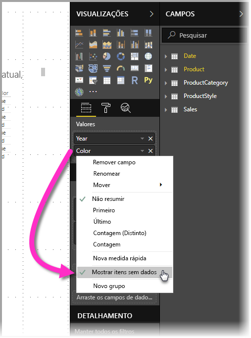
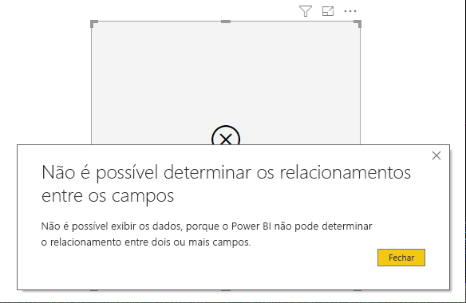

# Mostrar itens sem dados no Power BI

O Power BI permite visualizar todos os tipos de dados de várias fontes. Na criação de um visual, o Power BI mostra apenas dados relevantes para gerenciar corretamente como os dados são apresentados e exibidos. O Power BI determina quais dados são relevantes com base na configuração do visual e o modelo de dados subjacente. Este artigo descreve como o Power BI se comporta ao determinar dados relevantes, com exemplos que ilustram como são feitas as determinações.

## Determinar dados relevantes

Para começar a compreender como o Power BI determina quais dados são relevantes para serem exibidos, vamos considerar uma tabela como um exemplo simples. Usando o modelo representado na seção de exemplos, localizada no final deste artigo, considere criar uma tabela com as seguintes configurações:

**1. Grupos da mesma tabela:** *Product[Color] – Product[Size]*

|*Product[Color]*  |*Product[Size]*  |
|---------|---------|
|Azul     |Grande         |
|Azul     |Médio         |
|Azul     |Pequeno         |
|Vermelho     |Grande         |

Neste exemplo, o Power BI exibe as combinações de *[Color-Size]* que existem na tabela *[Product]*. 

Agora vamos dar uma olhada em uma combinação diferente:

**2. Grupos de tabelas diferentes, mas relacionadas diretamente, e uma medida:** *ProductStyle[Finish] – Product[Color] – Sum(Sales[Quantity])*

|*ProductStyle[Finish]*  |*Product[Color]*  |*[SumQuantity]*  |
|---------|---------|---------|
|Brilho     |Azul         |10         |
|Fosco     |Azul         |15         |

Neste exemplo, o Power BI exibe apenas as combinações que existem. Por exemplo, ele não exibirá ("Nenhum" + "Azul") ou ("Fosco" + "Vermelho") porque essas combinações não existem no modelo. A condição que determina quais combinações existem é o valor de *Sum(Sales[Quantity])* não estar em branco.

Vejamos agora um caso diferente: 

**3. Grupos de tabelas diferentes mas relacionadas diretamente e nenhuma medida:** *ProductStyle[Finish] – Product[Color]*

|*ProductStyle[Finish]*  |*Product[Color]*  |
|---------|---------|
|Brilho     |Azul         |
|Brilho     |Vermelho         |
|Fosco     |Azul         |

Como não há medidas explícitas, e as duas tabelas estão diretamente relacionadas, o Power BI tenta injetar uma medida para restringir as combinações resultantes. Nesse caso, o Power BI injeta uma medida *CALCULATE(COUNTROWS('Product'))*, que não deve estar em branco, uma vez que *Product* é a tabela comum a ambas as tabelas.

Dessa forma, o Power BI exibe as combinações que têm entradas na tabela Product, que exclui as combinações de *("Nenhum" + "Azul")* e *("Fosco" + "Vermelho")*.

**4. Grupos de tabelas diferentes e não relacionadas**

O modelo de exemplo não tem essa combinação, mas se houvesse grupos de tabelas não relacionados e diferentes, o Power BI não conseguiria relacionar duas colunas. O resultado seria uma união cruzada de todos os valores de cada coluna. Nessa situação, o Power BI emite um erro do tipo *junção irrestrita* porque essas junções cruzadas são custosas de calcular no banco de dados e não fornecem muitas informações a um usuário. 

## Mostrar itens sem dados

A seção anterior descreveu como o Power BI determina quais dados são relevantes para serem exibidos. Mas pode haver momentos em que você *quer* mostrar itens sem dados. 

O recurso **Show items with no data** (Mostrar itens sem dados) permite fazer exatamente isso: incluir linhas e colunas de dados que não contêm dados de medida (valores de medida em branco).

Para habilitar o recurso **Mostrar itens sem dados**, selecione um visual e, no contêiner **Campos**, clique com o botão direito do mouse no campo e selecione **Mostrar itens sem dados** no menu que é exibido, como mostrado na seguinte imagem:

O recurso **Show items with no data** (Mostrar itens sem dados) *não* tem efeito nas seguintes circunstâncias:

* Não há nenhuma medida adicionada ao elemento visual, e as colunas de agrupamento são provenientes da mesma tabela
* Os grupos não estão relacionados. O Power BI não executa consultas para elementos visuais que têm grupos não relacionados
* A medida não está relacionada a qualquer um dos grupos. Isso ocorre porque a medida nunca ficará em branco apenas para algumas combinações de grupo
* Há um filtro de medida definido pelo usuário que exclui as medidas em branco, por exemplo: *SalesAmount > 0*

### Como funciona o recurso Mostrar itens sem dados

Os casos de uso mais interessantes de **Show items with no data** (Mostrar itens sem dados) são quando existem medidas presentes. Vamos examinar a situação quando os grupos são da mesma tabela ou podem estar relacionados por meio de um caminho no modelo. Por exemplo, *ProductStyle* está diretamente relacionado a *Product* e indiretamente relacionado a *Sales*, *ProductStyle* e *ProductCategory* podem estar relacionados por meio da tabela *Product* e assim por diante.

Vamos examinar alguns casos interessantes e comparar quando **Show items with no data** (Mostrar itens sem dados) está desativado e ativado. 

**1. Colunas de agrupamento da mesma tabela:** *Product[Color] – Product[Size] – Sum(Sales[Quantity])*

Como são exibidas com o recurso **Show items with no data** (Mostrar itens sem dados) desativado:

|*Product[Color]*  |*Product[Size]*  |*[SumQuantity]*  |
|---------|---------|---------|
|Azul     |Médio         |15         |
|Azul     |Pequeno         |10         |

Como são exibidas com o recurso **Show items with no data** (Mostrar itens sem dados) ativado:

|*Product[Color]*  |*Product[Size]*  |*[SumQuantity]*  |
|---------|---------|---------|
|Azul     |Grande         |         |
|Azul     |Médio         |15         |
|Azul     |Pequeno         |10         |
|Vermelho     |Grande         |         |

Observe como duas novas combinações são exibidas com o recurso ativado: *Azul – Grande* e *Vermelho – Grande*. As duas entradas não têm nenhum correspondente de *Quantity* na tabela *Sales*. No entanto, elas são exibidas na tabela *Product*.

**2. Colunas de agrupamento de tabelas relacionadas:** *ProductStyle[Finish] – Product[Color] – Sum(Sales[Quantity])*

Como são exibidas com o recurso **Show items with no data** (Mostrar itens sem dados) desativado:

|*ProductStyle[Finish]*  |*Product[Color]*  |*[SumQuantity]*  |
|---------|---------|---------|
|Brilho     |Azul         |10         |
|Fosco     |Azul         |15         |

Como são exibidas com o recurso **Show items with no data** (Mostrar itens sem dados) ativado:

|*ProductStyle[Finish]*  |*Product[Color]*  |*[SumQuantity]*  |
|---------|---------|---------|
|Brilho     |Azul         |10         |
|Brilho     |Vermelho         |         |
|Fosco     |Azul         |15         |
|Nenhum     |         |         |

Observe como *(Brilho-Vermelho)* e *(Nenhum, em branco)* aparecem como combinações. Aqui está o motivo da exibição:
* O Power BI primeiro considerou ProductStyle[Finish] e selecionou todos os valores para serem exibidos, o que resultou em Brilho, Fosco, Nenhum.
* Usando cada um desses valores, o Power BI selecionou todas as entradas *Product[Color]* correspondentes 
* Uma vez que *Nenhum* não corresponde a qualquer *Product[Color]*, um espaço em branco é exibido para esse valor

É importante observar que o mecanismo de seleção de valores para as colunas é dependente da ordem e pode ser pensado como uma operação de *junção externa esquerda* entre tabelas. Se a ordem das colunas for alterada, os resultados serão alterados também.

Vamos ver um exemplo de como alterar a ordem e como isso afeta os resultados. É igual ao item **2** desta seção, mas com a ordem alterada.

**Product[Color] – ProductStyle[Finish] – Sum(Sales[Quantity])**

Como são exibidas com o recurso **Show items with no data** (Mostrar itens sem dados) ativado:

|*Product[Color]* |*ProductStyle[Finish]*  |*[SumQuantity]*  |
|---------|---------|---------|
|Azul     |Brilho         |10         |
|Azul     |Fosco         |15         |
|Vermelho     |Brilho         |         |

Nesse caso, observe como *ProductStyle[Finish]=None* não aparece na tabela. Isso ocorre porque, neste caso, o Power BI selecionou primeiro todos os valores de *Color* na tabela *Product*. Em seguida, para cada cor, o Power BI selecionou valores de *Finish* correspondentes que continham dados. Uma vez que *None* não é exibido em nenhuma combinação de *Color*, ele não é selecionado.

## Exemplo de modelo de dados

Esta seção mostra o exemplo de modelo de dados usado nos exemplos neste artigo.

**Modelo**: 

**Dados**:

|Product[ProductId]|    Product[ProductName]|   Product[Color]| Product[Size]|  Product[CategoryId]|    Product[StyleId]|
|---------|---------|---------|---------|---------|---------|
|1  |Prod1  |Azul   |Pequeno  |1  |1 |
|2  |Prod2  |Azul   |Médio |2  |2 |
|3  |Prod3  |Vermelho    |Grande  |1  |1 |
|4  |Prod4  |Azul   |Grande  |2  |2 |

|ProductCategory[CategoryId]|   ProductCategory[CategoryName]|
|---------|---------|
|1  |Telefone   |
|2  |Câmera |
|3  |TV |

|ProductStyle[StyleId]| ProductStyle[Finish]|   ProductStyle[Polished]|
|---------|---------|---------|
|1  |Brilho  |Sim |
|2  |Fosco  |Não |
|3  |Nenhum   |Não |

|Sales[SaleId]| Sales[ProductId]|   Sales[Date]|    Sales[Quantity]|
|---------|---------|---------|---------|
|1  |1  |1/1/2012 0:00| 10 |
|2  |2  |1/1/2013 0:00| 15 |

## Próximas etapas

Este artigo descreveu como você pode habilitar o recurso **Show items with no data** (Mostrar itens sem dados) no Power BI. Você também pode estar interessado nos seguintes artigos: 

* [Membro padrão em modelos multidimensionais no Power BI](desktop-default-member-multidimensional-models.md)
