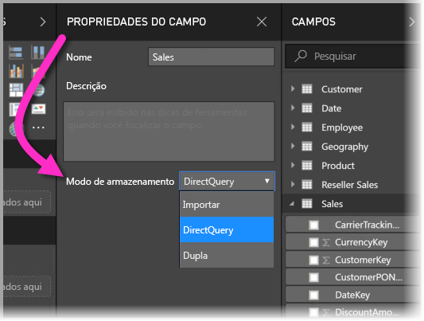
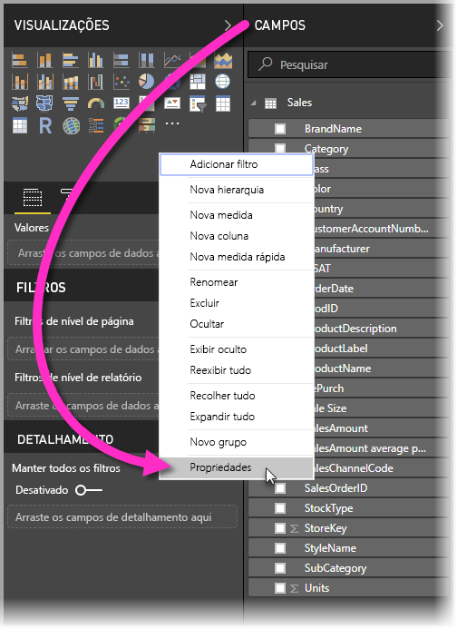
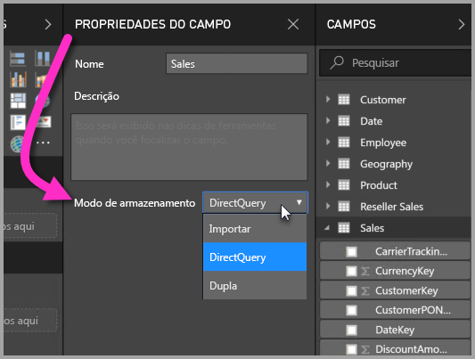
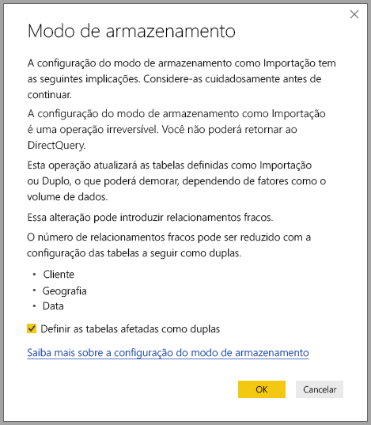

# Modo de armazenamento no Power BI Desktop (versão prévia)

No Microsoft Power BI Desktop, é possível especificar o *modo de armazenamento* das tabelas. O *Modo de armazenamento* permite controlar se o Power BI Desktop armazenamento dados da tabela em cache na memória para relatórios. 

Definir o modo de armazenamento oferece muitas vantagens. Você pode definir o modo de armazenamento para cada tabela individualmente no seu modelo. Essa ação habilita um único conjunto de dados, que fornece os seguintes benefícios:

* **Desempenho de consulta**: conforme os usuários interagem com os visuais nos relatórios do Power BI, as consultas DAX (Data Analysis Expressions) são enviadas para o conjunto de dados. O armazenamento de dados em cache na memória com a configuração adequada do modo de armazenamento pode melhorar o desempenho da consulta e a interatividade dos relatórios.

* **Grandes conjuntos de dados**: tabelas que não são armazenados em cache não consomem memória para fins de cache. Você pode habilitar a análise interativa de amplos conjuntos de dados que são muito grandes ou caros para armazenar completamente em cache na memória. É possível escolher quais tabelas valem a pena ser armazenadas em cache e quais não valem.

* **Otimização de atualização de dados**: as tabelas que não são armazenadas em cache não precisam ser atualizadas. É possível reduzir os períodos de atualização armazenando em cache apenas os dados necessários para atender aos contratos de nível de serviço e os requisitos empresariais.

* **Requisitos quase em tempo real**: as tabelas com requisitos quase em tempo real podem se beneficiar de não serem armazenadas em cache, para reduzir a latência de dados.

* **Write-back**: o write-back permite que os usuários empresariais explorem cenários hipotéticos alterando os valores das células. Aplicativos personalizados podem aplicar as alterações à fonte de dados. As tabelas não armazenadas em cache podem exibir as alterações de imediato, o que permite análise instantânea dos efeitos.

A definição do modo de armazenamento no Power BI Desktop é um dos três recursos relacionados:

* **Modelos compostos**: permite que um relatório tenha duas ou mais conexões de dados, incluindo conexões DirectQuery ou importação, em qualquer combinação. Para ver mais informações, confira [Modelos compostos no Power BI Desktop (versão prévia)](desktop-composite-models.md).

* **Relações muitos-para-muitos**: com *modelos compostos*, você pode estabelecer *relações muitos-para-muitos* entre as tabelas. *Relações muitos-para-muitos* removem os requisitos para valores exclusivos nas tabelas. Elas também removem as soluções alternativas anteriores, como introduzir novas tabelas somente para estabelecer relações. Para mais informações, confira [Relações muitos para muitos no Power BI Desktop (versão prévia)](desktop-many-to-many-relationships.md).

* **Modo de armazenamento**: agora você pode especificar quais visuais exigem uma consulta para fontes de dados de back-end. Visuais que não exigem uma consulta serão importados, mesmo se forem baseados no DirectQuery. Esse recurso ajuda a melhorar o desempenho e reduzir a carga de back-end. Antes, mesmo visuais simples como as segmentações iniciavam consultas enviadas para fontes de back-end. O modo de armazenamento é descrito em detalhes neste artigo.

## Usar a propriedade de modo de armazenamento

O modo de armazenamento é uma propriedade que pode ser definida em cada tabela do modelo. Para definir o modo de armazenamento, no painel **Campos**, clique com o botão direito do mouse na tabela cujas propriedades você deseja definir e selecione **Propriedades**.

A propriedade atual é exibida na lista suspensa **Modo de armazenamento** no painel **Propriedades de campo** da tabela. É possível exibir o modo de armazenamento atual ou modificá-lo.

Há três valores para o modo de armazenamento:

* **Importação**: quando o valor é definido para **Importação**, as tabelas importadas são armazenadas em cache. As consultas enviadas para o conjunto de dados do Power BI que retornam dados das tabelas de Importação só podem ser atendidas por dados armazenados em cache.

* **DirectQuery**: com essa configuração, as tabelas DirectQuery não são armazenadas em cache. As consultas enviadas para o conjunto de dados do Power BI – por exemplo, as consultas DAX (Data Analysis Expressions)– e que retornam dados das tabelas do DirectQuery só podem ser atendidas por meio da execução de consultas sob demanda para a fonte de dados. As consultas enviadas à fonte de dados usam a linguagem de consulta para essa fonte de dados – por exemplo, SQL.

* **Dupla**: as tabelas duplas podem se comportar como armazenadas em cache ou não, dependendo do contexto da consulta enviada para o conjunto de dados do Power BI. Em alguns casos, você atende às consultas de dados armazenados em cache. Em outros casos, você atende às consultas executando uma consulta sob demanda para a fonte de dados.

Alterar uma tabela para **Importação** é um operação *irreversível*. Essa propriedade não pode ser alterada de volta para DirectQuery ou Dupla.

## Restrições em tabelas duplas e do DirectQuery

As tabelas duplas têm as mesmas restrições de função que as tabelas DirectQuery. Essas restrições incluem transformações em M limitadas e as funções restritas do DAX em colunas calculadas. Para mais informações, confira [Implicações do uso do DirectQuery](desktop-directquery-about.md#implications-of-using-directquery).

## Propagação de Dupla
Considere o seguinte modelo simples, em que todas as tabelas são de uma única fonte que dá suporte à Importação e DirectQuery.

Digamos que, de início, todas as tabelas nesse modelo sejam do tipo DirectQuery. Se alterarmos, então, o **modo de armazenamento** da tabela *SurveyResponse* para Importação, a seguinte janela de aviso aparecerá:

As tabelas de dimensão (*Customer*, *Geography* e *Date*) podem ser definidas como **Dupla** para reduzir o número de relações fracas no conjunto de dados e melhorar o desempenho. Normalmente, as relações fracas envolvem pelo menos uma tabela do DirectQuery, na qual a lógica de associação não pode ser enviada para os sistemas de origem. O fato de que as tabelas **Duplas** podem agir como DirectQuery ou Importação ajuda a evitar isso.

A lógica de propagação é projetada para ajudar com os modelos que contêm muitas tabelas. Digamos que você tenha um modelo com 50 tabelas e que apenas determinadas tabelas de fatos (transacionais) precisem ser armazenadas em cache. A lógica no Power BI Desktop descobre o conjunto mínimo de tabelas de dimensões que precisa ser definido como **Duplo** para que você não precise fazer isso.

A lógica de propagação percorre somente em direção a um dos lados das relações **um para muitos**.

## Exemplo de uso do modo de armazenamento
Continuemos com o exemplo da seção anterior e imaginemos a aplicação das seguintes configurações de propriedade do modo de armazenamento:

| Tabela                   | Modo de armazenamento         |
| ----------------------- |----------------------| 
| *Vendas*                 | DirectQuery          | 
| *SurveyResponse*        | Importar               | 
| *Data*                  | Dupla                 | 
| *Cliente*              | Dupla                 | 
| *Geografia*             | Dupla                 | 

Definir essas propriedades do modo de armazenamento resultará nos comportamentos a seguir, supondo que a tabela *Vendas* tenha um volume de dados significativos.
* O Power BI Desktop armazena as tabelas de dimensões em cache – *Data*, *Cliente* e *Geografia* – portanto, os tempos de carregamento iniciais do relatório precisam ser rápidos ao recuperar valores de segmentação a ser exibidos.
* Se a tabela *Vendas* não for armazenada em cache, o Power BI Desktop fornece os seguintes resultados:
    * Os tempos de atualização de dados são aprimorados e o consumo de memória é reduzido.
    * Consultas de relatório que se baseiam na tabela *Vendas* são executados no modo DirectQuery. Essas consultas podem levar mais tempo, mas são mais próximas do tempo real, pois nenhuma latência de cache é introduzida.

* As consultas de relatório com base na tabela *SurveyResponse* são retornadas do cache na memória e, portanto, precisam ser relativamente rápidas.

## Consultas que acertam ou erram o cache

A conexão do **SQL Profiler** com a porta de diagnóstico do Power BI Desktop mostra quais consultas acertam ou erram o cache na memória executando um rastreamento com base nos eventos a seguir:

* Eventos de Consultas\Início da Consulta
* Processamento de Consulta\Início da Consulta Vertipaq SE
* Processamento de Consulta\Início de DirectQuery

Para todo evento *Início da Consulta*, verifique outros eventos com a mesma *ActivityID*. Por exemplo, se não houver nenhum evento *Início de DirectQuery*, mas houver um evento *Início da Consulta Vertipaq SE*, a consulta será atendida pelo cache.

As consultas que fizerem referência às tabelas do modo **Duplo** retornarão os dados do cache, se possível; caso contrário, serão revertidas para DirectQuery.

Seguindo com o exemplo anterior, a consulta a seguir se refere apenas a uma coluna da tabela *Data*, que está no modo **Duplo**. Portanto, a consulta precisa ter uma ocorrência no cache.

A consulta a seguir se refere apenas a uma coluna da tabela *Vendas*, que está no modo **DirectQuery**. Portanto, ela *não* deve ter ocorrência no cache.

A consulta a seguir é interessante porque combina as duas colunas. Esta consulta não tem ocorrência no cache. Inicialmente, você pode esperar que ela recupere os valores *CalendarYear* do cache e os valores *SalesAmount* da fonte e depois combine os resultados, mas isso seria uma abordagem menos eficiente do que enviar a operação SUM/GROUP BY para o sistema de origem. Se a operação for propagada para a fonte, o número de linhas retornadas provavelmente será muito menor. 

> [!NOTE]
> Esse comportamento é diferente das [relações muitos para muitos no Power BI Desktop (versão prévia)](desktop-many-to-many-relationships.md) ao combinar tabelas armazenadas e não armazenadas em cache.

## Os caches devem ser mantidos em sincronia

As consultas exibidas na seção anterior mostram que as tabelas **Duplas** às vezes acertam o cache e outras vezes não. Como resultado, se o cache estiver desatualizado, diferentes valores poderão ser retornados. A execução da consulta não tentará ocultar os problemas de dados, filtrando, por exemplo, os resultados de DirectQuery para coincidir com os valores armazenados em cache. É sua responsabilidade conhecer seus fluxos de dados, e você deve projetar de acordo com isso. Existem técnicas estabelecidas para lidar com tais casos na origem, se necessário.

O modo de armazenamento *Duplo* é uma otimização de desempenho. Ele só deve ser usado de maneira a não comprometer a capacidade de atender aos requisitos empresariais. Para um comportamento alternativo, considere o uso das técnicas descritas no artigo [Relações muitos para muitos no Power BI Desktop (versão prévia)](desktop-many-to-many-relationships.md).

## Exibição de dados
Se pelo menos uma tabela no conjunto de dados tiver o modo de armazenamento definido como **Importação** ou **Duplo**, a guia **Exibição de dados** será exibida.

Quando selecionadas em **Exibição de dados**, as tabelas **Dupla** e **Importação** mostram os dados armazenados em cache. As tabelas DirectQuery não mostram dados, e uma mensagem é exibida informando que as tabelas DirectQuery não podem ser mostradas.

## Limitações e considerações

Existem algumas limitações para esta versão do modo de armazenamento e sua correlação com os modelos compostos.

As seguintes fontes (multidimensionais) do Live Connect não podem ser usadas com os modelos compostos:

* SAP HANA
* SAP Business Warehouse
* SQL Server Analysis Services
* Conjuntos de dados do Power BI
* Azure Analysis Services

Ao se conectar a essas fontes multidimensionais usando o DirectQuery, não é possível se conectar também a outra fonte de DirectQuery, nem combinar de dados importados.

As limitações existentes no uso do DirectQuery ainda se aplicam ao usar modelos compostos. Muitas dessas limitações agora são por tabela, dependendo do modo de armazenamento da tabela. Por exemplo, uma coluna calculada em uma tabela importada pode se referir a outras tabelas, mas uma coluna calculada em uma tabela do DirectQuery ainda fica restrita para se referir apenas às colunas na mesma tabela. Outras limitações se aplicam ao modelo como um todo se quaisquer das tabelas no modelo forem DirectQuery. Por exemplo, os recursos QuickInsights e P e R não estarão disponíveis em um modelo se qualquer uma das tabelas nele tiver um modo de armazenamento do DirectQuery. 

## Próximas etapas

Para obter mais informações sobre modelos compostos e DirectQuery, confira os seguintes artigos:
* [Modelos compostos no Power BI Desktop (versão prévia)](desktop-composite-models.md)
* [Relações muitos para muitos no Power BI Desktop (versão prévia)](desktop-many-to-many-relationships.md)
* [Usar DirectQuery no Power BI](desktop-directquery-about.md)
* [Fontes de dados com suporte do DirectQuery no Power BI](desktop-directquery-data-sources.md)
