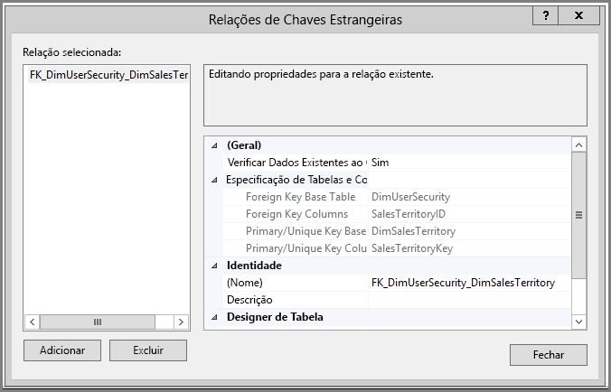
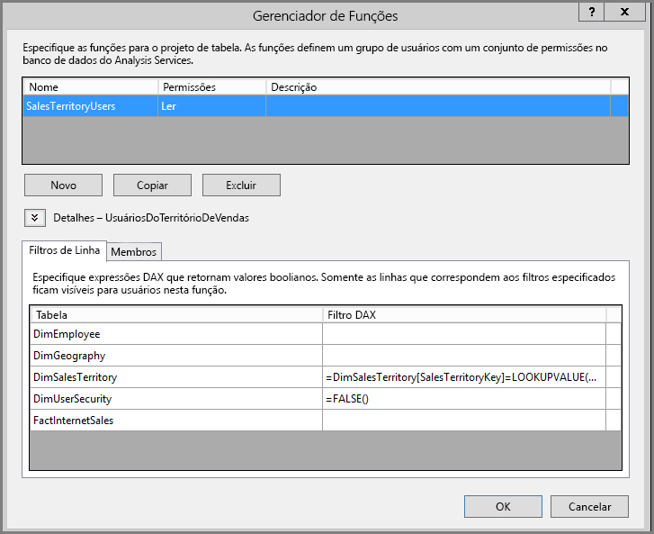
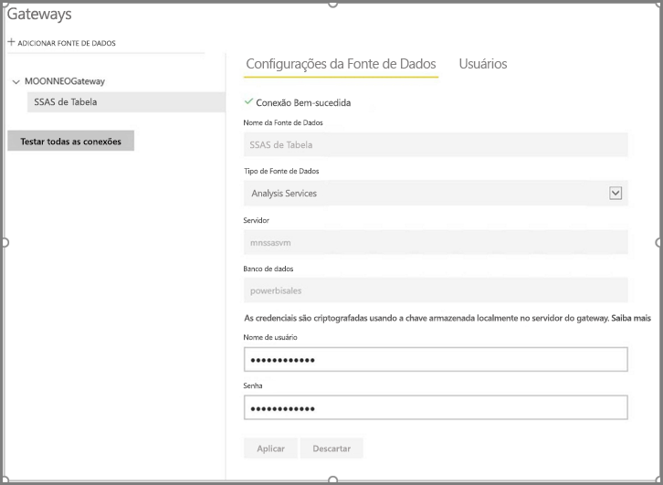
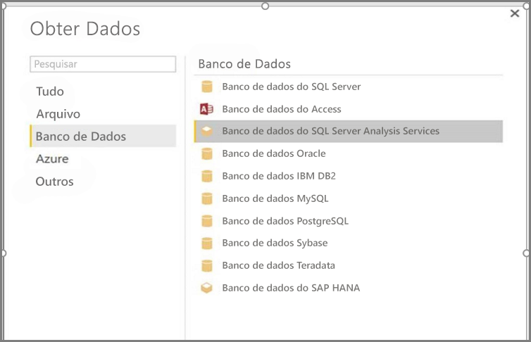
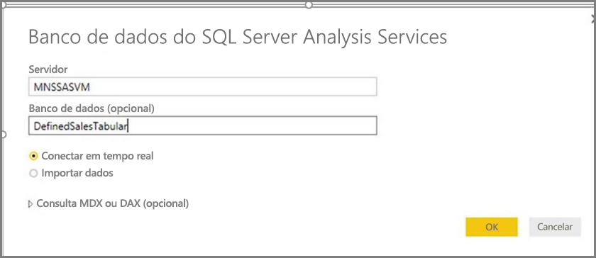
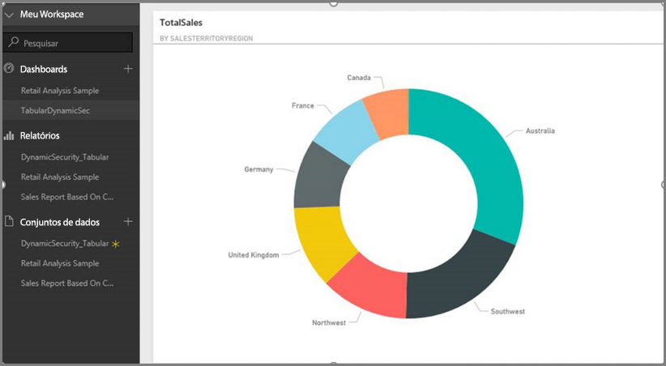
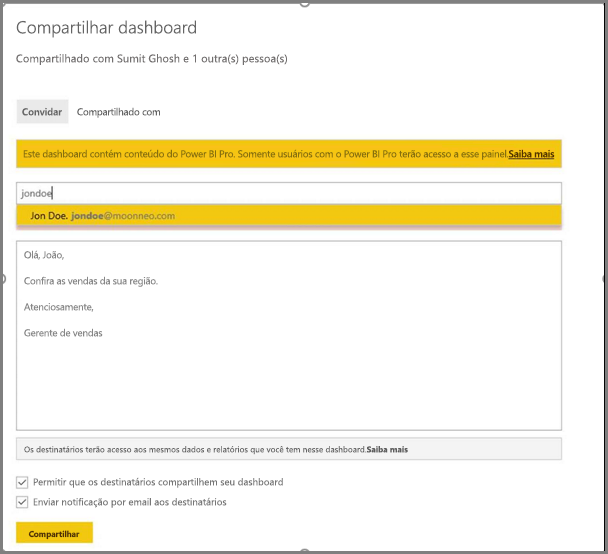
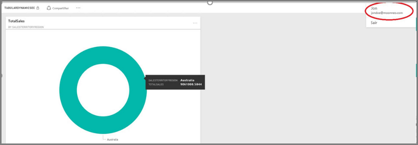

# <a name="dynamic-row-level-security-with-analysis-services-tabular-model"></a>Segurança em nível de linha dinâmica com o modelo de tabela do Analysis Services

Usando um conjunto de dados de exemplo para trabalhar com as etapas abaixo, este tutorial mostra como implementar a [**segurança em nível de linha**](service-admin-rls.md) em um **Modelo Tabular do Analysis Services** e usá-lo em um relatório do Power BI. 

* Crie uma nova tabela de segurança no banco de dados [**AdventureworksDW2012**](https://github.com/Microsoft/sql-server-samples/releases/tag/adventureworks)
* Criar o modelo de tabela com as tabelas de fatos e dimensões necessárias
* Definir as permissões e as funções de usuário
* Implantar o modelo em uma instância da **tabela do Analysis Services**
* Criar um relatório do Power BI Desktop que mostra dados personalizados ao usuário que está acessando o relatório
* Implantar o relatório no **serviço do Power BI**
* Criar um novo dashboard baseado no relatório
* Compartilhar o dashboard com seus colegas 

Este tutorial requer o banco de dados [**AdventureworksDW2012**](https://github.com/Microsoft/sql-server-samples/releases/tag/adventureworks).

## <a name="task-1-create-the-user-security-table-and-define-data-relationship"></a>Tarefa 1: criar a tabela de segurança de usuário e definir a relação de dados

Há vários artigos publicados que descrevem como definir a segurança dinâmica em nível de linha com o modelo **tabular do SSAS (SQL Server Analysis Services)** . Para nossa amostra, usamos [Implementar a segurança dinâmica usando filtros de linha](https://msdn.microsoft.com/library/hh479759.aspx). 

Estas etapas exigem o uso do banco de dados relacional **AdventureworksDW2012**.

1. No **AdventureworksDW2012**, crie a tabela **DimUserSecurity** conforme mostrado abaixo. É possível usar o [SSMS (SQL Server Management Studio)](https://docs.microsoft.com/sql/ssms/download-sql-server-management-studio-ssms) para criar a tabela.
   
   

2. Depois que a tabela for criada e salva, será necessário estabelecer a relação entre a coluna **SalesTerritoryID** da tabela **DimUserSecurity** e a coluna **SalesTerritoryKey** da tabela **DimSalesTerritory**, como mostrado a seguir. 

   Na **SSMS**, clique com o botão direito do mouse na tabela **DimUserSecurity** e selecione **Design**. Em seguida, selecione **Designer de Tabela -> Relações...** . Quando terminar, salve a tabela.
   
   

3. Adicione usuários à tabela: clique com o botão direito do mouse na tabela **DimUserSecurity** e selecione **Editar as primeiras 200 linhas**. Depois de adicionar usuários, a tabela **DimUserSecurity** deve ser semelhante ao seguinte, embora com seus próprios usuários:
   
   
   
   Você verá esses usuários em tarefas futuras.

4. Em seguida, faça uma *junção interna* com a tabela **DimSalesTerritory**, que mostra os detalhes da região associados ao usuário. O código SQL aqui faz a *junção interna* e a imagem mostra como a tabela é exibida.
   
       select b.SalesTerritoryCountry, b.SalesTerritoryRegion, a.EmployeeID, a.FirstName, a.LastName, a.UserName from [dbo].[DimUserSecurity] as a join  [dbo].[DimSalesTerritory] as b on a.[SalesTerritoryID] = b.[SalesTerritoryKey]
   
   

   A imagem mostra quem é responsável por cada região de vendas, graças à relação criada na **etapa 2**. Por exemplo, você pode ver que **Carlos Silva** é responsável pela **Austrália**. 

## <a name="task-2-create-the-tabular-model-with-facts-and-dimension-tables"></a>Tarefa 2: criar o modelo de tabela com tabelas de fatos e dimensão

1. Depois de implementar o data warehouse relacional, será necessário definir o modelo tabular. É possível criar o modelo usando o [**SSDT (SQL Server Data Tools)** ](https://docs.microsoft.com/sql/ssdt/sql-server-data-tools). Para obter mais informações, confira [Criar um novo projeto de modelo tabular](https://msdn.microsoft.com/library/hh231689.aspx).

2. Importe todas as tabelas necessárias no modelo, conforme mostrado abaixo.
   
    

3. Depois de importar as tabelas necessárias, você precisa definir uma função chamada **SalesTerritoryUsers** com a permissão **Leitura**. Selecione o menu **Modelo** no SQL Server Data Tools e, em seguida, selecione **Funções**. Na caixa de diálogo **Gerenciador de Funções**, selecione **Novo**.

4. Na guia **Membros** no **Gerenciador de Funções**, adicione os usuários definidos na tabela **DimUserSecurity**, na **Tarefa 1 – etapa 3**.
   
    

5. Em seguida, adicione as funções apropriadas para as tabelas **DimSalesTerritory** e **DimUserSecurity**, conforme mostrado abaixo na guia **Filtros de Linha**.
   
    

6. Nesta etapa, use a função **LOOKUPVALUE** para retornar valores de uma coluna na qual o nome de usuário do Windows é o mesmo que o nome de usuário retornado pela função **USERNAME**. Em seguida, você pode restringir as consultas para as quais os valores retornados de **LOOKUPVALUE** correspondem aos da mesma tabela ou da tabela relacionada. Na coluna **Filtro DAX**, digite a seguinte fórmula:
   
       =DimSalesTerritory[SalesTerritoryKey]=LOOKUPVALUE(DimUserSecurity[SalesTerritoryID], DimUserSecurity[UserName], USERNAME(), DimUserSecurity[SalesTerritoryID], DimSalesTerritory[SalesTerritoryKey])

    Nesta fórmula, a função **LOOKUPVALUE** retorna todos os valores da coluna **DimUserSecurity[SalesTerritoryID]** , em que o **DimUserSecurity[UserName]** é o mesmo nome de usuário atual do Windows conectado, e a **DimUserSecurity[SalesTerritoryID]** é igual a **DimSalesTerritory[SalesTerritoryKey]** .
   
    > [!IMPORTANT]
    > Ao usar a segurança em nível de linha, a função DAX [USERELATIONSHIP](https://msdn.microsoft.com/query-bi/dax/userelationship-function-dax) não é compatível.

   O conjunto de SalesTerritoryKey de Vendas retornado por **LOOKUPVALUE** é usado para restringir as linhas mostradas em **DimSalesTerritory**. Somente as linhas nas quais o valor **SalesTerritoryKey** estiver nas IDs retornadas pela função **LOOKUPVALUE** serão exibidas.

7. Para a tabela **DimUserSecurity**, na coluna **Filtro DAX**, adicione a fórmula a seguir:
   
       =FALSE()

    Essa fórmula especifica que todas as colunas são resolvidas para `false`. Ou seja, as colunas da tabela **DimUserSecurity** não podem ser consultadas.

8. Agora, é necessário processar e implantar o modelo. Para obter mais informações, confira o [artigo Implantar](https://msdn.microsoft.com/library/hh231693.aspx).

## <a name="task-3-add-data-sources-within-your-on-premises-data-gateway"></a>Tarefa 3: adicionar fontes de dados ao Gateway de dados local

Depois que o modelo tabular for implantado e estiver pronto para consumo, você precisará adicionar uma conexão de fonte de dados ao servidor tabular do Analysis Services local.

1. Para permitir que o **serviço do Power BI** acesse o serviço de análise local, é necessário ter um **[Gateway de dados local](service-gateway-onprem.md)** instalado e configurado no seu ambiente.

2. Depois de configurar o gateway corretamente, é necessário criar uma conexão de fonte de dados à instância de tabela do **Analysis Services**. Para mais informações, confira [Gerenciar sua fonte de dados – Analysis Services](service-gateway-enterprise-manage-ssas.md).
   
   

  Após a conclusão da etapa anterior, o gateway está configurado e pronto para interagir com sua fonte de dados do **Analysis Services** local.

## <a name="task-4-create-report-based-on-analysis-services-tabular-model-using-power-bi-desktop"></a>Tarefa 4: criar relatórios baseados no modelo tabular do Analysis Services usando o Power BI Desktop

1. Inicie o **Power BI Desktop** e selecione **Obter Dados > Banco de Dados**.

2. Na lista de fontes de dados, selecione o **Banco de Dados do SQL Server Analysis Services** e selecione **Conectar**.
   
   

3. Preencha os detalhes da instância de tabela do **Analysis Services** e selecione **Conexão Dinâmica**. Selecione **OK**. Com o **Power BI**, a segurança dinâmica funciona apenas com a **Conexão dinâmica**.
   
   

4. Você verá que o modelo implantado está na instância do **Analysis Services**. Selecione o respectivo modelo e selecione **OK**.
   
   

   Agora, o **Power BI Desktop** exibe todos os campos disponíveis à direita da tela no painel **Campos**.

5. No painel **Campos** à direita, selecione a medida **SalesAmount** na tabela **FactInternetSales** e a dimensão **SalesTerritoryRegion** na tabela **SalesTerritory**.

6. Para manter esse relatório simples, não adicionaremos mais nenhuma coluna. Para ter uma representação mais significativa dos dados, altere a visualização para **Gráfico de rosca**.
   
   

7. Quando o relatório estiver pronto, você poderá publicá-lo diretamente no portal do Power BI. Na faixa de opções **Página Inicial** do **Power BI Desktop**, selecione **Publicar**.

## <a name="task-5-create-and-share-a-dashboard"></a>Tarefa 5: Criar e compartilhar um dashboard

1. Você criou o relatório e fez a publicação no serviço do **Power BI**. Agora você pode usar o exemplo criado nas etapas anteriores para demonstrar o cenário de segurança do modelo.
   
   Na função de **Gerente de vendas**, Pedro pode ver os dados de todas as diferentes regiões de vendas. Ele cria esse relatório (o relatório criado nas etapas da tarefa anterior) e o publica no serviço do Power BI.
   
   Depois de publicar o relatório, ele cria um dashboard no serviço do Power BI chamado **TabularDynamicSec** com base no relatório. Na imagem a seguir, observe que Pedro consegue ver os dados correspondentes a todas as regiões de vendas.
   
   

2. Agora, ele compartilha o dashboard com seu colega, Carlos Silva, responsável pelas vendas na região da Austrália.
   
   
   
   

3. Quando Carlos Silva fizer logon no serviço do **Power BI** e exibir o dashboard compartilhado criado por Pedro, ele deverá ver **somente** as vendas de sua região. 
   
   

    Parabéns! O **serviço do Power BI** mostra a segurança em nível de linha dinâmica definida no modelo tabular do **Analysis Services** local. O Power BI usa a propriedade **EffectiveUserName** para enviar as atuais credenciais de usuário do Power BI à fonte de dados local para executar as consultas.

## <a name="task-6-understand-what-happens-behind-the-scenes"></a>Tarefa 6: Entender o que acontece nos bastidores

Esta tarefa pressupõe que você esteja familiarizado com o [SQL Profiler](https://docs.microsoft.com/sql/tools/sql-server-profiler/sql-server-profiler), já que você precisa capturar um rastreamento do criador de perfil do SQL Server na instância tabular do SSAS local.

1. A sessão é inicializada assim que o usuário (Carlos Silva) acessa o dashboard no serviço do Power BI. Você pode ver que a função **salesterritoryusers** funciona imediatamente com o nome de usuário efetivo **<EffectiveUserName>jondoe@moonneo.com</EffectiveUserName>**
   
       <PropertyList><Catalog>DefinedSalesTabular</Catalog><Timeout>600</Timeout><Content>SchemaData</Content><Format>Tabular</Format><AxisFormat>TupleFormat</AxisFormat><BeginRange>-1</BeginRange><EndRange>-1</EndRange><ShowHiddenCubes>false</ShowHiddenCubes><VisualMode>0</VisualMode><DbpropMsmdFlattened2>true</DbpropMsmdFlattened2><SspropInitAppName>PowerBI</SspropInitAppName><SecuredCellValue>0</SecuredCellValue><ImpactAnalysis>false</ImpactAnalysis><SQLQueryMode>Calculated</SQLQueryMode><ClientProcessID>6408</ClientProcessID><Cube>Model</Cube><ReturnCellProperties>true</ReturnCellProperties><CommitTimeout>0</CommitTimeout><ForceCommitTimeout>0</ForceCommitTimeout><ExecutionMode>Execute</ExecutionMode><RealTimeOlap>false</RealTimeOlap><MdxMissingMemberMode>Default</MdxMissingMemberMode><DisablePrefetchFacts>false</DisablePrefetchFacts><UpdateIsolationLevel>2</UpdateIsolationLevel><DbpropMsmdOptimizeResponse>0</DbpropMsmdOptimizeResponse><ResponseEncoding>Default</ResponseEncoding><DirectQueryMode>Default</DirectQueryMode><DbpropMsmdActivityID>4ea2a372-dd2f-4edd-a8ca-1b909b4165b5</DbpropMsmdActivityID><DbpropMsmdRequestID>2313cf77-b881-015d-e6da-eda9846d42db</DbpropMsmdRequestID><LocaleIdentifier>1033</LocaleIdentifier><EffectiveUserName>jondoe@moonneo.com</EffectiveUserName></PropertyList>

2. Com base na solicitação de nome de usuário efetivo, o Analysis Services converte a solicitação para a credencial real moonneo/carlossilva depois de consultar o Active Directory local. Assim que o **Analysis Services** obtém a credencial, o **Analysis Services** retorna os dados que o usuário tem permissão para exibir e acessar.

3. Se outras atividades forem realizadas no dashboard, por exemplo, se Carlos Silva acessar o dashboard e depois o relatório subjacente, com o SQL Profiler, você verá uma consulta específica retornando para o modelo de tabela do Analysis Services como uma consulta DAX.
   
   

4. Você também pode ver abaixo a consulta DAX sendo executada para popular os dados do relatório.
   
   ```
   EVALUATE
     ROW(
       "SumEmployeeKey", CALCULATE(SUM(Employee[EmployeeKey]))
     )
   
   <PropertyList xmlns="urn:schemas-microsoft-com:xml-analysis">``
             <Catalog>DefinedSalesTabular</Catalog>
             <Cube>Model</Cube>
             <SspropInitAppName>PowerBI</SspropInitAppName>
             <EffectiveUserName>jondoe@moonneo.com</EffectiveUserName>
             <LocaleIdentifier>1033</LocaleIdentifier>
             <ClientProcessID>6408</ClientProcessID>
             <Format>Tabular</Format>
             <Content>SchemaData</Content>
             <Timeout>600</Timeout>
             <DbpropMsmdRequestID>8510d758-f07b-a025-8fb3-a0540189ff79</DbpropMsmdRequestID>
             <DbPropMsmdActivityID>f2dbe8a3-ef51-4d70-a879-5f02a502b2c3</DbPropMsmdActivityID>
             <ReturnCellProperties>true</ReturnCellProperties>
             <DbpropMsmdFlattened2>true</DbpropMsmdFlattened2>
             <DbpropMsmdActivityID>f2dbe8a3-ef51-4d70-a879-5f02a502b2c3</DbpropMsmdActivityID>
           </PropertyList>
   ```

## <a name="considerations"></a>Considerações

* A segurança em nível de linha local com o Power BI só está disponível com a Conexão Dinâmica.

* As alterações nos dados após o processamento do modelo seriam imediatamente disponibilizadas para os usuários que estão acessando o relatório com a **Conexão Dinâmica** por meio do serviço do Power BI.

