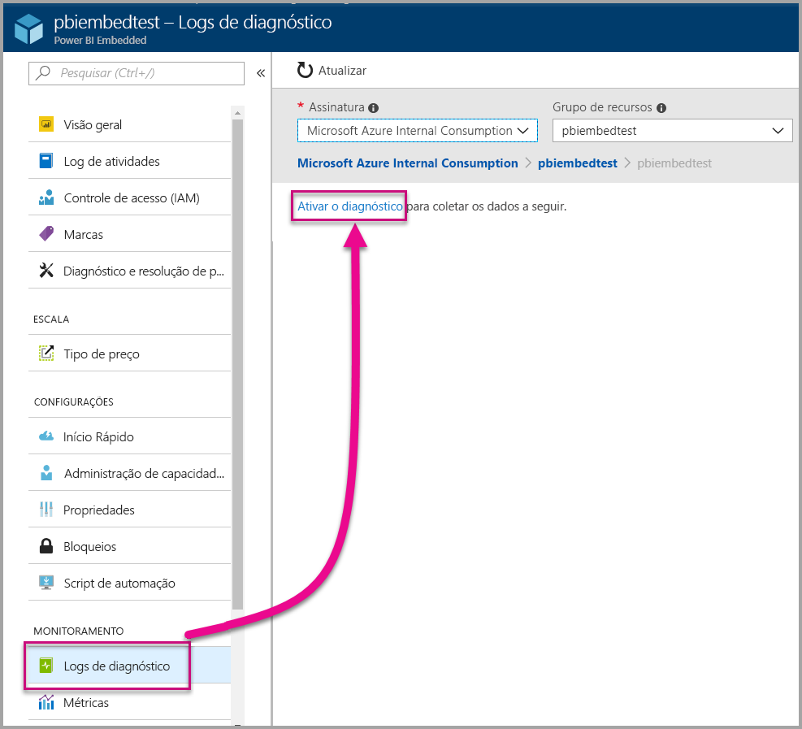
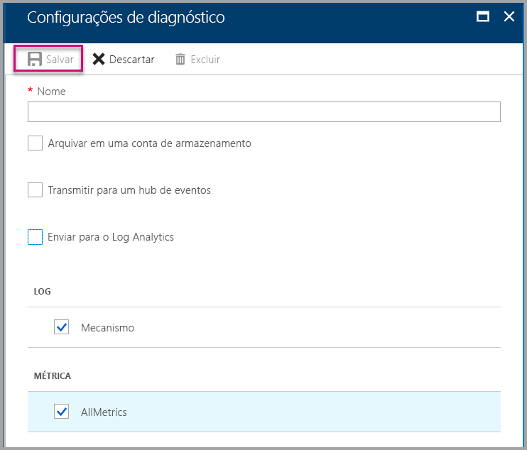
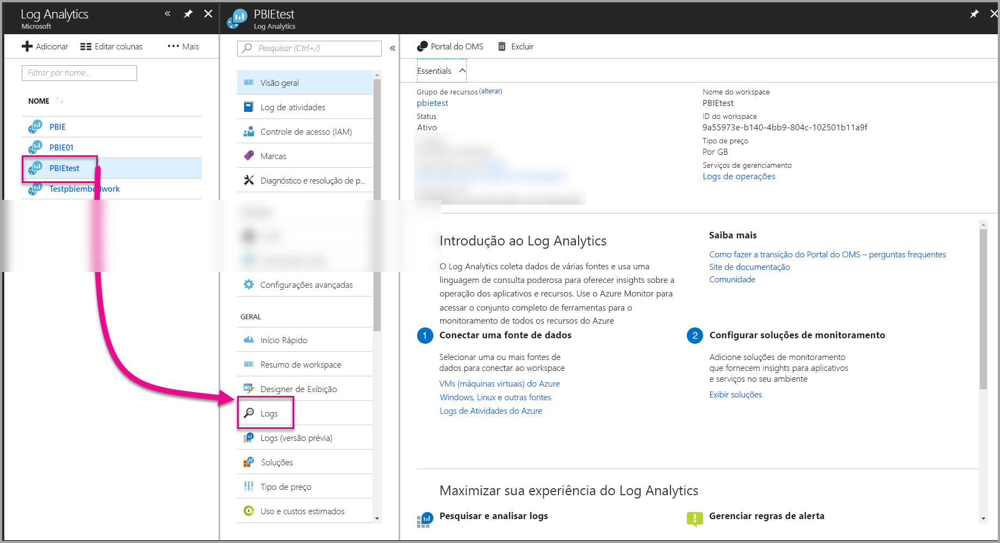
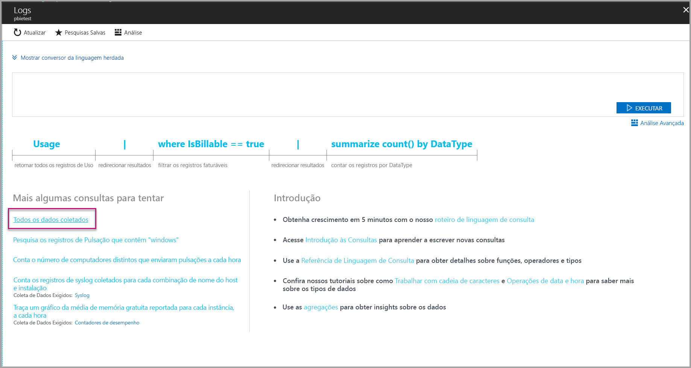
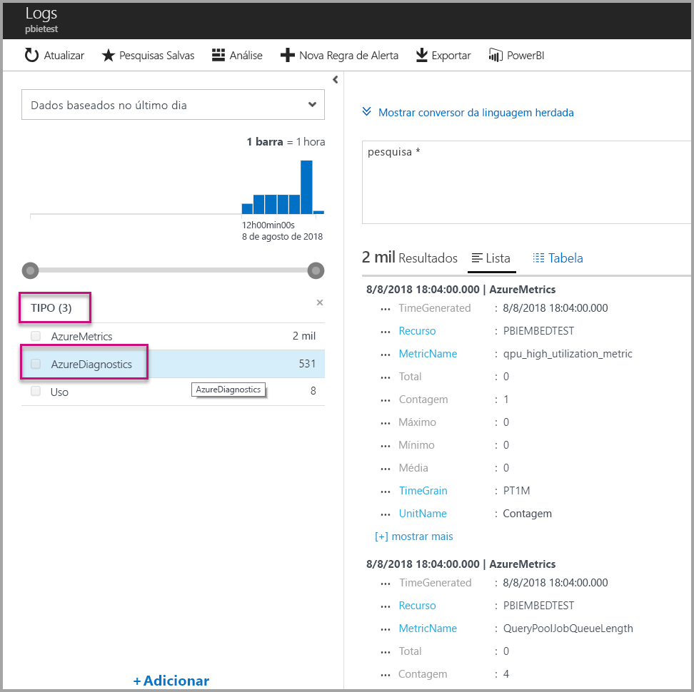
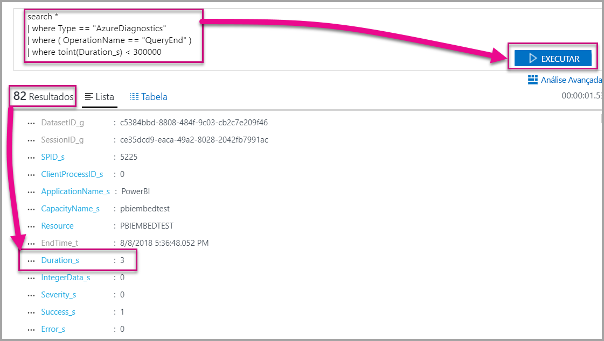
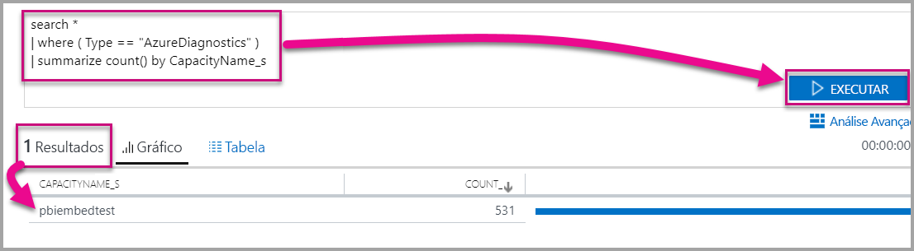

# <a name="diagnostic-logging-for-power-bi-embedded-in-azure"></a>Log de diagnóstico do serviço Power BI Embedded no Microsoft Azure

Com os [logs de diagnóstico de recurso do Azure](https://docs.microsoft.com/azure/monitoring-and-diagnostics/monitoring-overview-of-diagnostic-logs), você pode registrar vários eventos da sua capacidade, colocá-los em uma ferramenta de análise e obter informações sobre o comportamento do recurso.

O uso do Diagnóstico pode atender a alguns cenários, como:

* Detecção de consultas com problemas ou de execução longa.
* Derivação das [métricas de capacidade](https://powerbi.microsoft.com/blog/power-bi-developer-community-april-update/).
* Controle de uso de conjunto de dados específicos.

## <a name="set-up-diagnostics-logging"></a>Configurar o log de diagnóstico

### <a name="azure-portal"></a>Portal do Azure

1. Vá para o [Portal do Azure](https://portal.azure.com) > no recurso Power BI Embedded, selecione **Logs de diagnóstico**, na barra de navegação à esquerda, e selecione **Ativar o Diagnóstico**.

    

2. Em **Configurações de diagnóstico**, especifique as seguintes opções:

    * **Nome** – Insira um nome para a configuração de diagnóstico que será criada.

    * **Arquivar em uma conta de armazenamento** – Para usar esta opção, é necessário conectar-se a uma conta de armazenamento existente. Confira o tópico [Criar uma conta de armazenamento](https://docs.microsoft.com/azure/storage/common/storage-create-storage-account) e siga as instruções para criar uma conta de armazenamento. Em seguida, volte a esta página do portal e selecione essa conta. Pode levar alguns minutos para que a nova conta seja exibida no menu suspenso. O armazenamento do arquivo de log está em formato JSON.
    * **Transmitir para um hub de eventos** – Para usar esta opção, é necessário conectar-se a um Namespace de Hub de Eventos e a um hub de eventos. Para saber mais, confira o artigo [Criar um Namespace de Hub de Eventos e um hub de eventos no Portal do Azure](https://docs.microsoft.com/azure/event-hubs/event-hubs-create).
    * **Enviar para o Log Analytics** – Para usar esta opção, use um workspace existente ou crie um novo workspace do Log Analytics, seguindo as etapas do tópico [Criar um workspace](https://docs.microsoft.com/azure/log-analytics/log-analytics-quick-collect-azurevm#create-a-workspace), no portal. Ele aproveita o [Log Analytics do Microsoft Azure](https://docs.microsoft.com/azure/log-analytics/log-analytics-overview), que fornece funcionalidades internas de análise e criação de notificações e painéis. Use o Log Analytics para conectar mais dados de outros recursos e obter uma exibição completa e exclusiva dos dados em todos os recursos do aplicativo. É possível inclusive conectá-lo ao [Power BI com um único clique](https://docs.microsoft.com/azure/log-analytics/log-analytics-powerbi).
    Para saber mais sobre como exibir os logs no Log Analytics, confira [Exibir logs no Log Analytics](https://docs.microsoft.com/azure/log-analytics/log-analytics-activity).
    * **Mecanismo** – Selecione esta opção para registrar o conjunto de [eventos do mecanismo](#whats-logged) descrito abaixo.
    * **AllMetrics** – Selecione esta opção para armazenar dados detalhados em [Métricas](https://docs.microsoft.com/azure/analysis-services/analysis-services-monitor#server-metrics). Se arquivar em uma conta de armazenamento, selecione o período de retenção dos logs de diagnóstico. Os logs são excluídos automaticamente quando expira o período de retenção.

3. Selecione **Salvar**.

    Para alterar o modo de salvamento dos logs de diagnóstico, volte a esta página e modifique as configurações.

    

### <a name="using-powershell-to-enable-diagnostics"></a>Usar o PowerShell para habilitar diagnósticos

Para habilitar métricas e logs de diagnóstico com o PowerShell, use os seguintes comandos:

* Para habilitar o armazenamento de logs de diagnóstico em uma conta de armazenamento, use o seguinte comando:

    ```powershell
    Set-AzureRmDiagnosticSetting -ResourceId [your resource id] -StorageAccountId [your storage account id] -Enabled $true
    ```
    A ID da conta de armazenamento é a ID do recurso da conta de armazenamento para a qual você deseja enviar os logs.

* Para habilitar a transmissão de logs de diagnóstico para um hub de eventos, use o seguinte comando:

    ```powershell
    Set-AzureRmDiagnosticSetting -ResourceId [your resource id] -ServiceBusRuleId [your service bus rule id] -Enabled $true
    ```
* A ID de regra do Barramento de Serviço do Azure é uma cadeia de caracteres com o seguinte formato:

    ```powershell
    {service bus resource ID}/authorizationrules/{key name}
    ```

* Para habilitar o envio de logs de diagnóstico para um workspace do Log Analytics, use o seguinte comando:

    ```powershell
        Set-AzureRmDiagnosticSetting -ResourceId [your resource id] -WorkspaceId [resource id of the log analytics workspace] -Enabled $true
    ```

* Para obter a ID do recurso do workspace do Log Analytics, use o seguinte comando:

    ```powershell
    (Get-AzureRmOperationalInsightsWorkspace).ResourceId
    ```

É possível combinar esses parâmetros para habilitar várias opções de saída.

### <a name="rest-api"></a>API REST

Saiba como [alterar as configurações de diagnóstico usando a API REST do Azure Monitor](https://docs.microsoft.com/rest/api/monitor/). 

### <a name="resource-manager-template"></a>Modelo do Resource Manager

Saiba como [habilitar as configurações de diagnóstico na criação de recursos usando um modelo do Resource Manager](https://docs.microsoft.com/azure/monitoring-and-diagnostics/monitoring-enable-diagnostic-logs-using-template).

## <a name="whats-logged"></a>O que pode ser registrado?

Selecione **Mecanismo** e/ou as categorias **AllMetrics**.

### <a name="engine"></a>Mecanismo

A categoria do mecanismo instrui o recurso a registrar os seguintes eventos. Em cada um deles há as seguintes propriedades:

|     Nome do evento     |     Descrição do evento     |
|----------------------------|----------------------------------------------------------------------------------|
|    Auditoria de logon    |    Registra todas as novas conexões feitas aos eventos do mecanismo desde o início do rastreamento.    |
|    Inicializar sessão    |    Registra todos os eventos de inicialização de sessão desde o início do rastreamento.    |
|    Início da consulta Vertipaq    |    Registra todos os eventos de início de consulta VertiPaq SE desde o início do rastreamento.    |
|    Início da consulta    |    Registra todos os eventos de início de consulta desde o início do rastreamento.    |
|    Término da consulta    |    Registra todos os eventos de término de consulta desde o início do rastreamento.    |
|    Término da consulta Vertipaq    |    Registra todos os eventos de término de consulta VertiPaq SE desde o início do rastreamento.    |
|    Auditoria de logoff    |    Registra todos o eventos "desconectar" do mecanismo desde o início do rastreamento.    |
|    Error    |    Registra todos o eventos de erro do mecanismo desde o início do rastreamento.    |

<br>
<br>

| Nome da propriedade | Exemplo de término de consulta Vertipaq | Descrição da propriedade |
|-------------------|---------------------------------------------------------------------------------------------------------------------------------------------------------------------------------------------------------|--------------------------------------------------------------------------------------------------------------------------|
| EventClass | XM_SEQUERY_END | A Classe de Evento é usada para categorizar eventos. |
| EventSubclass | 0 | A Subclasse de Evento fornece informações adicionais sobre cada classe de evento. (por exemplo, 0: Exame do VertiPaq) |
| RootActivityId | ff217fd2-611d-43c0-9c12-19e202a94f70 | ID da atividade raiz. |
| CurrentTime | 2018-04-06T18:30:11.9137358Z | Hora em que o evento foi iniciado, quando disponível. |
| StartTime | 2018-04-06T18:30:11.9137358Z | Hora em que o evento foi iniciado, quando disponível. |
| JobID | 0 | ID do trabalho para o andamento. |
| ObjectID | 464 | ID de objeto |
| ObjectType | 802012 | ObjectType |
| EndTime | 2018-04-06T18:30:11.9137358Z | Hora em que o evento foi encerrado. |
| Duração | 0 | Quantidade de tempo (em milissegundos) tomada pelo evento. |
| SessionType | Usuário | Tipo de sessão (que entidade causou a operação). |
| ProgressTotal | 0 | Andamento total. |
| IntegerData | 0 | Dados Integer. |
| Severidade | 0 | Nível de severidade de uma exceção. |
| Êxito | 1 | 1 = êxito. 0 = falha (por exemplo, 1 significa êxito em uma verificação de permissões e 0 significa uma falha nessa verificação). |
| Error | 0 | Número do erro de um determinado evento. |
| ConnectionID | 3 | ID de Conexão Exclusiva. |
| DatasetID | 5eaa550e-06ac-4adf-aba9-dbf0e8fd1527 | Conjunto de dados no qual a instrução do usuário está sendo executada. |
| SessionID | 3D063F66-A111-48EE-B960-141DEBDA8951 | GUID de sessão. |
| SPID | 180 | ID de processo do servidor. Identifica exclusivamente a sessão do usuário. Corresponde diretamente ao GUID de sessão usado pelo XML/A. |
| ClientProcessID | nulo | A ID de processo do aplicativo cliente. |
| ApplicationName | nulo | Nome do aplicativo cliente que criou a conexão com o servidor. |
| CapacityName | pbi641fb41260f84aa2b778a85891ae2d97 | O nome do recurso da capacidade do Power BI Embedded. |


### <a name="allmetrics"></a>AllMetrics

A verificação da opção **AllMetrics** registra os dados de todas as métricas disponíveis para uso com um recurso do Power BI Embedded.

   

## <a name="manage-your-logs"></a>Gerenciar os logs

Geralmente, os logs ficam disponíveis em algumas horas depois de configurar o registro em log. Cabe a você gerenciar os logs em uma conta de armazenamento:

* use os métodos de controle de acesso padrão do Azure para proteger os logs, restringindo quem pode acessá-los.
* Exclua os logs que você não deseja mais manter na conta de armazenamento.
* Defina um período de retenção para que os logs antigos sejam excluídos da conta de armazenamento.

## <a name="view-logs-in-log-analytics"></a>Exibir logs no Log Analytics

Métricas e eventos de servidor são integrados ao xEvents no Log Analytics para análise lado a lado. É possível também configurar o Log Analytics para receber eventos de outros serviços do Azure que fornecem uma visão holística dos dados de log de diagnóstico em toda a arquitetura.

Para exibir os dados de diagnóstico no Log Analytics, abra a página **Logs** no menu à esquerda ou a área Gerenciamento, conforme mostrado abaixo.



Agora que você já habilitou uma coleta de dados, vá até **Logs** e selecione **Todos os dados coletados**.



Em **Tipo**, selecione **AzureDiagnostics** e **Aplicar**. O AzureDiagnostics inclui eventos do mecanismo. A consulta é criada instantaneamente no Log Analytics.



Selecione **EventClass\_s** ou um dos nomes de eventos, e o Log Analytics continuará criando uma consulta. Salve as consultas para reutilizá-las mais tarde.

Não deixe de conferir a documentação do [Log Analytics](https://docs.microsoft.com/azure/log-analytics/), que fornece um site com funcionalidades aprimoradas para criação de consultas, painéis e alertas sobre dados coletados.

### <a name="queries"></a>Consultas

Há centenas de consultas disponíveis à escolha. Veja aqui algumas consultas para começar. Para saber mais sobre como usar a nova linguagem de consulta de pesquisa de logs, confira [Noções básicas sobre pesquisa de logs no Log Analytics](https://docs.microsoft.com/azure/log-analytics/log-analytics-log-search).

* Retorno de consulta que levou menos de cinco minutos (300 mil milissegundos) para ser concluída.

    ```
    search *
    | where Type == "AzureDiagnostics"
    | where ( OperationName == "QueryEnd" )
    | where toint(Duration_s) < 300000
    ```

    

* Identificar os nomes da capacidade.

    ```
    search *
    | where ( Type == "AzureDiagnostics" )
    | summarize count() by CapacityName_s 
    ```

    

## <a name="next-steps"></a>Próximas etapas

Saiba mais sobre os logs de diagnóstico de recurso do Azure.

> [!div class="nextstepaction"]
> [Logs de diagnóstico de recurso do Azure](https://docs.microsoft.com/azure/monitoring-and-diagnostics/monitoring-overview-of-diagnostic-logs)

> [!div class="nextstepaction"]
> [Set-AzureRmDiagnosticSetting](https://docs.microsoft.com/powershell/module/azurerm.insights/Set-AzureRmDiagnosticSetting)
