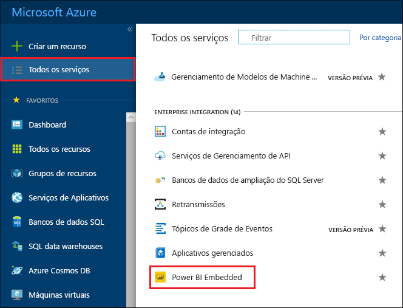
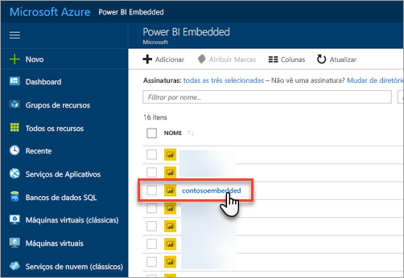
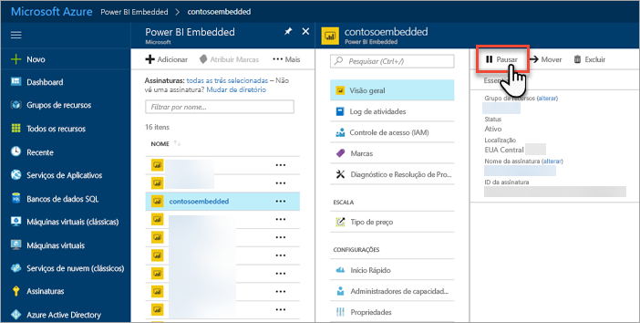
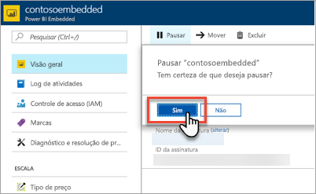
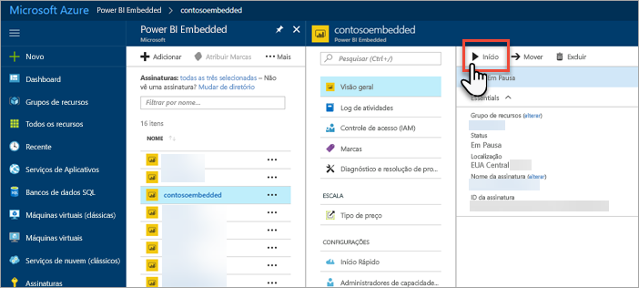
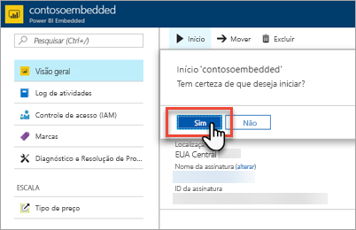

# Pausar e iniciar a capacidade do Power BI Embedded no portal do Azure

Este artigo explica como pausar e iniciar uma capacidade do Power BI Embedded no Microsoft Azure. Para fazer isso, é necessário já ter criado uma capacidade do Power BI Embedded. Se você ainda não criou, confira [Criar uma capacidade do Power BI Embedded no portal do Azure](azure-pbie-create-capacity.md) para começar.

Se você não tiver uma assinatura do Azure, crie uma [conta gratuita](https://azure.microsoft.com/free/) antes de começar.

## Pausar sua capacidade

A pausa da sua capacidade evita que você seja cobrado. A pausa da sua capacidade é ideal quando você não precisa usar a capacidade durante um período de tempo. Use as etapas a seguir para pausar a capacidade.

> [!NOTE]
> A pausa de um capacidade pode impedir que o conteúdo fique disponível no Power BI. Cancele a atribuição dos espaços de trabalho da sua capacidade antes de pausar para evitar interrupção.

1. Entre no [Portal do Azure](https://portal.azure.com/).

2. Selecione **Todos os serviços** > **Power BI Embedded** para ver suas capacidades.

    

3. Selecione a capacidade que deseja pausar.

    

4. Selecione **Pausar** nos detalhes da capacidade.

    

5. Selecione **Sim** para confirmar que você deseja pausar a capacidade.

    

## Iniciar sua capacidade

Retome o uso iniciando sua capacidade. O início da capacidade também retoma a cobrança.

1. Entre no [Portal do Azure](https://portal.azure.com/).

2. Selecione **Todos os serviços** > **Power BI Embedded** para ver suas capacidades.

    

3. Selecione a capacidade que você deseja iniciar.

    

4. Selecione **Iniciar** nos detalhes da capacidade.

    

5. Selecione **Sim** para confirmar que você deseja iniciar a capacidade.

    

Se algum conteúdo estiver atribuído a essa capacidade, ele ficará disponível após o início.

## Próximas etapas

Se você quiser escalar ou reduzir verticalmente a capacidade, confira [Dimensionar a capacidade do Power BI Embedded](azure-pbie-scale-capacity.md).

Para começar a inserir conteúdo do Power BI em seu aplicativo, confira [Como inserir dashboards, relatórios e blocos do Power BI](https://powerbi.microsoft.com/documentation/powerbi-developer-embedding-content/).

Mais perguntas? [Experimente perguntar à Comunidade do Power BI](http://community.powerbi.com/)