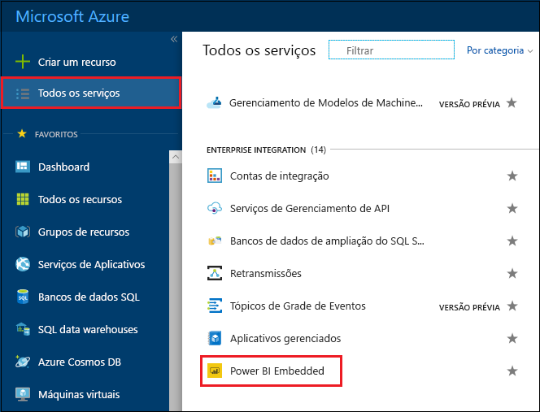
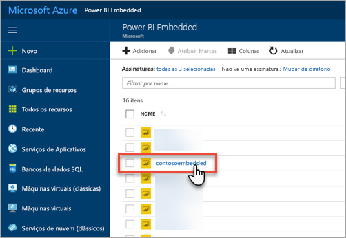
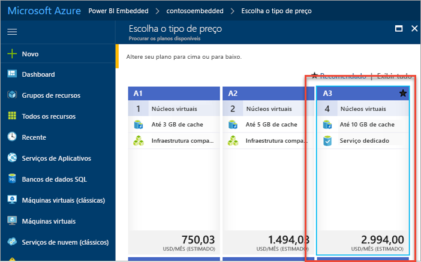
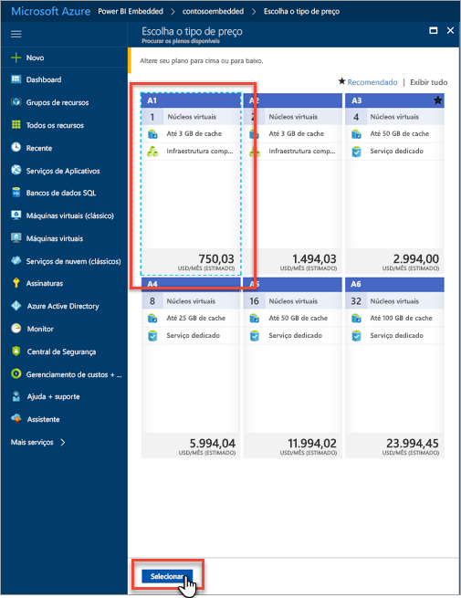
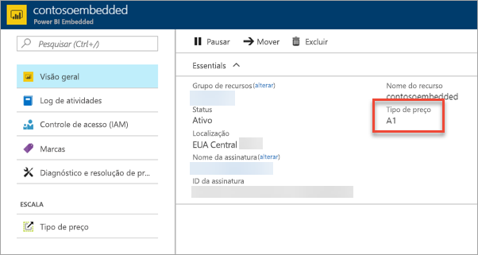

# Dimensionar a capacidade do Power BI Embedded no portal do Azure

Este artigo explica como dimensionar uma capacidade do Power BI Embedded no Microsoft Azure. O dimensionamento permite aumentar ou diminuir o tamanho de sua capacidade.

Para fazer isso, é necessário já ter criado uma capacidade do Power BI Embedded. Se você ainda não criou, confira [Criar uma capacidade do Power BI Embedded no portal do Azure](azure-pbie-create-capacity.md) para começar.

> [!NOTE]
> Uma operação de dimensionamento pode levar cerca de um minuto. Durante esse tempo, a capacidade não estará disponível. O carregamento do conteúdo inserido pode falhar.

## Dimensionar uma capacidade

1. Entre no [Portal do Azure](https://portal.azure.com/).

2. Selecione **Todos os serviços** > **Power BI Embedded** para ver suas capacidades.

    

3. Selecione a capacidade que você deseja dimensionar.

    

4. Selecione **Tipo de preço** em **Dimensionar** dentro de sua capacidade.

    

    O tipo de preço atual está contornado em azul.

    

5. Para escalar ou reduzir verticalmente, selecione o novo tipo para o qual deseja mudar. A seleção de um novo tipo coloca um contorno tracejado azul ao redor da seleção. Clique em **Selecionar** para dimensionar para o novo tipo.

    

    O dimensionamento da capacidade pode levar um ou dois minutos para ser concluído.

6. Confirme o tipo exibindo a guia de visão geral. O tipo de preço atual está listado.

    

## Próximas etapas

Para pausar ou iniciar sua capacidade, confira [Pausar e iniciar a capacidade do Power BI Embedded no portal do Azure](azure-pbie-pause-start.md).

Para começar a inserir conteúdo do Power BI em seu aplicativo, confira [Como inserir dashboards, relatórios e blocos do Power BI](https://powerbi.microsoft.com/documentation/powerbi-developer-embedding-content/).

Mais perguntas? [Experimente perguntar à Comunidade do Power BI](http://community.powerbi.com/)
