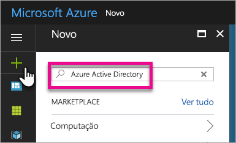
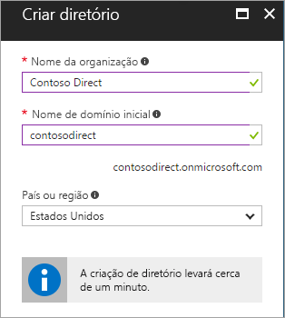
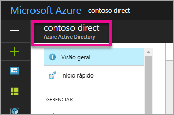
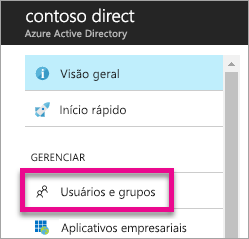
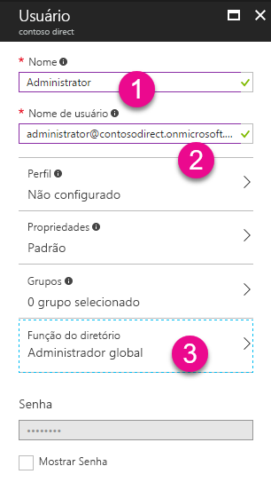
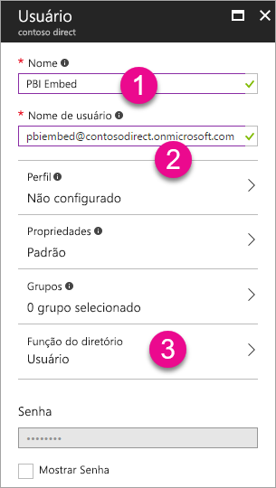

# Criar um locatário do Azure Active Directory para usar com o Power BI

Saiba como criar um novo locatário do Azure AD (Azure Active Directory) para um aplicativo personalizado que chama [APIs REST do Power BI](rest-api-reference.md).

Um locatário representa uma organização no Azure Active Directory. Ele é uma instância de serviço dedicada do Azure AD que uma organização recebe e detém quando se inscreve em um serviço de nuvem da Microsoft, como o Azure, Microsoft Intune ou Office 365. Cada locatário do Azure AD é diferente e separado de outros locatários do Azure AD.

Quando você tiver um locatário do Azure AD, será possível definir um aplicativo e atribuir permissões para ele usar para chamar [APIs REST do Power BI](rest-api-reference.md).

Sua organização talvez já tenha um locatário do Azure AD que você pode usar para seu aplicativo. Você também pode criar um novo locatário especificamente para o aplicativo. Este artigo mostra como criar um novo locatário.

## Crie um locatário do Azure Active Directory

Para integrar o Power BI em seu aplicativo personalizado, é necessário definir um aplicativo no Azure AD, o que exige um diretório do Azure AD. Esse diretório é o *locatário*. Caso sua organização ainda não tenha um locatário, porque não usa o Power BI nem o Office 365, [será necessário configurar um ambiente de desenvolvimento](https://docs.microsoft.com/azure/active-directory/develop/active-directory-howto-tenant). Também é necessário criar um locatário se você não quer que seu aplicativo se misture com o locatário da sua organização, permitindo manter as coisas isoladas. Ou talvez você apenas deseje criar um locatário para fins de testes.

Para criar um novo locatário do Azure AD:

1. Navegue até o [portal do Azure](https://portal.azure.com) e entre com uma conta que tenha uma assinatura do Azure.

2. Selecione o **ícone de mais (+)** e pesquise **Azure Active Directory**.

    

3. Selecione **Azure Active Directory** nos resultados da pesquisa.

    

4. Selecione **Criar**.

5. Forneça um **Nome de organização** e um **Nome de domínio inicial**. Em seguida, selecione **Criar**. Seu diretório está criado.

    

   > [!NOTE]
   > O domínio inicial faz parte de onmicrosoft.com. É possível adicionar outros nomes de domínio mais tarde. Um diretório de locatário pode ter vários domínios atribuídos a ele.

6. Após a conclusão da criação do diretório, marque a caixa de informações para gerenciar seu novo diretório.

Em seguida, você vai adicionar usuários do locatário.

## Crie usuários de locatário do Azure Active Directory

Agora que você tem um diretório, vamos criar pelo menos dois usuários. Um será um Administrador Global do locatário e o outro será um usuário mestre para inserção. Você pode considerar o segundo como uma conta de serviço.

1. No portal do Azure, você deverá estar na saída do Azure Active Directory.

    

    Se não estiver, selecione o ícone do Azure Active Directory na navegação de serviços esquerda.

    

2. Em **Gerenciar**, selecione **Usuários**.

    

3. Selecione **Todos os usuários** e, em seguida, selecione **+ Novo usuário**.

4. Forneça um **Nome** e um **Nome de usuário** para o Administrador Global do locatário. Altere a **Função do diretório** para **Administrador global**. Também é possível mostrar a senha temporária. Quando terminar, selecione **Criar**.

    

5. Faça a mesma coisa para um usuário de locatário regular. Você pode usar essa conta para a conta de inserção mestre. Dessa vez, em **Função do diretório**, deixe como **Usuário**. Anote a senha e, em seguida, selecione **Criar**.

    

6. Inscreva-se no Power BI com a conta de usuário criada na etapa 5. Acesse [powerbi.com](https://powerbi.microsoft.com/get-started/) e selecione **Experimentar grátis** em **Power BI – Colaboração e compartilhamento em nuvem**.

    

    Ao se inscrever, você deverá escolher ser deseja experimentar o Power BI Pro gratuitamente por 60 dias. Você pode optar por isso e se tornar um usuário Pro, o que lhe dará a opção de [começar a desenvolver uma solução inserida](embedding-content.md).

   > [!NOTE]
   > Inscreva-se com o endereço de email da sua conta de usuário.

## Próximas etapas

Agora que você tem um locatário do Azure AD, use esse locatário para testar itens no Power BI. Você também pode inserir relatórios e dashboards do Power BI em seu aplicativo. Para obter mais informações, confira [Como inserir dashboards, relatórios e blocos do Power BI](embedding-content.md).

[O que é um Azure Active Directory?](https://docs.microsoft.com/azure/active-directory/active-directory-whatis) 
 
[Início Rápido: configurar um ambiente de desenvolvimento](https://docs.microsoft.com/azure/active-directory/develop/active-directory-howto-tenant)  

Mais perguntas? [Experimente perguntar à Comunidade do Power BI](http://community.powerbi.com/)
