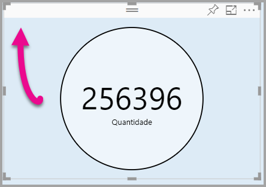

# <a name="tutorial-adding-formatting-options-to-a-power-bi-custom-visual"></a>Tutorial: Adicionar opções de formatação a um visual personalizado do Power BI

Nesse tutorial, vamos mostrar como adicionar propriedades comuns ao visual.

Neste tutorial, você aprenderá a:
> [!div class="checklist"]
> * Adicionar propriedades visuais.
> * Empacotar o visual.
> * Importar o visual personalizado para um relatório do Power BI Desktop.

## <a name="adding-formatting-options"></a>Como adicionar opções de formatação

1. Na **Power BI**, selecione o **Formato de Página**.

    Será exibida uma mensagem informando: *Opções de formatação não estão disponíveis para este visual.*

    

2. No **Visual Studio Code**, abra o arquivo *capabilities.json*.

3. Antes da matriz **dataViewMappings**, adicione **objetos** (depois da linha 8).

    ```json
    "objects": {},
    ```
    

4. Salve o arquivo **capabilities.json**.

5. No **Power BI**, revise as opções de formatação novamente.

    > [!Note]
    > Se as opções de formatação não forem alteradas, selecione **Recarregar visual personalizado**.

    

6. Defina a opção **Título** como *Desligado*. Observe que o visual não exibe mais o nome da medida no canto superior esquerdo.

    

    

### <a name="adding-custom-formatting-options"></a>Adicionar opções de formatação personalizadas

Você pode adicionar propriedades personalizadas para ativar a configuração da cor do círculo, além da largura da borda.

1. No PowerShell, interrompa o visual personalizado.

2. No Visual Studio Code, no arquivo **capabilities.json**, insira o seguinte fragmento JSON no objeto rotulado **objects**.

    ```json
    "circle": {
     "displayName": "Circle",
     "properties": {
         "circleColor": {
             "displayName": "Color",
             "description": "The fill color of the circle.",
             "type": {
                 "fill": {
                     "solid": {
                         "color": true
                     }
                 }
             }
         },
         "circleThickness": {
             "displayName": "Thickness",
             "description": "The circle thickness.",
             "type": {
                 "numeric": true
                 }
             }
         }
     },
    ```

    O fragmento JSON descreve um grupo denominado circle, que consiste em duas opções denominadas circleColor e circleThickness.

   

3. Salve o arquivo **capabilities.json**.

4. No **painel do Explorer**, de dentro da pasta **src**, selecione **settings.ts**. *Esse arquivo representa as configurações para o visual inicial*.

5. No arquivo **settings.ts**, substitua as duas classes pelo código a seguir.

    ```typescript
    export class CircleSettings {
     public circleColor: string = "white";
     public circleThickness: number = 2;
    }
    export class VisualSettings extends DataViewObjectsParser {
     public circle: CircleSettings = new CircleSettings();
    }
    ```

    

    Esse módulo define as duas classes. A classe **CircleSettings** define duas propriedades com nomes que correspondem aos objetos definidos no arquivo **capabilities.json** (**circleColor** e **circleThickness**) e também define valores padrão. A classe **VisualSettings** herda a classe **DataViewObjectParser** e adiciona uma propriedade chamada **circle**, que corresponde ao objeto definido no arquivo *capabilities.json*, e retorna uma instância de **CircleSettings**.

6. Salve o arquivo **settings.ts**.

7. Abra o arquivo **visual.ts**.

8. Na classe **Visual**, adicione a seguinte propriedade.

    ```typescript
    private visualSettings: VisualSettings;
    ```
    Esta propriedade armazena uma referência ao objeto **VisualSettings**, descrevendo as configurações do visual.

    

9. Na classe **Visual**, adicione o seguinte método antes do método **update**. Este método é usado para preencher as opções de formatação.

    ```typescript
    public enumerateObjectInstances(options: EnumerateVisualObjectInstancesOptions): VisualObjectInstanceEnumeration {
     const settings: VisualSettings = this.visualSettings ||
    VisualSettings.getDefault() as VisualSettings;
     return VisualSettings.enumerateObjectInstances(settings, options);
    }
    ```
    Este método é usado para preencher as opções de formatação.

    

10. No método **update**, após a declaração da variável **radius**, adicione o seguinte código.

    ```typescript
    this.visualSettings = VisualSettings.parse<VisualSettings>(dataView);
    this.visualSettings.circle.circleThickness = Math.max(0, this.visualSettings.circle.circleThickness)this.visualSettings.circle.circleThickness = Math.min(10, this.visualSettings.circle.circleThickness);
    ```
    Este código recupera as opções de formato. Ele ajusta qualquer valor passado para a propriedade **circleThickness**, convertendo-o para 0 se for negativo ou 10 se for um valor maior que 10.

    

11. No **elemento circle**, modifique o valor em **fill style** para a seguinte expressão.

    ```typescript
    this.visualSettings.circle.circleColor
    ```

    

12. No **elemento circle**, modifique o valor em **stroke-width style** para a seguinte expressão.

    ```typescript
    this.visualSettings.circle.circleThickness
    ```

    

13. Salve o arquivo visual.ts.

14. No PowerShell, inicie o visual.

    ```powershell
    pbiviz start
    ```

15. No **Power BI**, na barra de ferramentas flutuando acima do visual, selecione **Ativar/Desativar Recarga Automática**.

16. Nas opções de **formato visual**, expanda **Círculo**.

    

    Modifique as opções de **cor** e **espessura**.

    Modifique a opção de **espessura** para um valor menor do que zero e um valor maior do que 10. Em seguida, observe que o visual atualiza o valor para um mínimo ou máximo tolerável.

## <a name="packaging-the-custom-visual"></a>Preparar o visual personalizado

Insira valores de propriedade para o projeto visual personalizado, atualize o arquivo de ícone e, em seguida, prepare o visual personalizado.

1. No **PowerShell**, interrompa o visual personalizado.

2. Abra o arquivo **biviz.json** no **Visual Studio Code**.

3. No objeto **visual**, modifique a propriedade **displayName** para *Circle Card*.

    No painel **Visualizações**, passar o mouse sobre o ícone revela o nome de exibição.

    

4. Para a propriedade **description**, insira o texto a seguir.

    *Exibe um valor de medida formatado dentro de um círculo*

5. Opcionalmente, no objeto **author**, insira seus detalhes.

6. Salve o arquivo **pbiviz.json**.

7. No objeto **assets**, observe que o documento define um caminho para um ícone. O ícone é a imagem que aparece no painel **_Visualizações_**. Ele deve ser um arquivo **PNG**, *20 pixels por 20 pixels*.

8. No Windows Explorer, copie o arquivo icon.png, e cole-o para substituir o arquivo padrão localizado na pasta assets.

9. No Visual Studio Code, no painel do Explorer, expanda a pasta assets e, em seguida, selecione o arquivo icon.png.

10. Verifique o ícone.

    

11. No Visual Studio Code, verifique se todos os arquivos foram salvos.

12. Para preparar o visual personalizado, no PowerShell, digite o seguinte comando.

    ```powershell
    pbiviz package
    ```

    

Agora o pacote é enviado para a pasta **dist** do projeto. O pacote contém tudo o que é necessário para importar o visual personalizado para o serviço do Power BI ou para um relatório do Power BI Desktop. Você preparou o visual personalizado e agora ele está pronto para uso.

## <a name="importing-the-custom-visual"></a>Importar o visual personalizado

Agora você pode abrir o relatório do Power BI Desktop e importar o visual personalizado Circle Card.

1. Abra o **Power BI Desktop**, crie um novo relatório com qualquer *conjunto de dados de amostra*

2. No painel **_Visualizações_**, selecione as **reticências** e, em seguida, selecione **Importar do arquivo**.

    

3. Na **janela de importação**, selecione **Importar**.

4. Na janela aberta, acesse a pasta **dist** no diretório do projeto.

5. Selecione o arquivo **circleCard.pbiviz** e, em seguida, selecione **Abrir**.

6. Após a importação bem-sucedida, selecione **OK**.

7. Verifique se o visual foi adicionado ao painel **_Visualizações_**.

    

8. Passe o mouse sobre o ícone **Circle Card** e observe a dica de ferramenta que aparece.

## <a name="debugging"></a>Depuração

Para obter dicas de como depurar seu visual personalizado, veja o [guia depuração](https://microsoft.github.io/PowerBI-visuals/docs/how-to-guide/how-to-debug/).

## <a name="next-steps"></a>Próximas etapas

É possível listar seu visual desenvolvido recentemente para outras pessoas usarem enviando-o para o **AppSource**. Para saber mais sobre esse processo, veja [Publicar visuais personalizados no AppSource](office-store.md).