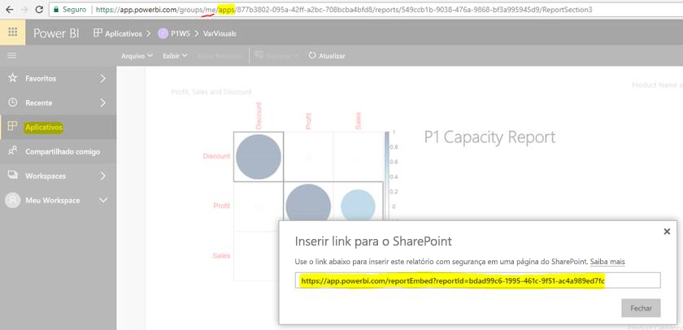

# Inserir relatórios ou dashboards de aplicativos

No Power BI, você pode criar aplicativos para reunir relatórios e dashboards relacionados, tudo em um só lugar. Em seguida, você os publica para grandes grupos de pessoas em sua organização. O uso desses aplicativos é relevante quando todos os usuários são usuários do Power BI. Portanto, você pode compartilhar conteúdo com eles por meio de aplicativos do Power BI. Este artigo apresenta algumas etapas rápidas para inserir conteúdo de um aplicativo do Power BI publicado em um aplicativo de terceiros.

## Pegar uma embedURL do relatório para inserção

1. Criar uma instância do aplicativo em um workspace do usuário, **Meu Workspace**. Compartilhe consigo mesmo ou conduza outro usuário a passar por esse fluxo.

2. Abra o relatório desejado no serviço do Power BI.

3. Acesse **Arquivo** > **Inserir no SharePoint Online** e pegue embedURL do relatório de lá. Ele é mostrado no seguinte instantâneo. Outra opção é chamar a API REST GetReports/GetReport e extrair o campo embedURL do relatório correspondente da resposta. A chamada REST não deve ter um identificador de workspace como parte da URL, uma vez que o aplicativo foi instanciado no workspace do usuário.

4. Use o embedURL recuperado na etapa 3 com o SDK do JavaScript.

    

## Pegar uma embedURL de dashboard para inserção

1. Criar uma instância do aplicativo em um workspace do usuário, **Meu Workspace**. Compartilhe consigo mesmo ou conduza outro usuário a passar por esse fluxo.

2. Chame a API REST de GetDashboards e extraia o campo embedURL do dashboard correspondente da resposta. A chamada REST não deve ter um identificador de workspace como parte da URL, uma vez que o aplicativo foi instanciado no espaço de workspace.

3. Use o embedURL recuperado na etapa 2 com o SDK do JavaScript.

## Próximas etapas

Examine como inserir de workspaces do aplicativo para clientes de terceiros e para a organização:

> [!div class="nextstepaction"]
>[Inserir para clientes de terceiros](embed-sample-for-customers.md)

> [!div class="nextstepaction"]
>[Inserir para a organização](embed-sample-for-your-organization.md)