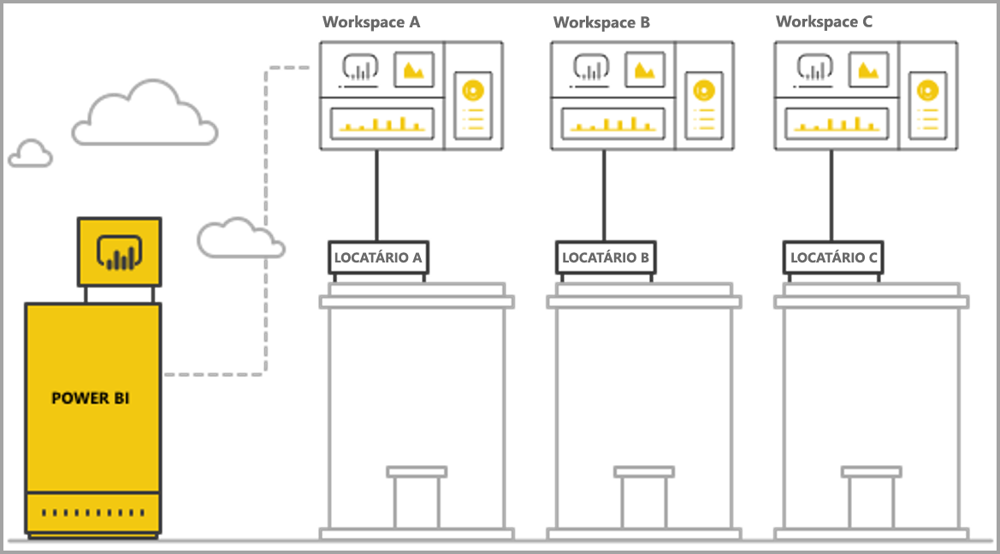
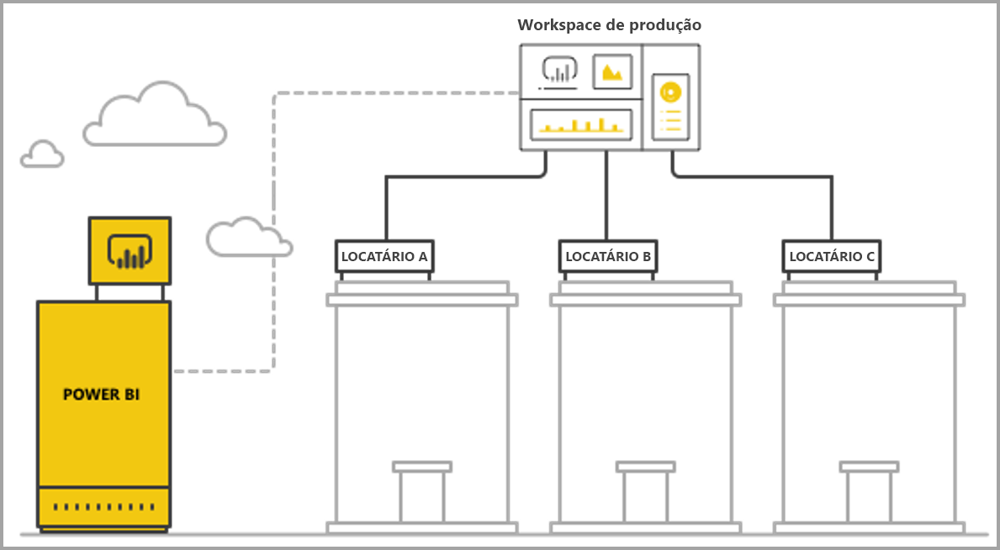

# Gerenciar multilocação com a análise integrada do Power BI

Ao projetar um aplicativo SaaS multilocatário, você deve escolher cuidadosamente o modelo de locação que melhor atenda às necessidades de seu aplicativo SaaS. Esse processo também é válido para o Power BI como parte da análise integrada de seu aplicativo SaaS. Um modelo de locação determina como os dados de cada locatário são mapeados e gerenciados no Power BI e na conta de armazenamento. Seu modelo de locação afeta o design e o gerenciamento do aplicativo. Talvez seja caro e prejudicial alternar para um modelo diferente depois.

Com o Power BI Embedded, há duas abordagens principais para manter a separação entre locatários.

   1. **Isolamento com base no espaço de trabalho**: criar um Workspace do Power BI por locatário.
   2. **Isolamento com base em segurança no nível da linha**: no qual os dados subjacentes são usados para controlar e gerenciar o acesso aos dados por usuário ou grupo.

Este artigo descreve as várias abordagens e as analisa de acordo com vários critérios de avaliação.

## Conceitos e terminologia

**[AAD](https://docs.microsoft.com/en-us/azure/active-directory/fundamentals/active-directory-whatis)**: Azure Active Directory.

**Aplicativo AAD**: uma identidade de aplicativo no AAD. É necessário ter um aplicativo AAD para autenticação.

**Aplicativo SaaS (software como serviço)**: um sistema implementado por uma empresa ou ISV que geralmente é um serviço online. Também está relacionado a sistemas de software para atender vários locatários de cliente (organizações). Neste artigo, **o aplicativo SaaS usa o Power BI Embedded para fornecer análises aos seus diferentes locatários**. O Power BI Embedded também funciona com todos os tipos de aplicativos quando eles tiverem uma conexão online.

**Locatário**: um único cliente (organização) que usa o aplicativo SaaS e quaisquer recursos ou dados que o cliente traz para o aplicativo SaaS.

**[Power BI](../power-bi-overview.md)** : serviço de nuvem do Power BI que serve como plataforma para o Power BI Embedded.

**Locatário do Power BI**: um conjunto de recursos do Power BI associado a um único locatário do AAD.

**[Workspace do Power BI](../service-create-workspaces.md)**: um contêiner para o conteúdo no Power BI.

**Artefatos do Power BI**: há vários artefatos do Power BI em espaços de trabalho do Power BI como dashboards, relatórios, conjuntos de dados e fluxos de dados.

**[Power BI Embedded](azure-pbie-what-is-power-bi-embedded.md)**: um conjunto de APIs públicas que permite aos desenvolvedores compilar aplicativos que gerenciam o conteúdo do Power BI e inserir elementos do Power BI.

**[RLS (Segurança no nível da linha)](embedded-row-level-security.md)**: permite controlar o acesso do usuário aos dados para linhas individuais em uma tabela. Você pode implementar a segurança no nível da linha no nível da fonte de dados ou no modelo semântico do Power BI.

**Usuário mestre**: a identidade que representa o aplicativo SaaS no Power BI e que o aplicativo SaaS usa ao chamar APIs do Power BI. É preciso ser usuário do AAD com uma licença do Power BI Pro.

**Usuário do Aplicativo AAD (entidade de serviço)**: a identidade que representa o aplicativo SaaS no Power BI e que o aplicativo SaaS usa ao chamar APIs do Power BI. Precisa ser um aplicativo Web do AAD. Pode substituir o uso de um usuário *mestre* para autenticar com o Power BI.

**Capacidade**: um conjunto de recursos dedicado à execução do serviço do Power BI. [Capacidades do Power BI Premium](../service-premium.md) Destinadas às empresas que usam o Power BI internamente. Já as[capacidades do Power BI Embedded](azure-pbie-create-capacity.md) servem para desenvolvedores de aplicativos desenvolverem aplicativos SaaS para terceiros.

**[Licença do Power BI Pro](../service-admin-purchasing-power-bi-pro.md)**: licença para um usuário, que concede direitos para publicar conteúdo em espaços de trabalho do aplicativo, consumir aplicativos sem capacidade Premium, compartilhar dashboards e se inscrever em dashboards e relatórios.

**[Modos de conectividade de dados](../desktop-directquery-about.md)**: a conexão de fontes de dados com o Power BI pode ser feita de vários modos:

   * Importação: a maneira mais comum para obter dados.
   * DirectQuery: conectar-se diretamente aos dados no repositório de origem.
   * Conexão dinâmica: outro modo de conexão direta aos dados do Analysis Services (no Azure e localmente).

## Critérios de avaliação

A opção ideal para o modelo de locação certo para o seu aplicativo SaaS varia de acordo com requisitos comerciais e técnicos específicos, arquitetura de dados e muito mais. Uma compreensão profunda desses requisitos, além de opções de modelo de locação e compensações disponíveis, pode ajudar a definir uma arquitetura robusta, de alto desempenho, econômica e escalonável para seu aplicativo SaaS.

Veja a seguir um conjunto de áreas passíveis de escolha entre os modelos de locação diferentes.

### Arquitetura de dados

Normalmente, os desenvolvedores que compilam aplicativos com o Power BI Embedded já têm um banco de dados único ou multilocatário. É mais fácil usar um modelo de locação para o Power BI Embedded, que é semelhante ao modelo de locação do banco de dados. Se o modelo de locação do banco de dados ainda não tiver sido definido, considere outros aspectos antes de decidir sobre a arquitetura de dados.

### Isolamento de dados

Qual é o nível de confidencialidade dos dados armazenados? Qual é o nível de isolamento necessário para separar os diferentes locatários do cliente? A resposta pode variar de acordo com o setor ou com clientes específicos com requisitos próprios.

### Escalabilidade

Para encontrar a melhor solução, defina o quanto você expandirá em um futuro próximo. Lembre-se de que uma solução adequada agora, talvez não seja suficiente quando o uso e os dados escalarem verticalmente. Ao analisar a escalabilidade, considere a lista a seguir:

   * Número de locatários (clientes).
   * Número de relatórios, dashboards e conjuntos de dados para cada locatário.
   * Tamanho dos dados em cada conjunto de dados e frequência de atualizações.
   * Número de usuários.
   * Número de usuários simultâneos em horários de pico.

Alguns aplicativos SaaS podem ser usados por poucos clientes, mas ter grandes quantidades de dados. Outros podem ter muitos clientes e alta utilização, mas uma pequena quantidade de dados e relatórios para cada cliente. Números altos em qualquer uma dessas situações podem afetar os custos e a complexidade operacional no futuro.

### Automação e complexidade operacional

Identifique os processos frequentes que precisam de automação.

   * Qual é a frequência de integração de novos locatários? Quais ações são necessárias para integrar totalmente cada um deles?
   * Qual é o ritmo de lançamento de conteúdo novo ou atualizado do Power BI que precisa ser implantado?
   * Quantas funções de segurança no nível da linha são definidas para cada locatário?  

A identificação desses processos, e como são abordados, pode ajudar você a compreender a complexidade operacional envolvida na manutenção de cada modelo.

### Requisitos de residência de dados e a necessidade de oferecer suporte a várias regiões geográficas

O Power BI Embedded oferece suporte à implantação em várias áreas geográficas (versão prévia do recurso). O [Multi-Geo](embedded-multi-geo.md) permite que os recursos do Power BI Embedded sejam implantados em regiões diferentes com conteúdo específico atribuído para regiões específicas. Esse recurso pode ser usado em todos os modelos, mas pode afetar a quantidade de conteúdo a gerenciar e os custos. O Multi-geo foi projetado para atender aos requisitos de residência de dados e não melhora o desempenho aproximando os dados dos consumidores.

### Custo

O [Power BI Embedded](https://azure.microsoft.com/en-us/services/power-bi-embedded/) tem um modelo de compra baseado em recursos, como o **Power BI Premium**. Você compra uma ou mais capacidades com potência de computação e memória fixas. Essa capacidade é a principal despesa ao trabalhar com o **Power BI Embedded**. Não há nenhum limite de usuários na capacidade. O único limite é o desempenho da capacidade. É necessário ter uma [licença do Power BI Pro](../service-admin-licensing-organization.md) para cada usuário *mestre*, ou para usuários específicos que precisam acessar o portal do Power BI.

Recomendamos testar e medir a carga esperada em sua capacidade simulando o uso em um ambiente ativo, e executar um teste de carga na capacidade. Você pode medir a carga e o desempenho com várias métricas disponíveis na capacidade do Azure ou no [Aplicativo de métricas de capacidade Premium](../service-admin-premium-monitor-capacity.md).

### Criação e personalização de conteúdo

Há duas abordagens para aplicativos SaaS que oferecem aos usuários a capacidade de editar e criar relatórios ou carregar dados no serviço como parte do fluxo:

   * [Modo de edição/criação em um iFrame interno](https://github.com/Microsoft/PowerBI-JavaScript/wiki/Create-Report-in-Embed-View): o usuário vê o relatório ou uma nova tela em branco dentro do aplicativo SaaS. Dessa forma, ele pode usar a barra de ferramentas do Power BI para criar conteúdo com base em um conjunto de dados no espaço de trabalho. Recomendamos essa opção, pois fica no contexto do usuário em um ambiente familiar. É mais fácil começar a trabalhar e editar, e o usuário cria um relatório anexado a um conjunto de dados existente.

   * Use o Power BI Desktop para criar conteúdo e carregá-lo por meio da interface do usuário do aplicativo SaaS no espaço de trabalho. Nessa abordagem, os usuários têm mais ferramentas para trabalhar usando o Power BI Desktop. No entanto, não recomendamos essa abordagem, pois os usuários precisam estar familiarizados com mais uma ferramenta fora do contexto do aplicativo SaaS. Carregar um arquivo PBIX significa que o usuário está adicionando mais um conjunto de dados, que talvez seja uma duplicata de conjuntos de dados já presentes no espaço de trabalho.

## Isolamento com base no Workspace do Power BI

No isolamento com base no Workspace do Power BI, o aplicativo SaaS oferece suporte a vários locatários a partir de um único locatário do Power BI. O isolamento com base no espaço de trabalho inclui todo o conteúdo do Power BI usado por locatários diferentes. A separação de locatários é realizada no nível do Workspace do Power BI, ao criar vários espaços de trabalho. Cada espaço de trabalho contém os conjuntos de dados, relatórios e dashboards relevantes para esse locatário. Além disso, cada espaço de trabalho está conectado apenas aos dados desse locatário. Se você precisar de mais isolamento, crie um usuário *mestre* ou uma entidade de serviço para cada espaço de trabalho e seu conteúdo.

### Arquitetura de dados

Há duas abordagens principais para gerenciar dados do locatário.

* Um banco de dados por locatário
* Um único banco de dados multilocatário

Se o armazenamento do aplicativos SaaS mantém um banco de dados por locatário, a escolha natural é usar conjuntos de dados de locatário único no Power BI, com a cadeia de conexão de cada conjunto de dados apontando para o banco de dados correspondente.

Se o armazenamento do aplicativo SaaS está usando um banco de dados multilocatário para todos os locatários, é fácil separar os locatários por espaço de trabalho. Configure a conexão do banco de dados com o conjunto de dados do Power BI usando uma consulta de banco de dados com parâmetros para recuperar somente os dados relevantes do locatário. Atualize a conexão usando o [Power BI Desktop](../desktop-query-overview.md) ou a [API](https://docs.microsoft.com/rest/api/power-bi/datasets/updatedatasourcesingroup) com [parâmetros](https://docs.microsoft.com/en-us/rest/api/power-bi/datasets/updateparametersingroup) na consulta.

### Isolamento de dados

Os dados nesse modelo de locação são separados no nível do espaço de trabalho. Um mapeamento simples entre um espaço de trabalho e um locatário impede que os usuários de um locatário vejam o conteúdo de outro locatário. O uso de um único usuário *mestre* exige que você tenha acesso a todos os diferentes espaços de trabalho. A configuração de quais dados mostrar a um usuário final é definida durante a [geração do token inserido](https://docs.microsoft.com/en-us/rest/api/power-bi/embedtoken), um processo somente back-end que os usuários finais não podem ver ou alterar.

Para adicionar mais isolamento, um desenvolvedor de aplicativos pode definir um usuário *mestre* ou um aplicativo por espaço de trabalho, ao invés de um único usuário *mestre* ou aplicativo com acesso a vários espaços de trabalho. Assim, você garante que qualquer erro humano ou vazamento de credencial não cause a exposição dos dados de vários clientes.

### Escalabilidade

Uma vantagem desse modelo é que a separação dos dados em vários conjuntos de dados para cada locatário supera o [limite de tamanho de um único conjunto de dados](https://docs.microsoft.com/en-us/power-bi/service-premium-large-datasets) (atualmente, 10 GB em uma capacidade). Quando a capacidade fica sobrecarregada, [ela pode remover conjuntos de dados não utilizados](../service-premium-understand-how-it-works.md) para liberar a memória para conjuntos de dados ativos. Essa tarefa não é possível com um único conjunto de dados grande. Com vários conjuntos de dados, também é possível separar locatários em várias capacidades do Power BI, se for necessário. [Saiba mais sobre como a capacidade funciona](../service-admin-premium-manage.md).

Apesar dessas vantagens, é necessário considerar a expansão do aplicativo SaaS no futuro. Por exemplo, pode-se atingir o limite de artefatos que é possível gerenciar. Consulte [Limitações de implantação](#summary-comparison-of-the-different-approaches) mais adiante neste artigo para saber mais. A SKU da capacidade usada apresenta um limite no tamanho da memória ao qual os conjuntos de dados precisam se ajustar, [quantas atualizações podem ser executadas ao mesmo tempo](../service-premium-understand-how-it-works.md) e a frequência máxima de atualizações de dados. Recomendamos fazer testes ao gerenciar centenas ou milhares de conjuntos de dados. Também recomendamos considerar o volume de uso médio e de pico, bem como quaisquer locatários específicos com grandes conjuntos de dados, ou padrões de uso diferentes, que são gerenciados diferentemente de outros locatários.

### Automação e complexidade operacional

Com o isolamento com base no Workspace do Power BI, talvez um desenvolvedor de aplicativos precise gerenciar centenas ou milhares de artefatos. É essencial definir os processos que ocorrem com frequência no gerenciamento do ciclo de vida de seu aplicativo, e verificar se você tem o conjunto certo de ferramentas para executar essas operações em grande escala nesse modelo de locação. Entre os exemplos de operação estão:

   * Adição de um novo locatário (cliente)
   * Atualização de um relatório ou dashboard para alguns ou todos os locatários
   * Atualização do esquema do conjunto de dados para alguns ou todos os locatários
   * Personalizações não planejadas para locatários específicos
   * Frequência de atualizações do conjunto de dados

Por exemplo, a criação de um espaço de trabalho para um novo locatário é uma tarefa comum, e precisa de automação. Com a [API REST do Power BI](https://docs.microsoft.com/rest/api/power-bi/), você pode conseguir [automação total durante a criação de espaços de trabalho](https://powerbi.microsoft.com/blog/duplicate-workspaces-using-the-power-bi-rest-apis-a-step-by-step-tutorial/).

### Necessidades do Multi-Geo

O Multi-Geo envolve a compra de capacidade nas regiões desejadas e atribuição de um espaço de trabalho para essa capacidade. Se você precisar oferecer suporte a locatários diferentes em regiões diferentes, precisará atribuir ao espaço de trabalho do locatário uma capacidade na região desejada. Essa tarefa é uma operação simples, cujo custo é ter todos os espaços de trabalho na mesma capacidade. No entanto, se você tiver locatários que precisam de dados residentes em várias regiões, todos os artefatos no espaço de trabalho precisam ser duplicados em cada capacidade regional, aumentando a complexidade de gerenciamento e de custo.

### Custo

Os desenvolvedores de aplicativo que usam o Power BI Embedded precisam [adquirir a capacidade do Power BI Embedded para entrar em produção](embed-sample-for-customers.md#move-to-production).  É importante entender o impacto do modelo de isolamento com base no espaço de trabalho e seus efeitos sobre as capacidades.

O modelo de isolamento com base no espaço de trabalho combina com as capacidades pelos seguintes motivos:

   * O menor objeto que você pode atribuir de forma independente a uma capacidade é um espaço de trabalho (ou seja, você não pode atribuir um relatório, por exemplo). Assim, ao separar locatários por espaços de trabalho, você obtém flexibilidade total no gerenciamento de cada locatário e suas necessidades de desempenho, e na otimização de utilização da capacidade por meio da redução vertical. Por exemplo, locatários grandes e essenciais com alto volume e volatilidade podem ser gerenciados em uma capacidade separada para garantir um nível consistente de serviços, agrupando locatários menores em outra capacidade para otimizar os custos.

   * Separar os espaços de trabalho também significa separar conjuntos de dados entre locatários, para que os modelos de dados possam vir em partes menores, ao invés de em um único conjunto de dados grande. Essa tarefa permite que a capacidade gerencie melhor o uso da memória, removendo conjuntos de dados pequenos e não utilizados, mantendo os usuários satisfeitos com o desempenho.

Os desenvolvedores de aplicativos precisam considerar o limite de atualizações paralelas, pois os processos de atualização podem precisar de capacidade adicional quando você tiver vários conjuntos de dados.

### Criação e personalização de conteúdo

Para os principais casos de uso de criação de conteúdo, o desenvolvedor do aplicativo precisa considerar cuidadosamente quais locatários podem ter recursos de edição e quantos usuários em cada locatário podem editar. Permitir que vários usuários em cada locatário possam editar resulta na geração de muito conteúdo que pode atingir um limite do conjunto de dados, como o número de relatórios por conjunto de dados ou o número de conjuntos de dados em um espaço de trabalho. Se você conceder aos usuários esse recurso, recomendamos o monitoramento da geração de conteúdo e o escalonamento vertical, conforme necessário. Pelos mesmos motivos, não recomendamos o uso desse recurso para personalização do conteúdo, quando cada usuário pode fazer pequenas alterações em um relatório e salvá-lo por conta própria. Se o aplicativo SaaS permitir a personalização do conteúdo, considere a introdução e comunicação de políticas de retenção de espaço de trabalho para o conteúdo específico do usuário a fim de facilitar o fluxo de exclusão do conteúdo quando os usuários finais mudarem para um novo cargo, saírem da empresa ou não usarem mais a plataforma.

## Isolamento com base em segurança no nível da linha

Com o isolamento com base em segurança no nível da linha, o aplicativo SaaS usa um único espaço de trabalho para hospedar vários locatários. Isso significa que cada relatório, dashboard e conjunto de dados de artefato do Power BI é criado depois que todos os locatários os usam. Separe os dados entre locatários usando a [segurança no nível da linha](embedded-row-level-security.md) no conjunto de dados multilocatário. Quando os usuários finais fazem logon no aplicativo SaaS e abrem um conteúdo, um token inserido é gerado para a sessão desse usuário, com as funções e filtros que garantem que o usuário veja somente os dados para os quais ele tem permissão. Se os usuários do mesmo locatário não têm permissão para exibir os mesmos dados, o desenvolvedor do aplicativo precisa implementar funções hierárquicas entre locatários e no mesmo locatário.

### Arquitetura de dados

A implementação do isolamento com base em segurança no nível da linha é mais adequada quando os dados de todos os locatários estão armazenados em um único data warehouse. Nesse caso, o desenvolvedor do aplicativo pode passar apenas os dados relevantes do data warehouse para o conjunto de dados do Power BI, por meio de Consulta Direta ou importação de dados. Se os dados no banco de dados estão separados por locatário, é necessário combiná-los em um único conjunto de dados, o que resulta em um grau menor de separação entre locatários que existiam no banco de dados.

### Isolamento de dados

Com o isolamento com base em segurança no nível da linha, a separação de dados é realizada usando [definições de segurança no nível da linha](embedded-row-level-security.md) no conjunto de dados, o que significa que todos os dados coexistem. Essa forma de separação de dados é mais suscetível à perda de dados por meio de erro do desenvolvedor. Mesmo que a segurança no nível da linha seja feita no back-end e esteja protegida contra um usuário final, se os dados forem altamente confidenciais ou os clientes estiverem pedindo a separação dos dados, talvez seja melhor usar o isolamento com base no espaço de trabalho.

### Escalabilidade

Com o isolamento com base em segurança no nível da linha, os dados precisam se ajustar dentro do limite de tamanho do conjunto de dados, que atualmente é de 10 GB. Com a introdução da [atualização incremental](../service-premium-incremental-refresh.md) e o lançamento próximo de um ponto de extremidade XMLA para conjuntos de dados do Power BI, o limite de tamanho do conjunto de dados deve aumentar consideravelmente. No entanto, os dados ainda precisam caber na memória da capacidade, com memória suficiente restando para execução de atualizações de dados. Implantações em larga escala precisam de uma capacidade grande para evitar que os usuários enfrentem problemas devido à memória exceder os limites da capacidade atual. Entre as maneiras alternativas de lidar com o escalonamento estão o uso de **[agregações](../desktop-aggregations.md)** ou conectar-se à fonte de dados diretamente usando a conexão do DirectQuery ou uma conexão dinâmica, em vez de armazenamento em cache de todos os dados na capacidade do Power BI.

### Automação e complexidade operacional

O gerenciamento de artefatos é muito mais fácil usando o isolamento com base em segurança no nível da linha do que com o isolamento com base no espaço de trabalho, pois há apenas uma versão de um artefato para cada ambiente (desenvolvimento/teste/produção), em vez de uma versão por locatário. Em grande escala, o gerenciamento de artefatos significa administrar e atualizar dezenas de artefatos, ao invés de milhares a dezenas de milhares.

O Power BI ainda não tem uma API para modificar ou criar regras e funções de RLS. A adição ou alteração de funções pode ser feita apenas manualmente no Power BI Desktop. Se for necessário aplicar uma hierarquia RLS, talvez seja complicado e arriscado de gerenciar se você não planejar cuidadosamente.

Se o desenvolvedor do aplicativo precisar gerenciar várias funções e definições de função que precisam ser criadas ou atualizadas com frequência, o isolamento baseado em segurança no nível da linha não será escalonável, de uma perspectiva de capacidade de gerenciamento.

Outra complexidade operacional é a necessidade de monitorar atentamente a utilização de memória e compilar um mecanismo robusto de alertas e dimensionamento para garantir que os usuários obtenham uma experiência positiva.  

### Necessidades do Multi-Geo

Como todos os dados são armazenados em um único conjunto de dados, é um desafio atender aos requisitos de residência de dados que exigem a associação de determinados dados a locais específicos. Também pode aumentar consideravelmente o custo do uso de várias regiões, pois todos os dados são replicados e armazenados em cada região. Se apenas um número limitado de locatários precisar de regiões geográficas diferentes, você pode manter apenas os dados desses locatários em uma região diferente, usando o modelo de isolamento com base no espaço de trabalho descrito acima.

### Custo

A principal despesa com o isolamento com base em segurança no nível da linha é o volume de memória do conjunto de dados. Você precisa de capacidade suficiente para armazenar o conjunto de dados e manter algum buffer de memória adicional para quaisquer picos de demanda da memória. Uma maneira de atenuar essa situação é armazenar os dados em um banco de dados do SQL Server ou em um cubo do SQL Server Analysis Services e usar a Consulta Direta ou uma conexão dinâmica para recuperar os dados da fonte de dados em tempo real. Essa abordagem aumenta o custo das fontes de dados, mas reduz a necessidade de uma capacidade grande devido a exigências de memória, reduzindo, portanto, o custo da capacidade do Power BI.

### Criação e personalização de conteúdo

À medida que os usuários finais editam ou criam relatórios, eles podem usar o conjunto de dados multilocatário de produção. Por esse motivo, recomendamos somente o uso da opção de iFrame inserido para editar ou [criar relatórios](https://github.com/Microsoft/PowerBI-JavaScript/wiki/Create-Report-in-Embed-View), pois ela depende do mesmo conjunto de dados, com segurança no nível da linha aplicada. Pode ser dispendioso e difícil de gerenciar ter usuários carregando arquivos PBIX com conjuntos de dados adicionais no isolamento baseado em segurança no nível da linha. Além disso, quando os usuários geram novo conteúdo no mesmo espaço de trabalho, você precisa se certificar de que o espaço de trabalho de produção não atinja seus limites e compilar um mecanismo robusto para distinguir qual conteúdo está conectado a qual locatário.

## Comparação resumida das diferentes abordagens

> [!Important]
> A análise a seguir baseia-se no estado atual do produto. Como estamos lançando novos recursos mensalmente, continuamos a fornecer novos recursos que solucionam as limitações e os pontos fracos existentes. Verifique nossas postagens mensais no blog para ver as novidades e volte a este artigo para ver como os novos recursos afetam a recomendação do modelo de locação.

| Critérios de avaliação | Com base no espaço de trabalho   | Com base na segurança no nível da linha  |  |  |
|--------------------------------------|----------------------------------------------------------------------------------------------------------------------|---------------------------------------------------------------------------------------|---|---|
| Arquitetura de dados  | Mais fácil quando há um banco de dados por locatário  | Mais fácil quando todos os dados de todos os locatários estão em um único data warehouse   |  |  |
| Isolamento de dados  | Bom. Cada locatário tem um conjunto de dados dedicado.  | Moderado. Todos os dados estão no mesmo conjunto de dados compartilhado, mas são gerenciados por meio do controle de acesso.  |  |  |
| Escalabilidade  | Médio. Dividir os dados em vários conjuntos de dados permite a otimização.  | Mais baixo. Restrito por limites do conjunto de dados.  |  |  |
| Necessidades do Multi-Geo  | Boa opção quando a maioria dos locatários está em apenas uma região.  | Não recomendado. Precisa manter todo o conjunto de dados armazenado em várias regiões.  |  |  |
| Automação e complexidade operacional  | Boa automação para o locatário individual.   Complexo para gerenciar muitos artefatos em grande escala.  | Fácil de gerenciar artefatos do Power BI, mas complexo para gerenciar a RLS em grande escala.  |  |  |
| Custo  | Médio-baixo. Pode otimizar a utilização para reduzir o custo por locatário.  Pode aumentar quando forem necessárias atualizações frequentes.  | Médio-alto, se usar o modo de importação.  Médio-baixo, se usar o modo de Consulta Direta.  |  |  |
| Criação e personalização de conteúdo  | Boa opção. Pode atingir limites em grande escala.  | Geração de conteúdo apenas no iFrame inserido  |  |  |

## Considerações e limitações de implantação

**Limites de artefato do Power BI:**

* O número de espaços de trabalho V1 (grupos) dos quais um único usuário/aplicativo pode ser membro/administrador é de 250.
* O número de espaços de trabalho V2 (pastas) dos quais um único usuário/aplicativo pode ser membro/administrador é de 1000.
* O número de conjuntos de dados em um único espaço de trabalho é de 1000.
* O número de relatórios/dashboards conectados a um único conjunto de dados é de 1000.
* O limite de tamanho de memória do conjunto de dados para carregar um arquivo *.pbix* é de 10 GB.

**Considerações e limitações da capacidade do Power BI:**

* Cada capacidade só pode usar sua memória e núcleos virtuais alocados, de acordo com a [SKU adquirida](../service-premium.md).
* Para saber o tamanho do conjunto de dados recomendado para cada SKU, consulte [Conjuntos de dados Premium grandes](../service-premium-large-datasets.md).
* O tamanho máximo do conjunto de dados em uma capacidade dedicada é de 10 GB.
* O número de atualizações agendadas de um conjunto de dados no *modo de importação* em um dia é de 48.
* O tempo entre as atualizações agendadas de um conjunto de dados no *modo de importação* é de 30.
* Para saber o número de atualizações que podem ser executadas simultaneamente em uma capacidade, consulte [gerenciamento e otimização de recursos](../service-premium-understand-how-it-works.md).
* O tempo médio de dimensionamento de uma capacidade está entre um e dois minutos. Durante esse tempo, a capacidade fica indisponível. Recomendamos usar uma abordagem de expansão para [evitar tempo de inatividade](https://powerbi.microsoft.com/blog/power-bi-developer-community-november-update-2018/#scale-script).

## Próximas etapas

* [Análise integrada com o Power BI](embedding.md)
* [Power BI Embedded](azure-pbie-what-is-power-bi-embedded.md)
* [Power BI Premium](../service-premium.md)
* [Segurança no nível da linha](embedded-row-level-security.md)