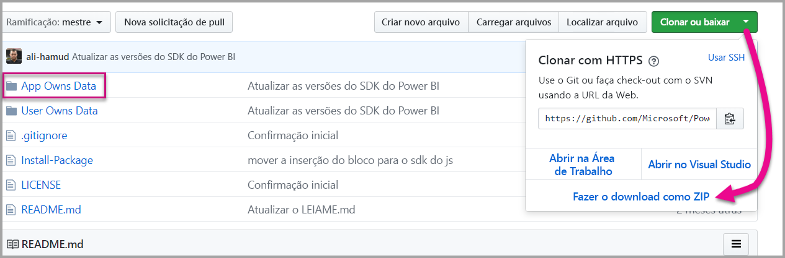

# <a name="tutorial-embed-a-power-bi-content-into-your-application-for-national-clouds"></a>Tutorial: Inserir conteúdo do Power BI a seu aplicativo para nuvens nacionais

Saiba como inserir conteúdo analítico em seus aplicativos de processos de negócios para a nuvem nacional. Você pode usar o SDK do .NET do Power BI com a API do JavaScript do Power BI para inserir um relatório, painel ou bloco, em seus aplicativos Web.

O Power BI também dá suporte a [nuvens nacionais](https://docs.microsoft.com/azure/active-directory/develop/authentication-national-cloud).

As diferentes nuvens nacionais são:

* (EUA) GCC (Government Community Cloud)

* U. S. Militares prestadores de serviço (DoDCON)

* U. S. Militar (DoD)

* Power BI para nuvem da Alemanha

* Power BI para a nuvem da China


Para começar este passo a passo, você precisará de uma conta do **Power BI**. Se você não tiver uma conta configurada, dependendo do tipo de governo ou país, você poderá escolher a nuvem nacional certa para você. Você pode se inscrever para uma [conta do Power BI do governo dos EUA](../service-govus-signup.md), uma [conta de nuvem do Power BI para a Alemanha](https://powerbi.microsoft.com/power-bi-germany/?ru=https%3A%2F%2Fapp.powerbi.de%2F%3FnoSignUpCheck%3D1) ou uma [conta do Power BI para a nuvem da China](http://www.21vbluecloud.com/powerbi/).

> [!NOTE]
> Buscando inserir um dashboard para sua organização em vez disso? Consulte [Inserir um dashboard do Power BI em um aplicativo para sua organização](integrate-dashboard.md).

Para integrar um dashboard em um aplicativo Web, você usa a API do **Power BI** e um **token de acesso** de autorização do Azure AD (Azure Active Directory) para obter um dashboard. Em seguida, carregue o dashboard usando um token de inserção. A API do **Power BI** fornece acesso programático a recursos específicos do **Power BI**. Para obter mais informações, confira [API REST do Power BI](https://docs.microsoft.com/rest/api/power-bi/), [SDK do .NET do Power BI e a [API JavaScript do Power BI](https://github.com/Microsoft/PowerBI-JavaScript).

## <a name="download-the-sample"></a>Baixe o exemplo

Este artigo mostra o código usado na [amostra O Aplicativo Possui Dados](https://github.com/Microsoft/PowerBI-Developer-Samples) no GitHub. Para acompanhar esse passo a passo, baixe a amostra. 



* GCC (Government Community Cloud):

    > [!Note]
    > As contas GCC são compatíveis apenas com as capacidades P e EM.

1. Substitua o arquivo Cloud.config por GCCCloud.config content.

2. Atualize a applicationId (applicationId do aplicativo nativo), workspaceId, o usuário (seu usuário mestre) e a senha no arquivo Web.config.

3. Adicione os parâmetros de GCC no arquivo web.config da seguinte maneira.

```xml
<add key="authorityUrl" value="https://login.microsoftonline.net/common/" />
<add key="resourceUrl" value="https://analysis.usgovcloudapi.net/powerbi/api" />
<add key="apiUrl" value="https://api.powerbigov.us/" />
<add key="embedUrlBase" value="https://app.powerbigov.us" />
```

* Militares prestadores de serviço (DoDCON):

1. Substitua o arquivo Cloud.config por TBCloud.config content.

2. Atualize a applicationId (applicationId do aplicativo nativo), workspaceId, o usuário (seu usuário mestre) e a senha no arquivo Web.config.

3. Adicione os parâmetros de DoDCON no arquivo web.config da seguinte maneira.

```xml
<add key="authorityUrl" value="https://login.microsoftonlineS.net/common/" />
<add key="resourceUrl" value="https://high.analysis.usgovcloudapi.net/powerbi/api" />
<add key="apiUrl" value="https://api.high.powerbigov.us/" />
<add key="embedUrlBase" value="https://app.high.powerbigov.us" />
```

* Militar (DoD):

1. Substitua o arquivo Cloud.config por PFCloud.config content.

2. Atualize a applicationId (applicationId do aplicativo nativo), workspaceId, o usuário (seu usuário mestre) e a senha no arquivo Web.config.

3. Adicione os parâmetros de DoDCON no arquivo web.config da seguinte maneira.

```xml
<add key="authorityUrl" value="https://login.microsoftonline.net/common/" />
<add key="resourceUrl" value="https://mil.analysis.usgovcloudapi.net/powerbi/api" />
<add key="apiUrl" value="https://api.mil.powerbigov.us/" />
<add key="embedUrlBase" value="https://app.mil.powerbigov.us" />
```

* Parâmetros do Power BI para nuvem da Alemanha

1. Substitua o arquivo Cloud.config pelo conteúdo do Power para nuvem da Alemanha.

2. Atualize a applicationId (applicationId do aplicativo nativo), workspaceId, o usuário (seu usuário mestre) e a senha no arquivo Web.config.

3. Adicione os parâmetros do Power BI para nuvem da Alemanha no arquivo web.config da seguinte maneira.

```xml
<add key="authorityUrl" value="https://login.microsoftonline.de/common/" />
<add key="resourceUrl" value="https://analysis.cloudapi.de/powerbi/api" />
<add key="apiUrl" value="https://api.powerbi.de/" />
<add key="embedUrlBase" value="https://app.powerbi.de" />
```

* Parâmetros do Power BI para nuvem da China

1. Substitua o arquivo Cloud.config pelo conteúdo do [Power BI para a nuvem da China](https://github.com/Microsoft/PowerBI-Developer-Samples/blob/master/App%20Owns%20Data/PowerBIEmbedded_AppOwnsData/CloudConfigs/Power%20BI%20operated%20by%2021Vianet%20in%20China/Cloud.config).

2. Atualize a applicationId (applicationId do aplicativo nativo), workspaceId, o usuário (seu usuário mestre) e a senha no arquivo Web.config.

3. Adicione os parâmetros do Power BI para nuvem da China no arquivo web.config da seguinte maneira.

```xml
<add key="authorityUrl" value="https://login.chinacloudapi.cn/common/" />
<add key="resourceUrl" value="https://analysis.chinacloudapi.cn/powerbi/api" />
<add key="apiUrl" value="https://api.powerbi.cn/" />
<add key="embedUrlBase" value="https://app.powerbi.cn" />
```

## <a name="step-1---register-an-app-in-azure-ad"></a>Etapa 1 – registrar um aplicativo no Azure AD

Registre o aplicativo no Azure AD para fazer chamadas à API REST. Para obter mais informações, consulte [Registrar um aplicativo do Azure AD para inserir o conteúdo do Power BI](register-app.md). Como há diferentes afiliações à nuvem nacional, há URLs distintas para registrar seu aplicativo.

* GCC (Government Community Cloud) – ```https://app.powerbigov.us/apps```

* Militares prestadores de serviço (DoDCON) – ```https://app.high.powerbigov.us/apps```

* Militar (DoD) – ```https://app.mil.powerbigov.us/apps```

* Power BI para nuvem da Alemanha – ```https://app.powerbi.de/apps```

* Power BI para a nuvem da China – ```https://app.powerbi.cn/apps```

Se você tiver baixado o [Exemplo Inserindo para seu cliente](https://github.com/Microsoft/PowerBI-Developer-Samples/tree/master/App%20Owns%20Data), use a **applicationId** obtida, para que o exemplo possa ser autenticado no Azure AD. Para configurar o exemplo, altere a **applicationId** no arquivo *web.config*.

## <a name="step-2---get-an-access-token-from-azure-ad"></a>Etapa 2 – Obter um token de acesso do Azure AD

No aplicativo, primeiro você precisa obter um **token de acesso** do Azure AD para que seja possível fazer chamadas à API REST do Power BI. Para obter mais informações, consulte [Autenticar usuários e obter um token de acesso do Azure AD para o aplicativo do Power BI](get-azuread-access-token.md). Como há afiliações de nuvem nacional diferentes, há URLs distintas para obter um token de acesso para seu aplicativo.

* GCC (Government Community Cloud) – ```https://login.microsoftonline.com```

* Militares prestadores de serviço (DoDCON) – ```http://login.microsoftonline.us```

* Militar (DoD) – ```https://login.microsoftonline.us```

* Power BI para nuvem da Alemanha – ```https://login.microsoftonline.de```

* Power BI para a nuvem da China – ```https://login.chinacloudapi.cn```

É possível ver exemplos desses tokens de acesso dentro de cada tarefa de item de conteúdo no arquivo **Controllers\HomeController.cs**.

## <a name="step-3---get-a-content-item"></a>Etapa 3 – Obter um item de conteúdo

Para inserir o conteúdo do Power BI, você precisará realizar algumas tarefas para verificar se ele é inserido corretamente. Embora todas essas etapas possam ser feitas diretamente com a API REST, o aplicativo de exemplo e os exemplos aqui usam o SDK do .NET.

### <a name="create-the-power-bi-client-with-your-access-token"></a>Criar o Cliente do Power BI com o token de acesso

Com o token de acesso, convém criar o objeto do cliente do Power BI que permite que você interaja com as APIs do Power BI. Crie seu objeto do cliente do Power BI encapsulando o AccessToken com um objeto *Microsoft.Rest.TokenCredentials*.

```csharp
using Microsoft.IdentityModel.Clients.ActiveDirectory;
using Microsoft.Rest;
using Microsoft.PowerBI.Api.V2;

var tokenCredentials = new TokenCredentials(authenticationResult.AccessToken, "Bearer");

// Create a Power BI Client object. This is used to call the Power BI APIs.
using (var client = new PowerBIClient(new Uri(ApiUrl), tokenCredentials))
{
    // Your code to embed items.
}
```

### <a name="get-the-content-item-you-want-to-embed"></a>Obter o item de conteúdo que você deseja inserir

Use o objeto de cliente do Power BI para recuperar uma referência ao item que você deseja inserir. É possível inserir dashboards, blocos ou relatórios. Veja a seguir um exemplo de como recuperar o primeiro dashboard, bloco ou relatório de um workspace específico.

Um exemplo está disponível em **Controllers\HomeController.cs** do [exemplo App Owns Data](https://github.com/Microsoft/PowerBI-Developer-Samples/tree/master/App%20Owns%20Data).

#### <a name="reports"></a>Relatórios

```csharp
using Microsoft.PowerBI.Api.V2;
using Microsoft.PowerBI.Api.V2.Models;

// You need to provide the workspaceId where the dashboard resides.
ODataResponseListReport reports = client.Reports.GetReportsInGroupAsync(workspaceId);

// Get the first report in the group.
Report report = reports.Value.FirstOrDefault();
```

#### <a name="dashboards"></a>Painéis

```csharp
using Microsoft.PowerBI.Api.V2;
using Microsoft.PowerBI.Api.V2.Models;

// You need to provide the workspaceId where the dashboard resides.
ODataResponseListDashboard dashboards = client.Dashboards.GetDashboardsInGroup(workspaceId);

// Get the first report in the group.
Dashboard dashboard = dashboards.Value.FirstOrDefault();
```

#### <a name="tiles"></a>Blocos

```csharp
using Microsoft.PowerBI.Api.V2;
using Microsoft.PowerBI.Api.V2.Models;

// To retrieve the tile, you first need to retrieve the dashboard.

// You need to provide the workspaceId where the dashboard resides.
ODataResponseListDashboard dashboards = client.Dashboards.GetDashboardsInGroup(workspaceId);

// Get the first report in the group.
Dashboard dashboard = dashboards.Value.FirstOrDefault();

// Get a list of tiles from a specific dashboard
ODataResponseListTile tiles = client.Dashboards.GetTilesInGroup(workspaceId, dashboard.Id);

// Get the first tile in the group.
Tile tile = tiles.Value.FirstOrDefault();
```

### <a name="create-the-embed-token"></a>Criar o token de inserção

Usando a API JavaScript, é possível gerar um token inserido. O token de inserção é específico do item que está sendo inserido. Sempre que você inserir uma parte do conteúdo do Power BI, precisará criar um novo token de inserção para ele. Para obter mais informações, incluindo qual **accessLevel** deve ser usado, confira [Inserir Token](https://docs.microsoft.com/rest/api/power-bi/embedtoken).

> [!IMPORTANT]
> Como os tokens inseridos destinam-se apenas para teste de desenvolvimento, o número de tokens inseridos que uma conta mestre do Power BI pode gerar é limitado. Uma [capacidade deve ser adquirida](https://docs.microsoft.com/power-bi/developer/embedded-faq#technical) para cenários de integração de produção. Não há nenhum limite para a geração de tokens inseridos quando uma capacidade é adquirida.

Um exemplo está disponível em **Controllers\HomeController.cs** do [exemplo Inserindo para a organização](https://github.com/Microsoft/PowerBI-Developer-Samples/tree/master/App%20Owns%20Data).

Uma classe é criada para **EmbedConfig** e **TileEmbedConfig**. Um exemplo está disponível em **Models\EmbedConfig.cs** e **Models\TileEmbedConfig.cs**.

#### <a name="reports"></a>Relatórios

```csharp
using Microsoft.PowerBI.Api.V2;
using Microsoft.PowerBI.Api.V2.Models;

// Generate Embed Token.
var generateTokenRequestParameters = new GenerateTokenRequest(accessLevel: "view");
EmbedToken tokenResponse = client.Reports.GenerateTokenInGroup(workspaceId, report.Id, generateTokenRequestParameters);

// Generate Embed Configuration.
var embedConfig = new EmbedConfig()
{
    EmbedToken = tokenResponse,
    EmbedUrl = report.EmbedUrl,
    Id = report.Id
};
```

#### <a name="dashboards"></a>Painéis

```csharp
using Microsoft.PowerBI.Api.V2;
using Microsoft.PowerBI.Api.V2.Models;

// Generate Embed Token.
var generateTokenRequestParameters = new GenerateTokenRequest(accessLevel: "view");
EmbedToken tokenResponse = client.Dashboards.GenerateTokenInGroup(workspaceId, dashboard.Id, generateTokenRequestParameters);

// Generate Embed Configuration.
var embedConfig = new EmbedConfig()
{
    EmbedToken = tokenResponse,
    EmbedUrl = dashboard.EmbedUrl,
    Id = dashboard.Id
};
```

#### <a name="tiles"></a>Blocos

```csharp
using Microsoft.PowerBI.Api.V2;
using Microsoft.PowerBI.Api.V2.Models;

// Generate Embed Token for a tile.
var generateTokenRequestParameters = new GenerateTokenRequest(accessLevel: "view");
EmbedToken tokenResponse = client.Tiles.GenerateTokenInGroup(workspaceId, dashboard.Id, tile.Id, generateTokenRequestParameters);

// Generate Embed Configuration.
var embedConfig = new TileEmbedConfig()
{
    EmbedToken = tokenResponse,
    EmbedUrl = tile.EmbedUrl,
    Id = tile.Id,
    dashboardId = dashboard.Id
};
```

## <a name="step-4---load-an-item-using-javascript"></a>Etapa 4 – Carregar um item usando o JavaScript

Você pode usar o JavaScript para carregar um dashboard em um elemento div na sua página da Web. O exemplo usa um modelo de EmbedConfig/TileEmbedConfig, juntamente com as exibições de um dashboard, bloco ou relatório. Para obter uma amostra completa de como usar a API JavaScript, use a [Amostra do Microsoft Power BI Embedded](https://microsoft.github.io/PowerBI-JavaScript/demo).

Um exemplo de aplicativo está disponível no [exemplo Inserindo para a organização](https://github.com/Microsoft/PowerBI-Developer-Samples/tree/master/App%20Owns%20Data).

### <a name="viewshomeembeddashboardcshtml"></a>Views\Home\EmbedDashboard.cshtml

```csharp
<script src="~/scripts/powerbi.js"></script>
<div id="dashboardContainer"></div>
<script>
    // Read embed application token from Model
    var accessToken = "@Model.EmbedToken.Token";

    // Read embed URL from Model
    var embedUrl = "@Html.Raw(Model.EmbedUrl)";

    // Read dashboard Id from Model
    var embedDashboardId = "@Model.Id";

    // Get models. models contains enums that can be used.
    var models = window['powerbi-client'].models;

    // Embed configuration used to describe the what and how to embed.
    // This object is used when calling powerbi.embed.
    // This also includes settings and options such as filters.
    // You can find more information at https://github.com/Microsoft/PowerBI-JavaScript/wiki/Embed-Configuration-Details.
    var config = {
        type: 'dashboard',
        tokenType: models.TokenType.Embed,
        accessToken: accessToken,
        embedUrl: embedUrl,
        id: embedDashboardId
    };

    // Get a reference to the embedded dashboard HTML element
    var dashboardContainer = $('#dashboardContainer')[0];

    // Embed the dashboard and display it within the div container.
    var dashboard = powerbi.embed(dashboardContainer, config);
</script>
```

### <a name="viewshomeembedtilecshtml"></a>Views\Home\EmbedTile.cshtml

```csharp
<script src="~/scripts/powerbi.js"></script>
<div id="tileContainer"></div>
<script>
    // Read embed application token from Model
    var accessToken = "@Model.EmbedToken.Token";

    // Read embed URL from Model
    var embedUrl = "@Html.Raw(Model.EmbedUrl)";

    // Read tile Id from Model
    var embedTileId = "@Model.Id";

    // Read dashboard Id from Model
    var embedDashboardId = "@Model.dashboardId";

    // Get models. models contains enums that can be used.
    var models = window['powerbi-client'].models;

    // Embed configuration used to describe the what and how to embed.
    // This object is used when calling powerbi.embed.
    // This also includes settings and options such as filters.
    // You can find more information at https://github.com/Microsoft/PowerBI-JavaScript/wiki/Embed-Configuration-Details.
    var config = {
        type: 'tile',
        tokenType: models.TokenType.Embed,
        accessToken: accessToken,
        embedUrl: embedUrl,
        id: embedTileId,
        dashboardId: embedDashboardId
    };

    // Get a reference to the embedded tile HTML element
    var tileContainer = $('#tileContainer')[0];

    // Embed the tile and display it within the div container.
    var tile = powerbi.embed(tileContainer, config);
</script>
```

### <a name="viewshomeembedreportcshtml"></a>Views\Home\EmbedReport.cshtml

```csharp
<script src="~/scripts/powerbi.js"></script>
<div id="reportContainer"></div>
<script>
    // Read embed application token from Model
    var accessToken = "@Model.EmbedToken.Token";

    // Read embed URL from Model
    var embedUrl = "@Html.Raw(Model.EmbedUrl)";

    // Read report Id from Model
    var embedReportId = "@Model.Id";

    // Get models. models contains enums that can be used.
    var models = window['powerbi-client'].models;

    // Embed configuration used to describe the what and how to embed.
    // This object is used when calling powerbi.embed.
    // This also includes settings and options such as filters.
    // You can find more information at https://github.com/Microsoft/PowerBI-JavaScript/wiki/Embed-Configuration-Details.
    var config = {
        type: 'report',
        tokenType: models.TokenType.Embed,
        accessToken: accessToken,
        embedUrl: embedUrl,
        id: embedReportId,
        permissions: models.Permissions.All,
        settings: {
            filterPaneEnabled: true,
            navContentPaneEnabled: true
        }
    };

    // Get a reference to the embedded report HTML element
    var reportContainer = $('#reportContainer')[0];

    // Embed the report and display it within the div container.
    var report = powerbi.embed(reportContainer, config);
</script>
```

## <a name="next-steps"></a>Próximas etapas

* Um aplicativo de exemplo está disponível no GitHub para você examinar. Os exemplos acima baseiam-se nessa amostra. Para obter mais informações, consulte a [amostra Inserindo para a organização](https://github.com/Microsoft/PowerBI-Developer-Samples/tree/master/App%20Owns%20Data).

* Para obter mais informações sobre a API de JavaScript, veja [API de JavaScript do Power BI](https://github.com/Microsoft/PowerBI-JavaScript).

* Para saber mais sobre o Power BI para a nuvem da Alemanha, veja [Perguntas frequentes do Power BI para a nuvem da Alemanha](https://docs.microsoft.com/power-bi/service-govde-faq)

* [Como migrar conteúdo da Coleção de workspaces do Power BI para o Power BI](migrate-from-powerbi-embedded.md)

Considerações e limitações

Mais perguntas? [Experimente perguntar à Comunidade do Power BI](http://community.powerbi.com/)
