# <a name="tutorial-embed-a-power-bi-report-dashboard-or-tile-into-an-application-for-your-customers"></a>Tutorial: Inserir um relatório, um painel ou um bloco do Power BI em um aplicativo para seus clientes

Com o **Power BI Embedded no Azure**, você pode inserir relatórios, painéis ou blocos em um aplicativo usando app owns data. **App owns data** representa um aplicativo que usa o Power BI como sua plataforma de análise incorporada. Como **desenvolvedor ISV**, é possível criar conteúdo do Power BI que exibe relatórios, painéis ou blocos em um aplicativo totalmente integrado e interativo, sem precisar que os usuários tenham uma licença do Power BI. Este tutorial demonstra como integrar um relatório em um aplicativo usando o SDK do .NET do Power BI com a API JavaScript do Power BI ao usar o **Power BI Embedded no Azure** para clientes.

Neste tutorial, você aprenderá a:
> [!div class="checklist"]
> * Registrar um aplicativo no Azure.
> * Insira um relatório do Power BI em um aplicativo.

## <a name="prerequisites"></a>Pré-requisitos

Para começar, é necessária uma conta do **Power BI Pro** (essa conta é sua **conta mestre**) e uma assinatura do **Microsoft Azure**.

* Se não estiver inscrito no **Power BI Pro**, [inscreva-se para uma avaliação gratuita](https://powerbi.microsoft.com/en-us/pricing/) antes de começar.
* Caso você não tenha uma assinatura do Azure, crie uma [conta gratuita](https://azure.microsoft.com/free/?WT.mc_id=A261C142F) antes de começar.
* Você precisa ter seu próprio [locatário do Azure Active Directory](create-an-azure-active-directory-tenant.md) configurado.
* Você precisa do [Visual Studio](https://www.visualstudio.com/) instalado (versão 2013 ou posterior).

## <a name="set-up-your-embedded-analytics-development-environment"></a>Configurar seu ambiente de desenvolvimento de análise integrada

Antes de começar a inserir relatórios, dashboard ou blocos no seu aplicativo, você precisará verificar se o ambiente permite inserção com o Power BI.

Você pode examinar a [Ferramenta de configuração de integração](https://aka.ms/embedsetup/AppOwnsData) para que possa iniciar rapidamente e baixar um aplicativo de exemplo que ajuda a criar um ambiente e a inserir um relatório.

No entanto, se você optar por configurar o ambiente manualmente, você poderá continuar abaixo.

### <a name="register-an-application-in-azure-active-directory-azure-ad"></a>Registrar um aplicativo no Azure AD (Azure Active Directory)

Registre seu aplicativo no Azure Active Directory para permitir que ele tenha acesso às APIs REST do Power BI. Registrando o aplicativo, você pode estabelecer uma identidade para ele e especificar permissões para recursos REST do Power BI.

1. Aceite os [Termos da API do Microsoft Power BI](https://powerbi.microsoft.com/api-terms).

2. Entre no [Portal do Azure](https://portal.azure.com).

    

3. No painel de navegação esquerdo, escolha **Todos os serviços**, selecione **Registros de aplicativo** e, em seguida, selecione **Novo registro de aplicativo**.

    </br>
    

4. Siga os prompts e crie um novo aplicativo. Para app owns data, você precisa usar **Nativo** como o tipo de aplicativo. Você também precisará fornecer um **URI de redirecionamento** que o **Azure AD** usa para retornar respostas de token. Insira um valor específico ao seu aplicativo (por exemplo, `http://localhost:13526/Redirect`).

    

### <a name="apply-permissions-to-your-application-within-azure-active-directory"></a>Aplique permissões ao seu aplicativo no Azure Active Directory

Habilite permissões adicionais para seu aplicativo, incluindo as que foram concedidas na página de registro do aplicativo. Entre com a conta *mestre* que você está usando para inserção. A conta mestre precisa ser a conta do administrador global.

### <a name="use-the-azure-active-directory-portal"></a>Use o portal do Azure Active Directory

1. Navegue até [Registros de aplicativo](https://portal.azure.com/#blade/Microsoft_AAD_IAM/ApplicationsListBlade) no portal do Azure e selecione o aplicativo que você está usando para inserção.

    

2. Selecione **Configurações** e, em **Acesso à API**, selecione **Permissões necessárias**.

    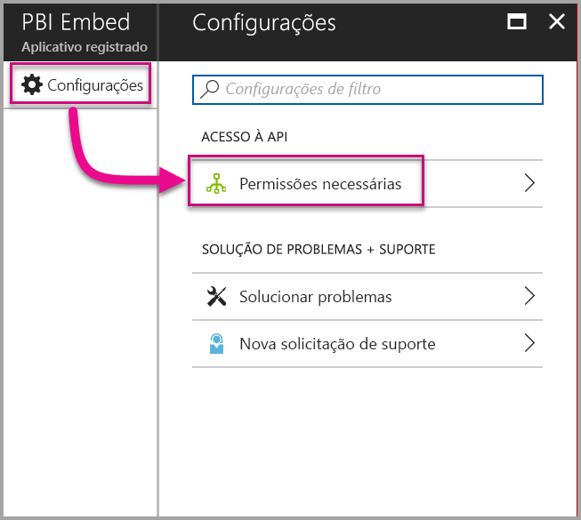

3. Selecione **Microsoft Azure Active Directory** e, em seguida, certifique-se de **Acessar o diretório como o usuário conectado** esteja selecionado. Selecione **Salvar**.

    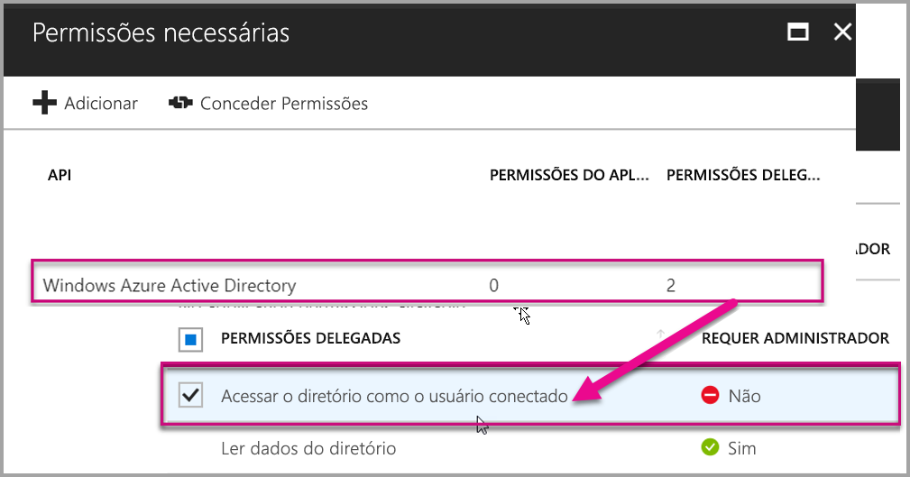

4. Selecione **Adicionar**.

    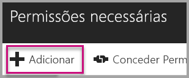

5. Selecione **Selecionar uma API**.

    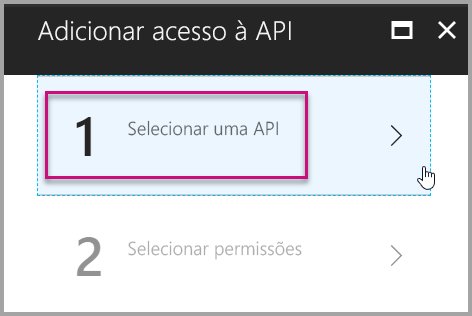

6. Selecione **Serviço do Power BI** e, em seguida, selecione **Selecionar**.

    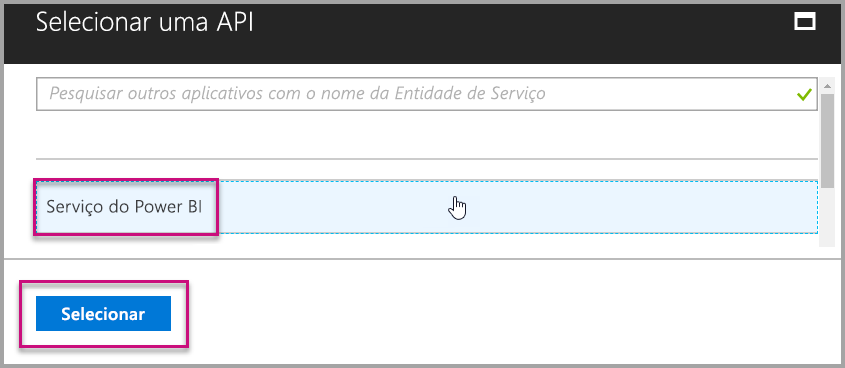

7. Selecione todas as permissões em **Permissões Delegadas**. Selecione **Salvar** quando terminar.

    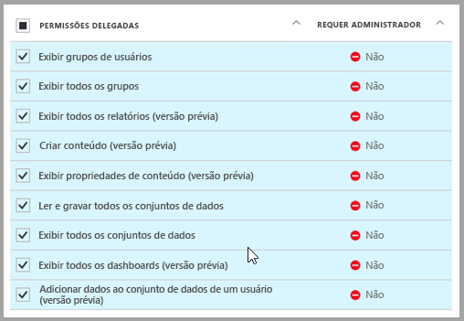

8. Em **Permissões necessárias**, selecione **Conceder Permissões**.

    A ação **Conceder permissões** é necessária para a *conta mestre*, a fim de evitar prompts de consentimento pelo Azure AD. Se a conta que executar essa ação for um administrador global, você precisará conceder permissões para todos os usuários da organização para esse aplicativo. Se a conta que executa essa ação é a *conta mestre* e não é um administrador global, você precisa conceder permissões apenas para a *conta mestre* para esse aplicativo.

    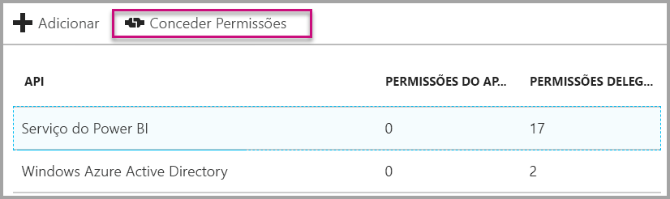

## <a name="set-up-your-power-bi-environment"></a>Configurar seu ambiente do Power BI

### <a name="create-an-app-workspace"></a>Criar workspace do aplicativo

Se você estiver inserindo relatórios, painéis ou blocos para seus clientes, precisará colocar o conteúdo dentro de um espaço de trabalho do aplicativo. A conta *mestre* precisa ser um administrador do workspace do aplicativo.

1. Comece criando o workspace. Selecione **Workspaces** > **Criar workspace do aplicativo**. No workspace Criar aplicativo, coloque o conteúdo que seu aplicativo precisa acessar.

    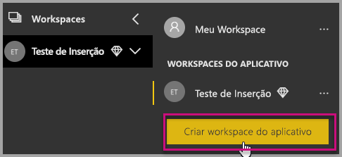

2. Nomeie o workspace. Se a **ID do Workspace** correspondente não estiver disponível, edite-a para criar uma ID exclusiva.

    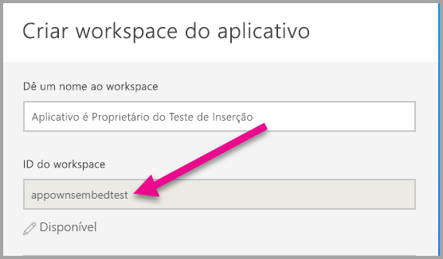

3. Você tem algumas opções para definir. Se você escolher **Público**, qualquer pessoa na sua organização poderá ver o que está no workspace. Se você escolher **Privado**, somente os membros do espaço de trabalho poderão ver o conteúdo.

    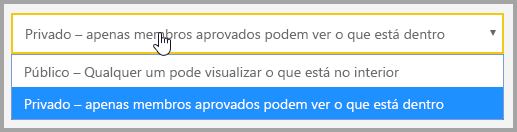

    Não é possível alterar a configuração Público/Particular depois de criar o grupo.

4. Também é possível escolher se os membros podem **editar** ou se terão acesso **somente exibição**.

    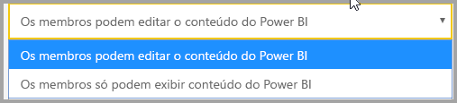

5. Adicione os endereços de email das pessoas que você deseja que tenham acesso ao workspace e selecione **Adicionar**. Você não pode adicionar aliases de grupos, apenas indivíduos.

6. Decida se cada pessoa será um membro ou um administrador. Os administradores podem editar o workspace, incluindo a adição de outros membros. Os membros podem editar o conteúdo no workspace, a menos que tenham acesso somente exibição. Os membros e os administradores podem publicar o aplicativo.

    Agora, você pode exibir o novo workspace. O Power BI cria o workspace e o abre. Ele aparece na lista de workspaces dos quais você é um membro. Como você é um administrador, você pode selecionar as reticências (...) para voltar e fazer alterações, adicionar novos membros ou alterar as permissões deles.

    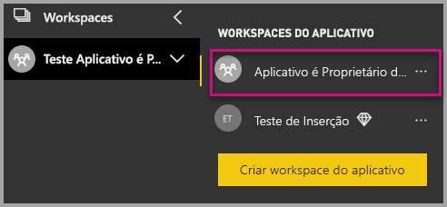

### <a name="create-and-publish-your-reports"></a>Crie e publique seus relatórios

É possível criar seus relatórios e conjuntos de dados usando o Power BI Desktop e, em seguida, publicar esses relatórios em um workspace do aplicativo. O usuário final que publicar os relatórios precisará ter uma licença do Power BI Pro para publicar em um workspace do aplicativo.

1. Baixe o exemplo [Blog Demo](https://github.com/Microsoft/powerbi-desktop-samples) do GitHub.

    

2. Abra o relatório de exemplo do PBIX no **Power BI Desktop**

   

3. Publique no **workspace do aplicativo**

   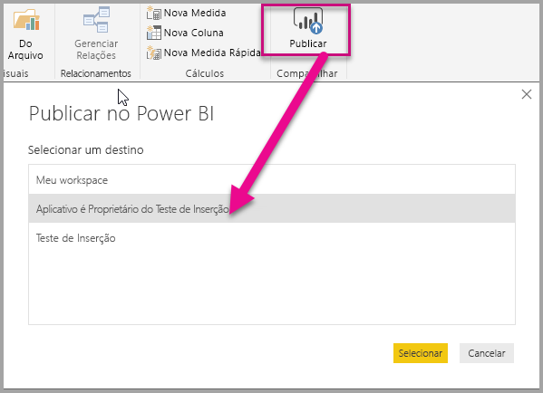

    Agora, você pode exibir o relatório no serviço do Power BI online.

   

## <a name="embed-your-content-using-the-sample-application"></a>Insira o conteúdo usando o aplicativo de exemplo

Execute estas etapas para começar a incorporar o conteúdo usando um aplicativo de exemplo.

1. Baixe o [exemplo App Owns Data](https://github.com/Microsoft/PowerBI-Developer-Samples) do GitHub para começar.

    

2. Abra o arquivo Web.config no aplicativo de exemplo. Há cinco campos que você precisa preencher para executar o aplicativo com êxito. Os campos **applicationId**, **workspaceId**, **reportId**, **pbiUsername** e **pbiPassword**.

    

    Preencha as informações de **applicationId** com a **ID do Aplicativo** do **Azure**. A **applicationId** é usada pelo aplicativo para identificar-se aos usuários para os quais você está solicitando permissões. Para obter a **applicationId**, siga estas etapas:

    Entre no [Portal do Azure](https://portal.azure.com).

    

    No painel de navegação esquerdo, escolha **Todos os serviços** e selecione **Registros de aplicativo**.

    

    Selecione o aplicativo para o qual você deseja obter **applicationId**.

    

    Você deve ver uma **ID do Aplicativo** listada como um GUID. Use essa **ID do aplicativo** como a **applicationId** do aplicativo.

    

    Preencha as informações de **workspaceId** com o **GUID de workspace do aplicativo** do Power BI.

    

    Preencha as informações de **reportId** com o **GUID de relatório** do Power BI.

    

    * Preencha o **pbiUsername** com a conta de usuário mestre do Power BI.
    * Preencha o **pbiPassword** com a senha da conta de usuário mestre do Power BI.

3. Execute o aplicativo!

    Primeiro, selecione **Executar** no **Visual Studio**.

    

    Selecione **Inserir Relatório**. Dependendo do conteúdo que você optar por testar – relatórios, painéis ou blocos –, selecione essa opção no aplicativo.

    

    Agora, você pode exibir o relatório no aplicativo de exemplo.

    

## <a name="embed-your-content-within-your-application"></a>Insira o conteúdo dentro de seu aplicativo

Embora as etapas para inserir seu conteúdo possam ser feitas com as [APIs REST do Power BI](https://docs.microsoft.com/rest/api/power-bi/), os códigos de exemplo descritos neste artigo são feitos com o **SDK do .NET**.

A inserção para seus clientes dentro de seu aplicativo exige que você obtenha um **token de acesso** para sua conta mestre do **Azure AD**. É necessário obter um [token de acesso do Azure AD](get-azuread-access-token.md#access-token-for-non-power-bi-users-app-owns-data) para o seu aplicativo do Power BI usando **app owns data** antes de pode fazer chamadas às [APIs REST do Power BI](https://docs.microsoft.com/rest/api/power-bi/).

Para criar o cliente do Power BI com o **token de acesso**, crie o objeto de cliente do Power BI que permitirá interagir com as [APIs REST do Power BI](https://docs.microsoft.com/rest/api/power-bi/). Crie o objeto do cliente do Power BI encapsulando o **AccessToken** com um objeto ***Microsoft.Rest.TokenCredentials***.

```csharp
using Microsoft.IdentityModel.Clients.ActiveDirectory;
using Microsoft.Rest;
using Microsoft.PowerBI.Api.V2;

var tokenCredentials = new TokenCredentials(authenticationResult.AccessToken, "Bearer");

// Create a Power BI Client object. it's used to call Power BI APIs.
using (var client = new PowerBIClient(new Uri(ApiUrl), tokenCredentials))
{
    // Your code to embed items.
}
```

### <a name="get-the-content-item-you-want-to-embed"></a>Obter o item de conteúdo que você deseja inserir

É possível usar o objeto do cliente do Power BI para recuperar uma referência ao item que deseja inserir.

Veja um exemplo de código de como recuperar o primeiro relatório de um workspace específico.

*Um exemplo de obtenção de um item de conteúdo, seja um bloco, um relatório ou um painel que você deseja inserir, está disponível no arquivo Controladores\HomeController.cs no [aplicativo de exemplo](#embed-your-content-within-a-sample-application).*

```csharp
using Microsoft.PowerBI.Api.V2;
using Microsoft.PowerBI.Api.V2.Models;

// You need to provide the workspaceId where the dashboard resides.
ODataResponseListReport reports = await client.Reports.GetReportsInGroupAsync(workspaceId);

// Get the first report in the group.
Report report = reports.Value.FirstOrDefault();
```

### <a name="create-the-embed-token"></a>Criar o token de inserção

Gerou um token de inserção, que pode ser usado a partir da API do JavaScript. O token de inserção é específico ao item que está sendo inserido. Sempre que você inserir uma parte do conteúdo do Power BI, precisará criar um novo token de inserção para ele. Para obter mais informações, incluindo qual **accessLevel** usar, consulte [API GenerateToken](https://msdn.microsoft.com/library/mt784614.aspx).

Aqui está um exemplo da adição de um token de inserção para um relatório ao seu aplicativo.

*Um exemplo da criação de um token de inserção para um bloco, relatório ou dashboard está disponível no arquivo Controladores\HomeController.cs no [aplicativo de exemplo](#embed-your-content-within-a-sample-application).*

```csharp
using Microsoft.PowerBI.Api.V2;
using Microsoft.PowerBI.Api.V2.Models;

// Generate Embed Token.
var generateTokenRequestParameters = new GenerateTokenRequest(accessLevel: "view");
EmbedToken tokenResponse = client.Reports.GenerateTokenInGroup(workspaceId, report.Id, generateTokenRequestParameters);

// Generate Embed Configuration.
var embedConfig = new EmbedConfig()
{
    EmbedToken = tokenResponse,
    EmbedUrl = report.EmbedUrl,
    Id = report.Id
};
```

Uma classe é criada para **EmbedConfig** e **TileEmbedConfig**. Uma amostra está disponível nos arquivos **Modelos\EmbedConfig.cs** e **Modelos\TileEmbedConfig.cs**.

### <a name="load-an-item-using-javascript"></a>Carregar um item usando o JavaScript

Use o JavaScript para carregar um relatório em um elemento div na página da Web.

Para obter um exemplo completo de como usar a API JavaScript, use a [ferramenta de Playground](https://microsoft.github.io/PowerBI-JavaScript/demo). A ferramenta de Playground é uma maneira rápida de experimentar diferentes tipos de exemplos do Power BI Embedded. Também é possível obter mais informações sobre a API de JavaScript, acessando a página da [wiki PowerBI-JavaScript](https://github.com/Microsoft/powerbi-javascript/wiki).

Aqui está uma amostra que usa um modelo de **EmbedConfig** e de **TileEmbedConfig**, juntamente com as exibições de um relatório.

*Um exemplo de adição de uma exibição de um bloco, relatório ou dashboard está disponível nos arquivos Exibições\Início\EmbedReport.cshtml, Exibições\Início\EmbedDashboard.cshtml ou Exibições\Início\Embedtile.cshtml no [aplicativo de exemplo](#embed-your-content-within-a-sample-application).*

```javascript
<script src="~/scripts/powerbi.js"></script>
<div id="reportContainer"></div>
<script>
    // Read embed application token from Model
    var accessToken = "@Model.EmbedToken.Token";

    // Read embed URL from Model
    var embedUrl = "@Html.Raw(Model.EmbedUrl)";

    // Read report Id from Model
    var embedReportId = "@Model.Id";

    // Get models. models contains enums that can be used.
    var models = window['powerbi-client'].models;

    // Embed configuration used to describe the what and how to embed.
    // This object is used when calling powerbi.embed.
    // This also includes settings and options such as filters.
    // You can find more information at https://github.com/Microsoft/PowerBI-JavaScript/wiki/Embed-Configuration-Details.
    var config = {
        type: 'report',
        tokenType: models.TokenType.Embed,
        accessToken: accessToken,
        embedUrl: embedUrl,
        id: embedReportId,
        permissions: models.Permissions.All,
        settings: {
            filterPaneEnabled: true,
            navContentPaneEnabled: true
        }
    };

    // Get a reference to the embedded report HTML element
    var reportContainer = $('#reportContainer')[0];

    // Embed the report and display it within the div container.
    var report = powerbi.embed(reportContainer, config);
</script>
```

## <a name="move-to-production"></a>Mover para a produção

Agora que você terminou o desenvolvimento do seu aplicativo, é hora de conferir uma capacidade dedicada para o workspace do seu aplicativo. É necessário ter capacidade dedicada para passar para a produção.

### <a name="create-a-dedicated-capacity"></a>Criar uma capacidade dedicada

Ao criar uma capacidade dedicada, é possível tirar proveito de um recurso dedicado para o seu cliente. Você pode comprar uma capacidade dedicada no [portal do Microsoft Azure](https://portal.azure.com). Para obter detalhes sobre como criar uma capacidade do Power BI Embedded, veja [Criar capacidade do Power BI Embedded no portal do Azure](azure-pbie-create-capacity.md).

Use a tabela a seguir para determinar qual capacidade do Power BI Embedded melhor atende as suas necessidades.

| Nó de capacidade | Total de núcleos<br/>*(Back-end + front-end)* | Núcleos de back-end | Núcleos de front-end | Limites de conexão dinâmica/DirectQuery | Máx. de renderizações de página no horário de pico |
| --- | --- | --- | --- | --- | --- |
| A1 |1 núcleo virtual |0,5 núcleo, 3 GB de RAM |0,5 núcleo |0 5 por segundo |1-300 |
| A2 |2 núcleos virtuais |1 núcleo, 5 GB de RAM |1 núcleo | 10 por segundo |301-600 |
| A3 |4 núcleos virtuais |2 núcleos, 10 GB de RAM |2 núcleos | 15 por segundo |601-1.200 |
| A4 |8 núcleos virtuais |4 núcleos, 25 GB de RAM |4 núcleos |30 por segundo |1.201-2.400 |
| A5 |16 núcleos virtuais |8 núcleos, 50 GB de RAM |8 núcleos |60 por segundo |2.401-4.800 |
| A6 |32 núcleos virtuais |16 núcleos, 100 GB de RAM |16 núcleos |120 por segundo |4.801-9.600 |

**_Com os SKUs A, não é possível acessar o conteúdo do Power BI com uma licença do Power BI GRATUITA._**

Os tokens inseridos com licenças PRO destinam-se a teste de desenvolvimento, portanto, o número de tokens inseridos que uma conta mestre do Power BI pode gerar é limitado. É preciso adquirir uma capacidade dedicada para incorporar em um ambiente de produção. Não há limite para a quantidade de tokens inseridos que você pode gerar com uma capacidade dedicada. Acesse [Recursos Disponíveis](https://docs.microsoft.com/rest/api/power-bi/availablefeatures/getavailablefeatures) para verificar o valor de uso que indica o uso inserido atual, em percentual. A quantidade de uso é por conta mestre.

Para obter mais informações, consulte [Artigo sobre planejamento de capacidade de análise integrada](https://aka.ms/pbiewhitepaper).

### <a name="assign-an-app-workspace-to-a-dedicated-capacity"></a>Atribua um workspace de aplicativo a uma capacidade dedicada

Depois de criar uma capacidade dedicada, você pode atribuir o workspace do aplicativo a uma capacidade dedicada. Para atribuir uma capacidade dedicada a um espaço de trabalho, siga estas etapas.

1. No **serviço do Power BI**, expanda os workspaces e selecione as reticências do workspace que você está usando para inserir seu conteúdo. Depois, selecione **Editar workspaces**.

    

2. Expanda **Avançado**, habilite **Capacidade dedicada** e selecione a capacidade dedicada criada por você. Depois, selecione **Salvar**.

    

3. Depois que você selecionar **Salvar**, será exibido um **losango** próximo ao nome do workspace do aplicativo.

    

## <a name="next-steps"></a>Próximas etapas

Neste tutorial, você aprendeu como inserir o conteúdo do Power BI em um aplicativo para seus clientes. Você também pode tentar inserir o conteúdo do Power BI para sua organização.

> [!div class="nextstepaction"]
>[Inserir para a organização](embed-sample-for-your-organization.md)

Mais perguntas? [Experimente perguntar à Comunidade do Power BI](http://community.powerbi.com/)
