# <a name="tutorial-embed-a-power-bi-report-dashboard-or-tile-into-an-application-for-your-organization"></a>Tutorial: Inserir um relatório, um dashboard ou um bloco do Power BI em um aplicativo para sua organização

Este tutorial demonstra como integrar um relatório a um aplicativo. Você pode usar o SDK do .NET do Power BI juntamente com a API do JavaScript do Power BI para inserir o Power BI em um aplicativo para sua organização. Com o Power BI, você pode inserir relatórios, dashboards e blocos em um aplicativo usando **user owns data**. O **user owns data** permite que o aplicativo estenda o serviço do Power BI.

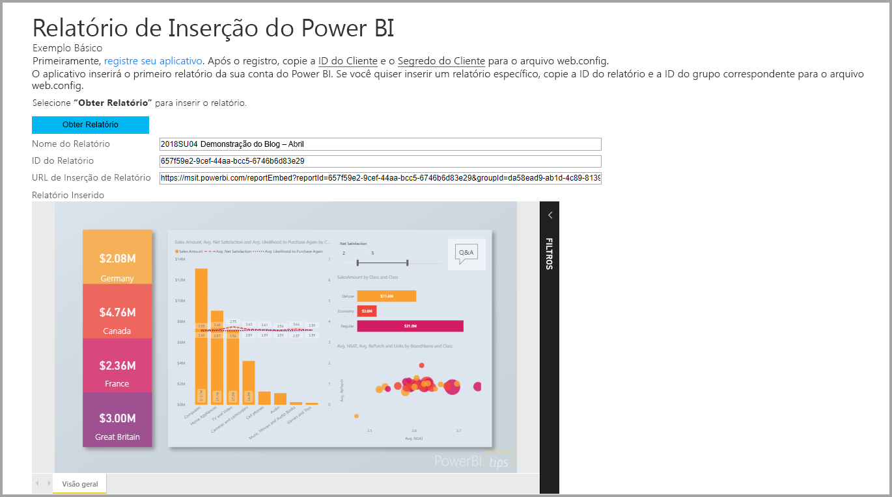

Neste tutorial, você aprenderá as seguintes tarefas:
>[!div class="checklist"]
>* Registrar um aplicativo no Azure.
>* Insira um relatório do Power BI em um aplicativo.

## <a name="prerequisites"></a>Pré-requisitos

Para começar, você precisa de uma conta Power BI Pro e uma assinatura do Microsoft Azure:

* Se não estiver inscrito no Power BI Pro, [inscreva-se para uma avaliação gratuita](https://powerbi.microsoft.com/en-us/pricing/) antes de começar.
* Caso você não tenha uma assinatura do Azure, crie uma [conta gratuita](https://azure.microsoft.com/free/?WT.mc_id=A261C142F) antes de começar.
* Configure seu próprio [locatário do Azure AD (Azure Active Directory)](create-an-azure-active-directory-tenant.md).
* Instale [Visual Studio](https://www.visualstudio.com/) versão 2013 ou posterior.

## <a name="set-up-your-embedded-analytics-development-environment"></a>Configurar seu ambiente de desenvolvimento de análise integrada

Antes de começar a inserir relatórios, painéis ou blocos em seu aplicativo, verifique se o ambiente está configurado para permitir a inserção. Como parte da instalação, execute uma destas ações:

- Você pode examinar a [Ferramenta de configuração de integração](https://aka.ms/embedsetup/UserOwnsData) para iniciar rapidamente e baixar um aplicativo de exemplo que o conduz pela criação de um ambiente e a inserir um relatório.

- Se você optar por configurar o ambiente manualmente, execute as etapas nas seções a seguir.

### <a name="register-an-application-in-azure-active-directory"></a>Registrar um aplicativo no Azure Active Directory

Para fornecer ao seu aplicativo acesso a APIs REST do Power BI, registre-o com o Azure Active Directory. Então você poderá estabelecer uma identidade para seu aplicativo e especificar permissões para recursos REST do Power BI.

1. Aceite os [termos da API do Microsoft Power BI](https://powerbi.microsoft.com/api-terms).

2. Entre no [portal do Azure](https://portal.azure.com).

    

3. No painel de navegação esquerdo, escolha **Todos os Serviços** e selecione **Registros de aplicativo**. Em seguida, selecione **Registro de aplicativo novo**.

    </br>

    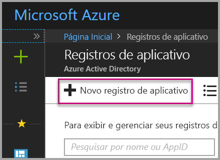

4. Siga os prompts e crie um novo aplicativo. Para **user owns data**, use **Aplicativo Web/API** para o **Tipo de aplicativo**. Você também deve fornecer uma **URL de logon** que o Azure AD use para retornar respostas de token. Insira um valor específico para seu aplicativo. Um exemplo é `http://localhost:13526/`.

    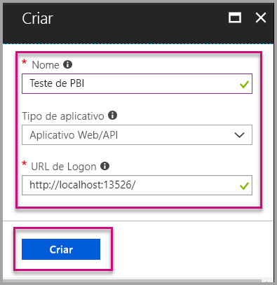

### <a name="apply-permissions-to-your-application-within-azure-active-directory"></a>Aplique permissões ao seu aplicativo no Azure Active Directory

Você deve habilitar permissões para seu aplicativo além do que é fornecido na página de registro do aplicativo. Entre com uma conta do administrador global para habilitar as permissões.

### <a name="use-the-azure-active-directory-portal"></a>Use o portal do Azure Active Directory

1. Navegue até [Registros de aplicativo](https://portal.azure.com/#blade/Microsoft_AAD_IAM/ApplicationsListBlade) no portal do Azure e selecione o aplicativo que você está usando para inserção.

    

2. Selecione **Configurações**. Então, em **Acesso à API**, selecione **Permissões necessárias**.

    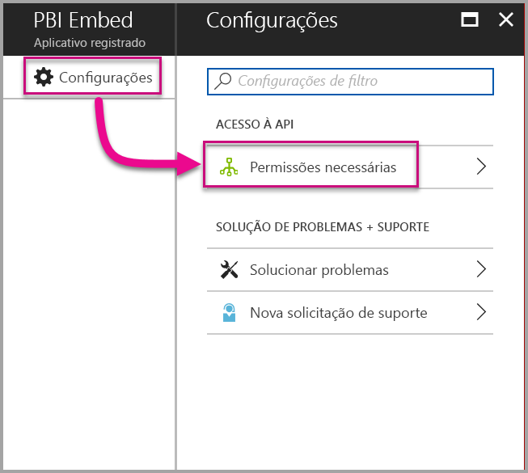

3. Selecione **Microsoft Azure Active Directory**. Em seguida, verifique se **Acessar o diretório como o usuário conectado** está selecionado. Selecione **Salvar**.

    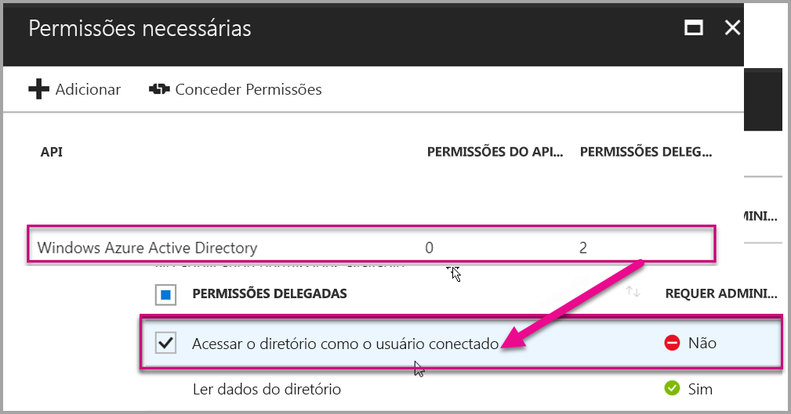

4. Selecione **Adicionar**.

    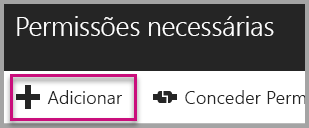

5. Escolha **Selecionar uma API**.

    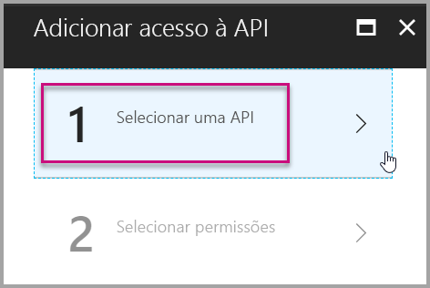

6. Selecione **Serviço do Power BI**. Em seguida, escolha **Selecionar**.

    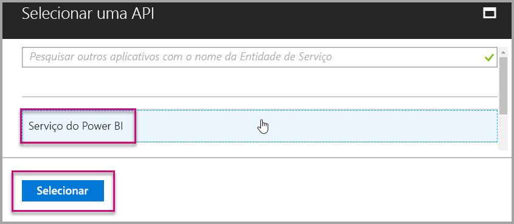

7. Selecione todas as permissões em **Permissões Delegadas**. Selecionar uma a uma para salvar as seleções. Selecione **Salvar** ao terminar.

    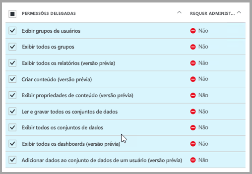

## <a name="set-up-your-power-bi-environment"></a>Configurar seu ambiente do Power BI

### <a name="create-an-app-workspace"></a>Criar um workspace de aplicativo

Se você estiver inserindo relatórios, dashboards ou blocos para seus clientes, precisará colocar o conteúdo dentro de um workspace do aplicativo:

1. Comece criando o workspace. Selecione **Workspaces** > **Criar workspace do aplicativo**. Esse é o workspace em que você coloca o conteúdo que seu aplicativo precisa acessar.

    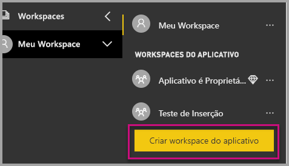

2. Nomeie o workspace. Se a **ID do Workspace** correspondente não estiver disponível, edite-a para criar uma ID exclusiva. Esse nome também precisa ser o nome do aplicativo.

    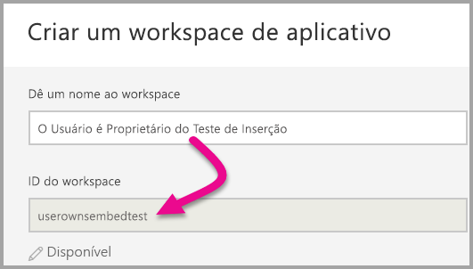

3. Você tem algumas opções para definir. Se você escolher **Público**, qualquer pessoa na sua organização poderá ver o que está no workspace. **Privado** significa que somente os membros do workspace podem ver o conteúdo.

    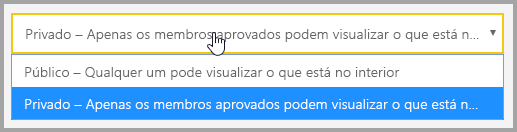

    Não é possível alterar a configuração Pública ou Privada depois de criar o grupo.

4. Também é possível escolher se os membros podem editar ou se terão acesso somente exibição.

    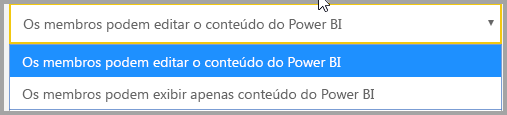

5. Adicione os endereços de email das pessoas que você deseja que tenham acesso ao workspace e selecione **Adicionar**. Você não pode adicionar aliases de grupos, apenas indivíduos.

6. Decida se cada pessoa será um membro ou um administrador. Os administradores podem editar o workspace, incluindo a adição de outros membros. Os membros podem editar o conteúdo no workspace, a menos que tenham acesso somente exibição. Os membros e os administradores podem publicar o aplicativo.

    Agora, você pode exibir o novo workspace. O Power BI cria o workspace e o abre. Ele aparece na lista de workspaces dos quais você é membro. Como você é um administrador, você pode selecionar as reticências (...) para voltar e fazer alterações, adicionar novos membros ou alterar as permissões deles.

    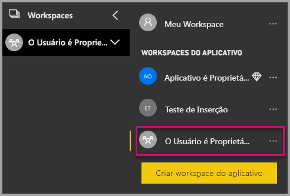

### <a name="create-and-publish-your-reports"></a>Crie e publique seus relatórios

Você pode criar seus relatórios e conjuntos de dados usando o Power BI Desktop. Em seguida, você pode publicar esses relatórios em um workspace do aplicativo. O usuário final que publicar os relatórios precisa ter uma licença do Power BI Pro para publicar em um workspace do aplicativo.

1. Baixe o exemplo [Blog Demo](https://github.com/Microsoft/powerbi-desktop-samples) do GitHub.

    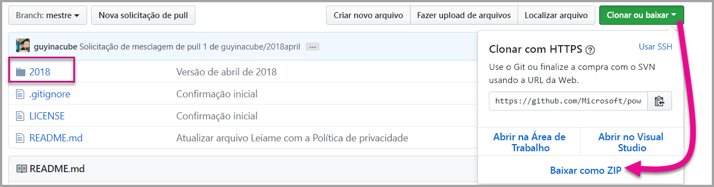

2. Abra o relatório de exemplo .pbix no Power BI Desktop.

   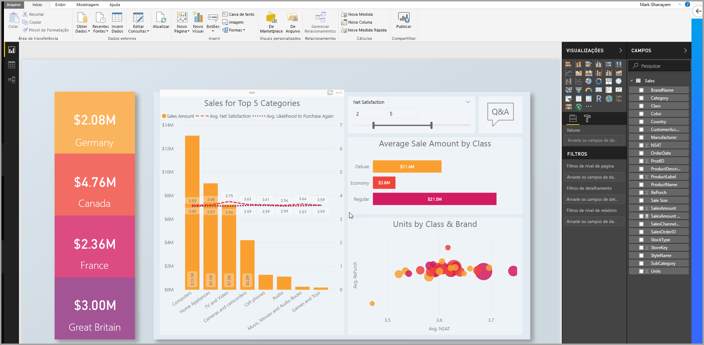

3. Publique no workspace do aplicativo.

   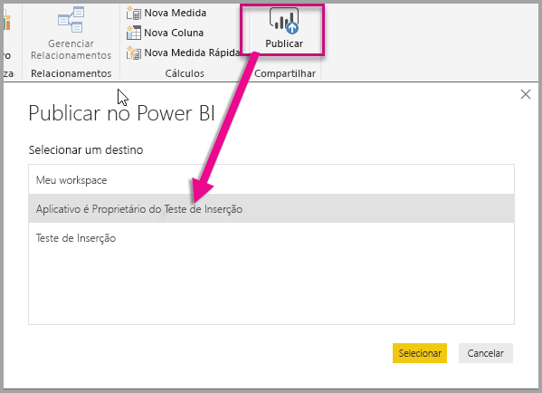

    Agora, você pode exibir o relatório no serviço do Power BI online.

   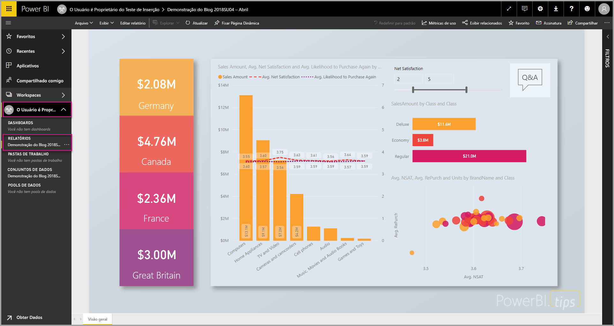

## <a name="embed-your-content-by-using-the-sample-application"></a>Insira o conteúdo usando o aplicativo de exemplo

Para inserir seu conteúdo usando um aplicativo de exemplo, siga estas etapas:

1. Para começar, baixe o [exemplo User Owns Data](https://github.com/Microsoft/PowerBI-Developer-Samples) do GitHub. Há três aplicativos de exemplo diferentes, um para [relatórios](https://github.com/Microsoft/PowerBI-Developer-Samples/tree/master/User%20Owns%20Data/integrate-report-web-app), um para [dashboards](https://github.com/Microsoft/PowerBI-Developer-Samples/tree/master/User%20Owns%20Data/integrate-dashboard-web-app) e outro para [blocos](https://github.com/Microsoft/PowerBI-Developer-Samples/tree/master/User%20Owns%20Data/integrate-tile-web-app). Este artigo refere-se ao aplicativo de **relatórios**.

    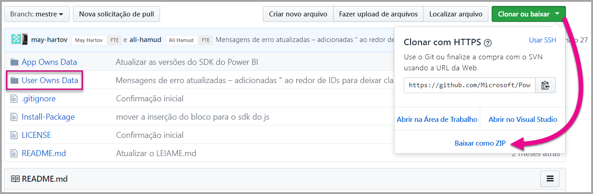

2. Abra o arquivo **Cloud.config** no aplicativo de exemplo. Há alguns campos que você precisa preencher para executar o aplicativo com êxito: **ApplicationID** e **ApplicationSecret**.

    

    Preencha as informações de **ApplicationID** com a **ID do Aplicativo** do Azure. A **ApplicationID** é usada pelo aplicativo para identificar-se aos usuários dos quais você está solicitando permissões.

    Para obter a **ApplicationID**, siga estas etapas:

    1. Entre no [portal do Azure](https://portal.azure.com).

        

    1. No painel de navegação esquerdo, escolha **Todos os Serviços** e selecione **Registros de aplicativo**.

        

    1. Selecione o aplicativo que precisa usar a **ApplicationID**.

        

    1. Você deve ver uma **ID do Aplicativo** listada como GUID. Use essa **ID do aplicativo** como a **ApplicationID** do aplicativo.

        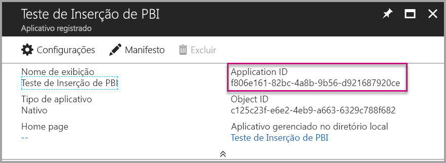

    1. Preencha as informações de **ApplicationSecret** da seção **Chaves** na seção **Registros de aplicativo** no **Azure**.

    1. Para obter o **ApplicationSecret**, siga estas etapas:

        1. Entre no [portal do Azure](https://portal.azure.com).

            

        1. No painel de navegação esquerdo, escolha **Todos os Serviços** e selecione **Registros de aplicativo**.

            

        1. Selecione o aplicativo que precisa usar o **ApplicationSecret**.

            

        1. Selecione **Configurações**.

            

        1. Selecione **Chaves**.

            

    1. Insira um nome na caixa **Descrição** e selecione uma duração. Em seguida, selecione **Salvar** para obter o **Valor** para seu aplicativo. Quando você fecha o painel **Chaves** depois de salvar o valor da chave, o campo de valor é mostrado como oculto. Neste ponto, você não pode recuperar o valor da chave. Se você perder o valor da chave, crie uma nova no portal do Azure.

        

    1. Para **groupId**, insira o GUID do workspace do aplicativo do Power BI.

        

    1. Para o **reportId**, insira o GUID de relatório do Power BI.

        

3. Executar o aplicativo:

    1. Primeiro, selecione **Executar** no **Visual Studio**.

        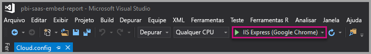

    1. Em seguida, selecione **Obter Relatório**.

        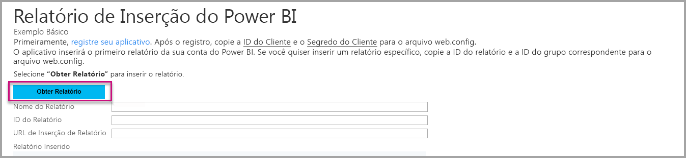

    1. Agora, você pode exibir o relatório no aplicativo de exemplo.

        

## <a name="embed-your-content-within-your-application"></a>Insira o conteúdo dentro de seu aplicativo

Embora as etapas para inserir seu conteúdo possam ser feitas com as [APIs REST do Power BI](https://docs.microsoft.com/rest/api/power-bi/), os códigos de exemplo descritos neste artigo são feitos com o SDK do .NET.

Para integrar um relatório a um aplicativo Web, você pode usar a API REST do Power BI ou o SDK do C# do Power BI. Você também pode usar um token de acesso de autorização do Azure Active Directory para obter um relatório. Em seguida, carregue o relatório usando o mesmo token de acesso. A API REST do Power BI fornece acesso programático a recursos específicos do Power BI. Para obter mais informações, confira [Visão geral das APIs REST do Power BI](https://docs.microsoft.com/rest/api/power-bi/) e a [API JavaScript do Power BI](https://github.com/Microsoft/PowerBI-JavaScript).

### <a name="get-an-access-token-from-azure-ad"></a>Obter um token de acesso do Azure AD

No aplicativo, primeiro você deve obter um token de acesso do Azure AD para que seja possível fazer chamadas à API REST do Power BI. Para obter mais informações, consulte [Autenticar usuários e obter um token de acesso do Azure AD para o aplicativo do Power BI](get-azuread-access-token.md).

### <a name="get-a-report"></a>Obter um relatório

Para obter um relatório do Power BI, use a operação [Obter Relatórios](https://docs.microsoft.com/rest/api/power-bi/reports/getreports) que obtém uma lista de relatórios do Power BI. Na lista de relatórios, obtenha uma ID de relatório.

### <a name="get-reports-by-using-an-access-token"></a>Obter relatórios usando um token de acesso

A operação [Obter Relatórios](https://docs.microsoft.com/rest/api/power-bi/reports/getreports) retorna uma lista de relatórios. É possível obter um relatório individual na lista de relatórios.

Para fazer a chamada à API REST, você deve incluir um cabeçalho *Autorização* no formato *Portador {token de acesso}*.

#### <a name="get-reports-with-the-rest-api"></a>Obter relatórios com a API REST

O exemplo de código a seguir mostra como recuperar relatórios com a **API REST**:

> [!NOTE]  
> Há um exemplo de como obter um item de conteúdo que você deseja inserir disponível no arquivo **Default.aspx.cs** no [aplicativo de exemplo](#embed-your-content-using-the-sample-application). Exemplos são relatório, dashboard ou bloco.

```csharp
using Newtonsoft.Json;

//Get a Report. In this sample, you get the first Report.
protected void GetReport(int index)
{
    //Configure Reports request
    System.Net.WebRequest request = System.Net.WebRequest.Create(
        String.Format("{0}/Reports",
        baseUri)) as System.Net.HttpWebRequest;

    request.Method = "GET";
    request.ContentLength = 0;
    request.Headers.Add("Authorization", String.Format("Bearer {0}", accessToken.Value));

    //Get Reports response from request.GetResponse()
    using (var response = request.GetResponse() as System.Net.HttpWebResponse)
    {
        //Get reader from response stream
        using (var reader = new System.IO.StreamReader(response.GetResponseStream()))
        {
            //Deserialize JSON string
            PBIReports Reports = JsonConvert.DeserializeObject<PBIReports>(reader.ReadToEnd());

            //Sample assumes at least one Report.
            //You could write an app that lists all Reports
            if (Reports.value.Length > 0)
            {
                var report = Reports.value[index];

                txtEmbedUrl.Text = report.embedUrl;
                txtReportId.Text = report.id;
                txtReportName.Text = report.name;
            }
        }
    }
}

//Power BI Reports used to deserialize the Get Reports response.
public class PBIReports
{
    public PBIReport[] value { get; set; }
}
public class PBIReport
{
    public string id { get; set; }
    public string name { get; set; }
    public string webUrl { get; set; }
    public string embedUrl { get; set; }
}
```

#### <a name="get-reports-by-using-the-net-sdk"></a>Obter relatórios usando o SDK do .NET

Use o SDK do .NET para recuperar uma lista de relatórios, em vez de chamar a API REST diretamente. O exemplo de código a seguir mostra como listar os relatórios:

```csharp
using Microsoft.IdentityModel.Clients.ActiveDirectory;
using Microsoft.PowerBI.Api.V2;
using Microsoft.PowerBI.Api.V2.Models;

var tokenCredentials = new TokenCredentials(<ACCESS TOKEN>, "Bearer");

// Create a Power BI Client object. It is used to call Power BI APIs.
using (var client = new PowerBIClient(new Uri(ApiUrl), tokenCredentials))
{
    // Get the first report all reports in that workspace
    ODataResponseListReport reports = client.Reports.GetReports();

    Report report = reports.Value.FirstOrDefault();

    var embedUrl = report.EmbedUrl;
}
```

### <a name="load-a-report-by-using-javascript"></a>Carregar um relatório usando JavaScript

Use o JavaScript para carregar um relatório em um elemento div na página da Web. O exemplo de código a seguir mostra como recuperar um relatório de um determinado workspace:

> [!NOTE]  
> Um exemplo de carregamento de um item de conteúdo que você deseja inserir está disponível no arquivo **default.aspx** no [aplicativo de exemplo](#embed-your-content-using-the-sample-application). Exemplos são relatório, dashboard ou bloco.

```javascript
<!-- Embed Report-->
<div> 
    <asp:Panel ID="PanelEmbed" runat="server" Visible="true">
        <div>
            <div><b class="step">Step 3</b>: Embed a report</div>

            <div>Enter an embed url for a report from Step 2 (starts with https://):</div>
            <input type="text" id="tb_EmbedURL" style="width: 1024px;" />
            <br />
            <input type="button" id="bEmbedReportAction" value="Embed Report" />
        </div>

        <div id="reportContainer"></div>
    </asp:Panel>
</div>
```

#### <a name="sitemaster"></a>Site.master

```javascript
window.onload = function () {
    // client side click to embed a selected report.
    var el = document.getElementById("bEmbedReportAction");
    if (el.addEventListener) {
        el.addEventListener("click", updateEmbedReporte, false);
    } else {
        el.attachEvent('onclick', updateEmbedReport);
    }

    // handle server side post backs, optimize for reload scenarios
    // show embedded report if all fields were filled in.
    var accessTokenElement = document.getElementById('MainContent_accessTokenTextbox');
    if (accessTokenElement !== null) {
        var accessToken = accessTokenElement.value;
        if (accessToken !== "")
            updateEmbedReport();
    }
};

// update embed report
function updateEmbedReport() {

    // check if the embed url was selected
    var embedUrl = document.getElementById('tb_EmbedURL').value;
    if (embedUrl === "")
        return;

    // get the access token.
    accessToken = document.getElementById('MainContent_accessTokenTextbox').value;

    // Embed configuration used to describe the what and how to embed.
    // This object is used when calling powerbi.embed.
    // You can find more information at https://github.com/Microsoft/PowerBI-JavaScript/wiki/Embed-Configuration-Details.
    var config = {
        type: 'report',
        accessToken: accessToken,
        embedUrl: embedUrl
    };

    // Grab the reference to the div HTML element that will host the report.
    var reportContainer = document.getElementById('reportContainer');

    // Embed the report and display it within the div container.
    var report = powerbi.embed(reportContainer, config);

    // report.on will add an event handler which prints to Log window.
    report.on("error", function (event) {
        var logView = document.getElementById('logView');
        logView.innerHTML = logView.innerHTML + "Error<br/>";
        logView.innerHTML = logView.innerHTML + JSON.stringify(event.detail, null, "  ") + "<br/>";
        logView.innerHTML = logView.innerHTML + "---------<br/>";
    }
  );
}
```

## <a name="using-a-power-bi-premium-dedicated-capacity"></a>Usando uma capacidade dedicada do Power BI Premium

Agora que você terminou o desenvolvimento do seu aplicativo, é hora de conferir uma capacidade dedicada para o workspace do seu aplicativo.

### <a name="create-a-dedicated-capacity"></a>Criar uma capacidade dedicada

Ao criar uma capacidade dedicada, você pode usufruir de um recurso dedicado ao conteúdo no workspace do aplicativo. Você pode criar uma capacidade dedicada usando o [Power BI Premium](../service-premium.md).

A tabela a seguir lista os SKUs do Power BI Premium disponíveis no [Microsoft Office 365](../service-admin-premium-purchase.md):

| Nó de capacidade | Total de vCores<br/>(back-end + front-end) | vCores de back-end | vCores de front-end | Limites de conexão dinâmica/DirectQuery | Máximo de renderizações de página no horário de pico |
| --- | --- | --- | --- | --- | --- |
| EM1 |1 vCore |0,5 vCore, 10 GB de RAM |0,5 vCore |3,75 por segundo |150-300 |
| EM2 |2 vCores |1 vCore, 10 GB de RAM |1 vCores |7,5 por segundo |301-600 |
| EM3 |4 vCores |2 vCores, 10 GB de RAM |2 vCores |15 por segundo |601-1.200 |
| P1 |8 vCores |4 vCores, 25 GB de RAM |4 vCores |30 por segundo |1.201-2.400 |
| P2 |16 vCores |8 vCores, 50 GB de RAM |8 vCores |60 por segundo |2.401-4.800 |
| P3 |32 vCores |16 vCores, 100 GB de RAM |16 vCores |120 por segundo |4.801 a 9.600 |
| P4 |64 vCores |32 vCores, 200 GB de RAM |32 vCores |240 por segundo |9.601 a 19.200 |
| P5 |128 vCores |64 vCores, 400 GB de RAM |64 vCores |480 por segundo |19.201 a 38.400 |

> [!NOTE]
> - Quando você está tentando inserir com aplicativos do Microsoft Office, pode usar SKUs de EM para acessar o conteúdo com uma licença gratuita do Power BI. Mas você não pode acessar o conteúdo com uma licença gratuita do Power BI quando você estiver usando o Powerbi.com ou o Power BI Mobile.
> - Quando você está tentando inserir com aplicativos do Microsoft Office usando o Powerbi.com ou o Power BI Mobile, pode acessar o conteúdo com uma licença gratuita do Power BI.

### <a name="assign-an-app-workspace-to-a-dedicated-capacity"></a>Atribua um workspace de aplicativo a uma capacidade dedicada

Depois de criar uma capacidade dedicada, você pode atribuir o workspace do aplicativo a uma capacidade dedicada. Para concluir este processo, siga estas etapas:

1. No serviço do Power BI, expanda os workspaces e selecione as reticências do workspace que você está usando para inserir seu conteúdo. Depois, selecione **Editar workspaces**.

    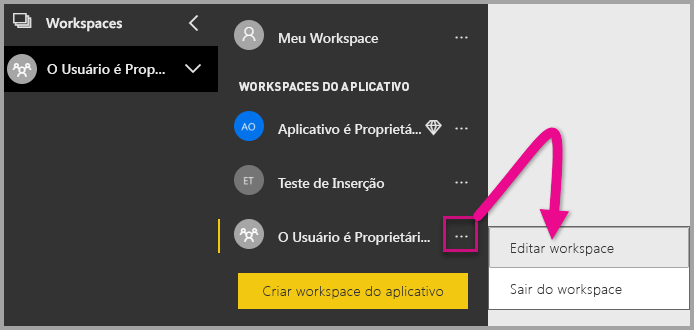

2. Expanda **Avançado** e habilite **Capacidade dedicada**. Selecione a capacidade dedicada que você criou. Depois, selecione **Salvar**.

    

3. Depois de selecionar **Salvar**, você verá um losango ao lado do nome do workspace do aplicativo.

    

## <a name="admin-settings"></a>Configurações de administração

Administradores globais ou administradores do serviço do Power BI podem ativar ou desativar a capacidade de usar as APIs REST para um locatário. Administradores do Power BI podem definir essa configuração para toda a organização ou para grupos de segurança individuais. Isso é habilitado para toda a organização por padrão. Você pode fazer estas alterações no [portal de administração do Power BI](../service-admin-portal.md).

## <a name="next-steps"></a>Próximas etapas

Neste tutorial, você aprendeu a inserir conteúdo do Power BI em um aplicativo usando a conta da organização do Power BI. Agora, você pode tentar inserir o conteúdo do Power BI em um aplicativo usando aplicativos. Você também pode tentar inserir o conteúdo do Power BI para seus clientes:

> [!div class="nextstepaction"]
> [Inserir de aplicativos](embed-from-apps.md)

> [!div class="nextstepaction"]
>[Inserir para seus clientes](embed-sample-for-customers.md)

Se você tiver outras dúvidas, [experimente perguntar à Comunidade do Power BI](http://community.powerbi.com/).
