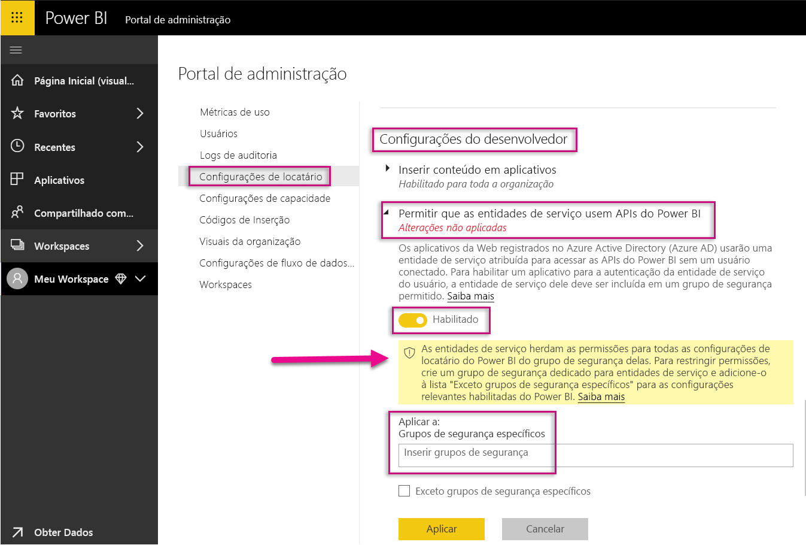
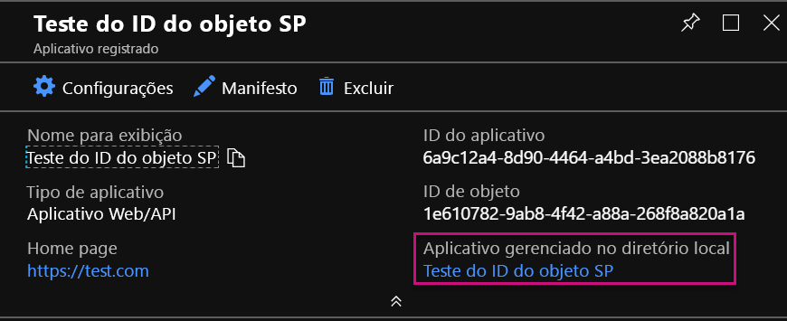
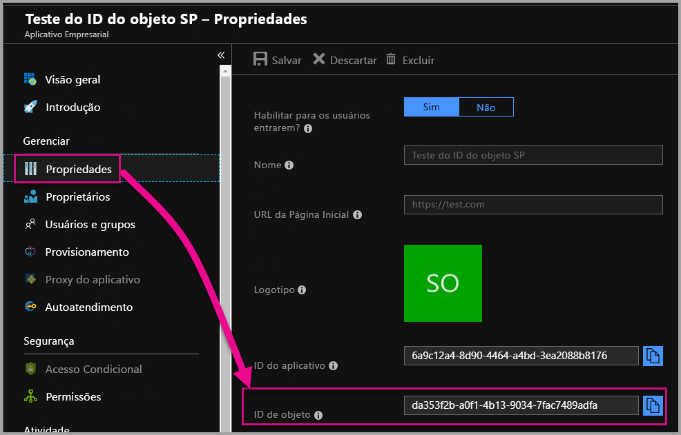

# <a name="service-principal-with-power-bi-preview"></a>Entidade de serviço com o Power BI (Versão Prévia)

Com a **entidade de serviço**, você pode inserir o conteúdo do Power BI em um aplicativo e usar a automação com o Power BI com um token **somente de aplicativo**. A entidade de serviço é útil ao usar o **Power BI Embedded** ou **automatizar processos e tarefas do Power BI**.

Ao trabalhar com o Power BI Embedded, há vantagens ao usar a entidade de serviço. Uma vantagem principal é uma conta mestra (licença do Power BI Pro, que é simplesmente um nome de usuário e senha para entrar) é que você não precisa autenticar-se no seu aplicativo. A entidade de serviço usa uma ID de aplicativo e um segredo do aplicativo para autenticar o aplicativo.

Ao trabalhar para automatizar tarefas do Power BI, você também pode criar scripts de como processar e gerenciar entidades de serviço para dimensionar.

## <a name="application-and-service-principal-relationship"></a>Relação de entidade de serviço e aplicativo

Para acessar recursos que protegem um locatário do Azure AD, a entidade que requer acesso representa uma entidade de segurança. Essa ação se aplica a usuários (entidade de usuário) e aplicativos (entidade de serviço).

A entidade de segurança define a política de acesso e permissões para usuários e aplicativos no locatário do Azure AD. Essa política de acesso habilita os principais recursos, como autenticação de usuários e aplicativos durante a entrada e autorização durante o acesso aos recursos. Para obter mais informações, veja [Aplicativo e entidade de serviço no AAD (Azure Active Directory)](https://docs.microsoft.com/azure/active-directory/develop/app-objects-and-service-principals).

Ao registrar um aplicativo Azure AD no portal do Azure, dois objetos são criados no locatário do Azure AD:

* Um [objeto de aplicativo](https://docs.microsoft.com/azure/active-directory/develop/app-objects-and-service-principals#application-object)
* Um [objeto da entidade de serviço](https://docs.microsoft.com/azure/active-directory/develop/app-objects-and-service-principals#service-principal-object)

Considere o objeto de aplicativo como a representação *global* de seu aplicativo para uso em todos os locatários e o objeto de entidade de serviço como a representação *local* para uso em um locatário específico.

O objeto de aplicativo serve como o modelo do qual propriedades comuns e padrão são *derivadas* para uso na criação de objetos de entidade de serviço correspondentes.

É necessária uma entidade de serviço por locatário em que o aplicativo é usado, permitindo que ele estabeleça uma identidade para entrada e acesso a recursos protegidos pelo locatário. Um aplicativo de locatário único tem apenas uma entidade de serviço (em seu locatário inicial), criada e consentida para uso durante o registro de aplicativo.

## <a name="service-principal-with-power-bi-embedded"></a>Entidade de serviço com o Power BI Embedded

Com a entidade de serviço, você pode mascarar as informações da conta mestra em seu aplicativo usando uma ID de aplicativo e um segredo do aplicativo. Você não precisa codificar uma conta mestra em seu aplicativo para autenticar.

Uma vez que **APIs do Power BI** e **o SDK do .NET do Power BI** agora dão suporte a chamadas usando a entidade de serviço, você pode usar [APIs REST do Power BI](https://docs.microsoft.com/rest/api/power-bi/) com entidade de serviço. Por exemplo, você pode fazer alterações a workspaces, como criar workspaces, adicionar ou remover usuários dos workspaces e importar o conteúdo para os workspaces.

Você só poderá usar a entidade de serviço se seus artefatos e recursos do Power BI estiverem armazenados no [novo workspace do Power BI](../service-create-the-new-workspaces.md).

## <a name="service-principal-vs-master-account"></a>Entidade de serviço versus conta mestra

Há diferenças entre o uso de uma entidade de serviço e uma conta mestra padrão (licença do Power BI Pro) para autenticação. A tabela a seguir destaca algumas diferenças significativas.

| Função | Conta Mestra de Usuário </br> (licença do Power BI Pro) | Entidade de serviço </br> (token somente de aplicativo) |
|------------------------------------------------------|---------------------|-------------------|
| Pode entrar no serviço do Power BI  | Sim | Não |
| Habilitado no portal de Administração do Power BI | Não | Sim |
| [Funciona com workspaces do aplicativo (v1)](../service-create-workspaces.md) | Sim | Não |
| [Funciona com os novos workspaces do aplicativo (v2)](../service-create-the-new-workspaces.md) | Sim | Sim |
| Precisa ser um administrador do workspace se usado com o Power BI Embedded | Sim | Sim |
| Pode usar as APIs REST do Power BI | Sim | Sim |
| Precisa de um administrador global para criar | Sim | Não |
| Pode instalar e gerenciar um gateway de dados local | Sim | Não |

## <a name="get-started-with-a-service-principal"></a>Introdução à entidade de serviço

Diferente do uso tradicional de uma conta mestra, usar a entidade de serviço (token somente de aplicativo) requer algumas partes diferentes para configurar. Para começar com a entidade de serviço (token somente de aplicativo), você precisa configurar o ambiente certo.

1. [Registrar um aplicativo Web do lado do servidor](register-app.md) no AAD (Azure Active Directory) para usar com o Power BI. Depois de registrar um aplicativo, você pode capturar uma ID de aplicativo, um segredo do aplicativo e a ID de objeto da entidade de serviço para acessar o conteúdo do Power BI. Você pode criar uma entidade de serviço com o [PowerShell](https://docs.microsoft.com/powershell/azure/create-azure-service-principal-azureps?view=azps-1.1.0).

    Abaixo está um exemplo de script para criar um novo aplicativo do Azure Active Directory.

    ```powershell
    # The app id - $app.appid
    # The service principal object id - $sp.objectId
    # The app key - $key.value

    # Sign in as a user that is allowed to create an app.
    Connect-AzureAD

    # Create a new AAD web application
    $app = New-AzureADApplication -DisplayName "testApp1" -Homepage "https://localhost:44322" -ReplyUrls "https://localhost:44322"

    # Creates a service principal
    $sp = New-AzureADServicePrincipal -AppId $app.AppId

    # Get the service principal key.
    $key = New-AzureADServicePrincipalPasswordCredential -ObjectId $sp.ObjectId
    ```

   > [!Important]
   > Depois que você habilita a entidade de serviço para ser usada com o Power BI, as permissões do aplicativo do AD não estão mais em vigor. As permissões do aplicativo então são gerenciadas por meio do portal de administração do Power BI.

2. Crie um [grupo de segurança no AAD (Azure Active Directory)](https://docs.microsoft.com/azure/active-directory/fundamentals/active-directory-groups-create-azure-portal) e adicione o aplicativo que você criou para o grupo de segurança. Você pode criar um grupo de segurança do AAD com o [PowerShell](https://docs.microsoft.com/powershell/azure/create-azure-service-principal-azureps?view=azps-1.1.0).

    Abaixo está um exemplo de script para criar um novo grupo de segurança e adicionar um aplicativo ao grupo de segurança.

    ```powershell
    # Required to sign in as a tenant admin
    Connect-AzureAD

    # Create an AAD security group
    $group = New-AzureADGroup -DisplayName <Group display name> -SecurityEnabled $true -MailEnabled $false -MailNickName notSet

    # Add the service principal to the group
    Add-AzureADGroupMember -ObjectId $($group.ObjectId) -RefObjectId $($sp.ObjectId)
    ```

3. Como um administrador do Power BI, você precisa habilitar a entidade de serviço nas **Configurações do desenvolvedor** no portal de administração do Power BI. Adicione o grupo de segurança que você criou no Azure AD para a seção **Grupo de segurança específico** nas **Configurações do desenvolvedor**.

   > [!Important]
   > As entidades de serviço herdam as permissões para todas as configurações de locatário do Power BI de seu grupo de segurança. Para restringir permissões, crie um grupo de segurança dedicado para entidades de serviço e adicione-o à lista "Exceto grupos de segurança específicos" para as configurações relevantes habilitadas do Power BI.

    

4. Configurar seu [ambiente do Power BI](embed-sample-for-customers.md#set-up-your-power-bi-environment).

5. Adicionar a entidade de serviço como um **administrador** para o novo workspace que você criou. Você pode gerenciar essa tarefa por meio de [APIs](https://docs.microsoft.com/rest/api/power-bi/groups/addgroupuser) ou com o serviço do Power BI.

6. Agora, escolha inserir o conteúdo dentro de um aplicativo de exemplo ou em seu próprio aplicativo.

    * [Insira conteúdo usando o aplicativo de exemplo](embed-sample-for-customers.md#embed-content-using-the-sample-application)
    * [Inserir conteúdo em seu aplicativo](embed-sample-for-customers.md#embed-content-within-your-application)

7. Agora você está pronto para [passar para a produção](embed-sample-for-customers.md#move-to-production).

## <a name="migrate-to-service-principal"></a>Migrar para a entidade de serviço

Você pode migrar para usar a entidade de serviço se está usando uma conta mestre atualmente com o Power BI ou com o Power BI Embedded.

Conclua as três primeiras etapas na seção [Introdução a uma entidade de serviço](#get-started-with-a-service-principal) e, depois de concluí-las, siga as informações a seguir.

Se você já está usando os [novos workspaces](../service-create-the-new-workspaces.md) no Power BI, adicione a entidade de serviço como um **administrador** para os workspaces com seus artefatos do Power BI. No entanto, se você está usando [workspaces tradicionais](../service-create-workspaces.md), copie ou mova seus artefatos do Power BI e recursos para os novos workspaces e, em seguida, adicione a entidade de serviço como um **administrador** a esses workspaces.

Não há recurso de interface do usuário para mover artefatos e recursos do Power BI de um workspace para outro, assim, você precisa usar [APIs](https://powerbi.microsoft.com/pt-br/blog/duplicate-workspaces-using-the-power-bi-rest-apis-a-step-by-step-tutorial/) para realizar essa tarefa. Ao usar as APIs com a entidade de serviço, é necessário a ID de objeto da entidade de serviço.

### <a name="how-to-get-the-service-principal-object-id"></a>Como obter a ID de objeto da entidade de serviço

Para atribuir uma entidade de serviço a um novo workspace do aplicativo, você deve usar as [APIs REST do Power BI](https://docs.microsoft.com/rest/api/power-bi/groups/addgroupuser). Para fazer referência a uma entidade de serviço para operações ou fazer alterações, você usa a **ID de objeto de entidade de serviço** – por exemplo, aplicação de uma entidade de serviço como um administrador a um workspace.

Abaixo estão as etapas para obter a ID de objeto da entidade de serviço do portal do Azure.

1. Crie um novo registro de Aplicativo no portal do Azure.  

2. Então, em **Aplicativo gerenciado no diretório local**, selecione o nome do aplicativo que você criou.

   

    > [!Note]
    > A ID de objeto na imagem acima não é usada com a entidade de serviço.

3. Selecione **Propriedades** para ver a ID do objeto.

    

Abaixo está um exemplo de script para recuperar a ID de objeto da entidade de serviço com o PowerShell.

   ```powershell
   Get-AzureADServicePrincipal -Filter "DisplayName eq '<application name>'"
   ```

## <a name="considerations-and-limitations"></a>Considerações e limitações

* A entidade de serviço só funciona com [novos workspaces do aplicativo](../service-create-the-new-workspaces.md).
* Não há suporte para **Meu Workspace** ao usar a entidade de serviço.
* É necessária [capacidade dedicada](../service-admin-premium-manage.md) ao passar para produção.
* Você não pode entrar no portal do Power BI usando a entidade de serviço.
* Direitos de administrador do Power BI são necessários para habilitar a entidade de serviço nas configurações do desenvolvedor no portal do administrador do Power BI.
* Você não pode instalar nem gerenciar um gateway de dados local usando a entidade de serviço.
* Aplicativos [inseridos para sua organização](embed-sample-for-your-organization.md) não podem usar a entidade de serviço.
* Não há suporte para gerenciamento de [fluxos de dados](../service-dataflows-overview.md).

## <a name="next-steps"></a>Próximas etapas

* [Registrar um aplicativo](register-app.md)
* [Power BI Embedded para seus clientes](embed-sample-for-customers.md)
* [Aplicativo e objetos de entidade de serviço no Azure Active Directory](https://docs.microsoft.com/azure/active-directory/develop/app-objects-and-service-principals)
