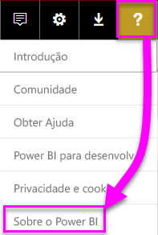
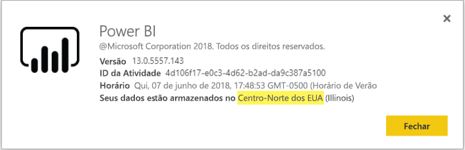

# <a name="frequently-asked-questions-about-power-bi-embedded"></a>Perguntas frequentes sobre o Power BI Embedded

* Se você tiver outras dúvidas, [experimente perguntar à comunidade do Power BI](http://community.powerbi.com/).
* Ainda tem um problema? Acesse a [página de suporte do Power BI](https://powerbi.microsoft.com/support/).

## <a name="general"></a>Geral

### <a name="what-is-power-bi-embedded"></a>O que é o Power BI Embedded?

[Microsoft Power BI Embedded (PBIE)](azure-pbie-what-is-power-bi-embedded.md) permite que os desenvolvedores de aplicativo inserir relatórios impressionantes e totalmente interativos em seus aplicativos sem precisar criar suas próprias visualizações de dados e controles do zero.

### <a name="who-is-the-target-audience-for-power-bi-embedded"></a>Quem é o público-alvo do Power BI Embedded?

Os desenvolvedores e empresas de software, fornecedores de software também conhecido como independentes (ISVs), aplicativos de codificação.

### <a name="how-is-power-bi-embedded-different-from-power-bi-the-service"></a>Qual a diferença entre o Power BI Embedded e o serviço do Power BI?

O Power BI é uma solução de análise de software como serviço que fornece às organizações uma exibição única dos dados corporativos mais críticos.

A Microsoft desenvolveu Power BI Embedded para ISVs que desejam inserir elementos visuais em seus aplicativos para ajudar seus clientes a tomar decisões de analíticas. Isso poupa os ISVs preciso criar a solução de sua própria análise em si. [Embedded analytics](embedding.md) permite que os usuários de negócios acessar dados de negócios e executar as consultas para gerar insights dentro do aplicativo.


### <a name="what-is-the-difference-between-power-bi-premium-and-power-bi-embedded"></a>Qual é a diferença entre o Power BI Premium e o Power BI Embedded?

O Power BI Premium é capacidade direcionada a empresas que desejam uma solução de BI completa que fornece uma exibição única de sua organização, parceiros, clientes e fornecedores. O Power BI Premium ajuda a organização na tomada de decisões. O Power BI Premium é um produto de SaaS que permite que os usuários consumam conteúdo por meio de aplicativos móveis, aplicativos desenvolvidos internamente, ou no portal do Power BI.

Power BI Embedded é para ISVs que desejam inserir elementos visuais em seus aplicativos. O Power BI Embedded ajuda os clientes a tomar decisões por ser destinado aos desenvolvedores de aplicativos, de modo que os clientes desses aplicativos, incluindo qualquer pessoa dentro ou fora da organização, podem consumir o conteúdo armazenado na capacidade do Power BI Embedded. Não é possível compartilhar no Power BI Embedded por meio de um clique o conteúdo da capacidade de publicar na Web ou um clique para publicar no SharePoint.

### <a name="what-is-the-microsoft-recommendation-for-when-a-customer-should-buy-power-bi-premium-vs-power-bi-embedded"></a>Segundo a recomendação da Microsoft, quando os clientes devem comprar o Power BI Premium e quando devem comprar o Power BI Premium vs. Power BI Embedded?

A Microsoft recomenda que as empresas comprem o Power BI Premium, um nível empresarial, a solução de BI de autoatendimento de nuvem. É recomendável que os ISVs comprem o Power BI Embedded para seus componentes de análise inseridos habilitados para nuvem. No entanto, um cliente não tem nenhuma restrição sobre qual produto comprar.

Pode haver alguns casos em que um ISV (normalmente de grande porte), além de inserção de aplicativos, quer usar uma SKU P para obter os benefícios adicionais do serviço do Power BI predefinido em sua organização. Algumas empresas poderão decidir usar SKUs A no Azure se estiverem interessadas apenas em criar aplicativos de linha de negócios e em inserir análise neles, e não em usar o serviço do Power BI predefinido.

### <a name="how-many-embed-tokens-can-i-create"></a>Quantos tokens inseridos posso criar?

Incorporar tokens com licença PRO destinam-se para testes de desenvolvimento, portanto, a conta do mestre de um Power BI ou [entidade de serviço](embed-service-principal.md) só pode gerar um número limitado de tokens. [Compre uma capacidade](#technical) para inserir em um ambiente de produção. Não há nenhum limite para quantas você pode gerar ao comprar uma capacidade de tokens de inserção. Acesse [Recursos Disponíveis](https://docs.microsoft.com/rest/api/power-bi/availablefeatures) para verificar o valor de uso que indica o uso inserido atual, em percentual.

## <a name="technical"></a>Técnico

### <a name="what-is-the-difference-between-the-a-skus-in-azure-and-the-em-skus-in-office-365"></a>Qual é a diferença entre os SKUs A no Azure e os SKUs EM no Office 365?

O PowerBI.com é uma empresa de Software como uma solução de serviço (SaaS) com muitos recursos, como colaboração social, assinatura de email e outros recursos. PowerBI.com ajuda ISVs gerenciar sua solução de análise inserida conteúda e as configurações no nível do locatário.

Power BI Embedded é uma plataforma como serviço (PaaS) do conjunto de desenvolvedores APIs pode usar para criar uma solução de análise inserida.

Aqui está uma lista parcial das diferenças de recursos.

| Recurso | Power BI Embedded | Capacidade do Power BI Premium | Capacidade do Power BI Premium |
|----------------------------------------------------------------------------------|-------------------|---------------------------|---------------------------|
|   | (SKUs A) | (SKUs EM) | (SKUs P) |
| Inserir artefatos de um workspace do Aplicativo do Power BI | Capacidade do Azure | Capacidade do Office 365 | Capacidade do Office 365 |
| Consumir relatórios do Power BI em um aplicativo inserido | Sim | Sim | Sim |
| Consumir relatórios do Power BI no SharePoint | Não | Sim | Sim |
| Consumir relatórios do Power BI no Dynamics | Não | Sim | Sim |
| Consumir relatórios do Power BI no Teams (exceto aplicativo móvel) | Não | Sim | Sim |
| Acessar conteúdo com uma licença GRATUITA do Power BI no Powerbi.com e no Power BI Mobile | Não | Não | Sim |
| Acessar conteúdo com uma licença GRATUITA do Power BI inserida em aplicativos do MS Office | Não | Sim | Sim |

### <a name="power-bi-now-offers-three-skus-for-embedding-a-skus-em-skus-and-p-skus-which-one-should-i-purchase-for-my-scenario"></a>O Power BI agora oferece três SKUs para inserção: SKUs A, SKUs EM e SKUs P. Qual devo comprar para meu cenário?

|  |SKU A (Power BI Embedded)  |SKU EM (Power BI Premium)  |SKU P (Power BI Premium)  |
|---------|---------|---------|---------|
|Compra  |Portal do Azure |Office |Office |
|Casos de uso | Inserir conteúdo em aplicativo próprio | <li> Inserir conteúdo em aplicativo próprio <br><br><br> <li> Inserir conteúdo em aplicativos do MS Office: <br> - [SharePoint](https://powerbi.microsoft.com/blog/integrate-power-bi-reports-in-sharepoint-online/) <br> - [Teams (exceto aplicativo móvel)](https://powerbi.microsoft.com/blog/power-bi-teams-up-with-microsoft-teams/) <br> - [Dynamics 365](https://docs.microsoft.com/dynamics365/customer-engagement/basics/add-edit-power-bi-visualizations-dashboard) | <li> Inserir conteúdo em aplicativo próprio <br><br><br> <li> Inserir conteúdo em aplicativos do MS Office: <br> - [SharePoint](https://powerbi.microsoft.com/blog/integrate-power-bi-reports-in-sharepoint-online/) <br> - [Teams (exceto aplicativo móvel)](https://powerbi.microsoft.com/blog/power-bi-teams-up-with-microsoft-teams/) <br> - [Dynamics 365](https://docs.microsoft.com/dynamics365/customer-engagement/basics/add-edit-power-bi-visualizations-dashboard) <br><br><br> <li> Compartilhar conteúdo com usuários do Power BI por meio do [serviço do Power BI](https://powerbi.microsoft.com/)  |
|Cobrança |A cada hora |Mensal |Mensal |
|Compromisso  |Sem compromisso |Anual  |Mensal/anual |
|Diferença |Elasticidade completa: pode aumentar/reduzir, pausar/retomar recursos no Portal do Azure ou por meio da API  |Você pode usar para inserir o conteúdo no SharePoint Online e Microsoft Teams (exclui o aplicativo móvel) |Combine inserção em aplicativos e use a mesma capacidade do serviço do Power BI |

### <a name="what-are-the-prerequisites-to-create-a-pbie-capacity-in-azure"></a>Quais são os pré-requisitos para criar uma capacidade de PBIE no Azure?

* Entrar no seu diretório organizacional (não há suporte para contas Microsoft).
* Você precisa ter um locatário do Power BI, ou seja, pelo menos um usuário em seu diretório se inscreveu no Power BI. 
* Você precisa ter uma assinatura do Azure em seu diretório organizacional.

### <a name="how-can-i-monitor-power-bi-embedded-capacity-consumption"></a>Como posso monitorar o consumo de capacidade do Power BI Embedded?

* Usando o [portal do administrador do Power BI](../service-admin-portal.md#power-bi-embedded).

* Fazendo o download do [aplicativo de métricas](https://review.docs.microsoft.com/power-bi/service-admin-premium-monitor-capacity) no Power BI.

* Usando a [criação de log de diagnóstico do Azure](azure-pbie-diag-logs.md).

### <a name="can-my-capacity-scale-automatically-to-adjust-to-my-app-consumption"></a>Minha capacidade pode dimensionar automaticamente para ajustar ao meu consumo do aplicativo?

Embora haja não agora de dimensionamento automático, todas as APIs estão disponíveis para dimensionar a qualquer momento.

### <a name="why-creatingscalingresuming-a-capacity-results-in-putting-the-capacity-into-a-suspended-state"></a>Por que criar/dimensionar/retomar uma capacidade resulta na capacidade em um estado suspenso?

Provisionamento de capacidade (escala/retomar/criação) pode falhar. Você pode usar a API de detalhes de obter para verificar ProvisioningState de uma capacidade: [Capacidades – Obter detalhes](https://docs.microsoft.com/rest/api/power-bi-embedded/capacities/getdetails).

### <a name="can-i-only-create-power-bi-embedded-capacities-in-a-specific-region"></a>Eu só posso criar as capacidades do Power BI Embedded em uma região específica?

Com o recurso [Multi-Geo (Versão Prévia)](embedded-multi-geo.md), você pode comprar uma [capacidade do Power BI Embedded](azure-pbie-create-capacity.md) em uma região diferente do local do seu locatário inicial do Power BI

### <a name="how-can-i-find-my-pbi-tenant-region"></a>Como posso encontrar minha região de locatário do PBI?

Você pode usar o portal PBI para localizar sua região do locatário do PBI.

[https://app.powerbi.com/](https://app.powerbi.com/) > ? > Sobre o Power BI




### <a name="what-does-the-cloud-solution-provider-csp-channel-support"></a>O que é compatível com o canal de provedor de solução de nuvem (CSP)?

* É possível criar o PBIE para seu locatário com o tipo de assinatura CSP
* A conta de parceiro pode ser conectada ao locatário do cliente e comprar o PBIE para o locatário do cliente, especificando o usuário do locatário do cliente como administrador de capacidade do Power BI

### <a name="why-do-i-get-an-unsupported-account-message"></a>Por que recebo uma mensagem de conta sem suporte?

O Power BI exige que você se inscreva com uma conta organizacional. Não há suporte ao tentar se inscrever para o Power BI usando uma conta da Microsoft.

### <a name="can-i-use-apis-to-create-and-manage-azure-capacities"></a>Pode usar as APIs para criar e gerenciar as capacidades do Azure?

Sim, há cmdlets do Powershell e REST APIs do Azure Resource Manager você pode usar para criar e gerenciar recursos PBIE.

* [APIs REST](https://docs.microsoft.com/rest/api/power-bi-embedded/)
* [Cmdlets do PowerShell](https://docs.microsoft.com/powershell/module/azurerm.powerbiembedded/)

### <a name="what-is-the-pbi-embedded-dedicated-capacity-role-in-a-pbi-embedded-solution"></a>O que é a função de capacidade dedicada do PBI Incorporado em uma solução de PBI Incorporado?

Para [promover sua solução para produção](embed-sample-for-customers.md#move-to-production), você precisará atribuir o conteúdo do Power BI (espaço de trabalho de aplicativo), seu aplicativo usa a uma capacidade do Power BI Embedded (um SKU).

### <a name="in-what-azure-regions-is-pbi-embedded-available"></a>Em quais regiões do Azure é o PBI Embedded disponível?

[PAM](https://ecosystemmanager.azurewebsites.net/home) (EcoManager) – consulte o gerenciador de disponibilidade do produto

Regiões disponíveis (16 – nas mesmas regiões que o Power BI)

* EUA (6) – Leste dos EUA, Leste dos EUA 2, Centro-Norte dos EUA, Centro-Sul dos EUA, Oeste dos EUA, Oeste dos EUA 2
* Europa (2) – Europa Setentrional, Europa Ocidental
* Pacífico Asiático (2) – Sudeste Asiático, Ásia Oriental
* Brasil (1) – Sul do Brasil
* Japão (1) – Leste do Japão
* Austrália (1) – Sudeste da Austrália
* Índia (1) – Índia Ocidental
* Canadá (1) – Canadá Central
* Reino Unido (1) – Sul do Reino Unido

### <a name="what-is-power-bi-embeddeds-authentication-model"></a>O que é o modelo de autenticação do Power BI Embedded?

Power BI Embedded continuará a usar o Azure AD para autenticação de usuário mestre (um usuário do Power BI Pro licenciado designado) ou com [entidade de serviço](embed-service-principal.md) para autenticar o aplicativo dentro do Power BI.  

 Um ISV pode implementar sua própria autenticação e autorização para seus aplicativos.

Se você já tiver um locatário Azure AD, você pode usar seu diretório existente. Você também pode criar um novo locatário do Azure AD para sua segurança de conteúdo do aplicativo inserido.

Para obter um token do AAD, você pode usar uma das [Bibliotecas de Autenticação do Azure Active Directory](https://docs.microsoft.com/azure/active-directory/develop/active-directory-authentication-libraries). Bibliotecas de cliente estão disponíveis para várias plataformas.

### <a name="my-application-already-uses-aad-for-user-authentication-how-can-we-use-this-identity-when-authenticating-to-power-bi-in-a-user-owns-data-scenario"></a>Meu aplicativo já utiliza o AAD para autenticação do usuário. Como podemos usar essa identidade ao fazer a autenticação com o Power BI em um cenário "User Owns Data"?

É padrão em nome de fluxo de OAuth (<https://docs.microsoft.com/azure/active-directory/develop/web-api>). Você precisa configurar seu aplicativo para solicitar permissões de serviço (com os escopos necessários) do Power BI. Quando você tiver um token de usuário ao seu aplicativo, você simplesmente chamar a ADAL API AcquireTokenAsync usando o acesso do usuário do token e especifique a URL de recurso do Power BI como a ID de recurso:

```csharp
var context = new AD.AuthenticationContext(authorityUrl);
var userAssertion = new AD.UserAssertion(userAccessToken);
var clientAssertion = new AD.ClientAssertionCertificate(MyAppId, MyAppCertificate)
var authenticationResult = await context.AcquireTokenAsync(resourceId, clientAssertion, userAssertion);
```

### <a name="what-object-id-is-the-service-principal-object-id"></a>Qual objeto que ID é a ID de objeto de entidade de serviço?

O *ID de objeto* na tela principal de um aplicativo registrado é a ID de objeto para o aplicativo.

O objeto ID encontrado na *aplicativo gerenciado no diretório local > propriedades* seção é a ID de objeto de entidade de serviço que você precisa usar. Essa ID de objeto é para fazer referência a uma entidade de serviço para operações ou fazer alterações no objeto de entidade de serviço a ID. Como a aplicação de uma entidade de serviço como um administrador para um espaço de trabalho.

### <a name="how-is-power-bi-embedded-different-from-other-azure-services"></a>Qual a diferença entre o Power BI Embedded e os serviços do Azure?

Você deve ter uma conta do Power BI antes de adquirir o Power BI Embedded no Azure. Sua região Power BI Embedded implantado determina sua conta do Power BI. Gerencie o recurso do Power BI Embedded no Azure para:

* Aumentar/reduzir
* Adicionar administradores de capacidade
* Pausar/retomar o serviço

Use o PowerBI.com para atribuir/cancelar a atribuição de workspaces à capacidade do Power BI Embedded.

### <a name="what-are-the-supported-deploy-regions"></a>O que são apresentados implantar regiões?

Sudeste da Austrália, Sul do Brasil, Central do Canadá Central, Leste dos EUA 2, Índia Ocidental, Leste do Japão, Centro-Norte dos EUA, Europa Setentrional, Centro-Sul dos EUA, Sudeste Asiático, Sul do Reino Unido, Europa Ocidental, Oeste dos EUA e Oeste dos EUA 2.

### <a name="what-content-pack-data-types-can-you-embed"></a>Quais tipos de dados do pacote de conteúdo pode incorporar?

Você *não é possível* inserir **painéis** e **blocos** criada a partir de conjuntos de dados do pacote de conteúdo. No entanto, você *podem* inserir **relatórios** criada a partir de um conjunto de dados do pacote de conteúdo.

### <a name="what-is-the-difference-between-using-row-level-security-rls-vs-javascript-filters"></a>Qual é a diferença entre o uso de segurança de nível de linha (RLS) vs. JavaScript?

Geralmente há uma confusão sobre quando usar a RLS em comparação com filtros de JavaScript, porque um método é sobre como controlar o que um usuário específico pode ver, e o outro é sobre como otimizar a exibição do usuário.

Para RLS, o desenvolvedor ISV controla a filtragem de dados como parte da criação do modelo e da geração de tokens inseridos. O usuário final vê apenas o que o ISV permitir. Neste caso, o usuário pode optar por ver menos do que o que está sendo filtrado, mas não conseguirá ignorar a configuração de RLS e ver mais do que o permitido.

Para filtragem (JavaScript do lado cliente), o ISV pode decidir o que o usuário final vê na exibição inicial, mas eles não podem controlar as alterações que o usuário final podem ser aplicadas à própria exibição. Uma vez que o usuário o código do cliente Javascript pode disparar a filtragem no back-end de dados, ele não pode ser considerado seguro.

Confira mais detalhes na referência [Filtros RLS vs JavaScript](embedded-row-level-security.md#using-rls-vs-javascript-filters).

### <a name="how-do-i-manage-permissions-for-service-principals-with-power-bi"></a>Como faço para gerenciar as permissões para as entidades de serviço com o Power BI?

Depois que você habilita [entidade de serviço](embed-service-principal.md) para usar com o Power BI, as permissões do aplicativo do AD não têm efeito mais. As permissões do aplicativo então são gerenciadas por meio do portal de administração do Power BI.

As entidades de serviço herdam as permissões para todas as configurações de locatário do Power BI de seu grupo de segurança. Para restringir permissões, crie um grupo de segurança dedicado para entidades de serviço e adicioná-lo para o **exceto grupos de segurança específicos** lista para as configurações relevantes, habilitadas do Power BI.

Essa situação é importante quando você adiciona a entidade de serviço como um **admin** ao novo workspace. Você pode gerenciar essa tarefa por meio de [APIs](https://docs.microsoft.com/rest/api/power-bi/groups/addgroupuser) ou com o serviço do Power BI.

### <a name="when-to-use-an-application-id-vs-a-service-principal-object-id"></a>Quando usar uma ID de aplicativo versus uma ID de objeto de entidade de serviço?

A **[ID do aplicativo](embed-sample-for-customers.md#application-id)** é usada para criar o token de acesso ao passar a ID do aplicativo para autenticação.

Para fazer referência a uma entidade de serviço para operações ou fazer alterações, você usa a **[ID de objeto de entidade de serviço](embed-service-principal.md#how-to-get-the-service-principal-object-id)** – por exemplo, aplicação de uma entidade de serviço como um administrador a um workspace.

### <a name="can-you-manage-an-on-premises-data-gateway-with-service-principal"></a>Você pode gerenciar um gateway de dados local com a entidade de serviço?

Você não pode gerenciar um gateway de dados local (gateway de dados) usando uma [entidade de serviço](embed-service-principal.md) como você pode fazer com uma conta mestra.

Com uma conta mestra, você pode instalar um gateway de dados, adicionar usuários ao gateway, conectar-se a fontes de dados e realizar outras tarefas administrativas.

Com a entidade de serviço, você pode configurar [RLS (segurança em nível de linha)](embedded-row-level-security.md#on-premises-data-gateway-with-service-principal-preview) usando uma fonte de dados de conexão ativa local do SSAS (SQL Server Analysis Services). Dessa forma, você pode gerenciar usuários e o acesso a dados no SSAS ao integrar com o **Power BI Embedded** usando uma entidade de serviço.

### <a name="can-you-sign-into-the-power-bi-service-with-service-principal"></a>Você pode entrar no serviço do Power BI com a entidade de serviço?

Não, você não pode entrar no Power BI usando a entidade de serviço.

Além disso, você não pode consumir conteúdo como usuário em aplicativos externos (SaaS inserido), apenas ao gerar um token inserido.

### <a name="what-are-the-best-practices-to-improve-performance"></a>Quais são as práticas recomendadas para melhorar o desempenho?

[Desempenho do Power BI Embedded](embedded-performance-best-practices.md)

## <a name="licensing"></a>Licenças

### <a name="how-do-i-purchase-power-bi-embedded"></a>Como fazer para comprar o Power BI Embedded?

O Power BI Embedded está disponível por meio do Azure.

### <a name="what-happens-if-i-already-purchased-power-bi-premium-and-now-i-want-some-power-bi-embedded-in-azure-benefits"></a>O que acontece se eu já tiver comprado o Power BI Premium e agora quero alguns Power BI Embedded em benefícios do Azure?

Os clientes continuam a pagar por compras existentes do Power BI Premium até o término do prazo de contrato atual e, nesse ponto, podem alternar suas compras do Power BI Premium conforme necessário.

### <a name="do-i-still-have-to-buy-power-bi-premium-to-get-access-to-power-bi-embedded"></a>Ainda preciso comprar o Power BI Premium para obter acesso ao Power BI Embedded?

Não, o Power BI Embedded inclui a capacidade baseada no Azure de que você precisa para implantar e distribuir sua solução aos clientes.

### <a name="whats-the-purchase-commitment-for-power-bi-embedded"></a>O que é a confirmação de compra para o Power BI Embedded?

Os clientes podem alterar o uso a cada hora. Não há nenhum compromisso mensal ou anual para o serviço do Power BI Embedded.

### <a name="how-does-the-usage-of-power-bi-embedded-show-up-on-my-bill"></a>Como o uso do Power BI Embedded aparece na minha fatura?

O Power BI Embedded é cobrado em uma taxa por hora previsível com base nos tipos de nós implantados. Você será cobrado enquanto o recurso estiver ativo, mesmo se não houver nenhum uso. Você precisa pausar o recurso para interromper a cobrança.

### <a name="who-needs-a-power-bi-pro-license-for-power-bi-embedded-and-why"></a>Quem precisa de uma licença do Power BI Pro para o Power BI Embedded e por quê?

Você precisa de uma licença do Power BI Pro ou [entidade de serviço](embed-service-principal.md) usar APIs REST. Para adicionar relatórios a um espaço de trabalho do Power BI, um analista precisa de uma licença do Power BI Pro ou o serviço principal. Para gerenciar a capacidade e locatário do Power BI, um administrador é necessário ter uma licença do Power BI Pro.

Porque o Power BI Embedded permite o uso de portal do Power BI para gerenciar e validar o conteúdo inserido, a licença do Power BI Pro é necessária para autenticar o aplicativo no PowerBI.com para obter acesso aos relatórios nos repositórios corretos.

No entanto, para a [criação/edição de relatórios inseridos](https://github.com/Microsoft/PowerBI-JavaScript/wiki/Create-Report-in-Embed-View) dentro de seu aplicativo, o usuário final não precisa ter uma licença Pro, pois ele não precisa ser um usuário do Power BI.

### <a name="can-i-get-started-for-free"></a>Posso começar gratuitamente?

Sim. Você pode usar os [créditos Azure](https://azure.microsoft.com/free/) para o Power BI Embedded.

### <a name="can-i-get-a-trial-experience-for-power-bi-embedded-in-azure"></a>Posso experimentar uma avaliação do Power BI Embedded no Azure?

Como o Power BI Embedded é uma parte do Azure, é possível usar o serviço com o [crédito de US $200 recebido ao se inscrever para o Azure](https://azure.microsoft.com/free/).

### <a name="is-power-bi-embedded-available-for-national-clouds-us-government-germany-china"></a>O Power BI Embedded está disponível para nuvens nacionais (Governo dos EUA, Alemanha, China)?

Power BI Embedded também está disponível para [nuvens nacionais](embed-sample-for-customers-national-clouds.md).

### <a name="is-power-bi-embedded-available-for-non-profits-and-educational"></a>O Power BI Embedded está disponível para entidades sem fins lucrativos e educacionais?

Não há nenhum especial os preços do Azure para entidades sem fins lucrativos e educacionais.

## <a name="power-bi-workspace-collection"></a>Coleção de workspaces do Power BI

### <a name="what-is-power-bi-workspace-collection"></a>O que é a Coleção de workspaces do Power BI?

**Coleção de espaço de trabalho de BI de energia** (**Power BI Embedded** versão 1) é uma solução baseada no **coleção de espaço de trabalho do Power BI** recursos do Azure. Essa solução permite criar aplicativos do **Power BI Embedded** para seus clientes usando conteúdo do Power BI na solução **Coleção de workspaces do Power BI**, APIs dedicadas e chaves de coleção de workspaces para autenticar o aplicativo no Power BI.

### <a name="can-i-migrate-from-power-bi-workspace-collection-to-power-bi-embedded"></a>Posso migrar da Coleção de workspaces do Power BI para o Power BI Embedded?

1. Você pode usar a ferramenta de migração para clonar o conteúdo da **Coleção de workspaces do Power BI** no Power BI – https://docs.microsoft.com/power-bi/developer/migrate-from-powerbi-embedded#content-migration.

2. Comece com o POC do aplicativo **Power BI Embedded** que usa o conteúdo do Power BI.

3. Quando estiver pronto para a produção, compre uma capacidade dedicada do **Power BI Embedded** e atribua seu conteúdo do Power BI (workspace) a essa capacidade.

    > [!Note]
    > Você pode continuar usando a **Coleção de workspaces do Power BI** enquanto compila em paralelo com uma solução **Power BI Embedded**. Quando estiver pronto, você poderá mover o cliente para a nova solução **Power BI Embedded** e desativar a solução **Coleção de Workspaces do Power BI**.

Para obter mais informações, confira [Como migrar o conteúdo da Coleção de workspaces do Power BI para o Power BI Embedded](https://docs.microsoft.com/power-bi/developer/migrate-from-powerbi-embedded)

### <a name="is-power-bi-workspace-collection-on-a-deprecation-path"></a>É a coleção de espaço de trabalho do Power BI em um caminho de substituição?

Sim, mas os clientes que já estão usando o **coleção de espaço de trabalho do Power BI** solução pode continuar a usá-lo até que a substituição. Os clientes também podem criar novas coleções de workspaces e qualquer aplicativo do **Power BI Embedded** que ainda usa a **Coleção de Workspaces do Power BI**.

No entanto, isso também significa que os novos recursos não são adicionados a qualquer **coleção de espaço de trabalho do Power BI** soluções. Incentivamos os clientes a planejar sua migração para o novo **Power BI Embedded** solução.

### <a name="when-is-power-bi-workspace-collection-support-discontinued"></a>Quando o suporte de coleção de workspaces do Power BI foi descontinuado?

Os clientes que já usam a solução **Coleções de workspace do Power BI** podem continuar usando-a até o final de junho de 2018 ou até o término do contrato de suporte.

### <a name="in-what-regions-can-i-create-a-pbi-workspace-collection"></a>Em quais regiões posso criar uma coleção de espaço de trabalho de PBI?

As regiões disponíveis são Sudeste da Austrália, Sul do Brasil, Canadá Central, Leste dos EUA 2, Leste do Japão, Centro-Norte dos EUA, Europa Setentrional, Centro-Sul dos EUA, Sudeste Asiático, Sul do Reino Unido, Europa Ocidental, Índia Ocidental e Oeste dos EUA.

### <a name="why-should-i-migrate-from-pbi-workspace-collection-to-power-bi-embedded"></a>Por que migrar da Coleção de Workspaces do PBI para o Power BI Embedded?

Existem algumas novas **Power BI Embedded** recursos de solução de que você não pode fazer com **coleção de espaço de trabalho do Power BI**.

Alguns deles são:
* Há suporte para todas as fontes de dados do PBI. Apenas duas **coleção de espaço de trabalho do Power BI** há suporte para fontes de dados. 
* Os novos recursos como P e R, atualizar, indicadores, inserção de painéis e blocos, menu personalizado etc. só têm suporte na solução **Power BI Embedded**.
* Modelo de cobrança por capacidade.

## <a name="embedding-setup-tool"></a>Ferramenta de configuração de inserção

### <a name="what-is-the-embedding-setup-tool"></a>O que é a ferramenta de configuração de inserção?

A [Ferramenta de configuração de inserção](https://aka.ms/embedsetup) permite iniciar rapidamente e baixar um aplicativo de exemplo para começar a inserção com o Power BI.

### <a name="which-solution-should-i-choose"></a>Qual solução devo escolher?

* A [inserção para clientes](embedding.md#embedding-for-your-customers) fornece a capacidade de inserir os dashboards e relatórios para usuários que não têm uma conta do Power BI. Execute a solução [Inserir para clientes](https://aka.ms/embedsetup/AppOwnsData).
* A [inserção para a organização](embedding.md#embedding-for-your-organization) permite que você estenda o serviço do Power BI. Execute a solução [Inserir para a organização](https://aka.ms/embedsetup/UserOwnsData).

### <a name="ive-downloaded-the-sample-app-which-solution-do-i-choose"></a>Baixei o aplicativo de exemplo. Qual solução devo escolher?

Se você estiver trabalhando com a experiência **Inserir para clientes**, salve e descompacte o arquivo *PowerBI-Developer-Samples.zip*. Em seguida, abra a pasta *PowerBI-Developer-Samples-master\App Owns Data* e execute o arquivo *PowerBIEmbedded_AppOwnsData.sln*.

Se você estiver trabalhando com a experiência **Inserir para a organização**, salve e descompacte o arquivo *PowerBI-Developer-Samples.zip*. Abra a pasta *PowerBI-Developer-Samples-master\User Owns Data\integrate-report-web-app* e execute o arquivo *pbi-saas-embed-report.sln*.

### <a name="how-can-i-edit-my-registered-application"></a>Como posso editar meu aplicativo registrado?

Confira como editar os aplicativos registrados no Azure AD no [Guia de Início Rápido: Atualizar um aplicativo no Azure Active Directory](https://docs.microsoft.com/azure/active-directory/develop/quickstart-v1-update-azure-ad-app).

### <a name="how-can-i-edit-my-power-bi-user-profile-or-data"></a>Como editar meu perfil do usuário os dados no Power BI?

Você pode aprender a editar os dados do Power BI [aqui](https://docs.microsoft.com/power-bi/service-basic-concepts).

Para saber mais, veja [Solução de problemas de seu aplicativo inserido](embedded-troubleshoot.md).

Mais perguntas? [Experimente a Comunidade do Power BI](http://community.powerbi.com/)
