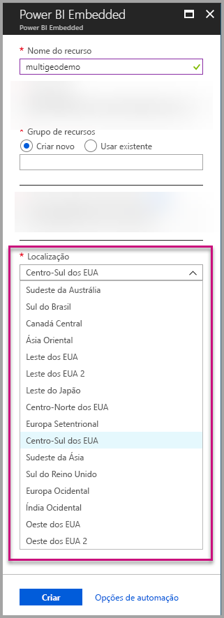
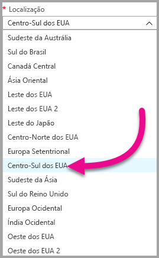
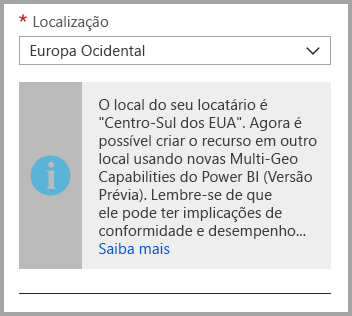
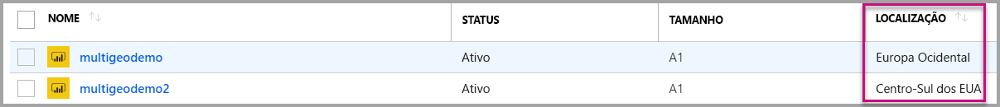
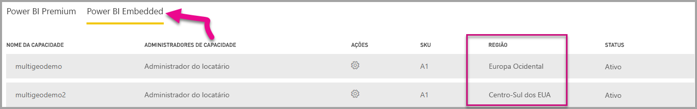

# Suporte Multi-Geo para o Power BI Embedded (versão prévia)

**Suporte a Multi-Geo para o Power BI Embedded (versão prévia)** significa que ISVs e empresas que criam aplicativos usando o Power BI Embedded para inserir análise em seus aplicativos agora podem implantar os dados em diferentes regiões em todo o mundo.

Agora os clientes que usam o **Power BI Embedded** podem configurar uma **capacidade A** usando opções **Multi-Geo**, de acordo com os mesmos recursos e limitações aos quais o [Power BI Premium dá suporte usando Multi-Geo](../service-admin-premium-Multi-Geo.md).

## Criar novo recurso de Capacidade do Power BI Embedded com Multi-Geo

Na tela **Criar recurso**, você precisa escolher o local da capacidade. Até agora, ele era limitado somente ao local do locatário do Power BI; portanto, somente um único local estava disponível. Com Multi-Geo, você pode escolher entre diferentes regiões para implantar a capacidade.

Observe que, ao abrir o menu suspenso local, seu locatário de residência é a seleção padrão.
  

Ao escolher um local diferente, uma mensagem solicitará que você garanta que está ciente da seleção.

## Exibir Local de Capacidade

Você pode ver a localização das capacidades facilmente na página de gerenciamento principal do Power BI Embedded no portal do Azure.

Ele também está disponível no Portal de Administração em Powerbi.com. No portal de administração, escolha 'Configurações de capacidade' e mude para a guia 'Power BI Embedded '.

[Saiba mais sobre como criar as capacidades com o Power BI Embedded.](azure-pbie-create-capacity.md)

## Gerenciar o local de capacidades existentes

Não é possível alterar um local de recursos do Power BI Embedded depois de criar uma nova capacidade.

Para mover o conteúdo do Power BI para uma região diferente, siga estas etapas:

1. [Criar uma nova capacidade](azure-pbie-create-capacity.md) em uma região diferente.
2. Atribua todos os workspaces da capacidade existente à nova capacidade.
3. Excluir ou pausar a capacidade antiga.

É importante observar que, se você decidir excluir uma capacidade sem reatribuindo seu conteúdo, todo o conteúdo da capacidade será movido para uma capacidade compartilhada, que está em sua região de residência.

## Suporte de API a Multi-Geo

Para dar suporte ao gerenciamento de capacidades com Multi-Geo por meio da API, fizemos algumas alterações em APIs existentes:

1. **[Obter Capacidades](https://docs.microsoft.com/rest/api/power-bi/capacities/getcapacities)** – a API retorna uma lista de capacidades com acesso ao usuário. A resposta agora inclui uma propriedade adicional chamada 'region', que especifica o local da capacidade.
2. **[Atribuir à Capacidade](https://docs.microsoft.com/rest/api/power-bi/capacities)** – a API permite a atribuição de determinado workspace a uma capacidade. Essa operação não permite que você atribua workspaces a uma capacidade fora de sua região de residência ou mova os workspaces entre as capacidades em regiões diferentes. Para executar essa operação, o usuário ainda precisa de permissões de administrador no workspace e deve administrar ou atribuir permissões na capacidade de destino.
3. **[API do Azure Resource Manager](https://docs.microsoft.com/rest/api/power-bi-embedded/capacities)** – todas as operações da API do Azure Resource Manager, incluindo *Criar* e *Excluir*, dão suporte a Multi-Geo.

## Limitações e considerações

* Antes de iniciar a transferência de dados, confirme se qualquer movimentação iniciada entre as regiões segue todos os requisitos de conformidade corporativos e governamentais.

* Uma consulta em cache armazenada em uma região remota permanece nessa região em repouso. No entanto, outros dados em trânsito podem ir e voltar entre diferentes regiões geográficas.

* Quando dados de uma região são movidos para outra em um ambiente Multi-Geo, os dados de origem podem permanecer na região da qual foram movidos por até 30 dias. Durante esse período, os usuários não têm acesso a eles. Eles foram removidos desta região e destruídos durante o período de 30 dias.

* O Multi-Geo não resulta em um melhor desempenho no geral. O carregamento de relatórios e painéis ainda envolve solicitações de metadados para a região de residência.

## Próximas etapas

Saiba mais sobre as capacidades do Power BI Embedded e as opções Multi-Geo para todas as capacidades consultando os links a seguir.

* [O que é o Power BI Embedded?](azure-pbie-what-is-power-bi-embedded.md)

* [Criar uma capacidade do Power BI Embedded](azure-pbie-create-capacity.md)

* [Multi-Geo nas capacidades do Power BI Premium](../service-admin-premium-multi-geo.md)

Mais perguntas? [Experimente perguntar à Comunidade do Power BI](http://community.powerbi.com/)