# <a name="row-level-security-with-power-bi-embedded"></a>Segurança em nível de linha com o Power BI Embedded

A **Segurança em Nível de Linha (RLS)** pode ser usada para restringir o acesso do usuário aos dados dentro de painéis, blocos, relatórios e conjuntos de dados. Usuários diferentes podem trabalhar com esses mesmos artefatos durante a visualização de dados distintos. Inserir dá suporte a RLS.

Se você está fazendo uma inserção para usuários que não têm o Power BI (o aplicativo possui dados), o que normalmente é um cenário de ISV, este artigo é ideal para você! Configure o token de inserção da conta para o usuário e a função.

Se estiver fazendo uma inserção para usuários do Power BI (o usuário possui os dados), em sua organização, a RLS funciona da mesma maneira que no serviço do Power BI diretamente. Não há nada mais que precise ser feito no aplicativo. Para obter mais informações, consulte [RLS (segurança em nível de linha) com o Power BI](../service-admin-rls.md).


Para aproveitar a RLS, é importante entender os três conceitos principais: Usuários, Funções e Regras. Vamos examinar cada um deles mais detalhadamente:

**Usuários** – os usuários finais, exibindo o artefato (dashboard, bloco, relatório ou conjunto de dados). No Power BI Embedded, os usuários são identificados pela propriedade de nome de usuário em um token de inserção.

**Funções** – os usuários pertencem a funções. Uma função é um contêiner de regras e pode ser nomeada como algo parecido com *Gerente de Vendas* ou *Representante de Vendas*. As funções são criadas no Power BI Desktop. Para obter mais informações, consulte [RLS (segurança em nível de linha) com o Power BI Desktop](../desktop-rls.md).

**Regras** – as funções têm regras e essas regras são os filtros reais que serão aplicados aos dados. As regras podem ser tão simples como “País = EUA” ou algo muito mais dinâmico.
No restante deste artigo, há um exemplo de como criar a RLS e, em seguida, como consumir isso em um aplicativo inserido. Nosso exemplo usa o arquivo PBIX da [Amostra de Análise de Varejo](http://go.microsoft.com/fwlink/?LinkID=780547).


## <a name="adding-roles-with-power-bi-desktop"></a>Adicionando funções com o Power BI Desktop

Nossa **amostra de Análise de Varejo** mostra as vendas de todas as lojas de uma cadeia de varejo. Sem a RLS, não importa que gerente regional se conecte e visualize o relatório: todos verão os mesmos dados. A gerência sênior determinou que cada gerente regional deve ver apenas as vendas das lojas que eles gerenciam. O uso de RLS permite ao gerenciamento sênior restringir os dados com base em um gerente regional.

A RLS é criada no Power BI Desktop. Quando o conjunto de dados e o relatório são abertos, é possível alternar para a exibição de diagrama para ver o esquema:


A seguir, veja alguns itens a serem observados com esse esquema:

* Todas as medidas, como **Total de Vendas**, são armazenadas na tabela de fatos **Vendas**.
* Há quatro tabelas de dimensões relacionadas adicionais: **Item**, **Hora**, **Loja** e **Distrito**.
* As setas nas linhas de relacionamento indicam em que direção os filtros podem fluir de uma tabela para outra. Por exemplo, se um filtro for colocado em **Hora[Data]** , no esquema atual, ele apenas filtrará valores da tabela **Vendas**. Nenhuma outra tabela é afetada por esse filtro, pois todas as setas nas linhas de relacionamento apontam para a tabela de vendas e não para outra.
* A tabela **Distrito** indica quem é o gerente de cada distrito:
  
    

Com base nesse esquema, se aplicarmos um filtro à coluna **Gerente Regional** da tabela **Distrito** e se o filtro corresponder ao usuário que exibe o relatório, ele filtrará as tabelas **Loja** e **Vendas** para mostrar os dados desse gerente regional.

Aqui está como:

1. Na guia **Modelagem**, selecione **Gerenciar Funções**.

    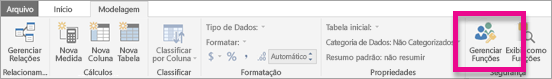
2. Crie uma nova função chamada **Gerente**.

    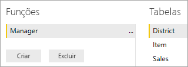
3. Na tabela **Distrito**, insira a expressão DAX: **[Gerente Regional] = USERNAME()** .

    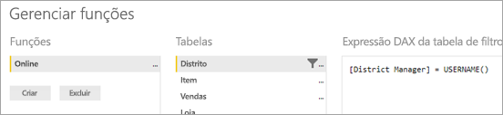
4. Para verificar se as regras estão funcionando, na guia **Modelagem**, selecione **Exibir como funções**, depois selecione a função **Gerente** que você criou, juntamente com **Outros usuários**. Insira **AndrewMa** como o usuário.

    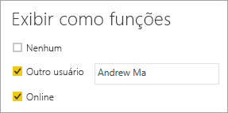

    Os relatórios apresentam os dados como se você tivesse entrado como **AndrewMa**.

A aplicação do filtro, da maneira como fizemos aqui, filtra todos os registros nas tabelas **Distrito**, **Loja** e **Vendas**. No entanto, devido à direção do filtro nos relacionamentos entre **Vendas** e **Hora**, as tabelas **Vendas** e **Item** e **Item** e **Hora** as tabelas não são filtradas. Para saber mais sobre a filtragem cruzada bidirecional, baixe o white paper [Filtragem cruzada bidirecional no SQL Server Analysis Services 2016 e no Power BI Desktop](http://download.microsoft.com/download/2/7/8/2782DF95-3E0D-40CD-BFC8-749A2882E109/Bidirectional%20cross-filtering%20in%20Analysis%20Services%202016%20and%20Power%20BI.docx).

## <a name="applying-user-and-role-to-an-embed-token"></a>Aplicando o usuário e a função a um token de inserção

Agora que você já configurou as funções do Power BI Desktop, é necessário trabalhar um pouco no aplicativo para aproveitar as funções.

Os usuários são autenticados e autorizados pelo aplicativo e os tokens de inserção são usados para conceder o acesso de usuário a um relatório específico do Power BI Embedded. O Power BI Embedded não tem nenhuma informação específica sobre quem é o usuário. Para que a RLS funcione, você precisará passar algum contexto adicional como parte do token de inserção na forma de identidades. Você pode passar as identidades usando a API do [Token de inserção](https://docs.microsoft.com/rest/api/power-bi/embedtoken).

A API aceita uma lista de identidades com a indicação dos conjuntos de dados relevantes. Para que a RLS funcione, você precisa passar os itens abaixo como parte da identidade.

* **nome de usuário (obrigatório)** – uma cadeia de caracteres que pode ser usada para ajudar a identificar o usuário ao aplicar as regras de RLS. Apenas um usuário pode ser listado. Seu nome de usuário pode ser criado com caracteres *ASCII*.
* **funções (obrigatório)** – uma cadeia de caracteres que contém as funções a serem selecionadas ao aplicar as regras de Segurança em Nível de Linha. Se você estiver passando mais de uma função, elas deverão ser passadas como uma matriz de cadeia de caracteres.
* **conjunto de dados (obrigatório)** – o conjunto de dados aplicável ao artefato que está sendo inserido.

Crie o token de inserção usando o método **GenerateTokenInGroup** em **PowerBIClient.Reports**.

Por exemplo, você poderá alterar a amostra [PowerBIEmbedded_AppOwnsData](https://github.com/Microsoft/PowerBI-Developer-Samples/tree/master/App%20Owns%20Data). As *linhas 76 e 77 de Services\EmbedService.cs* podem ser atualizadas de:

```csharp
// Generate Embed Token.
var generateTokenRequestParameters = new GenerateTokenRequest(accessLevel: "view");

var tokenResponse = await client.Reports.GenerateTokenInGroupAsync(GroupId, report.Id, generateTokenRequestParameters);
```

to

```csharp
var generateTokenRequestParameters = new GenerateTokenRequest("View", null, identities: new List<EffectiveIdentity> { new EffectiveIdentity(username: "username", roles: new List<string> { "roleA", "roleB" }, datasets: new List<string> { "datasetId" }) });

var tokenResponse = await client.Reports.GenerateTokenInGroupAsync("groupId", "reportId", generateTokenRequestParameters);
```

Se você estiver chamando a API REST, a API atualizada agora aceitará uma matriz JSON adicional, chamada **identidades**, que contém um nome de usuário, a lista de funções de cadeia de caracteres e a lista de conjuntos de dados de cadeia de caracteres. 

Use o código a seguir como exemplo:

```json
{
    "accessLevel": "View",
    "identities": [
        {
            "username": "EffectiveIdentity",
            "roles": [ "Role1", "Role2" ],
            "datasets": [ "fe0a1aeb-f6a4-4b27-a2d3-b5df3bb28bdc" ]
        }
    ]
}
```

Agora, com todas as informações juntas, quando alguém fizer logon no aplicativo para exibir este artefato, verá apenas os dados que tiver permissão de ver, conforme definido por nossa segurança em nível de linha.

## <a name="working-with-analysis-services-live-connections"></a>Trabalhando com conexões dinâmicas do Analysis Services

A segurança em nível de linha pode ser usada com conexões dinâmicas do Analysis Services para servidores locais. Há alguns conceitos específicos que você deve compreender ao usar esse tipo de conexão.

A identidade efetiva fornecida para a propriedade de nome de usuário deve ser um usuário do Windows com permissões no servidor do Analysis Services.

### <a name="on-premises-data-gateway-configuration"></a>Configuração do gateway de dados local

Um [Gateway de dados local](../service-gateway-onprem.md) é usado ao trabalhar com as conexões dinâmicas do Analysis Services. Ao gerar um token de inserção, com uma identidade listada, a conta mestra precisa estar listada como um administrador do gateway. Se a conta mestra não estiver listada, a segurança em nível de linha não será aplicada à propriedade dos dados. Um não administrador do gateway pode fornecer funções, mas deve especificar seu próprio nome de usuário para a identidade efetiva.

### <a name="use-of-roles"></a>Uso de funções

As funções podem ser fornecidas com a identidade em um token de inserção. Se nenhuma função for fornecida, o nome de usuário fornecido poderá ser usado para resolver as funções associadas.

### <a name="using-the-customdata-feature"></a>Usando o recurso CustomData

O recurso CustomData funciona apenas para os modelos que residem no **Azure Analysis Services** e funciona apenas no modo **Conectar em tempo real**. Ao contrário dos usuários e das funções, o recurso Custom Data não pode ser definido dentro de um arquivo .pbix. Ao gerar um token com o recurso Custom Data, é preciso ter um nome de usuário.

O recurso CustomData permite adicionar um filtro de linha ao exibir dados do Power BI em seu aplicativo ao usar o **Azure Analysis Services** como sua fonte de dados (exibição de dados do Power BI conectados ao Azure Analysis Services em seu aplicativo).

O recurso CustomData permite passar texto livre (cadeia de caracteres) usando a propriedade de cadeia de caracteres de conexão CustomData. O Analysis Services usa este valor por meio da função *CUSTOMDATA()* .

A única maneira de ter RLS dinâmica (que usa valores dinâmicos para a avaliação de filtro) no **Azure Analysis Services** é usando a função *CUSTOMDATA()* .

É possível usá-lo dentro da consulta DAX de função e usá-lo sem qualquer função em uma consulta DAX de medida.
O recurso CustomData faz parte de nossa funcionalidade de geração de token para os seguintes artefatos: dashboard, relatório e bloco. Dashboards podem ter várias identidades CustomData (um por bloco/modelo).

#### <a name="customdata-sdk-additions"></a>Adições do SDK CustomData

A propriedade de cadeia de caracteres CustomData foi adicionada à nossa identidade efetiva no cenário de geração de tokens.

```json
[JsonProperty(PropertyName = "customData")]
public string CustomData { get; set; }
```

A identidade pode ser criada tendo dados personalizados usando a chamada a seguir:

```csharp
public EffectiveIdentity(string username, IList<string> datasets, IList<string> roles = null, string customData = null);
```

#### <a name="customdata-sdk-usage"></a>Uso do SDK CustomData

Se você estiver chamando a API REST, será possível adicionar dados personalizados dentro de cada identidade, por exemplo:

```json
{
    "accessLevel": "View",
    "identities": [
        {
            "username": "EffectiveIdentity",
            "roles": [ "Role1", "Role2" ],
            "customData": "MyCustomData",
            "datasets": [ "fe0a1aeb-f6a4-4b27-a2d3-b5df3bb28bdc" ]
        }
    ]
}
```

Aqui estão as etapas para começar a configurar o recurso CustomData() com seu aplicativo do Power BI Embedded.

1. Crie seu banco de dados do Azure Analysis Services. Depois, entre em seu servidor do Azure Analysis Services por meio do [SQL Server Management Studio](https://docs.microsoft.com/sql/ssms/download-sql-server-management-studio-ssms?view=sql-server-2017).

    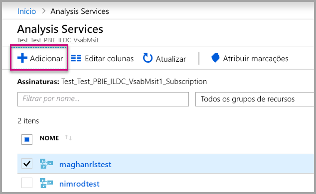

    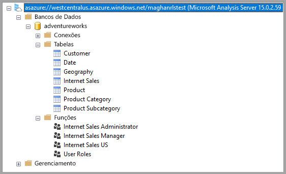

2. Crie uma Função no servidor do Analysis Services.

    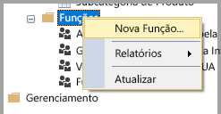

3. Defina suas configurações**Gerais**.  Aqui você concede o **Nome da Função** e define as permissões de banco de dados para somente **Leitura**.

    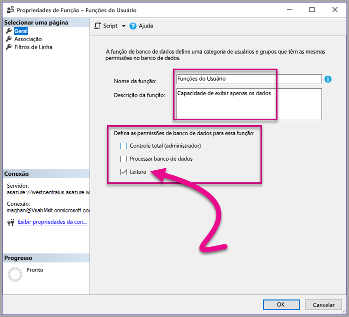

4. Defina as configurações de **Associação**. Aqui você adiciona os usuários afetados por essa função.

    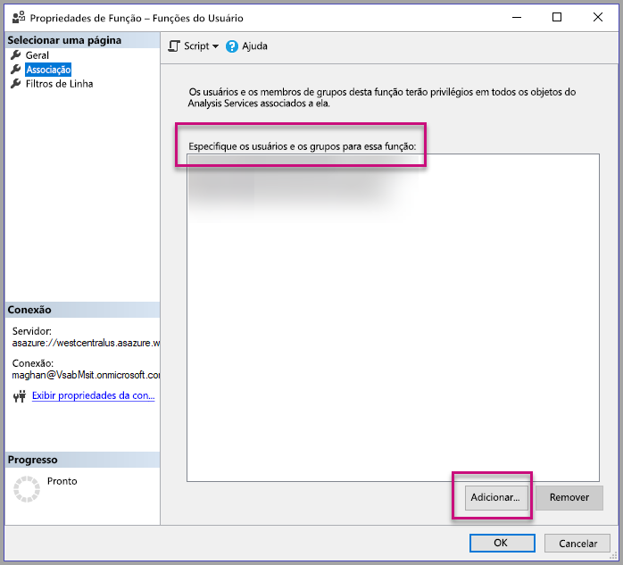

5. Defina sua consulta DAX de **Filtros de linha** usando a função *CUSTOMDATA()* .

    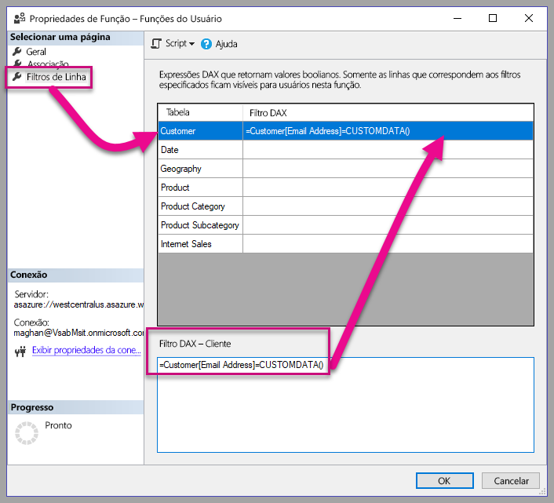

6. Crie um relatório PBI e publique-o em um espaço de trabalho com capacidade dedicada.

    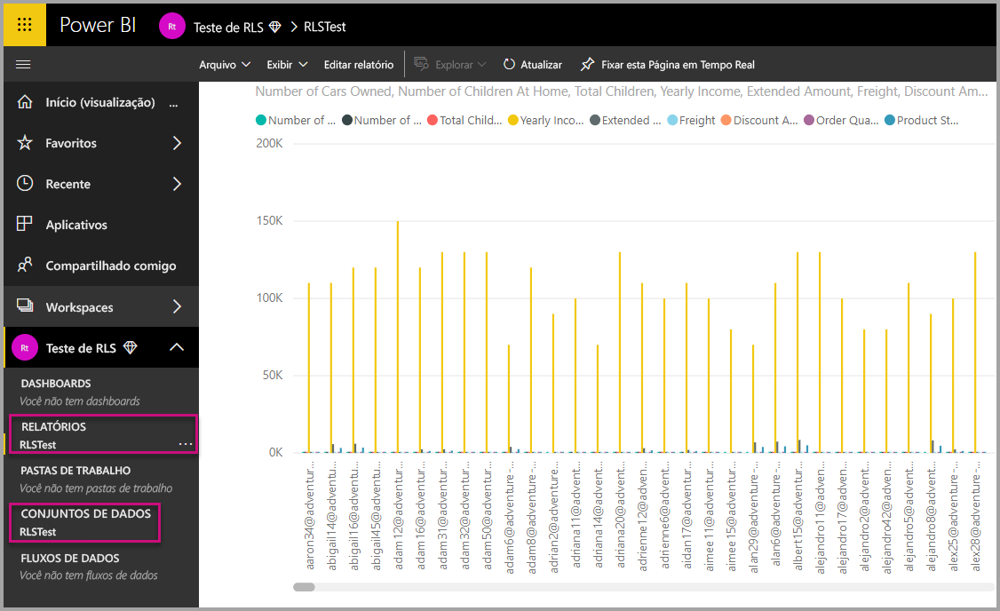

7. Use as APIs do Power BI para usar o recurso CustomData em seu aplicativo.  Ao gerar um token com o recurso Custom Data, é preciso ter um nome de usuário. O nome de usuário deve ser igual ao UPN do usuário mestre. O usuário mestre deve ser membro da(s) função(ões) criadas por você. Se nenhuma função for especificada, todas as funções de que usuário mestre for membro serão usadas para avaliação de RLS.

    Ao trabalhar com uma [entidade de serviço](embed-service-principal.md), você também precisará executar as etapas acima em vez de usar uma conta mestre. Ao gerar o token de inserção, use a [ID de objeto da entidade de serviço](embed-service-principal.md#how-to-get-the-service-principal-object-id) como o nome de usuário.

    > [!Note]
    > Quando estiver pronto para implantar o aplicativo para produção, a opção ou o campo de conta de usuário mestre não deverá ficar visível para o usuário final.

    Exiba o [código](#customdata-sdk-additions) para adicionar o recurso CustomData.

8. Agora você pode exibir o relatório em seu aplicativo antes de aplicar o(s) valor(es) de Custom Data para ver todos os dados que o relatório contém.

    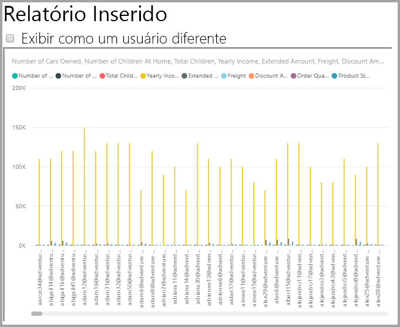

    Em seguida, aplique o(s) valor(es) de Custom Data para ver como o relatório exibe um conjunto de dados diferente.
    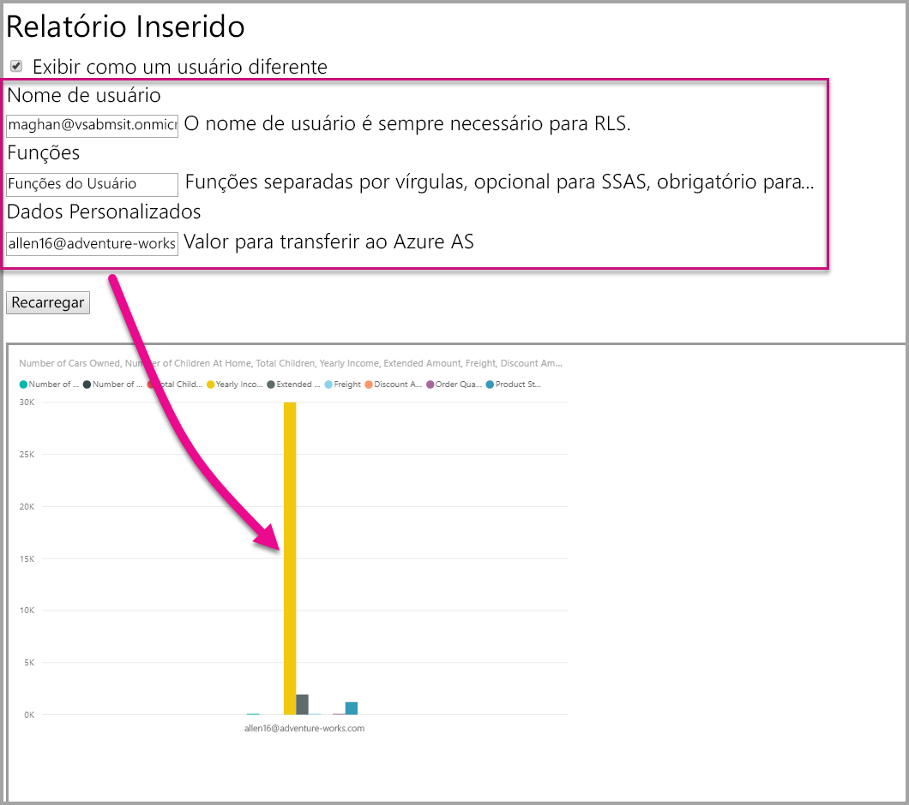

## <a name="using-rls-vs-javascript-filters"></a>Uso dos filtros RLS em vez de JavaScript

Ao decidir sobre a filtragem dos dados em um relatório, é possível usar os **filtros de Segurança em Nível de Linha (RLS)** ou **JavaScript**.

A [Segurança em Nível de Linha](../service-admin-rls.md) é um recurso que filtra os dados no nível do modelo de dados. Sua fonte de dados de back-end controla as configurações de RLS. A geração de token de inserção define o nome de usuário e as funções para a sessão com base em seu modelo de dados. Ela não pode ser substituída, removida ou controlada pelo código do lado do cliente e por isso é considerada segura. É recomendável usar a RLS para filtrar dados com segurança. Filtre os dados com a RLS usando uma das opções a seguir.

* [Configurar funções em um relatório do Power BI](../desktop-rls.md).
* Configuração de funções no nível da fonte de dados (apenas conexão dinâmica do Analysis Services).
* Por meio de programação com um [Token de Inserção](https://docs.microsoft.com/rest/api/power-bi/embedtoken/datasets_generatetokeningroup) usando `EffectiveIdentity`. Ao usar um token de inserção, o filtro real passa pelo token de inserção durante uma sessão específica.

Os [filtros JavaScript](https://github.com/Microsoft/PowerBI-JavaScript/wiki/Filters#page-level-and-visual-level-filters) são usados para permitir que o usuário consuma uma exibição de dados reduzida, com escopo ou filtrada. No entanto, o usuário ainda mantém o acesso a tabelas, colunas e medidas do esquema de modelo e pode, potencialmente, acessar todos os dados lá. O acesso restrito aos dados só pode ser aplicado com RLS e não por meio de APIs de filtragem do lado do cliente.

## <a name="token-based-identity-with-azure-sql-database-preview"></a>Identidade baseada em token com o Banco de Dados SQL do Azure (versão prévia)

A **identidade baseada em token** permite que você especifique a identidade efetiva para um token de inserção usando o token de acesso do **Azure Active Directory (AAD)** para um **Banco de Dados SQL**.

Os clientes que mantêm seus dados no **Banco de Dados SQL**, agora podem aproveitar uma nova funcionalidade para gerenciar usuários e seu acesso aos dados no Azure SQL ao integrarem com o **Power BI Embedded**.

Ao gerar o token de inserção, você pode especificar a identidade efetiva de um usuário no Azure SQL. Você pode especificar a identidade efetiva de um usuário passando o token de acesso do AAD para o servidor. O token de acesso é usado para extrair somente os dados relevantes daquele usuário do SQL Azure para uma sessão específica.

Ele pode ser usado para gerenciar o modo de exibição de cada usuário no Azure SQL ou entrar Azure SQL como um cliente específico em um banco de dados de multilocatários. Ele também aplica segurança em nível de linha nesta sessão no Azure SQL e recuperar somente os dados relevantes para a sessão, eliminando a necessidade de gerenciar a RLS no Power BI.

Esses problemas de identidade em vigor se aplicam às regras da RLS diretamente no Azure SQL Server. O Power BI Embedded usa o token de acesso fornecido ao consultar os dados do Azure SQL Server. O UPN do usuário (para o qual o token de acesso foi fornecido) pode ser acessado como resultado da função SQL USER_NAME().

A identidade baseada em token só funciona para modelos DirectQuery em capacidade dedicada – conectada a um Banco de Dados SQL do Azure, que é configurado para permitir a autenticação do AAD ([saiba mais sobre a autenticação do AAD no Banco de Dados SQL do Azure](https://docs.microsoft.com/azure/sql-database/sql-database-manage-logins)). Para usar a identidade baseada em token, a fonte de dados do conjunto de dados deve ser configurada para usar as credenciais OAuth2 dos usuários finais.

   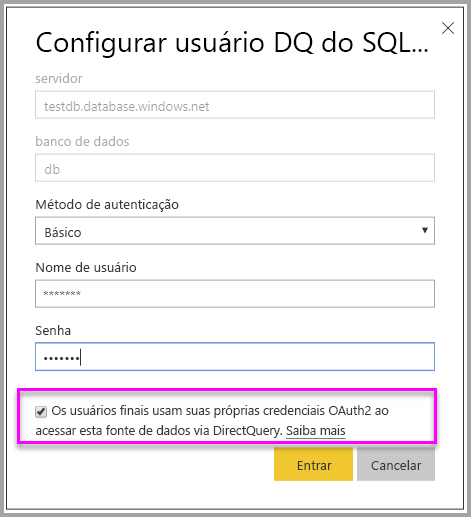

### <a name="token-based-identity-sdk-additions"></a>Adições do SDK de identidade baseada em token

A propriedade de blob de identidade foi adicionada à nossa identidade efetiva no cenário de geração de tokens.

```JSON
[JsonProperty(PropertyName = "identityBlob")]
public IdentityBlob IdentityBlob { get; set; }
```

O tipo de IdentityBlob é uma estrutura JSON simples que contém uma propriedade de cadeia de caracteres de valor

```JSON
[JsonProperty(PropertyName = "value")]
public string value { get; set; }
```

O EffectiveIdentity pode ser criado com o blob de identidade usando a seguinte chamada:

```C#
public EffectiveIdentity(string username, IList<string> datasets, IList<string> roles = null, string customData = null, IdentityBlob identityBlob = null);
```

O blob de identidade pode ser criado usando a chamada a seguir.

```C#
public IdentityBlob(string value);
```

### <a name="token-based-identity-rest-api-usage"></a>Uso da API REST de identidade baseada em token

Se você estiver chamando a [API REST](/rest/api/power-bi/embedtoken/reports_generatetokeningroup#definitions), é possível adicionar o blob de identidade dentro de cada identidade.

```JSON
{
    "accessLevel": "View",
    "identities": [
        {
            "datasets": ["fe0a1aeb-f6a4-4b27-a2d3-b5df3bb28bdc"],
        “identityBlob”: {
            “value”: “eyJ0eXAiOiJKV1QiLCJh….”
         }
        }
    ]
}
```

O valor fornecido no blob de identidade deve ser um token de acesso válido para o Azure SQL Server (com uma URL de recurso de (<https://database.windows.net/>).

   > [!Note]
   > Para poder criar um token de acesso para o Azure SQL, o aplicativo deve ter permissão delegada de **acesso do Azure SQL DB e do Data Warehouse** para a API do **Banco de Dados SQL do Azure** na configuração de registro de aplicativo do AAD no portal do Azure.

   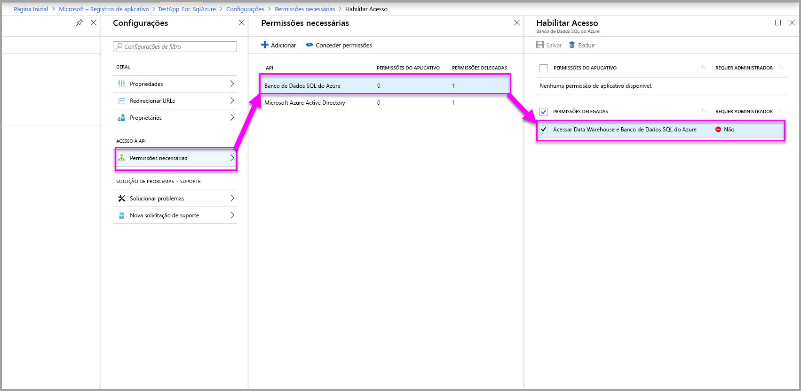

## <a name="on-premises-data-gateway-with-service-principal"></a>Gateway de dados local com a entidade de serviço

Os clientes que configuram a RLS (segurança de nível de linha) usando uma fonte de dados de conexão ativa local do SSAS (SQL Server Analysis Services) podem aproveitar a nova capacidade de [entidade de serviço](embed-service-principal.md) para gerenciar usuários e seu acesso a dados no SSAS na integração com o **Power BI Embedded**.

Usando as [APIs REST do Power BI](https://docs.microsoft.com/rest/api/power-bi/), permite que você especifique a identidade efetiva para conexões ativas locais SSAS para um token de inserção usando um [objeto de entidade de serviço](https://docs.microsoft.com/azure/active-directory/develop/app-objects-and-service-principals#service-principal-object).

Até agora, para que seja possível especificar a identidade efetiva para SSAS de conexão ativa local, o usuário mestre que está gerando o token de inserção precisa ser um administrador do gateway. Agora, em vez de exigir que o usuário seja um administrador do gateway, o administrador do gateway pode dar ao usuário permissão dedicada à fonte de dados, que permite ao usuário substituir a identidade efetiva ao gerar o token de inserção. Essa nova capacidade permite a inserção com a entidade de serviço para uma conexão ao vivo do SSAS.

Para habilitar esse cenário, o administrador do gateway usa a [Adicionar API REST do Usuário da Fonte de Dados](https://docs.microsoft.com/rest/api/power-bi/gateways/adddatasourceuser) para dar à entidade de serviço a permissão *ReadOverrideEffectiveIdentity* para o Power BI Embedded.

Você não pode definir essa permissão usando o portal de administração. Essa permissão é definida somente com a API. No portal de administração, você verá uma indicação para usuários e os SPNs com essas permissões.

## <a name="considerations-and-limitations"></a>Considerações e limitações

* A atribuição de usuários a funções no serviço do Power BI não afeta a RLS ao usar um token de inserção.
* Embora o serviço do Power BI não aplique a configuração de RLS a administradores ou membros com permissões de edição, ao fornecer uma identidade com um token de inserção, ela é aplicada aos dados.
* Para servidores locais, há suporte para conexões dinâmicas do Analysis Services.
* As conexões ao vivo do Azure Analysis Services dão suporte à filtragem por funções. A filtragem dinâmica pode ser realizada usando CustomData.
* Se o conjunto de dados subjacente não exigir a RLS, a solicitação de GenerateToken **não** deverá conter uma identidade efetiva.
* Se o conjunto de dados subjacente for um modelo de nuvem (modelo armazenado em cache ou DirectQuery), a identidade efetiva deverá incluir pelo menos uma função. Caso contrário, a atribuição de função não ocorrerá.
* Uma lista de identidades permite vários tokens de identidade para a inserção de painéis. Para todos os outros artefatos, a lista contém uma única identidade.

### <a name="token-based-identity-limitations-preview"></a>Limitações de identidade baseada em token (versão prévia)

* Esse recurso restringe o uso somente com o Power BI Premium.
* Esse recurso não funciona com o SQL Server local.
* Esse recurso não funciona com multi-geo.

Mais perguntas? [Experimente perguntar à Comunidade do Power BI](https://community.powerbi.com/)
