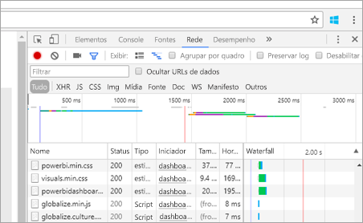
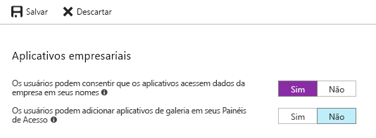

# <a name="troubleshoot-your-embedded-application"></a>Solucione problemas do aplicativo inserido

Este artigo aborda alguns problemas comuns que podem ser encontrados ao inserir conteúdo do Power BI.

## <a name="tools-to-troubleshoot"></a>Ferramentas para solucionar problemas

### <a name="fiddler-trace"></a>Rastreamento do Fiddler

[Fiddler](http://www.telerik.com/fiddler) é uma ferramenta gratuita da Telerik que monitora o tráfego HTTP.  Você pode ver o tráfego com as APIs do Power BI do computador cliente. Essa ferramenta pode mostrar erros e outras informações relacionadas.


### <a name="f12-in-browser-for-front-end-debugging"></a>F12 no navegador para depuração de front-end

A tecla F12 inicia a janela do desenvolvedor no navegador. Essa ferramenta fornece a capacidade de examinar o tráfego de rede e outras informações.



### <a name="extract-error-details-from-power-bi-response"></a>Extraia detalhes do erro na resposta do Power BI

Este snippet de código mostra como extrair os detalhes do erro da exceção HTTP:

```csharp
public static string GetExceptionText(this HttpOperationException exc)
{
    var errorText = string.Format("Request: {0}\r\nStatus: {1} ({2})\r\nResponse: {3}",
    exc.Request.Content, exc.Response.StatusCode, (int)exc.Response.StatusCode, exc.Response.Content);
    if (exc.Response.Headers.ContainsKey("RequestId"))
    {
        var requestId = exc.Response.Headers["RequestId"].FirstOrDefault();
        errorText += string.Format("\r\nRequestId: {0}", requestId);
    }

    return errorText;
}
```

É recomendável registrar em log as IDs de Solicitação (e detalhes do erro para solução de problemas).
Forneça a ID de Solicitação ao entrar em contato com o Suporte da Microsoft.

## <a name="app-registration"></a>Registro de aplicativo

### <a name="app-registration-failure"></a>Falha no registro de aplicativo

As mensagens de erro no portal do Azure ou na página de registro de aplicativo do Power BI mencionam privilégios insuficientes. Para registrar um aplicativo, você deve ser administrador no locatário do Azure AD ou os registros do aplicativo devem estar habilitados para usuários não administradores.

### <a name="power-bi-service-doesnt-appear-in-the-azure-portal-when-registering-a-new-app"></a>O serviço do Power BI não é exibido no portal do Azure ao registrar um novo aplicativo

Pelo menos um usuário deve estar inscrito no Power BI. Se você não vir o **Serviço do Power BI** na lista de APIs, será uma indicação de que nenhum usuário está inscrito no Power BI.

## <a name="rest-api"></a>API REST

### <a name="api-call-returning-401"></a>Chamada à API retornando 401

Uma captura do fiddler pode ser necessária para uma investigação mais aprofundada. O escopo necessário da permissão pode estar ausente no aplicativo registrado no Azure AD. Verifique se o escopo necessário está presente no registro do aplicativo para o Azure AD no Portal do Azure.

### <a name="api-call-returning-403"></a>Chamada à API retornando 403

Uma captura do fiddler pode ser necessária para uma investigação mais aprofundada. Pode haver vários motivos para um erro 403.

* O usuário excedeu a quantidade de tokens de inserção que pode ser gerada em uma capacidade compartilhada. Compre capacidades do Azure para gerar tokens de inserção e atribuir o workspace a essa capacidade. Consulte [Criar uma capacidade do Power BI Embedded no Portal do Azure](https://docs.microsoft.com/azure/power-bi-embedded/create-capacity).
* O token de autenticação do Azure AD expirou.
* O usuário autenticado não é membro do grupo (workspace do aplicativo).
* O usuário autenticado não é administrador do grupo (workspace do aplicativo).
* O cabeçalho de autorização talvez não esteja exibido corretamente. Verifique se não há erros de digitação.

O back-end do aplicativo pode precisar atualizar o token de autenticação antes de chamar GenerateToken.

    ```
    GET https://wabi-us-north-central-redirect.analysis.windows.net/metadata/cluster HTTP/1.1
    Host: wabi-us-north-central-redirect.analysis.windows.net
    ...
    Authorization: Bearer eyJ0eXAiOi...
    ...

    HTTP/1.1 403 Forbidden
    ...

    {"error":{"code":"TokenExpired","message":"Access token has expired, resubmit with a new access token"}}
    ```

## <a name="authentication"></a>Autenticação

### <a name="authentication-failed-with-aadsts70002-or-aadsts50053"></a>Falha na autenticação com AADSTS70002 ou AADSTS50053

**_(AADSTS70002: Erro ao validar credenciais. AADSTS50053: você tentou entrar muitas vezes com uma ID de usuário ou senha incorreta)_**

Se você estiver usando o Power BI Embedded e a autenticação direta do Azure AD e estiver recebendo mensagens ao fazer logon, como ***error:unauthorized_client, error_description:AADSTS70002: Erro ao validar credenciais. AADSTS50053: você tentou entrar muitas vezes com uma ID de usuário ou senha incorreta***. Isso acontece porque a autenticação direta não está mais em uso desde 14 de junho de 2018 por padrão.

Há uma maneira de fazer a reativação usando uma [Política do Azure AD](https://docs.microsoft.com/azure/active-directory/manage-apps/configure-authentication-for-federated-users-portal#enable-direct-authentication-for-legacy-applications) que pode estar no escopo da organização ou de uma [entidade de serviço](https://docs.microsoft.com/azure/active-directory/develop/active-directory-application-objects#service-principal-object).

É recomendável habilitar essa política somente de acordo com o aplicativo.

Para criar essa política, você precisa ser um **administrador global** do diretório em que está criando a política e a atribuição. Aqui está um script de exemplo para criar a política e atribuí-la ao SP para este aplicativo:

1. Instale o [módulo do PowerShell de visualização do Azure AD](https://docs.microsoft.com/powershell/azure/active-directory/install-adv2?view=azureadps-2.0).

2. Execute os seguintes comandos do PowerShell, linha por linha (certificando-se de que a variável $sp não tem mais de um aplicativo como resultado).

```powershell
Connect-AzureAD
```

```powershell
$sp = Get-AzureADServicePrincipal -SearchString "Name_Of_Application"
```

```powershell
$policy = New-AzureADPolicy -Definition @("{`"HomeRealmDiscoveryPolicy`":{`"AllowCloudPasswordValidation`":true}}") -DisplayName EnableDirectAuth -Type HomeRealmDiscoveryPolicy -IsOrganizationDefault $false
```

```powershell
Add-AzureADServicePrincipalPolicy -Id $sp.ObjectId -RefObjectId $policy.Id 
```

Depois de atribuir a política, aguarde aproximadamente de 15 a 20 segundos para a propagação antes de testar.

### <a name="generate-token-fails-when-providing-effective-identity"></a>Falha na geração do token ao fornecer a identidade em vigor

Por motivos diferentes, pode haver falha em GenerateToken com a identidade em vigor fornecida.

* O conjunto de dados não é compatível com a identidade em vigor
* O nome de usuário não foi fornecido
* A função não foi fornecida
* A DatasetId não foi fornecida
* O usuário não tem as permissões corretas

Para verificar qual é o problema, tente seguir as etapas abaixo.

* Execute [get dataset](https://docs.microsoft.com/rest/api/power-bi/datasets). A propriedade IsEffectiveIdentityRequired é verdadeira?
* O nome de usuário é obrigatório para qualquer EffectiveIdentity.
* Se a propriedade IsEffectiveIdentityRolesRequired for verdadeira, a Função será necessária.
* A DatasetId é obrigatória para qualquer EffectiveIdentity.
* Para o Analysis Services, o usuário mestre deve ser administrador do gateway.

### <a name="aadsts90094-the-grant-requires-admin-permission"></a>AADSTS90094: a concessão exige permissão de administrador

**_Sintomas:_**</br>
quando um usuário não administrador tenta entrar em um aplicativo pela primeira vez ao conceder autorização, uma das seguintes mensagens de erro é exibida:

* O ConsentTest precisa de permissão para acessar os recursos em sua organização que apenas um administrador pode conceder. Peça a um administrador para conceder permissão para este aplicativo antes de usá-lo.
* AADSTS90094: A concessão exige permissão de administrador.

    

Um usuário administrador pode entrar e dar o consentimento com êxito.

**_Causa raiz:_**</br>
O consentimento do usuário está desabilitado para o locatário.

**_Várias correções são possíveis:_**

*Habilitar o consentimento do usuário para todo o locatário (todos os usuários, todos os aplicativos)*

1. No portal do Azure, navegue até "Azure Active Directory" = > "Usuários e grupos" = > "Configurações de usuário"
2. Habilite a configuração “Os usuários podem consentir que os aplicativos acessem dados da empresa em seus nomes” e, em seguida, salve as alterações

    

*Conceda permissões* ao aplicativo por um administrador – para todo o locatário ou um usuário específico.

## <a name="data-sources"></a>Fontes de dados

### <a name="isv-wants-to-have-different-credentials-for-the-same-data-source"></a>O ISV deseja ter credenciais diferentes para a mesma fonte de dados

Uma fonte de dados pode ter um único conjunto de credenciais para um usuário mestre. Se você precisar usar credenciais diferentes, crie usuários mestres adicionais. Em seguida, atribua as credenciais diferentes em cada contexto de usuários mestres e insira usando o token do Azure AD do usuário.

## <a name="troubleshoot-your-embedded-application-with-the-ierror-object"></a>Solucione problemas do aplicativo inserido com o objeto IError

Use o [**Objeto IError** retornado pelo evento *erro* do **SDK do JavaScript**](https://github.com/Microsoft/PowerBI-JavaScript/wiki/Troubleshooting-and-debugging-of-embedded-parts) para depurar o aplicativo e entender melhor a causa dos erros.

Depois de adquirir o objeto IError, você deve examinar a tabela de erros comuns apropriada ao tipo de inserção que está usando. Compare as **Propriedades de IError** às da tabela e encontre os possíveis motivos da falha.

### <a name="typical-errors-when-embedding-for-power-bi-users"></a>Erros típicos durante a inserção para usuários do Power BI

| Mensagem | Mensagem Detalhada | Código de erro | Possíveis motivos |
|-------------------------------------------------------|-----------------------------------------------------------------------------------------------------------------------------|-----------|--------------------------------------------------------|
| TokenExpired | O token de acesso expirou; reenvie com um novo token de acesso | 403 | Token expirado  |
| PowerBIEntityNotFound | Falha ao obter relatório | 404 | <li> ID de Relatório incorreta <li> O relatório não existe  |
| Parâmetros inválidos | Parâmetro powerbiToken não especificado | N/A | <li> Nenhum token de acesso fornecido <li> Nenhuma ID de Relatório fornecida |
| LoadReportFailed | Falha ao inicializar – não foi possível resolver o cluster | 403 | * Token de acesso inválido * O tipo de inserção não corresponde ao tipo de token |
| PowerBINotAuthorizedException | Falha ao obter relatório | 401 | <li> ID de grupo incorreta <li> Grupo não autorizado |
| TokenExpired | O token de acesso expirou. Reenvie com um novo token de acesso. Não foi possível renderizar um visual de relatório intitulado: <visual title> | N/A | Token expirado de consulta de dados |
| OpenConnectionError | Não é possível exibir o visual. Não foi possível renderizar um visual de relatório intitulado: <visual title> | N/A | Capacidade em pausa ou excluída enquanto um relatório relacionado à capacidade estava aberto em uma sessão |
| ExplorationContainer_FailedToLoadModel_DefaultDetails | Não foi possível carregar o esquema de modelo associado a este relatório. Verifique se você tem uma conexão com o servidor e tente novamente. | N/A | <li> Capacidade em pausa <li> Capacidade excluída |

### <a name="typical-errors-when-embedding-for-non-power-bi-users-using-an-embed-token"></a>Erros típicos durante a inserção para usuários que não são do Power BI (usando um Token de Inserção)

| Mensagem | Mensagem Detalhada | Código de erro | Motivos |
|-------------------------------------------------------|-------------------------------------------------------------------------------------------------------------------------------|------------|-------------------------------------------------|
| TokenExpired | O token de acesso expirou; reenvie com um novo token de acesso | 403 | Token expirado  |
| LoadReportFailed | Falha ao obter relatório | 404 | <li> ID de Relatório incorreta <li> O relatório não existe  |
| LoadReportFailed | Falha ao obter relatório | 403 | A ID do relatório não corresponde ao token |
| LoadReportFailed | Falha ao obter relatório | 500 | A ID de relatório fornecida não é um GUID |
| Parâmetros inválidos | Parâmetro powerbiToken não especificado | N/A | <li> Nenhum token de acesso fornecido <li> Nenhuma ID de Relatório fornecida |
| LoadReportFailed | Falha ao inicializar – não foi possível resolver o cluster | 403 | Tipo de token errado, Token inválido |
| PowerBINotAuthorizedException | Falha ao obter relatório | 401 | ID de grupo incorreta/desautorizada |
| TokenExpired | O token de acesso expirou. Reenvie com um novo token de acesso. Não foi possível renderizar um visual de relatório intitulado: <visual title> | N/A | Token expirado de consulta de dados |
| OpenConnectionError | Não é possível exibir o visual. Não foi possível renderizar um visual de relatório intitulado: <visual title> | N/A | Capacidade em pausa ou excluída enquanto um relatório relacionado à capacidade estava aberto em uma sessão |
| ExplorationContainer_FailedToLoadModel_DefaultDetails | Não foi possível carregar o esquema de modelo associado a este relatório. Verifique se você tem uma conexão com o servidor e tente novamente. | N/A | <li> Capacidade em pausa <li> Capacidade excluída |

## <a name="content-rendering"></a>Renderização de conteúdo

### <a name="performance"></a>Desempenho

[Desempenho do Power BI Embedded](embedded-performance-best-practices.md)

### <a name="rendering-or-consumption-of-embedded-content-fails-or-times-out"></a>A renderização ou o consumo de conteúdo inserido falha ou atinge o tempo limite

Verifique se o token de inserção não expirou. Não se esqueça de verificar a expiração do token de inserção e atualizá-lo. Para obter mais informações, veja [Refresh token using JavaScript SDK](https://github.com/Microsoft/PowerBI-JavaScript/wiki/Refresh-token-using-JavaScript-SDK-example) (Atualizar token usando o SDK do JavaScript).

### <a name="report-or-dashboard-doesnt-load"></a>O relatório ou o dashboard não carrega

Se o usuário não puder visualizar o relatório ou o dashboard, verifique se o relatório ou o dashboard foi carregado corretamente no powerbi.com. O relatório ou o painel não funcionará no aplicativo se ele não for carregado no powerbi.com.

### <a name="report-or-dashboard-is-performing-slowly"></a>A execução do relatório ou do dashboard está lenta

Abra o arquivo no Power BI Desktop ou no powerbi.com e verifique se o desempenho é aceitável para eliminar problemas com o aplicativo ou as APIs de inserção.

## <a name="embed-setup-tool"></a>Ferramenta de configuração de inserção

É possível acessar a [Ferramenta de configuração de inserção](https://aka.ms/embedsetup) para baixar um aplicativo de exemplo rapidamente. Em seguida, você pode comparar o aplicativo com o exemplo.

### <a name="prerequisites"></a>Pré-requisitos

Verifique se você tem todos os pré-requisitos apropriados antes de usar a ferramenta de configuração de inserção. Você precisará de uma conta do **Power BI Pro** e de uma assinatura do **Microsoft Azure**.

* Se não estiver inscrito no **Power BI Pro**, [inscreva-se para uma avaliação gratuita](https://powerbi.microsoft.com/en-us/pricing/) antes de começar.
* Caso você não tenha uma assinatura do Azure, crie uma [conta gratuita](https://azure.microsoft.com/free/?WT.mc_id=A261C142F) antes de começar.
* Você precisa ter seu próprio [locatário do Azure Active Directory](create-an-azure-active-directory-tenant.md) configurado.
* Você precisa do [Visual Studio](https://www.visualstudio.com/) instalado (versão 2013 ou posterior).

### <a name="common-issues"></a>Problemas comuns

Alguns problemas comuns que você pode encontrar ao testar com a ferramenta de configuração de inserção são:

#### <a name="using-the-embed-for-your-customers-sample-application"></a>Usando o aplicativo de exemplo Inserir para clientes

Se você estiver trabalhando com a experiência **Inserir para clientes**, salve e descompacte o arquivo *PowerBI-Developer-Samples.zip*. Em seguida, abra a pasta *PowerBI-Developer-Samples-master\App Owns Data* e execute o arquivo *PowerBIEmbedded_AppOwnsData.sln*.

Ao selecionar **Conceder permissões** (a etapa "Conceder permissões"), você verá o seguinte erro:

    AADSTS70001: Application with identifier <client ID> wasn't found in the directory <directory ID>

A solução é fechar a janela pop-up, aguarde alguns segundos e tente novamente. Talvez seja necessário repetir essa ação algumas vezes. Um intervalo de tempo causa o problema de conclusão do processo de registro de aplicativo quando ele está disponível para APIs externas.

A seguinte mensagem de erro será exibida ao executar o aplicativo de exemplo:

    Password is empty. Please fill password of Power BI username in web.config.

Esse erro ocorre porque o único valor que não está sendo inserido no aplicativo de exemplo é a senha do usuário. Abra o arquivo Web.config na solução e preencha o campo pbiPassword com a senha do usuário.

Se você receber o erro – AADSTS50079: o usuário precisa usar autenticação multifator.

    Need to use an AAD account that doesn't have MFA enabled.

#### <a name="using-the-embed-for-your-organization-sample-application"></a>Usando o aplicativo de exemplo Inserir para a organização

Se você estiver trabalhando com a experiência **Inserir para a organização**, salve e descompacte o arquivo *PowerBI-Developer-Samples.zip*. Abra a pasta *PowerBI-Developer-Samples-master\User Owns Data\integrate-report-web-app* e execute o arquivo *pbi-saas-embed-report.sln*.

Ao executar o aplicativo de exemplo **Inserir para a organização**, você verá o seguinte erro:

    AADSTS50011: The reply URL specified in the request doesn't match the reply URLs configured for the application: <client ID>

Esse erro ocorre porque a URL de redirecionamento especificada para o aplicativo para servidores Web é diferente da URL do exemplo. Se você quiser registrar o aplicativo de exemplo, use `http://localhost:13526/` como a URL de redirecionamento.

Se quiser editar o aplicativo registrado, aprenda a editar o [aplicativo registrado no AAD](https://docs.microsoft.com/azure/active-directory/develop/active-directory-integrating-applications#updating-an-application), assim, o aplicativo poderá fornecer acesso às APIs Web.

Se você quiser editar o perfil do usuário do Power BI ou os dados, aprenda a editar os [dados do Power BI](https://docs.microsoft.com/power-bi/service-basic-concepts).

Se você receber o erro – AADSTS50079: o usuário precisa usar autenticação multifator.

    Need to use an AAD account that doesn't have MFA enabled.

Para saber mais, veja [Perguntas frequentes do Power BI Embedded](embedded-faq.md).

Mais perguntas? [Experimente a Comunidade do Power BI](http://community.powerbi.com/)

Se você precisar de assistência adicional [contate o suporte](https://powerbi.microsoft.com/en-us/support/pro/?Type=documentation&q=power+bi+embedded) ou [crie um tíquete de suporte por meio do portal do Azure](https://ms.portal.azure.com/#blade/Microsoft_Azure_Support/HelpAndSupportBlade/newsupportrequest) e forneça as mensagens de erro que encontrar.

## <a name="next-steps"></a>Próximas etapas

Para saber mais, veja [Perguntas frequentes](embedded-faq.md).

Mais perguntas? [Experimente a Comunidade do Power BI](http://community.powerbi.com/)