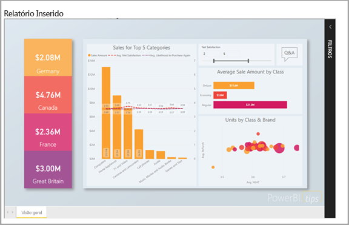
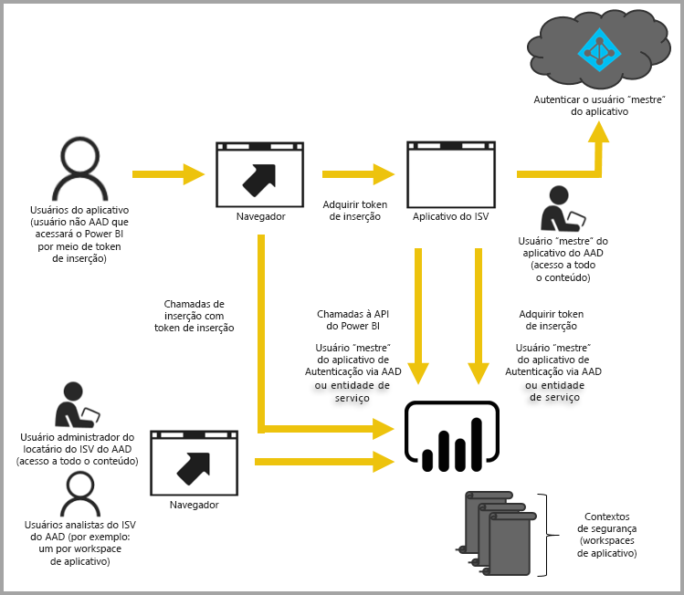

# Inserção com o Power BI

O serviço do Power BI (SaaS) e o serviço do Power BI Embedded no Azure (PaaS) têm APIs para inserir seus painéis e seus relatórios. Isso significa que você tem um conjunto consistente de recursos e o acesso aos recursos mais recentes do Power BI, tais como painéis, gateways e espaços de trabalho de aplicativo, ao inserir seu conteúdo.

É possível acessar a [Ferramenta de experiência de integração](https://aka.ms/embedsetup) para começar rapidamente e baixar um aplicativo de exemplo.

Escolha a solução certa para você:

* A [inserção para a organização](embedding.md#embedding-for-your-organization) permite que você estenda o serviço do Power BI. Execute a solução [Inserir para a organização](https://aka.ms/embedsetup/UserOwnsData).
* A [inserção para clientes](embedding.md#embedding-for-your-customers) fornece a capacidade de inserir os dashboards e relatórios para usuários que não têm uma conta do Power BI. Execute a solução [Inserir para clientes](https://aka.ms/embedsetup/AppOwnsData).

## Usando APIs

Há dois cenários principais ao inserir conteúdo do Power BI.  Inserir para usuários em sua organização (que têm a licença para o Power BI) e inserir para seus usuários e clientes sem que estes precisem ter licenças do Power BI. A API REST do Power BI permite os dois cenários.

Para clientes e usuários sem licenças do Power BI, você pode inserir painéis e relatórios em seu aplicativo personalizado, usando a mesma API para atender a organização ou os clientes. Os clientes veem os dados que são gerenciados pelo aplicativo. Além disso, para usuários do Power BI em sua organização, eles possuem as opções adicionais para exibir *seus dados* diretamente no Power BI ou no contexto do aplicativo inserido. Você pode se beneficiar das APIs REST e do JavaScript para suas necessidades de inserção.

Para exibir uma amostra de como a inserção funciona, consulte a [amostra de inserção do JavaScript](https://microsoft.github.io/PowerBI-JavaScript/demo/).

## Inserção para a organização

A **inserção para a organização** permite que você estenda o serviço do Power BI. A inserção para a organização requer que os usuários do aplicativo entrem no serviço do Power BI quando eles desejarem exibir seu conteúdo. Depois que alguém na organização conectar-se, este usuário só terá acesso aos painéis e relatórios dos quais ele é proprietário ou que foram compartilhados com ele no serviço do Power BI.

*Os exemplos de inserção para a organização incluem aplicativos internos, como [SharePoint Online](https://powerbi.microsoft.com/blog/integrate-power-bi-reports-in-sharepoint-online/), [integração do Microsoft Teams (é necessário ter direitos de administrador)](https://powerbi.microsoft.com/blog/power-bi-teams-up-with-microsoft-teams/) e [Microsoft Dynamics](https://docs.microsoft.com/dynamics365/customer-engagement/basics/add-edit-power-bi-visualizations-dashboard).*

Para inserir para a organização, consulte o seguinte:

* [Integrar um relatório em um aplicativo](embed-sample-for-your-organization.md)

Recursos de autoatendimento, como editar, salvar e muito mais, estão disponíveis por meio de [API JavaScript](https://github.com/Microsoft/PowerBI-JavaScript) ao inserir para usuários do Power BI.

Você pode examinar a [Ferramenta de experiência de integração para inserção para a organização](https://aka.ms/embedsetup/UserOwnsData) para iniciar rapidamente e baixar um aplicativo de exemplo que explica como integrar um relatório para a organização.

## Inserção para os clientes

A **inserção para clientes** permite que você insira os dashboards e relatórios para usuários que não têm uma conta do Power BI. A inserção para clientes também é conhecida como **Power BI Embedded**.

O [Power BI Embedded](azure-pbie-what-is-power-bi-embedded.md) é um serviço do **Microsoft Azure** que permite que ISVs (fornecedores de software independentes) e desenvolvedores insiram rapidamente visuais, relatórios e dashboards em um aplicativo por meio de um modelo medido em horas com base em capacidade.

O Power BI Embedded fornece benefícios para um ISV, seus desenvolvedores e clientes. Por exemplo, um ISV pode começar a criar elementos visuais gratuitamente com o Power BI Desktop. Os ISVs podem obter tempo de lançamento mais rápido minimizando os esforços de desenvolvimento de análise visual e se destacando em relação à concorrência com experiências de dados diferenciadas. Os ISVs também podem optar por cobrar uma taxa para o valor adicional criado com a análise integrada.

Com o Power BI Embedded, seus clientes não precisam saber nada sobre o Power BI. É necessária pelo menos uma conta do Power BI Pro para criar um aplicativo inserido. A conta do Power BI Pro funciona como uma conta mestre do seu aplicativo (pense nisso como uma conta de proxy). A conta do Power BI Pro também permite a geração de tokens de inserção que fornecem acesso a painéis e relatórios no serviço do Power BI que são de propriedade/gerenciados pelo seu aplicativo.

Os desenvolvedores que usam o Power BI Embedded podem passar o tempo concentrados na criação da competência principal do seu aplicativo, em vez de gastar tempo desenvolvendo visuais e análise. Os desenvolvedores podem atender rapidamente as demandas de dashboard e relatório do cliente e podem inserir facilmente com APIs e SDKs totalmente documentadas. Ao habilitar a exploração de dados fácil de navegar em aplicativos, os ISVs permitem que seus clientes tomem decisões rápidas e direcionadas a dados no contexto em qualquer dispositivo.

> [!IMPORTANT]
> Embora a inserção seja dependente do serviço do Power BI, não há uma dependência do Power BI para os clientes. Eles não precisa inscrever-se no Power BI para exibir o conteúdo inserido em seu aplicativo.

Quando você estiver pronto para passar para a produção, seu espaço de trabalho do aplicativo deverá ser atribuído a uma capacidade dedicada. O Power BI Embedded no Microsoft Azure oferece [capacidades dedicadas](azure-pbie-create-capacity.md) a serem usadas com seus aplicativos.

Para obter detalhes sobre como inserir, consulte [Como inserir seus dashboards, relatórios e blocos do Power BI](embed-sample-for-customers.md).

## Próximas etapas

Agora você pode tentar inserir o conteúdo do Power BI em um aplicativo ou tentar inserir o conteúdo do Power BI para seus clientes.

> [!div class="nextstepaction"]
> [Inserir para a organização](embed-sample-for-your-organization.md)

> [!div class="nextstepaction"]
> [O que é o Power BI Embedded?](azure-pbie-what-is-power-bi-embedded.md)

> [!div class="nextstepaction"]
>[Inserir para seus clientes](embed-sample-for-customers.md)

Mais perguntas? [Experimente perguntar à Comunidade do Power BI](http://community.powerbi.com/)