# <a name="power-bi-embedded-migration-tool"></a>Ferramenta de migração Power BI Embedded

Essa ferramenta de migração pode ser usada para copiar seus relatórios do serviço Power BI Embedded do Azure (PaaS) para o serviço do Power BI (SaaS).

A migração do conteúdo de suas coleções de workspaces para o serviço do Power BI poderá ser feita paralelamente à sua solução atual e não requer nenhum tempo de inatividade.

## <a name="limitations"></a>Limitações

* Conjuntos de dados enviados por push não podem ser baixados e precisarão ser recriados usando as APIs REST do Power BI para o serviço do Power BI.
* Arquivos PBIX importados antes de 26 de novembro de 2016 não estarão disponíveis para download.

## <a name="download"></a>Download

É possível baixar o exemplo da ferramenta de migração no [GitHub](https://github.com/Microsoft/powerbi-migration-sample). Você pode baixar um zip do repositório ou pode cloná-lo localmente. Após o download, você pode abrir *powerbi-migration-sample.sln* dentro do Visual Studio para compilar e executar a ferramenta de migração.

## <a name="migration-plans"></a>Planos de migração

Seu plano de migração são apenas metadados que catalogam o conteúdo no Power BI Embedded e como você deseja publicá-lo no serviço do Power BI.

### <a name="start-with-a-new-migration-plan"></a>Iniciar com um novo plano de migração

Um plano de migração são os metadados dos itens disponíveis no Power BI Embedded que você deseja mover para o serviço do Power BI. O plano de migração é armazenado como um arquivo XML.

Comece criando um novo plano de migração. Para criar um novo plano de migração, faça o seguinte.

1. Selecione **Arquivo** > **Novo Plano de Migração**.

    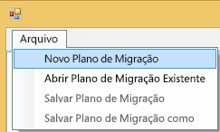

2. Na caixa de diálogo **Selecionar grupo de recursos do Power BI Embedded**, selecione o menu suspenso Ambiente e selecione Produção.

3. Será solicitado que você entre. Você usará seu logon de assinatura do Azure.

   > [!IMPORTANT]
   > **Não** se trata da conta da organização do Office 365 que você usa para entrar no Power BI.

4. Selecione a assinatura do Azure que armazena suas coleções de workspaces do Power BI Embedded.

    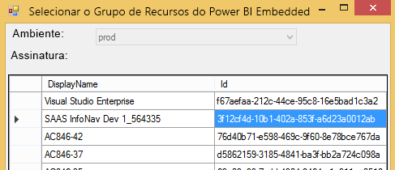
5. Abaixo da lista de assinaturas, selecione o **Grupo de Recursos** que contém suas coleções de workspaces e selecione **Selecionar**.

    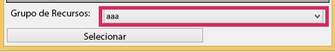

6. Selecione **Analisar**. Isso retornará um inventário dos itens dentro de sua assinatura do Azure para você começar seu plano.

    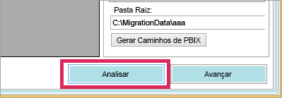

   > [!NOTE]
   > O processo de análise pode levar vários minutos dependendo do número de coleções de workspaces e da quantidade de conteúdo que existe na coleção de workspaces.

7. Quando o processo de **Analisar** estiver concluído, será solicitado que você salve seu plano de migração.

Neste ponto, você conectou seu plano de migração à sua assinatura do Azure. Leia abaixo para entender o fluxo de como trabalhar com seu plano de migração. Ele inclui Analisar e Planejar a Migração, Baixar, Criar Grupos e Carregar.

### <a name="save-your-migration-plan"></a>Salvar o plano de migração

Você pode salvar o plano de migração para usá-lo posteriormente. Isso criará um arquivo XML contento todas as informações em seu plano de migração.

Para salvar seu plano de migração, faça o seguinte.

1. Selecione **Arquivo** > **Salvar Plano de Migração**.

    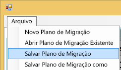

2. Nomeie o arquivo ou use o nome de arquivo gerado e selecione **Salvar**.

### <a name="open-an-existing-migration-plan"></a>Abrir um plano de migração existente

Você pode abrir um plano de migração salvo para continuar trabalhando na migração.

Para abrir o plano de migração existente, faça o seguinte.

1. Selecione **Arquivo** > **Abrir Plano de Migração Existente**.

    

2. Selecione o arquivo de migração e selecione **Abrir**.

## <a name="step-1-analyze--plan-migration"></a>Etapa 1: Analisar e Planejar a Migração

A guia **Analisar e Planejar a Migração** fornece um panorama do que está no grupo de recursos de sua assinatura do Azure.

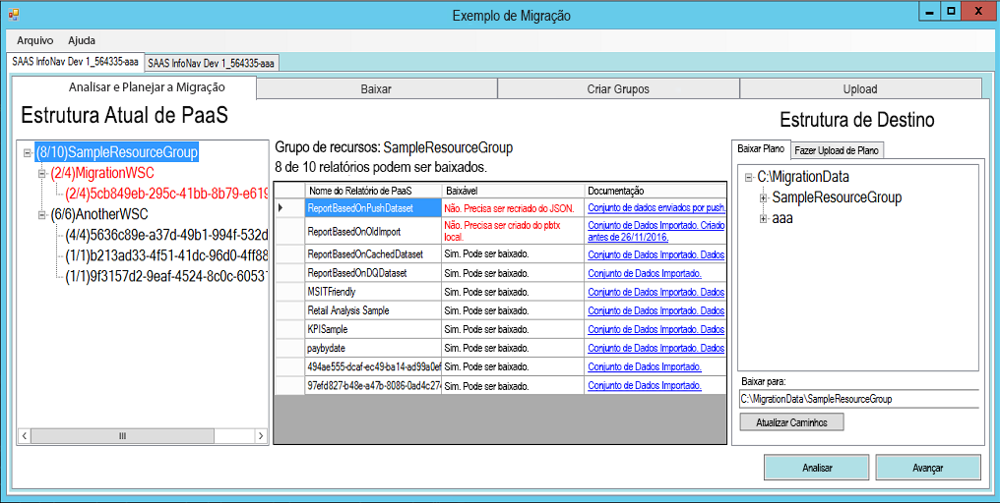

Examinaremos *SampleResourceGroup* como exemplo.

### <a name="paas-topology"></a>Topologia de PaaS

Essa é uma lista de *Grupo de Recursos &gt; Coleções de workspaces &gt; Workspaces*. As coleções de workspaces e o grupo de recursos mostrarão um nome amigável. Os workspaces mostrarão um GUID.

Os itens na lista também exibirão uma cor e um número no formato (#/#). Isso indica o número de relatórios que podem ser baixados.
A cor preta significa que todos os relatórios podem ser baixados.

A cor vermelha significa que alguns relatórios não podem ser baixados. O número à esquerda indica o número total de relatórios que podem ser baixados. O número à direita indica o número total de relatórios no agrupamento.

Você pode selecionar um item dentro da topologia de PaaS para exibir os relatórios na seção de relatórios.

### <a name="reports"></a>Relatórios

A seção de relatórios listará os relatórios disponíveis e indicará se eles podem ser baixados ou não.

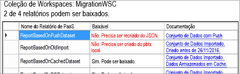

### <a name="target-structure"></a>Estrutura de destino

A **Estrutura de destino** é onde você informa à ferramenta onde os itens serão baixados e como carregá-los.

#### <a name="download-plan"></a>Baixar Plano

Um caminho será criado automaticamente para você. Se desejar, você poderá alterar esse caminho. Se alterar o caminho, você precisará selecionar **Atualizar caminhos**.

> [!NOTE]
> Isso não executa o download. Isso só especifica a estrutura do local para o local em que os relatórios serão baixados.

#### <a name="upload-plan"></a>Plano de upload

Aqui, você pode especificar um prefixo para ser usado para os Workspaces do Aplicativo que serão criados no serviço do Power BI. Depois do prefixo, estará o GUID do workspace que existia no Azure.

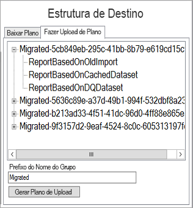

> [!NOTE]
> Isso não cria os grupos no serviço do Power BI. Isso apenas define a estrutura de nomenclatura dos grupos.

Se alterar o prefixo, você precisará selecionar **Gerar Plano de Upload**.

Você pode clicar com o botão direito do mouse em um grupo e escolher renomear o grupo diretamente no plano de upload, se desejado.

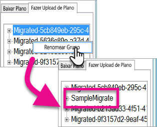

> [!NOTE]
> O nome do *grupo* não pode conter espaços ou caracteres inválidos.

## <a name="step-2-download"></a>Etapa 2: Fazer o download

Na guia **Baixar**, você verá a lista de relatórios e os metadados associados. Você pode ver qual é o status da exportação, junto com o status da exportação anterior.

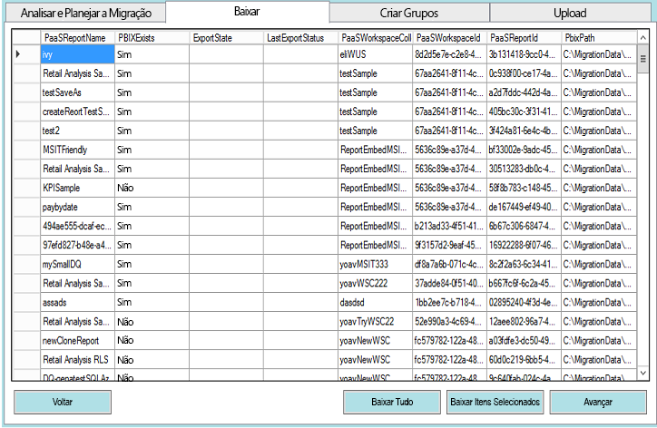

Você tem duas opções.

* Selecionar relatórios específicos e selecionar **Baixar Selecionados**
* Selecionar **Baixar Todos**.

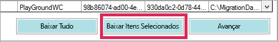

Para um download bem-sucedido, você verá o status *Concluído* e ele refletirá que o arquivo PBIX existe.

Depois que o download for concluído, selecione a guia **Criar Grupos**.

## <a name="step-3-create-groups"></a>Etapa 3: Criar Grupos

Após ter baixado os relatórios disponíveis, você pode ir para a guia **Criar Grupos**. Esta guia criará os workspaces do aplicativo no serviço do Power BI com base no plano de migração que você criou. Ela criará o workspace do aplicativo com o nome fornecido na guia **Carregar** em **Analisar e Planejar a Migração**.

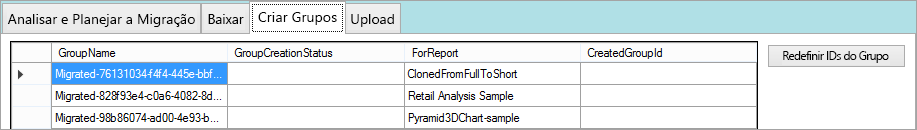

Para criar os workspaces do aplicativo, você pode selecionar **Criar Grupos Selecionados** ou **Criar Todos os Grupos Ausentes**.

Quando selecionar uma dessas opções, você será solicitado a entrar. *Use as credenciais do serviço do Power BI no qual você deseja criar os workspaces do aplicativo.*


Isso criará o workspace do aplicativo no serviço do Power BI. Os relatórios não serão carregados no workspace do aplicativo.

Você pode confirmar se o workspace do aplicativo foi criado entrando no Power BI e validando se o workspace existe. Você observará que não há nada no workspace.

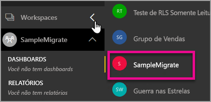

Após o workspace ser sido criado, você poderá passar para a guia **Carregar**.

## <a name="step-4-upload"></a>Etapa 4: Carregar

Na guia **Carregar**, os relatórios serão carregados para o serviço do Power BI. Você verá uma lista dos relatórios baixados na guia Baixar, em conjunto com o nome do grupo de destino com base em seu plano de migração.

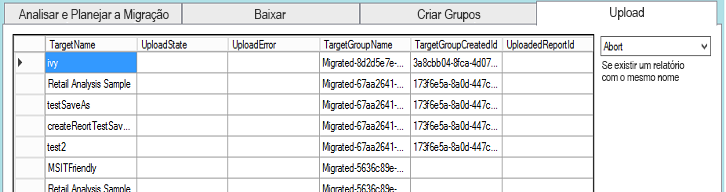

Você pode carregar relatórios selecionados ou pode carregar todos os relatórios. Você também pode redefinir o status de upload para carregar itens novamente.

Você também tem a opção de selecionar o que deseja fazer se houver um relatório com o mesmo nome. Você pode escolher entre **Anular**, **Ignorar** e **Substituir**.

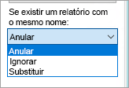

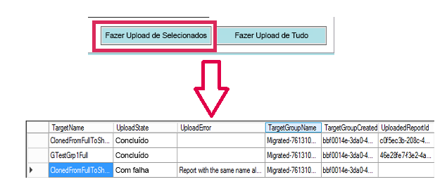

### <a name="duplicate-report-names"></a>Nomes de relatório duplicados

Se tiver um relatório com o mesmo nome, mas souber que se trata de um relatório diferente, você precisará alterar o **TargetName** do relatório. Você pode alterar o nome editando manualmente o XML do plano de migração.

Você precisará fechar a ferramenta de migração para fazer a alteração e, em seguida, abrir novamente a ferramenta e o plano de migração.

No exemplo acima, um dos relatórios clonados falhou indicando que existe um relatório com o mesmo nome. Se examinarmos o XML do plano de migração, veremos o seguinte.

```xml
<ReportMigrationData>
    <PaaSWorkspaceCollectionName>SampleWorkspaceCollection</PaaSWorkspaceCollectionName>
    <PaaSWorkspaceId>4c04147b-d8fc-478b-8dcb-bcf687149823</PaaSWorkspaceId>
    <PaaSReportId>525a8328-b8cc-4f0d-b2cb-c3a9b4ba2efe</PaaSReportId>
    <PaaSReportLastImportTime>1/3/2017 2:10:19 PM</PaaSReportLastImportTime>
    <PaaSReportName>cloned</PaaSReportName>
    <IsPushDataset>false</IsPushDataset>
    <IsBoundToOldDataset>false</IsBoundToOldDataset>
    <PbixPath>C:\MigrationData\SampleResourceGroup\SampleWorkspaceCollection\4c04147b-d8fc-478b-8dcb-bcf687149823\cloned-525a8328-b8cc-4f0d-b2cb-c3a9b4ba2efe.pbix</PbixPath>
    <ExportState>Done</ExportState>
    <LastExportStatus>OK</LastExportStatus>
    <SaaSTargetGroupName>SampleMigrate</SaaSTargetGroupName>
    <SaaSTargetGroupId>6da6f072-0135-4e6c-bc92-0886d8aeb79d</SaaSTargetGroupId>
    <SaaSTargetReportName>cloned</SaaSTargetReportName>
    <SaaSImportState>Failed</SaaSImportState>
    <SaaSImportError>Report with the same name already exists</SaaSImportError>
</ReportMigrationData>
```

Para o item com falha, podemos alterar o nome do SaaSTargetReportName.

```xml
<SaaSTargetReportName>cloned2</SaaSTargetReportName>
```

Podemos, em seguida, abrir novamente o plano na ferramenta de migração e carregar o relatório com falha.

Voltando ao Power BI, podemos ver que os relatórios e conjuntos de dados foram carregados no workspace do aplicativo.

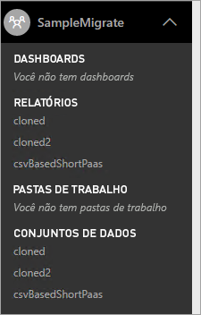

<a name="upload-local-file"></a>

### <a name="upload-a-local-pbix-file"></a>Carregar um arquivo PBIX local

Você pode carregar uma versão local de um arquivo do Power BI Desktop. Você precisará fechar a ferramenta, editar o XML e colocar o caminho completo para seu PBIX local na propriedade **PbixPath**.

```xml
<PbixPath>[Full Path to PBIX file]</PbixPath>
```

Depois de editar o xml, abra novamente o plano dentro da ferramenta de migração e carregue o relatório.

<a name="directquery-reports"></a>

### <a name="directquery-reports"></a>Relatórios do DirectQuery

Você precisará atualizar a cadeia de conexão para relatórios do DirectQuery. Faça isso no *powerbi.com* ou consulte a cadeia de conexão de forma programática usando o Power BI Embedded (PaaS). Para ver um exemplo, consulte [Extrair uma cadeia de conexão do DirectQuery do relatório de PaaS](migrate-code-snippets.md#extract-directquery-connection-string-from-paas-report).

Em seguida, você poderá atualizar a cadeia de conexão do conjunto de dados no serviço do Power BI (SaaS) e definir as credenciais para a fonte de dados. Você pode examinar os exemplos a seguir para saber como fazer isso.

* [Atualizar a cadeia de conexão do DirectQuery no workspace de SaaS](migrate-code-snippets.md#update-directquery-connection-string-is-saas-workspace)
* [Definir credenciais do DirectQuery no workspace de SaaS](migrate-code-snippets.md#set-directquery-credentials-in-saas-workspace)

## <a name="embedding"></a>Inserção

Agora que seus relatórios foram migrados do serviço Power BI Embedded do Azure para o serviço do Power BI, você pode atualizar seu aplicativo e começar a inserir os relatórios neste workspace do aplicativo.

Para obter mais informações, consulte [Como migrar o conteúdo da coleção de workspaces do Power BI Embedded para o Power BI](migrate-from-powerbi-embedded.md).

## <a name="next-steps"></a>Próximas etapas

[Inserindo com o Power BI](embedding.md)  
[Como migrar o conteúdo da coleção de workspaces do Power BI Embedded para o Power BI](migrate-from-powerbi-embedded.md)  
[Power BI Premium – o que é?](../service-premium-what-is.md)  
[Repositório Git de API do JavaScript](https://github.com/Microsoft/PowerBI-JavaScript)  
[Repositório Git de C# do Power BI](https://github.com/Microsoft/PowerBI-CSharp)  
[Exemplo inserido do JavaScript](https://microsoft.github.io/PowerBI-JavaScript/demo/)  
[White paper do Power BI Premium](https://aka.ms/pbipremiumwhitepaper)  

Mais perguntas? [Experimente perguntar à Comunidade do Power BI](http://community.powerbi.com/)