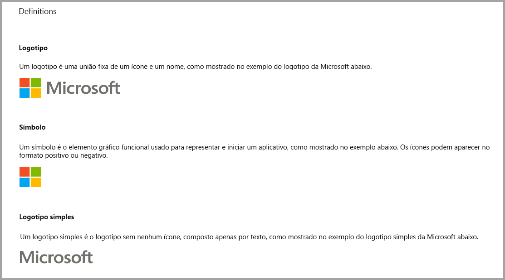
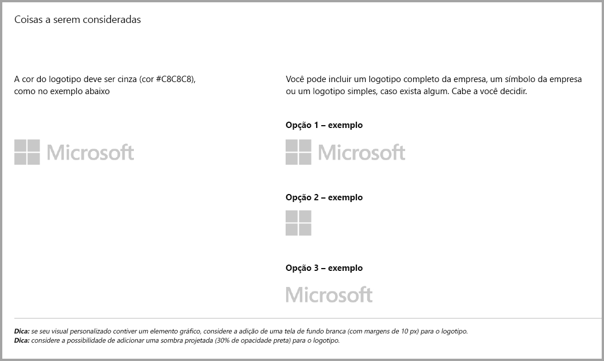
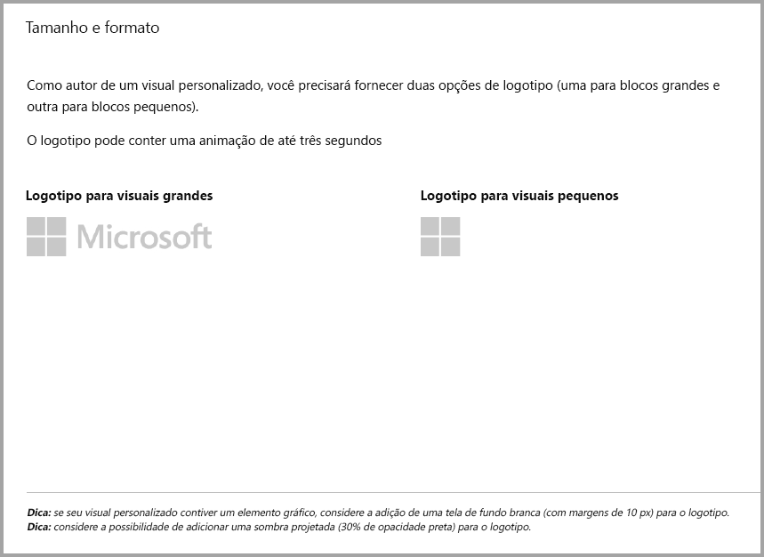
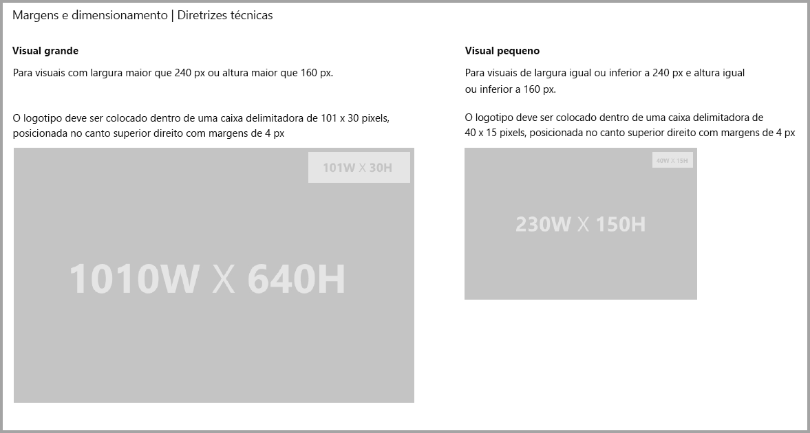
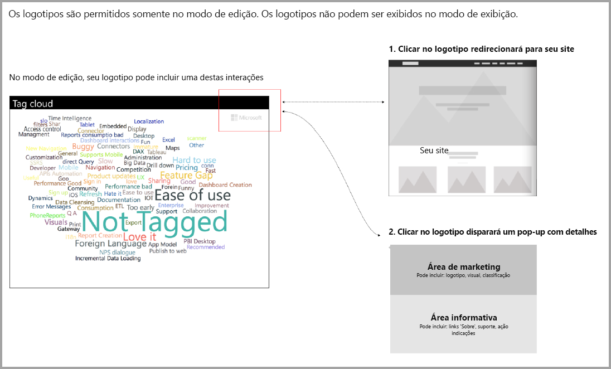

# Diretrizes para visuais do Power BI com compras adicionais

Até recentemente, o Marketplace (AppSource) aceitava apenas os visuais gratuitos do Power BI. Esta política foi alterada, para que você também possa enviar os visuais para o AppSource com uma marca de preço "compra adicional pode ser necessária". 

Os visuais "compra adicional pode ser necessária" são semelhantes a suplementos de IAP (compra no aplicativo) na Office Store. Os desenvolvedores também podem enviar esses visuais para a certificação após a equipe do AppSource aprova-los e depois de verificar se eles estão em conformidade com os requisitos de certificação. Para obter mais informações sobre os requisitos, confira [Elementos visuais personalizados certificados](../power-bi-custom-visuals-certified.md).

> [!NOTE]
> * Para o visual ser certificado, ele não deverá acessar serviços ou recursos externos.
> * Todos os visuais gratuitos devem manter os mesmos recursos gratuitos oferecidos anteriormente. Você pode adicionar recursos avançados opcionais pagos, além dos recursos gratuitos existentes. Recomendamos que você envie os visuais de IAP com os recursos avançados como novos visuais e não atualize os existentes gratuitos.

## O que mudou no processo de envio?

Os desenvolvedores carregam seus visuais de IAP para o AppSource por meio do Painel do Vendedor, como eles faziam para visuais gratuitos. Para indicar que o visual enviado tem recursos de IAP, os desenvolvedores devem escrever nas notas do Painel do vendedor: "Visual com compra no aplicativo." Além disso, os desenvolvedores precisam fornecer um token ou chave de licença para que a equipe de validação poder validar os recursos de IAP. Assim que o visual tiver sido validado e aprovado, a listagem do AppSource para os visuais do IAP diz "Compra adicional pode ser necessária" nas opções de preços.

## O que é um visual do Power BI com recursos de IAP?

Um visual de IAP é um visual grátis que oferece recursos gratuitos. Ele também possui alguns recursos avançados para os quais podem ser aplicados custos extras para operá-los. Na descrição do visual, os desenvolvedores devem notificar os usuários sobre os recursos que exigem compras adicionais para operar. Atualmente, a Microsoft não fornece APIs nativas compatíveis com a compra de aplicativos e suplementos.

Os desenvolvedores podem usar qualquer sistema de pagamento de terceiros para essas compras. Para obter mais informações, confira [nossa política de loja](https://docs.microsoft.com/office/dev/store/validation-policies#2-apps-or-add-ins-can-display-certain-ads).

> [!NOTE]
> As marcas d'água não são permitidas nos recursos gratuitos. Os desenvolvedores poderão exibir uma janela pop-up ou uma marca-d'água se os recursos pagos avançados forem usados sem uma licença válida.  

## Diretrizes de logotipo

Esta seção descreve as especificações para adicionar logos e logotipos em elementos visuais.

> [!NOTE]
> Logotipos são permitidos apenas no modo de edição. Logotipos não podem ser exibidos no modo de exibição.

## Práticas recomendadas

### Página de aterrissagem de elementos visuais

Use a página de aterrissagem para esclarecer aos usuários como eles podem usar seu visual e em que local comprar a licença. Não inclua vídeos disparados automaticamente. Adicione apenas material que ajude a melhorar a experiência do usuário, como informações ou links sobre detalhes de compra de licença e como usar os recursos de IAP.

### Token e a chave de licença

Para conveniência do usuário, adicione os campos relacionados ao token ou a chave de licença na parte superior do painel de formato.

## PERGUNTAS FREQUENTES

Para saber mais sobre visuais, acesse [Perguntas frequentes sobre os visuais com compras adicionais](https://docs.microsoft.com/power-bi/power-bi-custom-visuals-faq#visuals-with-additional-purchases).

## Próximas etapas

Saiba como você pode publicar seu visual personalizado no [AppSource](office-store.md) para que outros possam descobrir e usá-lo.
