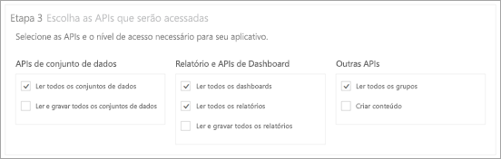
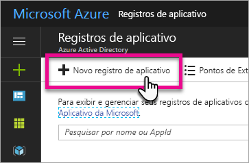
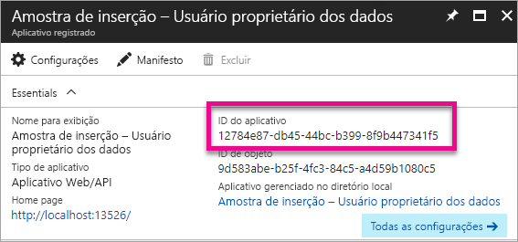
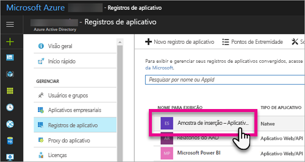
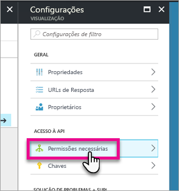
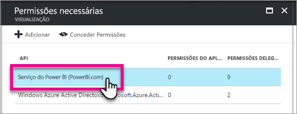
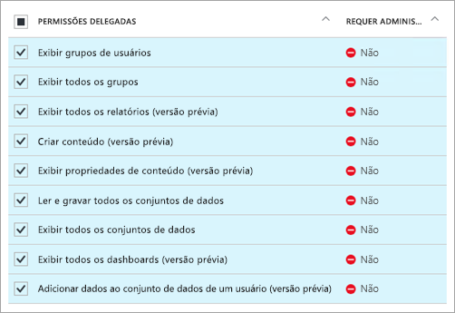
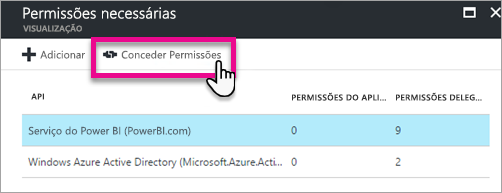

# <a name="register-an-azure-ad-app-to-embed-power-bi-content"></a>Registrar um aplicativo do Azure AD para inserir o conteúdo do Power BI

Saiba como registrar um aplicativo no Azure AD (Azure Active Directory) para uso com a inserção de conteúdo do Power BI.

Registre seu aplicativo com o Azure AD para permitir que seu aplicativo acesse as APIs REST do Power BI. Quando registrar o aplicativo, você poderá estabelecer uma identidade para ele e especificar permissões para recursos REST do Power BI.

> [!IMPORTANT]
> Antes de registrar um aplicativo do Power BI, é necessário um [locatário do Azure Active Directory e um usuário da organização](create-an-azure-active-directory-tenant.md). Se você ainda não se inscreveu no Power BI com um usuário em seu locatário, o registro do aplicativo não será concluído com êxito.

Há duas maneiras de registrar seu aplicativo. A primeira é com a [Ferramenta de Registro de Aplicativo do Power BI](https://dev.powerbi.com/apps/), sendo que também é possível fazê-lo diretamente no portal do Azure. A Ferramenta de Registro de Aplicativo do Power BI é a opção mais fácil, pois há apenas alguns campos para preencher. Se você desejar fazer alterações no aplicativo, use o portal do Azure.

## <a name="register-with-the-power-bi-app-registration-tool"></a>Registrar um aplicativo com a Ferramenta de Registro de Aplicativo do Power BI

Registre o aplicativo no **Azure Active Directory** a fim de estabelecer uma identidade para ele e especificar permissões para recursos REST do Power BI. Quando registra um aplicativo, como um aplicativo de console ou um site, você recebe um identificador que é usado pelo aplicativo para se identificar aos usuários dos quais ele está solicitando permissões.

Veja aqui como registrar seu aplicativo com a Ferramenta de Registro de Aplicativo do Power BI:

1. Acesse [dev.powerbi.com/apps](https://dev.powerbi.com/apps).
2. Selecione **Entre com sua conta existente**.
3. Forneça um **Nome do Aplicativo**.
4. A seleção de Tipo de aplicativo depende do tipo de aplicativo que você está usando.

   * Use **Aplicativo nativo** para aplicativos executados em dispositivos cliente. Escolha **Aplicativo nativo** se estiver inserindo conteúdo para clientes, independentemente de qual seja o aplicativo, até mesmo para aplicativos Web.
   * Use **Aplicativo Web do servidor** para aplicativos Web ou APIs da Web.

5. Insira um valor para **URL de redirecionamento** e **URL da Home Page**. A **URL de redirecionamento** funciona com qualquer URL válida.

    **URL da Home Page** só estará disponível se você escolher **Aplicativo Web do lado do servidor** como o tipo de aplicativo.

    Para as amostras *Inserindo para os clientes* e *integrate-dashboard-web-app*, a **URL de redirecionamento** é `http://localhost:13526/Redirect`. Para a amostra de relatório e bloco, a **URL de redirecionamento** é `http://localhost:13526/`.
6. Escolha as APIs para o aplicativo que tem acesso. Para obter mais informações sobre as permissões de acesso do Power BI, veja [Permissões do Power BI](power-bi-permissions.md).

    
7. Selecione **Registrar aplicativo**.

    Em seguida, você recebe uma **ID do cliente** e, ao selecionar **Aplicativo Web do lado do servidor**, você recebe um **Segredo do Cliente**. A **ID do Cliente** pode ser recuperada no portal do Azure, mais tarde, se necessário. Se você perder o **Segredo do Cliente**, será necessário criar um novo no portal do Azure.

8. Navegue até o Azure para selecionar **Conceder permissões**.

   > [!Note]
   > Os usuários no locatário precisam ter acesso à opção **_Conceder permissões_** para concluírem esta etapa.

* Acesse o Azure.
* Pesquise e selecione **Registros do aplicativo**.
* Escolha seu aplicativo.
* Selecione **Configurações**.
* Selecione **Permissões necessárias**:
* Selecione **Serviço do Power BI** para verificar as permissões que você selecionou no site de Registro do aplicativo.
* Selecione **Conceder Permissões**.

Agora é possível usar o aplicativo registrado como parte do aplicativo personalizado para interagir com o serviço do Power BI.

> [!IMPORTANT]
> Se você estiver inserindo conteúdo para os clientes, será necessário configurar permissões adicionais no portal do Azure. Para obter mais informações, consulte [Aplicar permissões ao aplicativo](#apply-permissions-to-your-application).

## <a name="register-with-the-azure-portal"></a>Registrar com o portal do Azure

Sua outra opção para registrar seu aplicativo é fazer isso diretamente no portal do Azure. Para registrar seu aplicativo, siga estas etapas.

1. Aceite os [Termos da API do Microsoft Power BI](https://powerbi.microsoft.com/api-terms).
2. Entre no [Portal do Azure](https://portal.azure.com).
3. Para escolher o locatário do Azure AD, selecione sua conta no canto superior direito da página.
4. No painel de navegação à esquerda, escolha **Mais Serviços**, selecione **Registros de Aplicativo** em **Segurança + Identidade** e selecione **Novo registro de aplicativo**.

    
5. Siga os prompts e crie um novo aplicativo.

   * Para aplicativos Web, forneça a URL de logon, que é a URL base do aplicativo, na qual os usuários podem entrar, por exemplo, `http://localhost:13526`).
   * Para aplicativos nativos, forneça um **URI de redirecionamento**, que usa o Azure AD para retornar respostas de token. Insira um valor específico para o aplicativo (por exemplo, `http://myapplication/Redirect`).

Para obter mais informações sobre como registrar aplicativos no Azure Active Directory, consulte [Integrando aplicativos ao Azure Active Directory](https://docs.microsoft.com/azure/active-directory/develop/active-directory-integrating-applications)

## <a name="how-to-get-the-client-id"></a>Como obter a ID do cliente

Ao registrar um aplicativo, você recebe uma **ID do Cliente**.  A **ID do Cliente** solicita permissões aos usuários pelo aplicativo para que eles se identifiquem.

Eis como obter uma ID do cliente:

1. Entre no [Portal do Azure](https://portal.azure.com).
2. Para escolher o locatário do Azure AD, selecione sua conta no canto superior direito da página.
3. No painel de navegação esquerdo, escolha **Mais serviços** e selecione **Registros de aplicativo**.
4. Selecione o aplicativo para o qual você deseja recuperar a ID que precisa usar.
5. Você verá a **ID do Aplicativo** listada como um GUID. Esta é a ID do cliente para o aplicativo.

    

## <a name="apply-permissions-to-your-application-within-azure-ad"></a>Aplicar permissões ao aplicativo no Azure AD

> [!IMPORTANT]
> Esta seção se aplica apenas aos aplicativos que estão **inserindo conteúdo para a organização**.

Habilite permissões adicionais para o aplicativo, além das fornecidas pela página de registro do aplicativo. Você pode fazer isso por meio do portal do Azure AD ou programaticamente.

Convém entrar com a conta *mestra* usada para inserção, ou com uma conta de Administrador Global.

### <a name="using-the-azure-ad-portal"></a>Usando o Portal do Azure AD

1. Navegue até [Registros de aplicativo](https://portal.azure.com/#blade/Microsoft_AAD_IAM/ApplicationsListBlade) no Portal do Azure e selecione o aplicativo que você está usando para inserção.

    
2. Selecione **Permissões necessárias** em **Acesso à API**.

    

3. Em **Permissões necessárias**, selecione **Serviço do Power BI (Power BI)**.

    

   > [!NOTE]
   > Se você tiver criado o aplicativo diretamente no portal do Azure AD, o **Serviço do Power BI (Power BI)** poderá não estar presente. Se ele não estiver, selecione **+ Adicionar** e **1 Selecionar e API**. Selecione **Serviço do Power BI** na lista de APIs e **Selecionar**.  Se o **serviço do Power BI (Power BI)** não está disponível em **+ Adicionar**, inscreva-se no Power BI com pelo menos um usuário.

4. Selecione todas as permissões em **Permissões Delegadas**. Selecionar uma a uma para salvar as seleções. Selecione **Salvar** quando terminar.

    
5. Em **Permissões necessárias**, selecione **Conceder Permissões**.

    A ação **Conceder permissões** é necessária para a *conta mestre*, a fim de evitar solicitações de consentimento pelo Azure AD. Se a conta que executar essa ação for um Administrador Global, você concederá permissões para todos os usuários da organização a esse aplicativo. Se a conta que executa essa ação é a *conta mestre* e não é um Administrador Global, você concede permissões apenas para a *conta mestre* a esse aplicativo.

    

### <a name="applying-permissions-programmatically"></a>Aplicando permissões de forma programática

1. É necessário obter as entidades de serviço existentes (usuários) no seu locatário. Para obter informações de como fazer isso, consulte [Obter servicePrincipal](https://developer.microsoft.com/en-us/graph/docs/api-reference/beta/api/serviceprincipal_get).

    É possível chamar a API *Get servicePrincipal* sem {id} e ela obterá todas as entidades de serviço no locatário.
2. Procure uma entidade de serviço com a ID de cliente do seu aplicativo como a propriedade **appId**.

3. Crie um novo plano de serviço, se o aplicativo não tiver um.

    ```json
    Post https://graph.microsoft.com/beta/servicePrincipals
    Authorization: Bearer ey..qw
    Content-Type: application/json
    {
    "accountEnabled" : true,
    "appId" : "{App_Client_ID}",
    "displayName" : "{App_DisplayName}"
    }
    ```

4. Conceder permissões do aplicativo para a API do Power BI

   Se você estiver usando um locatário existente e não estiver interessado em conceder permissões em nome de todos os usuários de locatário, poderá conceder permissões substituindo o valor de **contentType** para **Principal**.

   O valor de **consentType** pode fornecer **AllPrincipals** ou **Principal**.

   * **AllPrincipals** somente pode ser usado por um administrador do locatário para conceder permissões em nome de todos os usuários no locatário.
   * **Principal** é usado para conceder permissões em nome de um usuário específico. Nesse caso, uma propriedade adicional deve ser adicionada ao corpo da solicitação – *principalId={User_ObjectId}*.

     Você deve *Conceder permissões* à conta mestra para impedir que o Microsoft Azure AD solicite consentimento, o que não é possível ao entrar de forma não interativa.

     ```json
     Post https://graph.microsoft.com/beta/OAuth2PermissionGrants
     Authorization: Bearer ey..qw
     Content-Type: application/json
     {
     "clientId":"{Service_Plan_ID}",
     "consentType":"AllPrincipals",
     "resourceId":"c78a3685-1ce7-52cd-95f7-dc5aea8ec98e",
     "scope":"Dataset.ReadWrite.All Dashboard.Read.All Report.Read.All Group.Read Group.Read.All Content.Create Metadata.View_Any Dataset.Read.All Data.Alter_Any",
     "expiryTime":"2018-03-29T14:35:32.4943409+03:00",
     "startTime":"2017-03-29T14:35:32.4933413+03:00"
     }
     ```

    A **resourceId** *c78a3685-1ce7-52cd-95f7-dc5aea8ec98e* não é universal, mas ela é dependente de locatário. Esse valor é a objectId do aplicativo “Serviço do Power BI” no locatário do AAD.

    O usuário pode obter rapidamente esse valor no portal do Azure:
    1. https://portal.azure.com/#blade/Microsoft_AAD_IAM/StartboardApplicationsMenuBlade/AllApps
    2. Pesquise por “Serviço do Power BI” na caixa de pesquisa

5. Conceder permissões do aplicativo ao AAD (Azure Active Directory)

   O valor de **consentType** pode fornecer **AllPrincipals** ou **Principal**.

   * **AllPrincipals** somente pode ser usado por um administrador do locatário para conceder permissões em nome de todos os usuários no locatário.
   * **Principal** é usado para conceder permissões em nome de um usuário específico. Nesse caso, uma propriedade adicional deve ser adicionada ao corpo da solicitação – *principalId={User_ObjectId}*.

   Você deve *Conceder permissões* à conta mestra para impedir que o Microsoft Azure AD solicite consentimento, o que não é possível ao entrar de forma não interativa.

   ```json
   Post https://graph.microsoft.com/beta/OAuth2PermissionGrants
   Authorization: Bearer ey..qw
   Content-Type: application/json
   { 
   "clientId":"{Service_Plan_ID}",
   "consentType":"AllPrincipals",
   "resourceId":"61e57743-d5cf-41ba-bd1a-2b381390a3f1",
   "scope":"User.Read Directory.AccessAsUser.All",
   "expiryTime":"2018-03-29T14:35:32.4943409+03:00",
   "startTime":"2017-03-29T14:35:32.4933413+03:00"
   }
   ```

## <a name="next-steps"></a>Próximas etapas

Agora que você registrou seu aplicativo no Azure AD, é necessário autenticar os usuários no aplicativo. Confira [Autenticar usuários e obter um token de acesso do Azure AD para o aplicativo do Power BI](get-azuread-access-token.md) para saber mais.

Mais perguntas? [Experimente perguntar à Comunidade do Power BI](http://community.powerbi.com/)
