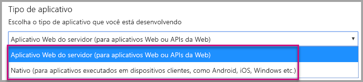
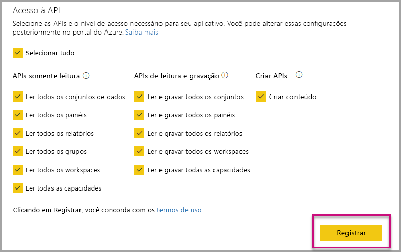
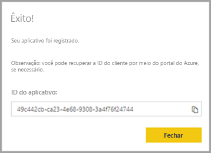
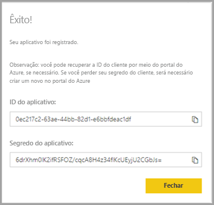

# <a name="register-an-azure-ad-application-to-use-with-power-bi"></a>Registrar um aplicativo do Azure AD para usar com o Power BI

Saiba como registrar um aplicativo no Azure AD (Azure Active Directory) para uso com a inserção de conteúdo do Power BI.

Registre seu aplicativo com o Azure AD para permitir que seu aplicativo acesse as [APIs REST do Power BI](https://docs.microsoft.com/rest/api/power-bi/). Quando registrar o aplicativo, você poderá estabelecer uma identidade para ele e especificar permissões para recursos REST do Power BI.

> [!IMPORTANT]
> Antes de registrar um aplicativo do Power BI, é necessário um [locatário do Azure Active Directory e um usuário da organização](create-an-azure-active-directory-tenant.md). Se você ainda não se inscreveu no Power BI com um usuário em seu locatário, o registro do aplicativo não será concluído com êxito.

Há duas maneiras de registrar seu aplicativo. A primeira é com a [Ferramenta de Registro de Aplicativo do Power BI](https://dev.powerbi.com/apps/), sendo que também é possível fazê-lo diretamente no portal do Azure. A ferramenta de registro de aplicativo do Power BI é mais conveniente de usar, pois há apenas alguns campos a preencher. Se você desejar fazer alterações no aplicativo, use o portal do Azure.

## <a name="register-with-the-power-bi-application-registration-tool"></a>Registrar-se com a Ferramenta de Registro de Aplicativo do Power BI

Registre o aplicativo no **Azure Active Directory** a fim de estabelecer uma identidade para ele e especificar permissões para recursos REST do Power BI. Quando registra um aplicativo, como um aplicativo de console ou um site, você recebe um identificador que é usado pelo aplicativo para se identificar aos usuários dos quais ele está solicitando permissões.

Veja aqui como registrar seu aplicativo com a Ferramenta de Registro de Aplicativo do Power BI:

1. Acesse [dev.powerbi.com/apps](https://dev.powerbi.com/apps).

2. Selecione **Entrar** com sua conta e, em seguida, selecione **Avançar**.

3. Informe um **Nome do Aplicativo**.

4. Informe um **Tipo de Aplicativo**.

    Aqui estão as diferenças de por que você escolhe **aplicativos Web Nativos** versus **do lado do Servidor** para um tipo de aplicativo.

    Nativo:
    * Você planeja criar um aplicativo [projetado para seus clientes](embed-sample-for-customers.md) usando uma conta de usuário mestre (uma licença do Power BI Pro usada para entrar no Power BI) para autenticar-se.

    Aplicativo Web do lado do servidor:
    * Você planeja criar um aplicativo [projetado para sua organização](embed-sample-for-your-organization.md).
    * Você planeja criar um aplicativo [projetado para seus clientes](embed-sample-for-customers.md) usando a entidade de serviço para autenticar-se.
    * Você planeja criar aplicativos Web ou APIs Web.

    

5. Se você selecionou **Aplicativo Web do lado do servidor** para o tipo de aplicativo, continue com a inserção de um valor para **URL da Página Inicial** e **URL de Redirecionamento**. O **URL de redirecionamento** funciona com qualquer URL válida e deve corresponder com o aplicativo que você criou. Se você selecionou **nativo**, vá para a etapa 6.

6. Escolha as APIs do Power BI de que seu aplicativo precisa. Para obter mais informações sobre as permissões de acesso do Power BI, veja [Permissões do Power BI](power-bi-permissions.md). Em seguida, selecione **Registrar**.

    

    > [!Important]
    > Se você habilitar as entidades de serviço a serem usadas com o Power BI, as permissões do Azure Active Directory não estarão mais em vigor. As permissões são gerenciadas por meio do portal de administração do Power BI.

7. Se você escolher **nativos** para o tipo de aplicativo, em seguida, você está, em seguida, forneceu um **ID do aplicativo**. Se você selecionar **Aplicativo Web do lado do servidor** para o tipo de aplicativo, receberá uma **ID do Aplicativo** e um **Segredo do aplicativo**.

    > [!Note]
    > A **ID do Aplicativo** pode ser recuperada no portal do Azure, mais tarde, se necessário. Se você perder o **Segredo do aplicativo**, será necessário criar um novo no portal do Azure.

| Nativo | Aplicativo Web do lado do servidor |
|--------|-----------------------------|
|  |  |

Agora você pode usar o aplicativo registrado como parte do seu aplicativo personalizado para interagir com o serviço do Power BI e com o seu aplicativo do Power BI Embedded.

## <a name="register-with-the-azure-portal"></a>Registrar com o portal do Azure

Sua outra opção para registrar seu aplicativo é fazer isso diretamente no portal do Azure. Para registrar seu aplicativo, siga estas etapas.

1. Aceite os [Termos da API do Microsoft Power BI](https://powerbi.microsoft.com/api-terms).

2. Entre no [Portal do Azure](https://portal.azure.com).

3. Para escolher o locatário do Azure AD, selecione sua conta no canto superior direito da página.

4. No painel de navegação à esquerda, acesse **todos os serviços**, selecione **registros de aplicativo** e, em seguida, selecione **novo registro**.

5. Siga os prompts e crie um novo aplicativo.

   Para obter mais informações sobre como registrar aplicativos no Azure Active Directory, consulte [registrar um aplicativo com o Azure Active Directory](https://docs.microsoft.com/azure/active-directory/develop/quickstart-v2-register-an-app)

## <a name="how-to-get-the-application-id"></a>Como obter a ID do Aplicativo

Ao registrar um aplicativo, você recebe uma [ID do Aplicativo](embed-sample-for-customers.md#application-id).  A **ID do Aplicativo** solicita permissões aos usuários pelo aplicativo para que eles se identifiquem.

## <a name="how-to-get-the-service-principal-object-id"></a>Como obter a ID de objeto da entidade de serviço

Ao usar [APIs do Power BI](https://docs.microsoft.com/rest/api/power-bi/), defina operações usando a [ID do objeto de entidade de serviço](embed-service-principal.md#how-to-get-the-service-principal-object-id) para fazer referência à entidade de serviço – por exemplo, aplicação de uma entidade de serviço como um administrador a um workspace.

## <a name="apply-permissions-to-your-application-within-azure-ad"></a>Aplicar permissões ao aplicativo no Azure AD

Habilite permissões adicionais para o aplicativo, além das fornecidas pela página de registro do aplicativo. Você pode realizar essa tarefa por meio do portal do Azure AD ou programaticamente.

Convém entrar com a conta *mestra* usada para inserção, ou com uma conta de Administrador Global.

### <a name="using-the-azure-ad-portal"></a>Usando o Portal do Azure AD

1. Navegue até [Registros de aplicativo](https://portal.azure.com/#blade/Microsoft_AAD_IAM/ApplicationsListBlade) no portal do Azure e selecione o aplicativo que você está usando para inserção.

2. Selecione **permissões de API** sob **gerenciar**.

3. Dentro de **permissões de API**, selecione **adicionar uma permissão**, em seguida, selecione **serviço do Power BI**.

    

4. Selecione as permissões específicas que você precisa sob **permissões delegadas**. Selecionar uma a uma para salvar as seleções. Selecione **Salvar** quando terminar.

5. Selecione **conceder consentimento**.

    O **conceder consentimento** precisa de ação para o *conta mestre* para evitar prompts de consentimento pelo Azure AD. Se a conta que executar essa ação for um Administrador Global, você concederá permissões para todos os usuários da organização a esse aplicativo. Se a conta que executa essa ação é a *conta mestre* e não é um Administrador Global, você concede permissões apenas para a *conta mestre* a esse aplicativo.

### <a name="applying-permissions-programmatically"></a>Aplicando permissões de forma programática

1. É necessário obter as entidades de serviço existentes (usuários) no seu locatário. Para obter informações sobre como fazer isso, consulte [servicePrincipal](https://docs.microsoft.com/graph/api/resources/serviceprincipal?view=graph-rest-beta).

    É possível chamar a API *Get servicePrincipal* sem {ID} e ela obterá todas as entidades de serviço no locatário.

2. Procure uma entidade de serviço com a ID de aplicativo do seu aplicativo como a propriedade **appId**.

3. Crie um novo plano de serviço, se o aplicativo não tiver um.

    ```json
    Post https://graph.microsoft.com/beta/servicePrincipals
    Authorization: Bearer ey..qw
    Content-Type: application/json
    {
    "accountEnabled" : true,
    "appId" : "{App_Client_ID}",
    "displayName" : "{App_DisplayName}"
    }
    ```

4. Conceder permissões do aplicativo para a API do Power BI

   Se você estiver usando um locatário existente e não estiver interessado em conceder permissões em nome de todos os usuários de locatário, poderá conceder permissões substituindo o valor de **contentType** para **Principal**.

   O valor de **consentType** pode fornecer **AllPrincipals** ou **Principal**.

   * **AllPrincipals** somente pode ser usado por um administrador do locatário para conceder permissões em nome de todos os usuários no locatário.
   * **Principal** é usado para conceder permissões em nome de um usuário específico. Nesse caso, uma propriedade adicional deve ser adicionada ao corpo da solicitação – *principalId={User_ObjectId}* .

     Você deve *Conceder permissões* à conta mestra para impedir que o Microsoft Azure AD solicite consentimento, o que não é possível ao entrar de forma não interativa.

     ```json
     Post https://graph.microsoft.com/beta/OAuth2PermissionGrants
     Authorization: Bearer ey..qw
     Content-Type: application/json
     {
     "clientId":"{Service_Plan_ID}",
     "consentType":"AllPrincipals",
     "resourceId":"c78a3685-1ce7-52cd-95f7-dc5aea8ec98e",
     "scope":"Dataset.ReadWrite.All Dashboard.Read.All Report.Read.All Group.Read Group.Read.All Content.Create Metadata.View_Any Dataset.Read.All Data.Alter_Any",
     "expiryTime":"2018-03-29T14:35:32.4943409+03:00",
     "startTime":"2017-03-29T14:35:32.4933413+03:00"
     }
     ```

    A **resourceId** *c78a3685-1ce7-52cd-95f7-dc5aea8ec98e* não é universal, mas ela é dependente de locatário. Esse valor é o objectId do aplicativo "Serviço do Power BI" no locatário do AAD (Azure Active Directory).

    O usuário pode obter rapidamente esse valor no portal do Azure:
    1. https://portal.azure.com/#blade/Microsoft_AAD_IAM/StartboardApplicationsMenuBlade/AllApps

    2. Pesquise por “Serviço do Power BI” na caixa de pesquisa

5. Conceder permissões do aplicativo ao AAD (Azure Active Directory)

   O valor de **consentType** pode fornecer **AllPrincipals** ou **Principal**.

   * **AllPrincipals** só pode ser usado por um administrador de locatário para conceder permissões para todos os usuários no locatário.
   * **Entidade** é usado para conceder permissões para um usuário específico. Nesse caso, uma propriedade adicional deve ser adicionada ao corpo da solicitação – *principalId={User_ObjectId}* .

   Você deve *Conceder permissões* à conta mestra para impedir que o Microsoft Azure AD solicite consentimento, o que não é possível ao entrar de forma não interativa.

   ```json
   Post https://graph.microsoft.com/beta/OAuth2PermissionGrants
   Authorization: Bearer ey..qw
   Content-Type: application/json
   { 
   "clientId":"{Service_Plan_ID}",
   "consentType":"AllPrincipals",
   "resourceId":"61e57743-d5cf-41ba-bd1a-2b381390a3f1",
   "scope":"User.Read Directory.AccessAsUser.All",
   "expiryTime":"2018-03-29T14:35:32.4943409+03:00",
   "startTime":"2017-03-29T14:35:32.4933413+03:00"
   }
   ```

## <a name="next-steps"></a>Próximas etapas

Agora que você registrou seu aplicativo no Azure AD, é necessário autenticar os usuários no aplicativo. Confira [Autenticar usuários e obter um token de acesso do Azure AD para o aplicativo do Power BI](get-azuread-access-token.md) para saber mais.

Mais perguntas? [Experimente perguntar à Comunidade do Power BI](http://community.powerbi.com/)