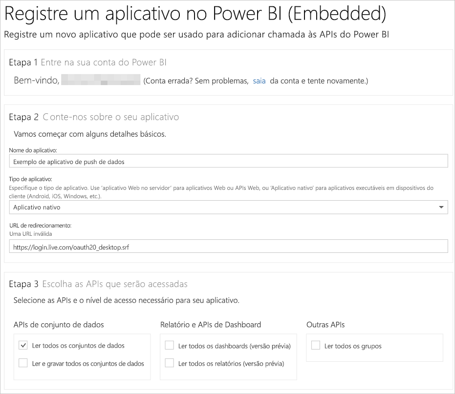

# Etapa 1: Registrar um aplicativo com o Azure AD

Este artigo faz parte do passo a passo para [enviar dados por push a um conjunto de dados](walkthrough-push-data.md).

A primeira etapa para enviar dados por push a um conjunto de dados do Power BI é registrar seu aplicativo no Azure AD. Você precisa fazer isso primeiro para que tenha uma **ID do Cliente** que identifique seu aplicativo no Azure AD. Sem uma **ID do Cliente**, o Azure AD não pode autenticar seu aplicativo.

> **OBSERVAÇÃO**: antes de registrar um aplicativo para o Power BI, é necessário [Inscrever-se no Power BI](create-an-azure-active-directory-tenant.md).

Estas são as etapas para registrar um aplicativo no Azure AD.

## Registrar um aplicativo no Azure AD

1. Vá para dev.powerbi.com/apps.
2. Clique em **Entre com sua conta existente**e entre em sua conta do Power BI.
3. Insira um **Nome do Aplicativo** , como "Aplicativo de envio de dados de exemplo por push".
4. Em **Tipo de Aplicativo**, escolha **Aplicativo nativo**.
5. Insira uma **URL de Redirecionamento**, como **https://login.live.com/oauth20_desktop.srf**. Para um **Aplicativo cliente nativo**, um URI de redirecionamento dá ao **Azure AD** mais detalhes sobre aplicativo específico que ele autenticará. O URI padrão para um aplicativo cliente é https://login.live.com/oauth20_desktop.srf.
6. Em **Escolher APIs para acessar**, escolha **Ler e Gravar todos os Conjuntos de Dados**. Para ver todas as permissões ao aplicativo do Power BI, confira [Permissões do Power BI](power-bi-permissions.md).
7. Clique em **Registrar aplicativo**e salve a **ID do Cliente** que foi gerada. Uma **ID do Cliente** identifica o aplicativo no Azure AD.

Sua página **Registrar um Aplicativo para o Power BI** deve ser semelhante a esta:

A próxima etapa mostra como [obter um token de acesso de autenticação](walkthrough-push-data-get-token.md).

[Próxima etapa >](walkthrough-push-data-get-token.md)

## Próximas etapas

[Inscrever-se no Power BI](create-an-azure-active-directory-tenant.md)  
[Obter um token de acesso de autenticação](walkthrough-push-data-get-token.md)  
[Instruções passo a passo: enviar dados por push a um conjunto de dados](walkthrough-push-data.md)  
[Registrar um aplicativo](register-app.md)  
[Visão geral da API REST do Power BI](overview-of-power-bi-rest-api.md)  

Mais perguntas? [Experimente perguntar à Comunidade do Power BI](http://community.powerbi.com/)