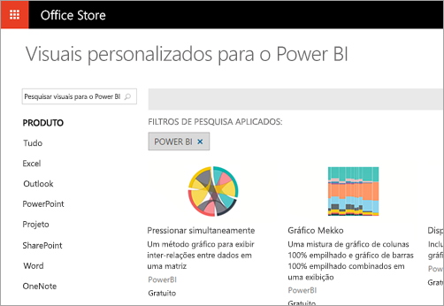
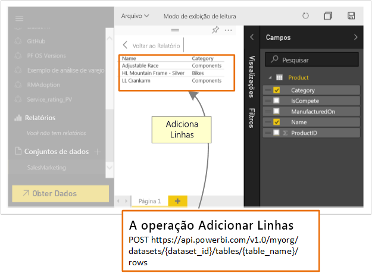

# O que os desenvolvedores podem fazer com o Power BI?

Os desenvolvedores têm diferentes opções ao tentar incluir o conteúdo do Power BI em aplicativos. Como desenvolvedor, você pode usar opções que incluem **inserção com o Power BI**, **elementos visuais personalizados** e **envio de dados por push para o Power BI**.

## Inserção de conteúdo do Power BI

O serviço do Power BI (SaaS) e o serviço do Power BI Embedded no Azure (PaaS) têm APIs para inserir seus painéis e seus relatórios. Esse recurso significa que você pode acessar os recursos mais recentes do Power BI, tais como dashboards, gateways e workspaces de aplicativo, ao inserir seu conteúdo.

É possível acessar a [Ferramenta de configuração de inserção](https://aka.ms/embedsetup) para começar rapidamente e baixar um aplicativo de exemplo.

Escolha a solução certa para você:

* A [inserção para clientes](embedding.md#embedding-for-your-customers) fornece a capacidade de inserir os dashboards e relatórios para usuários que não têm uma conta do Power BI. Execute a solução [Inserir para clientes](https://aka.ms/embedsetup/AppOwnsData).

* A [inserção para a organização](embedding.md#embedding-for-your-organization) permite que você estenda o serviço do Power BI. Execute a solução [Inserir para a organização](https://aka.ms/embedsetup/UserOwnsData).

Para saber mais sobre inserção com o Power BI, consulte [Inserção com o Power BI](embedding.md).

## Desenvolvimento de elementos visuais personalizados

Você pode usar elementos visuais personalizados com o Power BI para criar um tipo exclusivo de visual que seja adequado para você ou sua empresa. Muitas vezes, esses elementos visuais personalizados são criados por desenvolvedores. Eles são criados quando a variedade de elementos visuais inclusos com o Power BI não atende às suas necessidades.

Os elementos visuais personalizados permitem que você crie seus elementos visuais para uso em relatórios do Power BI. Os visuais personalizados são gravados em TypeScript, que é um superconjunto de JavaScript. O TypeScript oferece suporte a alguns recursos avançados e acesso antecipado à funcionalidade do ES6/ES7. A aplicação de estilo do visual é realizada usando CSS (folhas de estilos em cascata). Para facilitar, usamos o pré-compilador Less que é compatível com alguns recursos avançados, como aninhamento, variáveis, condições, loops e outros recursos. Se não quiser usar esses recursos, escreva o CSS simples no arquivo LESS.

Para começar a aprender mais sobre o desenvolvimento de elementos visuais personalizados, consulte [Usar ferramentas de desenvolvedor para criar elementos visuais personalizados](../service-custom-visuals-getting-started-with-developer-tools.md).

## Uso da automação de API

O Power BI exibe painéis interativos e que podem ser criados e atualizados por meio de várias fontes de dados diferentes em tempo real. Ao usar qualquer linguagem de programação que dá suporte a chamadas REST, você pode criar aplicativos que se integram a um dashboard do Power BI em tempo real. Você também pode integrar blocos do Power BI e relatórios a aplicativos.

Os desenvolvedores também podem criar suas próprias visualizações de dados, que podem ser usadas em dashboards e relatórios interativos.

Para ver algumas das coisas que você pode fazer com as APIs do Power BI, consulte [O que um desenvolvedor pode fazer com as APIs do Power BI](overview-of-power-bi-rest-api.md)?

## Próximas etapas

[Inserindo com o Power BI](embedding.md)  

[Desenvolvimento de um visual personalizado do Power BI](https://microsoft.github.io/PowerBI-visuals/docs/step-by-step-lab/developing-a-power-bi-custom-visual/)

[O que os desenvolvedores podem fazer com a API do Power BI?](overview-of-power-bi-rest-api.md)

[Central de Desenvolvedores do Power BI](https://powerbi.microsoft.com/developers/)