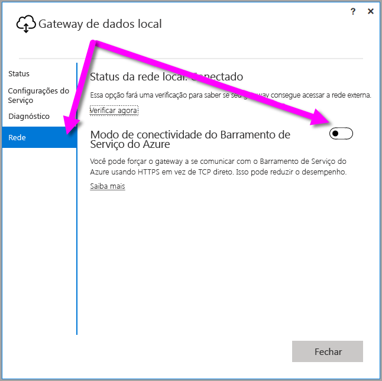
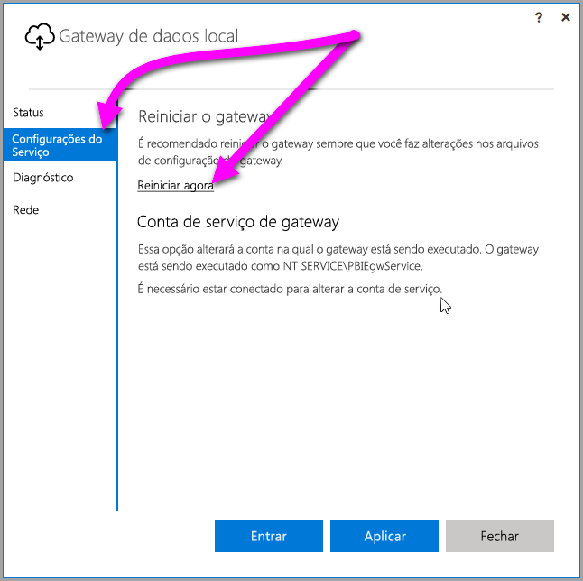

## <a name="sign-in-account"></a>Conta de entrada

Os usuários entram com uma conta corporativa ou de estudante. Essa conta é **de sua organização**. Se você se inscreveu para uma oferta do Office 365 e não forneceu seu email de trabalho real, ela poderá ser semelhante a nancy@contoso.onmicrosoft.com. Sua conta é armazenada em um locatário no AAD (Azure Active Directory). Na maioria dos casos, o UPN de sua conta do AAD corresponderá ao endereço de email.

## <a name="windows-service-account"></a>Conta do Serviço Windows

O Gateway de dados local está configurado para usar *NT SERVICE\PBIEgwService* como credencial de logon do serviço Windows. Por padrão, ele tem o direito de fazer logon como um serviço, no contexto do computador no qual você está instalando o gateway. A conta não é a mesma conta usada para se conectar a fontes de dados locais. A conta também não é corporativa nem de estudante com a qual você entra nos serviços de nuvem.

> [!NOTE]
> Se você selecionou o modo pessoal, a conta do serviço Windows será configurada separadamente.

Caso encontre problemas de autenticação com seu servidor proxy, experimente alterar a conta do serviço Windows para um usuário de domínio ou conta de serviço gerenciado. Para obter mais informações, consulte [configuração de proxy](../service-gateway-proxy.md#changing-the-gateway-service-account-to-a-domain-user).

## <a name="ports"></a>Portas

O gateway cria uma conexão de saída para o Barramento de Serviço do Azure. Ele se comunica nas portas de saída: TCP 443 (padrão), 5671, 5672 e 9350 até 9354.  O gateway não requer portas de entrada.

É recomendável colocar os endereços IP no seu firewall, para sua região de dados, na lista de permissões. É possível baixar a [lista de IPs de data centers do Microsoft Azure](https://www.microsoft.com/download/details.aspx?id=41653), que é atualizada semanalmente. O gateway se comunicará com o Barramento de Serviço do Azure usando o endereço IP junto com o nome de domínio totalmente qualificado (FQDN). Se você estiver forçando o gateway a se comunicar usando HTTPS, ele usará apenas o FQDN de forma exclusiva e nenhuma comunicação acontecerá usando endereços IP.

> [!NOTE]
> Os Endereços IP listados na lista de IP do Data Center do Azure estão na notação CIDR. Por exemplo, 10.0.0.0/24 não significa 10.0.0.0 até 10.0.0.24. Saiba mais sobre a [notação CIDR](http://whatismyipaddress.com/cidr).

Esta é uma lista dos nomes de domínio totalmente qualificados usados pelo gateway.

| Nomes de domínio | Portas de saída | Descrição |
| --- | --- | --- |
| *.download.microsoft.com |80 |HTTP usado para baixar o instalador. |
| *.powerbi.com |443 |HTTPS |
| *.analysis.windows.net |443 |HTTPS |
| *.login.windows.net |443 |HTTPS |
| *.servicebus.windows.net |5671-5672 |Advanced Message Queuing Protocol (AMQP) |
| *.servicebus.windows.net |443, 9350-9354 |Ouvintes na Retransmissão do Barramento de Serviço por TCP (requer 443 para aquisição de token de Controle de Acesso) |
| *.frontend.clouddatahub.net |443 |HTTPS |
| *.core.windows.net |443 |HTTPS |
| login.microsoftonline.com |443 |HTTPS |
| *.msftncsi.com |443 |Usado para testar a conectividade com a Internet se o gateway não estiver acessível pelo serviço do Power BI. |
| *.microsoftonline-p.com |443 |Usado para autenticação, dependendo da configuração. |

> [!NOTE]
> O tráfego direcionado para visualstudio.com ou visualstudioonline.com é para o App Insights e não é necessário para que o gateway funcione.

## <a name="forcing-https-communication-with-azure-service-bus"></a>Forçar a comunicação HTTPS com o Barramento de Serviço do Azure

Você pode forçar o gateway a se comunicar com o Barramento de Serviço do Azure usando HTTPS em vez de TCP direto. usar HTTPS pode ter um impacto no desempenho. Para fazer isso, modifique o arquivo *Microsoft.PowerBI.DataMovement.Pipeline.GatewayCore.dll.config*, alterando o valor de `AutoDetect` para `Https`, conforme mostrado no snippet de código logo após este parágrafo. Este arquivo está localizado (por padrão) em *C:\Arquivos de Programas\Gateway de dados local*.

```xml
<setting name="ServiceBusSystemConnectivityModeString" serializeAs="String">
    <value>Https</value>
</setting>
```

O valor do parâmetro *ServiceBusSystemConnectivityModeString* diferencia maiúsculas de minúsculas. Os valores válidos são *AutoDetect* e *Https*.

Como alternativa, é possível forçar o gateway a adotar esse comportamento usando a interface do usuário do gateway. Na interface do usuário do gateway, selecione **Rede** e mude o **Modo de conectividade do Barramento de Serviço do Azure** para **Ativado**.



Depois de alterado, ao selecionar **Aplicar** (um botão que aparece somente quando você faz uma alteração), o *gateway do serviço Windows* será reiniciado automaticamente para que as alterações tenham efeito.

Para referência futura, você pode reiniciar o *gateway do serviço Windows* na caixa de diálogo de interface do usuário, selecionando **Configurações de serviço** e, em seguida, *Reiniciar agora*.



## <a name="support-for-tls-12"></a>Suporte para TLS 1.2

Por padrão, o gateway de dados local usa o protocolo TLS 1.2 para se comunicar com o serviço do Power BI. Para garantir que todo o tráfego de gateway use o TLS 1.2, pode ser preciso adicionar ou modificar as seguintes chaves do Registro no computador que esteja executando o serviço de gateway:

```
[HKEY_LOCAL_MACHINE\SOFTWARE\Microsoft\.NETFramework\v4.0.30319]"SchUseStrongCrypto"=dword:00000001
[HKEY_LOCAL_MACHINE\SOFTWARE\Wow6432Node\Microsoft\.NETFramework\v4.0.30319]"SchUseStrongCrypto"=dword:00000001
```

> [!NOTE]
> A adição ou modificação dessas chaves do Registro aplica a alteração a todos os aplicativos .NET. Para obter informações sobre as alterações no registro que afetam o TLS em outros aplicativos, consulte [Transport Layer Security (TLS) registry settings](https://docs.microsoft.com/windows-server/security/tls/tls-registry-settings) (Configurações de registro do protocolo TLS).

## <a name="how-to-restart-the-gateway"></a>Como reiniciar o gateway

O gateway é executado como um serviço Windows. É possível iniciar e pará-lo como qualquer serviço Windows. Veja abaixo como é possível fazer isso no prompt de comando.

1. No computador em que o gateway está em execução, inicie um prompt de comando do administrador.
2. Use o seguinte comando para interromper o serviço.
   
   net stop PBIEgwService
3. Use o seguinte comando para iniciar o serviço.
   
   net start PBIEgwService

