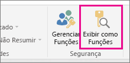
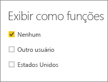
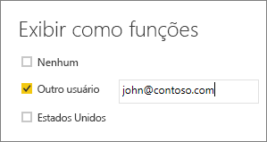

## Validar as funções dentro do Power BI Desktop
Depois de criar sua função, você poderá testar os resultados da função no Power BI Desktop.

1. Selecione  **Exibir como Funções**. 

    

    Em **Exibir como funções**, você pode ver as funções que criou.

    

3. Selecione uma função que você criou > **OK**  para aplicar essa função. Os relatórios renderizam somente os dados relevantes para essa função. 

4. Você também pode selecionar **Outro usuário** e fornecer um determinado usuário. É melhor fornecer o nome UPN, é ele que será usado pelo serviço do Power BI e pelo Servidor de Relatórios do Power BI.

    

1. Selecione  **OK**  e os relatórios serão renderizados com base no que esse usuário pode ver. 

No Power BI Desktop, a opção **Outro usuário** somente exibirá resultados diferentes se você estiver usando a segurança dinâmica com base em expressões DAX. 

