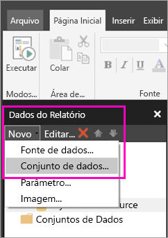
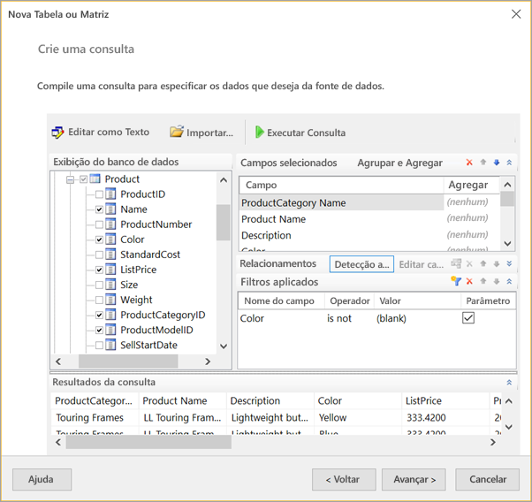
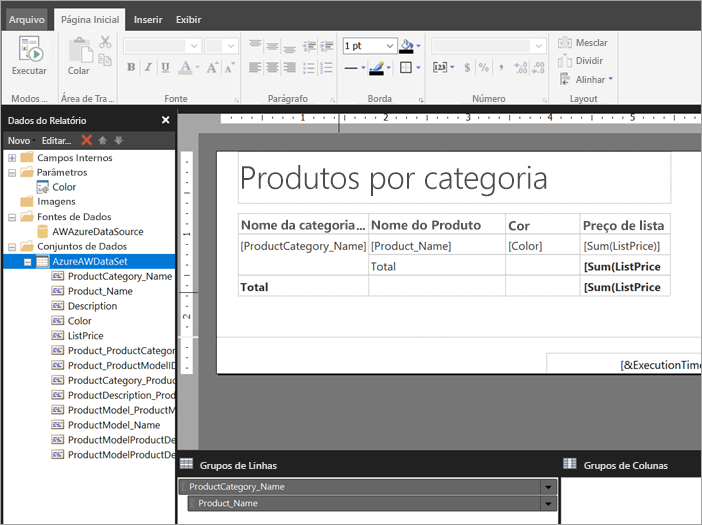

# Criar um conjunto de dados inseridos para um relatório paginado no serviço do Power BI (versão prévia)

Neste artigo, você aprenderá como criar um conjunto de dados inserido, com base em uma fonte de dados inseridos para um relatório paginado no serviço do Power BI. Os conjuntos de dados inseridos estão contidos em um único relatório paginado, para uso nesse relatório. Atualmente, os relatórios paginados publicados no serviço do Power BI precisam de conjuntos de dados e fontes de dados inseridos. Você criar o conjunto de dados e fonte de dados inserida no construtor de relatórios do Power BI, enquanto você estiver criando o relatório. 

Antes de criar o conjunto de dados, você precisará criar uma fonte de dados. Confira [Fontes de dados inseridos para relatórios paginados no serviço do Power BI](paginated-reports-embedded-data-source.md) para saber mais.
  
## Criar um conjunto de dados incorporados
  
1. No painel de dados de relatório no construtor de relatórios do Power BI, selecione **New** > **conjunto de dados**.

1. Na guia **Consulta** da caixa de diálogo **Propriedades do Conjunto de Dados**, nomeie o conjunto de dados. A fonte de dados inserida já está na caixa **Fonte de Dados** ou você pode selecionar **Novo** para criar uma fonte de dados inseridos diferente.
 
     

3. Em **Tipo de consulta**, selecione o tipo de comando ou uma consulta para usar para o conjunto de dados. 
    - **Texto** executa uma consulta para recuperar dados do banco de dados. Ele é o padrão e é usado para a maioria das consultas. Digite uma consulta ou importe uma consulta preexistente, selecionando **Importar**. Para criar a consulta graficamente, marque **Designer de Consultas**. Se você usar o designer de consultas para criar uma consulta, o texto da consulta será exibido nessa caixa. Selecione o botão **Expressão** (**fx**) para usar uma expressão para gerar dinamicamente a consulta. 
    - **Tabela** seleciona todos os campos dentro de uma tabela. Insira o nome da tabela que você deseja usar como um conjunto de dados.
    - **Procedimento armazenado** executa um procedimento armazenado pelo nome.

4. No Designer de Consultas, você pode ver e interagir com as tabelas e os campos no conjunto de dados, importar uma consulta ou editar como texto. Você também pode adicionar filtros e parâmetros aqui. 

    

5. No Designer de Consultas, selecione **Executar Consulta** para testá-lo e selecione **OK**.

1. De volta na caixa de diálogo Propriedades do Conjunto de Dados, a caixa **Atingir tempo limite (em segundos)** , digite o número de segundos até que a consulta expire. O padrão é 30 segundos. O valor para **Atingir tempo limite** deve ser vazio ou maior que zero. Se ele estiver vazio, a consulta não terá tempo limite.

7.  Você pode definir outras propriedades para o conjunto de dados nas outras guias:
    - Criar campos calculados na guia **Campos**.
    - Definir opções avançadas na guia **Opções**.
    - Adicionar ou atualizar **Filtros** e **Parâmetros** em suas respectivas guias.

8. Selecione **OK**
 
   O relatório é aberto no modo de exibição de Design de Relatório. A fonte de dados, o conjunto de dados e a coleção de campos do conjunto de dados aparecem no painel Dados do Relatório, e você pode continuar a criar seu relatório paginado.  

     
 
## Próximas etapas 

- [O que são os relatórios paginados no Power BI Premium? (versão prévia)](paginated-reports-report-builder-power-bi.md)  
- [Tutorial: Criar um relatório paginado e carregá-lo no serviço do Power BI](paginated-reports-quickstart-aw.md)
- [Publicar um relatório paginado no serviço do Power BI](paginated-reports-save-to-power-bi-service.md)

