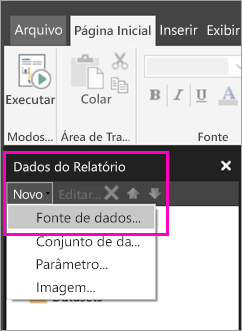

# Criar uma fonte de dados incorporada para relatórios paginados no serviço do Power BI

Neste artigo, você aprenderá como criar e modificar uma fonte de dados incorporada para um relatório paginado no serviço do Power BI. Você define uma fonte de dados incorporada em um único relatório e a usa somente nesse relatório. Atualmente, os relatórios paginados publicados no serviço do Power BI precisam de conjuntos de dados e fontes de dados incorporadas. Eles podem se conectar às seguintes fontes de dados:

- Banco de Dados SQL do Azure e SQL Data Warehouse do Azure
- SQL Server
- SQL Server Analysis Services
- Oracle 
- Teradata 

Para as seguintes fontes de dados, use a opção [Conexão do SQL Server Analysis Services](service-premium-connect-tools.md):

- Azure Analysis Services
- Conjuntos de dados do Power BI Premium

Os relatórios paginados se conectam a fontes de dados locais por meio de um [gateway do Power BI](service-gateway-getting-started.md). Você configura o gateway após publicar o relatório no serviço do Power BI.

Confira [Dados de relatório no Construtor de Relatórios do Power BI](report-builder-data.md) para obter mais informações.

## Criar uma fonte de dados incorporados
  
1. Abra o Construtor de Relatórios do Power BI.

1. Na barra de ferramentas do painel Dados do Relatório, selecione **Novo** > **Fonte de Dados**. A caixa de diálogo **Propriedades da Fonte de Dados** é aberta.

    
  
2.  Na caixa de texto **Nome**, digite um nome para a fonte de dados ou aceite o padrão.  
  
3.  Selecione **Usar uma conexão inserida no meu relatório**.  
  
1.  Na lista **Selecionar tipo de conexão**, selecione um tipo de fonte de dados. 

1.  Especifique uma cadeia de conexão usando um dos seguintes métodos:  
  
    -   Digite a cadeia de conexão diretamente na caixa de texto **Cadeia de Conexão**. 
  
    -   Selecione o botão de expressões (**fx)** para criar uma expressão que seja avaliada como uma cadeia de conexão. Na caixa de diálogo **Expressão**, digite a expressão no painel Expressão. Selecione **OK**. 
  
    -   Selecione **Compilar** para abrir a caixa de diálogo **Propriedades de Conexão** para a fonte de dados escolhida na etapa 2.  
  
        Preencha os campos na caixa de diálogo **Propriedades de Conexão** conforme apropriado para o tipo de fonte de dados. As propriedades da conexão incluem o tipo de fonte de dados, o nome da fonte de dados e as credenciais a serem usadas. Depois de especificar valores nessa caixa de diálogo, selecione **Testar Conectividade** para verificar se a fonte de dados está disponível e se as credenciais especificadas estão corretas.  
  
4.  Selecione **Credenciais**.  
  
     Especifique as credenciais a serem usadas para essa fonte de dados. O proprietário da fonte de dados escolhe o tipo de credenciais que têm suporte. Para obter mais informações, confira [Especificar informações de credenciais e conexões para fontes de dados de relatório](https://docs.microsoft.com/sql/reporting-services/report-data/specify-credential-and-connection-information-for-report-data-sources).
  
5.  Selecione **OK**.  
  
     A fonte de dados é exibida no painel Dados do Relatório.  

## Próximas etapas

- [Criar um conjunto de dados inseridos para um relatório paginado no serviço do Power BI](paginated-reports-create-embedded-dataset.md)
- [O que são os relatórios paginados no Power BI Premium?](paginated-reports-report-builder-power-bi.md)
