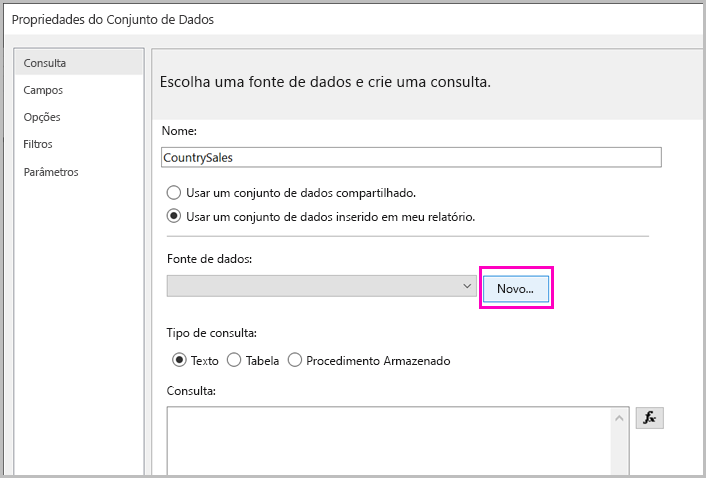
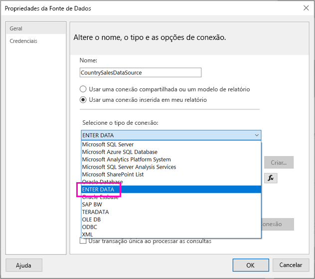
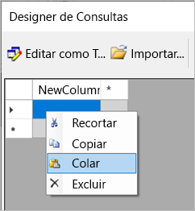
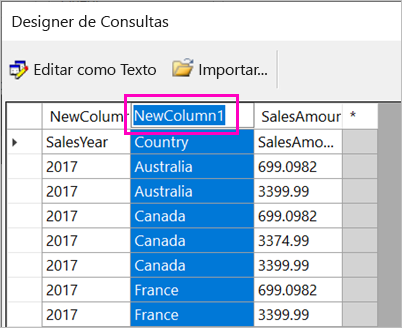
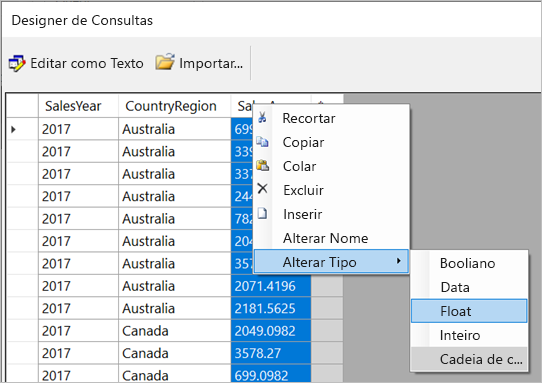
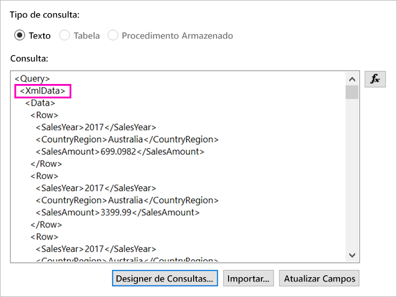
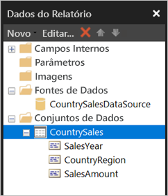

# <a name="enter-data-directly-in-a-paginated-report-in-report-builder-preview---power-bi"></a>Inserir dados diretamente em um relatório paginado no Construtor de Relatórios (versão prévia) – Power BI

Neste artigo, você aprenderá sobre um recurso na nova versão do SQL Server 2016 do Construtor de Relatórios que permite inserir dados diretamente em um relatório de RDL como um conjunto de dados inserido.  Esse recurso é semelhante ao Power BI Desktop. Você pode digitar os dados diretamente em um conjunto de dados em seu relatório ou colá-los de outro programa, como o Microsoft Excel. Depois de criar um conjunto de dados inserindo dados, você pode usá-lo exatamente como faria com qualquer outro conjunto de dados inserido que você criou. Além disso, você pode adicionar mais de uma tabela e usá-la como um filtro para as outras. Esse recurso é especialmente útil para conjuntos de dados de pequenos e estáticos que talvez você precise usar em seu relatório, como parâmetros de relatório.
 
## <a name="prerequisites"></a>Pré-requisitos

- Para inserir dados diretamente em um relatório paginado, instale a nova versão do [Construtor de Relatórios do Centro de Download da Microsoft](https://www.microsoft.com/download/details.aspx?id=53613). 
- Para salvar seu relatório paginado no serviço do Power BI, você precisa de uma [conta do Power BI Pro](service-self-service-signup-for-power-bi.md) e acesso de gravação a um workspace em uma [capacidade do Power BI Premium](service-premium.md).
- Para salvar seu relatório paginado em um servidor de relatório, você precisa de permissões para [editar o arquivo RsReportServer.config](#upload-the-paginated-report-to-a-report-server).

## <a name="get-started"></a>Começar

Depois de baixar e instalar o Construtor de Relatórios, siga o mesmo fluxo de trabalho que você usa para adicionar uma fonte de dados inserida e o conjunto de dados ao seu relatório. No procedimento a seguir, em **Fontes de Dados**, há uma nova opção: **Inserir Dados**.  Você precisa configurar essa fonte de dados apenas uma vez em um relatório. Depois disso, você pode criar várias tabelas de dados inseridos como conjuntos de dados separados, tudo usando essa fonte de dados única.

1. No painel **Dados do Relatório**, selecione **Novo** > **Conjunto de Dados**.

    

1. Na caixa de diálogo **Propriedades do Conjunto de Dados**, selecione **Usar um conjunto de dados inserido em meu relatório**.

1. Ao lado de **Fonte de dados**, selecione **Novo**.

    

1. Na caixa de diálogo **Propriedades da Fonte de Dados**, selecione **Usar uma conexão inserida no meu relatório**.
2. Na caixa **Selecionar tipo de conexão**, selecione **INSERIR DADOS** > **OK**.

    

1. De volta à caixa de diálogo **Propriedades do Conjunto de Dados**, selecione **Designer de Consultas**.
2. No painel **Designer de Consulta**, clique com o botão direito do mouse e cole seus dados na tabela.

    

1. Para definir os nomes de coluna, clique duas vezes em cada **NewColumn** e digite o nome da coluna.

    

1. Se a primeira linha contiver cabeçalhos de coluna dos dados originais, clique com o botão direito do mouse nela e exclua-a.
    
9. Por padrão, o tipo de dados para cada coluna é a Cadeia de Caracteres. Para alterar o tipo de dados, clique com o botão direito do mouse no cabeçalho da coluna > **Alterar Tipo** e defina-o como outro tipo de dados, como Data ou Float.

    

1. Quando você terminar de criar a tabela, selecione **OK**.  

    A consulta gerada é a mesmo que você veria com uma fonte de dados XML. Nos bastidores, estamos usando XML como o provedor de dados.  Podemos ter remodelado-o para habilitar esse cenário também.

    

12. Na caixa de diálogo **Propriedades do Conjunto de Dados**, selecione **OK**.

13. Você verá sua fonte de dados e o conjunto de dados no painel **Relatório de Dados**.

    

Você pode usar o conjunto de dados como a base para visualizações de dados em seu relatório. Você também pode adicionar outro conjunto de dados e usar a mesma fonte de dados para ele.

## <a name="upload-the-paginated-report-to-the-power-bi-service"></a>Carregar um relatório paginado para o serviço do Power BI

Agora que há suporte para relatórios paginados no serviço do Power BI em versão prévia, você pode carregar seu relatório paginado para uma capacidade Premium. Veja [Carregar um relatório paginado](paginated-reports-save-to-power-bi-service.md#upload-a-paginated-report) para obter detalhes.

## <a name="upload-the-paginated-report-to-a-report-server"></a>Carregar o relatório paginado para um servidor de relatório

Você também pode carregar seu relatório paginado para um Servidor de Relatórios do Power BI ou o servidor de relatório SQL Server Reporting Services 2016 ou 2017. Antes de fazer isso, é preciso adicionar o item a seguir ao seu RsReportServer.config como uma extensão de dados adicionais. Faça backup do arquivo RsReportServer.config antes de fazer a alteração, caso encontre qualquer problema.

```xml
<Extension Name="ENTERDATA" Type="Microsoft.ReportingServices.DataExtensions.XmlDPConnection,Microsoft.ReportingServices.DataExtensions">
    <Configuration>
        <ConfigName>ENTERDATA</ConfigName>
    </Configuration>
</Extension>
```

Depois de editá-lo, é assim que a lista de provedores de dados no arquivo de configuração deve ser:


Isso é tudo. Agora você pode publicar relatórios que usam essa nova funcionalidade no seu servidor de relatório.

## <a name="next-steps"></a>Próximas etapas

- [O que são os relatórios paginados no Power BI Premium? (versão prévia)](paginated-reports-report-builder-power-bi.md)
- [O que é o Servidor de Relatórios do Power BI?](report-server/get-started.md)
