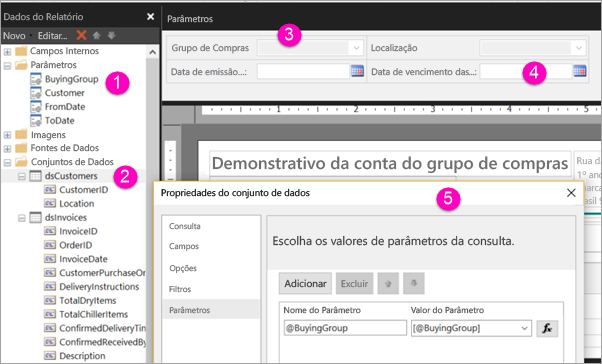

# Criar parâmetros para relatórios paginados no serviço do Power BI (versão prévia)

Neste artigo, você aprenderá a criar parâmetros de relatórios paginados no serviço do Power BI.  Um parâmetro de relatório fornece uma maneira de escolher dados do relatório e variar a apresentação do relatório. Você pode fornecer um valor padrão e uma lista de valores disponíveis, e os leitores do relatório podem alterar a seleção.  

A ilustração a seguir mostra o modo de exibição de Design no Construtor de Relatórios para um relatório com os parâmetros @BuyingGroup, @Customer, @FromDate e @ToDate. 
  

  
1.  Os parâmetros do relatório no painel Dados do Relatório.  
  
2.  A tabela com um dos parâmetros no conjunto de dados.  
  
3.  O painel Parâmetros. Você pode personalizar o layout dos parâmetros no painel de parâmetros. 
  
4.  Os parâmetros @FromDate e @ToDate têm o tipo de dados **DateTime**. Ao exibir o relatório, você pode digitar uma data na caixa de texto ou escolher uma data no controle de calendário. 

5.  Um dos parâmetros na caixa de diálogo **Propriedades do Conjunto de Dados**.  

  
## Criar ou editar um parâmetro de relatório  
  
1.  Abra seu relatório paginado no Construtor de Relatórios.

1. No painel **​​Dados do Relatório**, clique com o botão direito do mouse no nó **Parâmetros**> **Adicionar Parâmetro**. A caixa de diálogo **Propriedades de Parâmetros do Relatório** é aberta.  
  
2.  Em **Nome**, digite um nome para o parâmetro ou aceite o nome padrão.  
  
3.  Em **Prompt**, digite o texto a ser exibido ao lado da caixa de texto do parâmetro quando o usuário executar o relatório.  
  
4.  Em **Tipo de dados**, selecione o tipo de dados para o valor do parâmetro.  
  
5.  Se o parâmetro puder conter um valor em branco, selecione **Permitir valor em branco**.  
  
6.  Se o parâmetro puder conter um valor nulo, selecione **Permitir valor nulo**.  
  
7.  Para permitir que um usuário selecione mais de um valor para o parâmetro, selecione **Permitir vários valores**.  
  
8.  Defina a opção de visibilidade.  
  
    -   Para mostrar o parâmetro na barra de ferramentas na parte superior do relatório, selecione **Visível**.  
  
    -   Para ocultar o parâmetro para que ele não seja exibido na barra de ferramentas, selecione **Oculto**.  
  
    -   Para ocultar o parâmetro e protegê-lo contra alterações no servidor de relatório após a publicação do relatório, selecione **Interno**. O parâmetro de relatório só pode ser exibido na definição de relatório. Para esta opção, você deve definir um valor padrão ou permitir que o parâmetro aceite um valor nulo.  
  
9. Selecione **OK**. 
  
## Próximas etapas

Veja [Exibir parâmetros para relatórios paginados ](paginated-reports-view-parameters.md) para conferir como os parâmetros são exibidos no serviço do Power BI.

Para obter informações detalhadas sobre parâmetros em relatórios paginados, confira o artigo [Parâmetros de relatório (Construtor de Relatórios e Designer de Relatórios)](https://docs.microsoft.com/sql/reporting-services/report-design/report-parameters-report-builder-and-report-designer) na documentação do SQL Server Reporting Services  
