# Tutorial: Criar um relatório paginado e carregá-lo no serviço do Power BI

Neste tutorial, você se conecta a um banco de dados do SQL do Azure de exemplo. Em seguida, use um assistente no Construtor de Relatórios para criar um relatório paginado com uma tabela que encapsula para várias páginas. Em seguida, carregue o relatório paginado em um espaço de trabalho em uma capacidade Premium no serviço do Power BI. Os relatórios paginados no serviço do Power BI estão no momento em versão prévia.

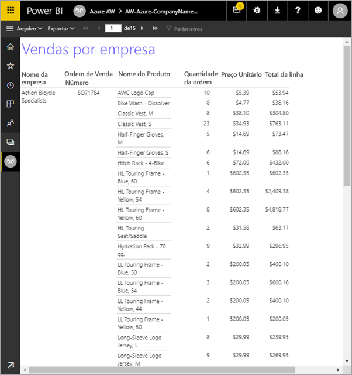

Aqui estão as etapas que você deverá concluir este tutorial:

> [!div class="checklist"]
> * Crie um banco de dados de exemplo do Azure.
> * Crie uma matriz no Construtor de Relatórios com a ajuda de um assistente.
> * Formate o relatório com o título, os números de página e os títulos de coluna em cada página.
> * Formate a moeda.
> * Carregue o relatório no serviço do Power BI.

Se você não tiver uma assinatura do Azure, crie uma [conta gratuita](https://azure.microsoft.com/free/?WT.mc_id=A261C142F) antes de começar.
 
## Pré-requisitos  

Aqui estão os pré-requisitos para criar o relatório paginado:

- Instale o [Construtor de Relatórios no Centro de Download da Microsoft](http://go.microsoft.com/fwlink/?LinkID=734968). 

- Siga o guia de início rápido [Criar um exemplo de banco de dados SQL do Azure no portal do Azure](https://docs.microsoft.com/azure/sql-database/sql-database-get-started-portal). Copie e salve o valor na caixa **Nome do servidor** na guia **Visão geral**. Lembre-se do nome de usuário e da senha que você criou no Azure.

Aqui estão os pré-requisitos para carregar seu relatório paginado no serviço do Power BI:

- Você precisa de uma [licença do Power BI Pro](service-admin-power-bi-pro-in-your-organization.md).
- Você precisa de um espaço de trabalho de aplicativo no serviço em uma [capacidade do Power BI Premium](service-premium.md). Ele tem um ícone de losango  ao lado do nome do espaço de trabalho.

## Criar a matriz com um assistente
  
1.  Inicie o Construtor de Relatórios no computador.  
  
     A caixa de diálogo **Guia de Introdução** é aberta.  
  
     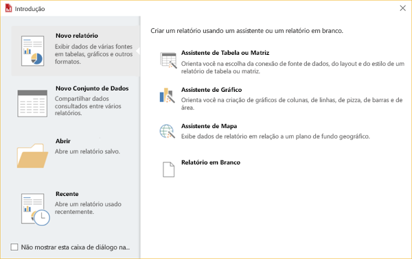
  
1.  No painel esquerdo, verifique se **Novo Relatório** está selecionado e, no painel direito, selecione **Assistente de Tabela ou Matriz**.  
  
4.  Na página **Escolher um conjunto de dados**, selecione **Criar um conjunto de dados** > **Avançar**.  

    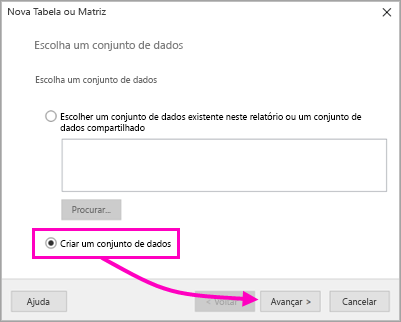
  
5.  Na página **Escolha uma conexão com uma fonte de dados**, selecione **Nova**. 

    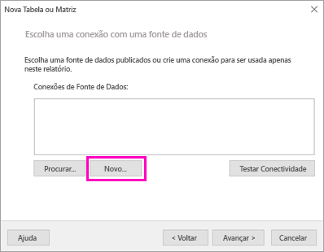
  
     A caixa de diálogo **Propriedades da Fonte de Dados** é aberta.  
  
6.  Você pode nomear uma fonte de dados como desejar, usando caracteres e sublinhados. Para este tutorial, na caixa **Nome**, digite **MyAzureDataSource**.  
  
7.  Na caixa **Selecionar tipo de conexão**, selecione **Banco de Dados SQL do Microsoft Azure**.  
  
8.  Selecione **Compilar** ao lado da caixa **Cadeia de conexão**. 

    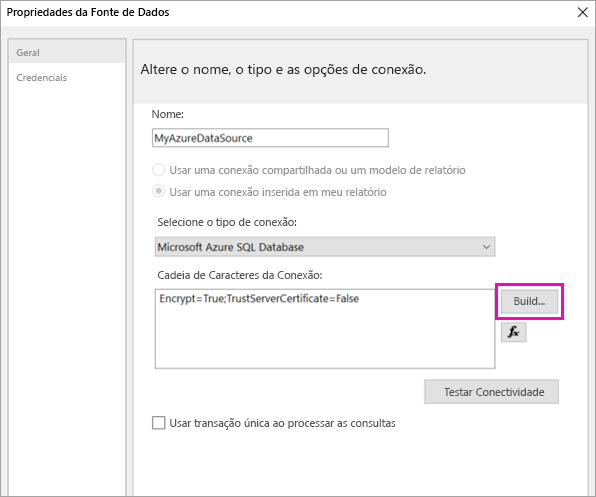

9. **No Azure:** volte para o portal do Azure e selecione **bancos de dados SQL**.

1. Selecione o banco de dados SQL do Azure criado no início rápido "Criar um exemplo de banco de dados SQL do Azure no portal do Azure" na seção **Pré-requisitos** deste artigo.

1. Na guia **Visão geral**, copie o valor na caixa **Nome do servidor**.

2. **No Construtor de Relatórios**: na caixa de diálogo **Propriedades de Conexão**, em **Nome do servidor**, cole o nome do servidor que você copiou. 

1. Para **Faça logon no servidor**, verifique se a opção **Usar a autenticação do SQL Server** está selecionada, digite o nome de usuário e a senha que você criou no Azure para o banco de dados de exemplo.

1. Em **Conectar-se a um banco de dados**, selecione a seta suspensa e selecione o nome do banco de dados que você criou no Azure.
 
    

1. Selecione **Testar Conexão**. Você vê a mensagem **Resultados de teste** informando **Teste de conexão bem-sucedido**.

1. Selecione **OK** > **OK**. 

   Agora na caixa **Cadeia de conexão**, o Construtor de Relatórios exibe a cadeia de conexão que você acabou de criar. 

    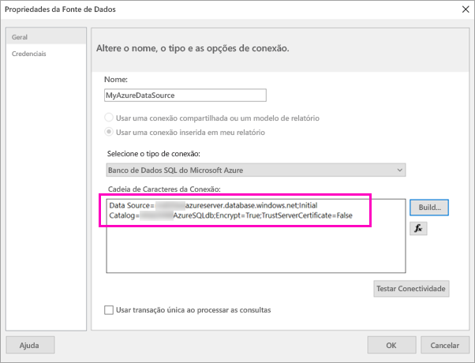

1. Selecione **OK**.
  
9. Na página **Escolha uma conexão com uma fonte de dados**, confira "(neste relatório)" na conexão de fonte de dados que você acabou de criar. Selecione essa fonte de dados > **Avançar**.  

    

10. Digite o mesmo nome de usuário e a mesma senha na caixa. 
  
10. Na página **Criar uma consulta**, expanda SalesLT, expanda Tabelas e selecione essas tabelas:

    - Endereço
    - Cliente
    - Produto
    - ProductCategory
    - SalesOrderDetail
    - SalesOrderHeader

     Como **Relacionamentos** > **Detecção automática** está selecionado, o Construtor de Relatórios detecta as relações entre essas tabelas. 
    
    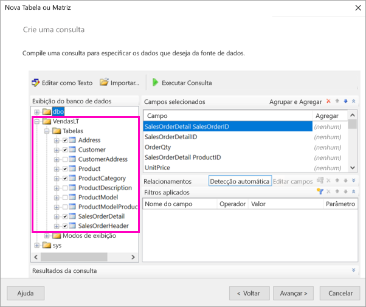
 
1.  Selecione **Executar Consulta**. O Construtor de Relatórios exibe os **Resultados da consulta**. 
 
     

18. Selecione **Avançar**. 

19. Na página **Escolher um conjunto de dados**, escolha o conjunto de dados que você acabou de criar > **Avançar**.

    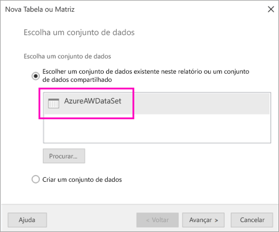

1. Na página **Organizar campos**, arraste esses campos da caixa **Campos disponíveis** para a caixa **Grupos de linhas**:

    - CompanyName
    - NúmeroDaOrdemDeVendas
    - Product_Name

1. Arraste estes campos da caixa **Campos disponíveis** para a caixa **Valores**:

    - OrderQty
    - UnitPrice
    - LineTotal

    O Construtor de Relatórios automaticamente fez a soma dos campos na caixa **Valores**.

    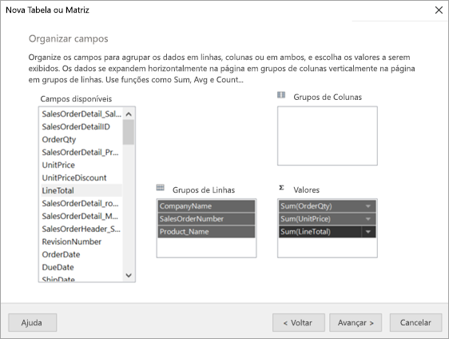

24. Na página **Escolher o layout**, mantenha todas as configurações padrão, mas desmarque **Expandir/recolher grupos**. Em geral, o recurso de expandir/recolher grupos é ótimo, mas desta vez você deseja que a tabela encapsule várias páginas.

1. Selecione **Avançar** > **Concluir**. A tabela é exibida na superfície de design.
 
## O que você criou

Façamos uma pausa por um momento para examinar os resultados do assistente.

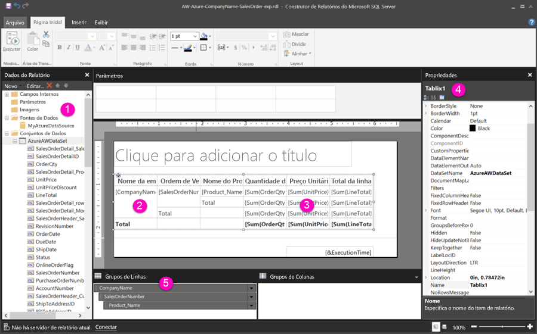

1. No painel Dados do Relatório, você verá a fonte de dados inseridos do Azure e o conjunto de dados inseridos baseados nele, que você criou. 

2. A superfície de design tem cerca de seis polegadas de largura. Na superfície de design, você vê a matriz exibindo títulos de coluna e valores de espaço reservado. A matriz tem seis colunas e parece ter apenas cinco linhas de altura. 

3. Quantidade do pedido, Preço unitário e Total de linhas são todas somas, e cada grupo de linhas tem um subtotal. 

    Você não vê os valores de dados reais. Você precisa executar o relatório para vê-los.

4. No painel Propriedades, a matriz selecionada é chamada de Tablix1. Um *tablix* no Construtor de Relatórios é uma região de dados que exibe dados em linhas e colunas. Ele pode ser uma tabela ou matriz.

5. No painel Agrupamento, você verá os três grupos de linhas que você criou no assistente: 

    - Nomedaempresa
    - Ordem de Venda
    - Nome do Produto

    Esta matriz não tem grupos de colunas.

### Executar o relatório

Para ver os valores reais, você precisará executar o relatório.

1. Selecione **Executar** na barra de ferramentas **Página inicial**.

   Agora você pode ver os valores. A matriz tem muito mais linhas do que você viu no modo de exibição de Design! Observou que o Construtor de Relatórios diz que é a página **1** de **2?**. O Construtor de Relatórios carrega o relatório o mais rápido possível, de modo que só recupera dados suficientes para algumas páginas por vez. O ponto de interrogação indica que o Construtor de Relatórios não carregou todos os dados ainda.

   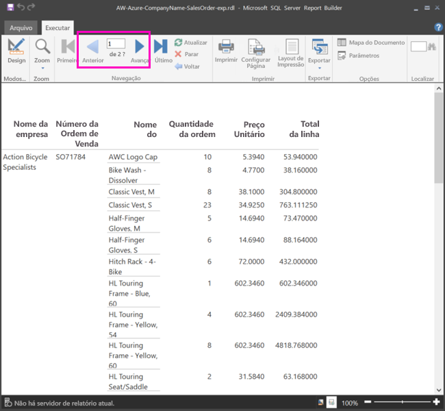

2. Selecione **Layout de impressão**. O relatório estará nesse formato quando for impresso. O Construtor de Relatórios agora sabe que o relatório tem 33 páginas e adicionou automaticamente um carimbo de data e hora no rodapé.

## Formatar o relatório

Agora você tem um relatório com uma matriz que o encapsula em 33 páginas. Vamos adicionar outros recursos e melhorar a aparência dele. Você pode executar o relatório após cada etapa, se quiser ver como ele está ficando.

- Na guia **Executar** da Faixa de Opções, selecione **Design**, para continuar a modificá-lo.  

### Definir a largura da página

Normalmente, um relatório paginado é formatado para imprimir e uma página típica tem 8 1/2 X 11 polegadas. 

1. Arraste a régua para que a superfície de design tenha sete polegadas de largura. As margens padrão têm 1 polegada em cada lado, então as margens laterais precisam ser mais estreitas.

1. Clique na área cinza ao redor da superfície de design para mostrar as propriedades **Relatório**.

    Se você não vir o painel Propriedades, clique na guia **Modo de exibição** > **Propriedades**.

2. Expanda **Margens** e altere **Esquerda** e **Direita** de 1 para 0,75 polegada. 

    
  
### Adicionar um título de relatório  

1. Selecione as palavras **Clique para adicionar título** na parte superior da página, em seguida, digite **Vendas por empresa**.  

2. Selecione o texto do título e, no painel Propriedades em **Fonte**, altere **Cor** para **Azul**.
  
### Adicionar um número da página

Você observou que o relatório tem um carimbo de data e hora no rodapé. Você também pode adicionar um número de página no rodapé.

1. Na parte inferior da superfície de design, você vê [&ExecutionTime] à direita no rodapé. 

2. No painel Dados do Relatório, expanda a pasta Campos Internos. Arraste **Número da Página** para o lado esquerdo do rodapé, na mesma altura que [& ExecutionTime].

3. Arraste o lado direito da caixa [&PageNumber] caixa para que ela fique quadrada.

4. Na guia **Inserir**, selecione **Caixa de texto**.

5. Clique à direita de [&PageNumber], digite "de" e marque o quadrado da caixa de texto.

6. Arraste **Total geral de páginas** para o rodapé, à direita de "de", em seguida, arraste o lado direito para que ele também fique quadrado.

    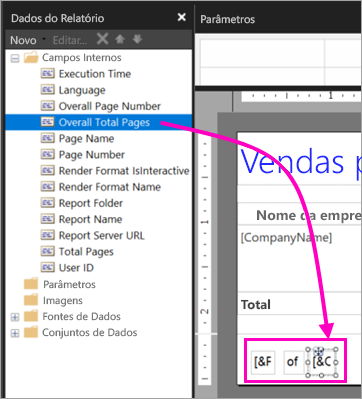

### Deixar a tabela mais larga  

Agora você pode deixar a matriz grande o suficiente para preencher a largura da página e deixar as colunas de texto mais largas para que os nomes não rolem tanto. 
 
1. Selecione a matriz, em seguida, selecione a coluna Nome da Empresa.

3. Passe o mouse sobre a barra cinza na parte superior da matriz na borda direita da coluna Nome da Empresa. Arraste para a direita, até que a coluna termine em 1 3/8 polegada. 

    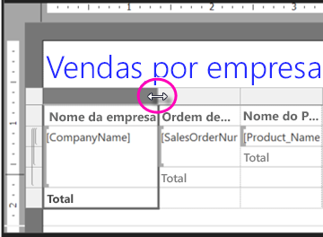

4. Arraste a borda direita do Nome do produto até que a coluna termine em 3 3/4 polegadas.   

Agora, a matriz tem a mesma largura da área de impressão.

### Formatar a moeda

Se você observou quando executou o relatório, o valor em dólar ainda não está formatado como moeda.

1. Selecione a célula do canto superior esquerdo [SUM(OrderQty)], mantenha pressionada a tecla Shift e selecione a célula [SUM(LineTotal)] inferior direita.

    

2. Na guia **Página inicial**, selecione o símbolo de moeda como o sinal de cifrão (**$**), em seguida, selecione a seta ao lado de **Estilos de espaço reservado** > **Valores de Exemplo**.
 
    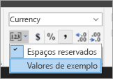

    Agora você pode ver os valores formatados como moeda.

    

### Adicionar cabeçalhos de coluna em cada página

Mais um aprimoramento de formatação antes de publicar o relatório no serviço do Power BI: fazer os cabeçalhos de coluna aparecerem em cada página no relatório.

1. Na extremidade direita da barra superior no painel Agrupamento, selecione a seta suspensa > **Modo Avançado**.

    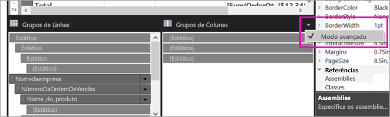

2. Selecione a barra **Estática** de cima nos **Grupos de Linhas**. Repare que a célula Nome da Empresa na matriz está selecionada.

   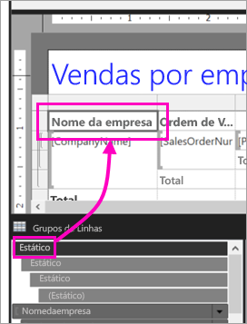

3. No painel **Propriedades**, você vê as propriedades para **Membro Tablix**. Defina **KeepWithGroup** como **Após** e **RepeatOnNewPage** como **True**.

    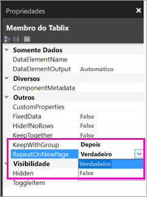

    É hora de executar o relatório e ver como ele está.

5. Selecione **Executar** na guia **Página inicial**.

6. Selecione **Layout de Impressão**, se ainda não estiver selecionado. Agora o relatório tem 29 páginas. Percorra algumas páginas. Você verá que a moeda está formatada, as colunas têm títulos em cada página e o relatório tem um rodapé com números de página e o carimbo de data e hora em cada página.
 
    

7. Salve o relatório no computador.
 
##  Carregue o relatório no serviço

Agora que você criou esse relatório paginado, é hora de carregá-lo no serviço do Power BI.

1. No serviço do Power BI, http://app.powerbi.com) no painel de navegação esquerdo, selecione **Workspaces** > **Criar espaço de trabalho do aplicativo**.

2. Nomeie seu espaço de trabalho **Azure AW** ou dê outro nome exclusivo. Você é o único membro por enquanto. 

3. Selecione a seta ao lado de **Avançado** e ative **Capacidade dedicada**. 

    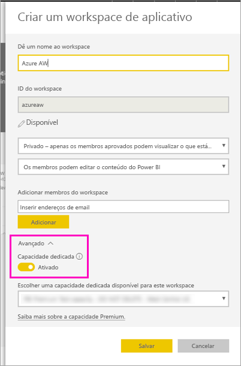

    Se você não puder ativá-lo, precisará pedir ao administrador do Power BI para lhe dar permissão para adicionar o espaço de trabalho à capacidade Premium dedicada.

4. Escolha uma **capacidade dedicada disponível para este espaço de trabalho**, se for necessário > **Salvar**.
    
    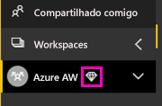

    Se o espaço de trabalho não tiver uma capacidade Premium, quando você tentar carregar o relatório, verá a mensagem "Não é possível carregar o relatório paginado". Entre em contato com o administrador do Power BI para mover o espaço de trabalho.

1. No seu espaço de trabalho, selecione **Obter Dados**.

2. Na caixa **Arquivos** > **Obter**.

3. Selecione **Arquivo Local**, navegue até onde você salvou o arquivo > **Abrir**.

   O Power BI importa o arquivo e você o vê em **Relatórios** na página de lista do aplicativo.

    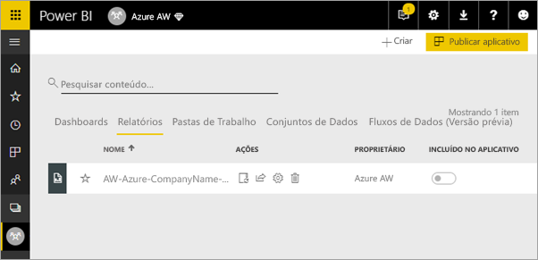

4. Selecione o relatório para exibi-lo.

5. Se receber um erro, você talvez precise digitar novamente suas credenciais. Selecione o ícone **Gerenciar**.

    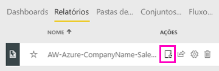

6. Selecione **Editar credenciais** e insira as credenciais usadas no Azure quando você criou o banco de dados do Azure.

    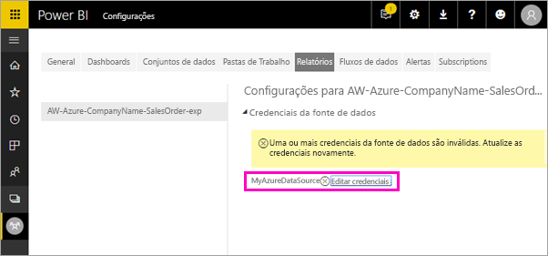

7. Agora, você pode exibir o relatório paginado no serviço do Power BI.

    

## Próximas etapas

[O que são os relatórios paginados no Power BI Premium? (versão prévia)](paginated-reports-report-builder-power-bi.md)

