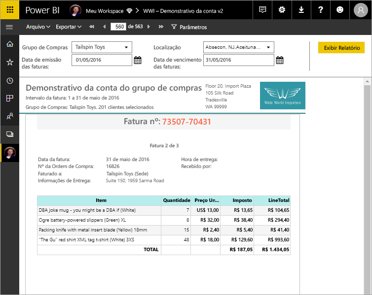

# O que são os relatórios paginados no Power BI Premium? (Versão prévia)

Os relatórios paginados, o formato longo de relatório padrão no SQL Server Reporting Services, agora estão disponíveis no serviço do Power BI. Esses relatórios podem ser impressos ou compartilhados. Eles são chamados de "paginados" porque são formatados de modo a se adaptarem bem a uma página. Eles exibem todos os dados em uma tabela, mesmo que a tabela abranja várias páginas. Às vezes são chamados de "pixel perfeito" porque você pode controlar o layout de página do relatório de maneira exata. Os relatórios paginados são baseados na tecnologia de relatório RDL no SQL Server Reporting Services. O Construtor de Relatórios é a ferramenta autônoma para a criação de relatórios paginados. 

Os relatórios paginados podem ter muitas páginas. Por exemplo, esse relatório tem 563 páginas. Cada página é disposta exatamente, com uma página por fatura e cabeçalhos e rodapés repetidos.

Você pode visualizar o relatório no Construtor de Relatórios e publicá-lo no serviço do Power BI, http://app.powerbi.com. Você precisa de uma licença do Power BI Pro para publicar um relatório no serviço. É possível publicar e compartilhar relatórios paginados em Meu Workspace ou em espaços de trabalho do aplicativo, desde que o espaço de trabalho esteja em uma capacidade do Power BI Premium. Além disso, um administrador do Power BI precisa habilitar relatórios paginados no portal de administração do Power BI. 

## Criar relatórios no Construtor de Relatórios

Os relatórios paginados têm sua própria ferramenta de design, o Construtor de Relatórios. É a mesma ferramenta e a mesma versão que você usaria para criar relatórios paginados para o Servidor de Relatórios do Power BI ou o SSRS (SQL Server Reporting Services). Na verdade, os relatórios paginados criados para SSRS 2016 e 2017 ou para o Servidor de Relatórios do Power BI local são compatíveis com o serviço do Power BI. O serviço do Power BI mantém compatibilidade com versões anteriores para que você possa encaminhar seus relatórios e atualizar qualquer relatório paginado de versões anteriores. Nem todos os recursos de relatório estão disponíveis no lançamento. Veja [Limitações e considerações](#limitations-and-considerations) neste artigo para obter detalhes.
     
## Relatório de uma variedade de fontes de dados

Um único relatório paginado pode ter várias fontes de dados diferentes. Ele não tem um modelo de dados subjacente, ao contrário dos relatórios do Power BI. Para a versão inicial de relatórios paginados no serviço do Power BI, você cria fontes de dados inseridas e conjuntos de dados no próprio relatório. Por enquanto, não é possível usar fontes de dados compartilhadas ou conjuntos de dados compartilhados. Você pode criar relatórios no Construtor de Relatórios no computador local. Se um relatório se conectar a dados locais, depois de carregar o relatório no serviço do Power BI, você precisará criar um gateway e redirecionar a conexão de dados. Aqui estão as fontes de dados às quais você pode se conectar para a versão inicial:

- Banco de Dados SQL do Azure e SQL Data Warehouse do Azure
- SQL Server por meio de um gateway
- SSAS (SQL Server Analysis Services) via gateway
 
Mais fontes de dados estarão disponíveis durante o período de versão prévia.

## Projetar seu relatório  

### Crie relatórios paginados com matriz, gráfico e layouts de forma livre

Os relatórios de tabela funcionam bem para dados baseados em colunas. Os relatórios de matriz, como relatórios de tabela cruzada ou Tabela Dinâmica, são bons para dados resumidos. Os relatórios de gráficos apresentam dados em um formato gráfico e os relatórios de *lista* de forma livre podem apresentar quase qualquer outro item, como faturas. 
  
Você pode começar com um dos assistentes do Construtor de Relatórios. Os assistentes de Tabela, Matriz e Gráfico orientam você durante a criação da conexão de fonte de dados inseridos e o conjunto de dados inseridos. Em seguida, você pode arrastar e soltar campos para criar uma consulta de conjunto de dados, selecionar um layout e estilo e personalizar seu relatório.  
  
Com o Assistente de mapa, você cria relatórios que exibem dados agregados em um plano de fundo geográfico ou geométrico. Os dados de mapa podem ser dados espaciais de uma consulta Transact-SQL ou um shapefile do Environmental Systems Research Institute, Inc. (ESRI). Você também pode adicionar um plano de fundo do bloco de mapa do Microsoft Bing.  

### Adicionar mais ao seu relatório

Modifique seus dados filtrando, agrupando e classificando dados ou adicionando fórmulas ou expressões. Adicione gráficos, medidores, minigráficos e indicadores para resumir dados em um formato visual.  Use parâmetros e filtros para filtrar dados para exibições personalizadas. Insira ou referencie imagens e outros recursos, incluindo conteúdo externo.  

Tudo em um relatório paginado, do relatório em si até cada caixa de texto, imagem, tabela e gráfico, tem uma matriz de propriedades que você pode definir para tornar o relatório exatamente como você deseja.

## Como criar uma definição de relatório

Quando você cria um relatório paginado, realmente está criando uma *definição de relatório*. Ele não contém os dados. Especifica onde obter os dados, quais dados devem ser obtidos e como exibir os dados. Quando você executa o relatório, o processador de relatório usa a definição de relatório que você especificou, recupera os dados e combina-os com o layout do relatório para gerar o relatório. Carregue a definição de relatório para o serviço do Power BI, http://app.powerbi.com, para Meu espaço de trabalho ou um espaço de trabalho compartilhado com seus colegas. Se a fonte de dados de relatório está no local, depois de carregar o relatório, redirecione a conexão de fonte de dados para passar por um gateway. 

## Exibir o relatório paginado
Você exibe seu relatório paginado no serviço do Power BI em um navegador e também nos aplicativos móveis do Power BI. Do serviço do Power BI, você pode exportar o relatório para vários formatos, como HTML, MHTML, PDF, XML, CSV, TIFF, Word e Excel. Você também pode compartilhá-lo com outras pessoas.  
  
## Limitações e considerações

Aqui estão alguns outros recursos que não têm suporte na versão inicial:

- Fixar páginas de relatório ou visuais em painéis do Power BI. Você ainda pode fixar visualizações a um painel do Power BI de um relatório paginado local em um Servidor de Relatórios do Microsoft Power BI ou em um Servidor de Relatórios do Reporting Services. Confira [Fixar itens do Reporting Services em painéis do Power BI](https://docs.microsoft.com/sql/reporting-services/pin-reporting-services-items-to-power-bi-dashboards) para obter mais informações.
- Recursos interativos, como mapas de documento e botões de mostrar/ocultar.
- Sub-relatórios e relatórios detalhados.
- Assinaturas.
- Fontes de dados compartilhadas e conjuntos de dados compartilhados.
- Conjuntos de dados do Power BI.
- Elementos visuais de relatórios do Power BI.
- Relatórios paginados em aplicativos. Você pode compartilhar um relatório paginado de um espaço de trabalho do aplicativo, mas não pode incluí-lo ao publicar o aplicativo nesse espaço de trabalho.
 
## Próximas etapas

- [Instalar o Construtor de Relatórios no Centro de Download da Microsoft](http://go.microsoft.com/fwlink/?LinkID=734968)
- [Tutorial: Criar um relatório paginado](paginated-reports-quickstart-aw.md)
- [Inserir dados diretamente em um relatório paginado](paginated-reports-enter-data.md)

  

