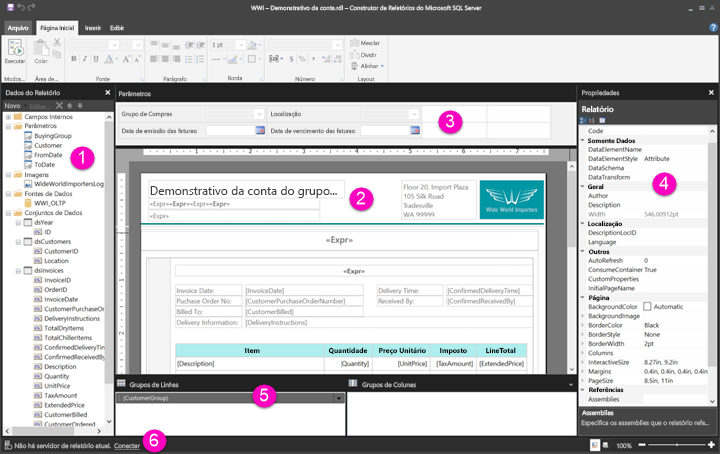

# Conheça o modo de exibição Design de Relatório para relatórios paginados (versão prévia)

O modo de exibição Design de Relatório no Construtor de Relatórios é o espaço de design para a criação de relatórios paginados que podem ser publicados no serviço do Power BI. A superfície de design fica no centro do Construtor de Relatórios, com a faixa de opções e os painéis em torno dela. A superfície de design é onde você pode adicionar e organizar os itens do seu relatório. Este artigo explica os painéis usados para adicionar, selecionar e organizar os recursos de relatório e alterar as propriedades de itens de relatório.  

1. [Painel de dados do relatório](#report-data-pane) 
2. [Superfície de design de relatório](#report-design-surface)  
3. [Painel de Parâmetros](#parameters-pane) 
4. [Painel de Propriedades](#properties-pane) 
5. [Painel de Agrupamento](#grouping-pane) 
6. [Barra de status do relatório atual](#current-report-status-bar)  
  
## 1 Painel de dados do relatório  
 No painel de dados do relatório, você pode definir os dados e recursos que você precisa para um relatório antes de criar o layout dele. Por exemplo, é possível adicionar fontes de dados, conjuntos de dados, campos calculados, parâmetros de relatório e imagens ao painel de dados do relatório.  
  
 Depois de adicionar itens ao painel de dados do relatório, arraste campos para itens de relatório na superfície de design a fim de controlar onde os dados são exibidos no relatório.  
  
> [!TIP]  
>  Se você arrastar um campo do painel de dados do relatório diretamente para a superfície de design de relatório, em vez de colocá-lo em uma região de dados como uma tabela ou gráfico, quando você executar o relatório, verá apenas o primeiro valor dos dados nesse campo.  
  
 Também é possível arrastar campos internos do painel de dados do relatório para a superfície de design de relatório. Quando renderizados, esses campos fornecem informações sobre o relatório, como o nome dele, o número total de páginas e o número da página atual.  
  
 Alguns itens são adicionados automaticamente ao painel de dados do relatório quando você adiciona algo à superfície de design de relatório. Por exemplo, se você inserir uma imagem no relatório, ela será adicionado à pasta Imagens no painel de dados do relatório.  
  
> [!NOTE]  
>  É possível usar o botão **Novo** para adicionar um novo item ao painel de dados do relatório. Você pode adicionar vários conjuntos de dados da mesma fonte de dados ou de outras fontes ao relatório. Para adicionar um novo conjunto de dados da mesma fonte, clique com botão direito a uma fonte de dados > **Adicionar Conjunto de Dados**.  
  
## 2 Superfície de design de relatório  
 A superfície de design de relatório do Construtor de Relatórios é a área de trabalho principal para a criação de relatórios. Para inserir itens em seu relatório, como regiões de dados, sub-relatórios, caixas de texto, imagens, retângulos e linhas, adicione-os da faixa de opções ou da Galeria de partes de relatório à superfície de design. Ali, é possível adicionar grupos, expressões, parâmetros, filtros, ações, visibilidade e formatação aos itens de relatório.  
  
 Você também pode alterar o seguinte:  
  
-   As propriedades do corpo do relatório, como a cor de borda e preenchimento, clicando duas vezes com o botão direito na área branca da superfície de design, fora de qualquer item de relatório, e selecionando **Propriedades do Corpo**.  
  
-   As propriedades do cabeçalho e rodapé, como a cor de borda e preenchimento, clicando duas vezes com o botão direito na área branca da superfície de design na área de cabeçalho e rodapé, fora de qualquer item de relatório, e selecionando **Propriedades do Cabeçalho** ou **Propriedades do Rodapé**.  
  
-   As propriedades do relatório em si, como a configuração da página, clicando duas vezes com o botão direito na área cinza ao redor da superfície de design e selecionando **Propriedades do Relatório**.  
  
-   As propriedades dos itens de relatório, clicando duas vezes neles com o botão direito e selecionando **Propriedades**.  
  
### Área de impressão e tamanho da superfície de design  
O tamanho da superfície de design pode ser diferente da área de impressão do tamanho da página especificado para imprimir o relatório. Alterar o tamanho da superfície de design não alterará a área de impressão do relatório. Não importa que tamanho você definiu para a área de impressão do relatório, o tamanho total da área de design não será alterado. Confira mais informações em Comportamentos de Renderização. 
  
- Para exibir a régua, na guia **Exibição**, selecione a caixa de seleção **Régua**.  
  
## 3 Painel de Parâmetros  
 Com os parâmetros de relatório, você pode controlar dados do relatório, conectar relatórios relacionados e variar a apresentação do relatório. O painel de Parâmetros fornece um layout flexível para os parâmetros de relatório.  
  
 Leia mais sobre Parâmetros de Relatório   
  
## 4 Painel de Propriedades
 Cada item em um relatório, incluindo regiões de dados, imagens, caixas de texto e o corpo do relatório em si, tem propriedades associadas a ele. Por exemplo, a propriedade BorderColor de uma caixa de texto mostra o valor de cor da borda da caixa de texto, e a propriedade PageSize do relatório mostra o tamanho da página do relatório.  
  
 Essas propriedades são exibidas no painel de Propriedades. As propriedades no painel mudam de acordo com o item de relatório selecionado.  
  
- Para ver o painel de Propriedades, na guia **Exibição** no grupo **Mostrar/Ocultar** > **Propriedades**.  
  
### Alterar valores de propriedade  
 No Construtor de Relatórios, você pode alterar as propriedades de itens de relatório de várias maneiras:  
  
-   Selecionando os botões e listas da faixa de opções.  
  
-   Alterando configurações das caixas de diálogo.  
  
-   Alterando os valores de propriedade no painel de Propriedades.  
  
 As propriedades mais usadas estão disponíveis nas caixas de diálogo e na faixa de opções.  
  
 Dependendo da propriedade, você pode definir um valor de propriedade em uma lista suspensa, digitar o valor ou selecionar `<Expression>` para criar uma expressão.  
  
### Alterar o modo de exibição do painel de Propriedades  
 Por padrão, as propriedades exibidas no painel de Propriedades são organizadas em categorias amplas, como a Ação, Borda, Preenchimento, Fonte e Geral. Cada categoria tem um conjunto de propriedades associado a ela. Por exemplo, as seguintes propriedades são listadas na categoria Font: Color, FontFamily, FontSize, FontStyle, FontWeight, LineHeight e TextDecoration. Se você preferir, você pode classificar em ordem alfabética todas as propriedades listadas no painel. Isso remove as categorias e lista todas as propriedades em ordem alfabética, independentemente da categoria.  
  
 O painel Propriedades tem três botões na parte superior: **Categoria**, **Alfabetizar** e **Página de propriedades**. Selecione os botões Categoria e Ordem Alfabética para alternar entre os modos de exibição do painel de Propriedades. Selecione o botão **Páginas de Propriedade** para abrir a caixa de diálogo de propriedades para um item de relatório selecionado.  
  
  
## 5 Painel de Agrupamento

 Os grupos são usados para organizar os dados do relatório em uma hierarquia visual e para calcular totais. É possível exibir os grupos de linhas e colunas dentro de uma região de dados na superfície de design e também no painel de Agrupamento. O painel Agrupamento tem dois painéis: Grupos de Linhas e Grupos de Colunas. Quando você seleciona uma região de dados, o painel Agrupamento exibe todos os grupos dentro dessa região de dados como uma lista hierárquica: os grupos filho aparecem recuados abaixo dos grupos pai.  
  
 Para criar grupos, arraste campos do painel de dados do relatório e solte-os na superfície de design ou no painel de Agrupamento. No painel de Agrupamento, você pode adicionar grupos pai, adjacentes e filho, alterar as propriedades do grupo e excluir grupos.  
  
 O painel de Agrupamento é exibido por padrão, mas você pode fechá-lo desmarcando a caixa de seleção do painel de Agrupamento na guia Exibir. O painel de Agrupamento não está disponível para as regiões de dados de Gráfico ou Medidor.  
  
 Para obter mais informações, confira Painel de Agrupamento e Noções básicas sobre grupos.  
  
## 6 Barra de status do relatório atual

A barra de status do relatório atual mostra o nome do servidor a que de relatório está conectado ou mostra "Nenhum servidor de relatório atual". É possível selecionar **Conectar** para se conectar a um servidor.

## Próximas etapas

[O que são os relatórios paginados no Power BI Premium? (versão prévia)](paginated-reports-report-builder-power-bi.md) 

  
  
