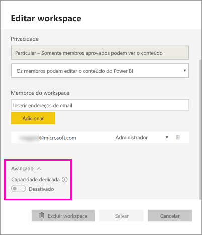
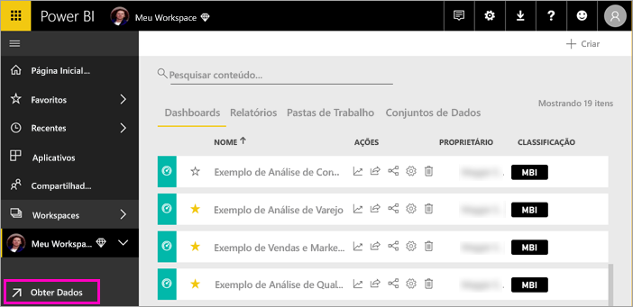
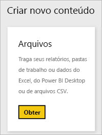
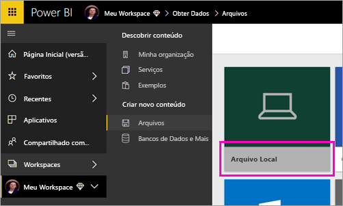
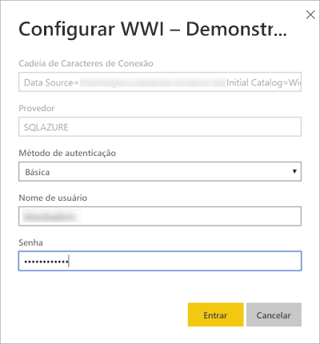
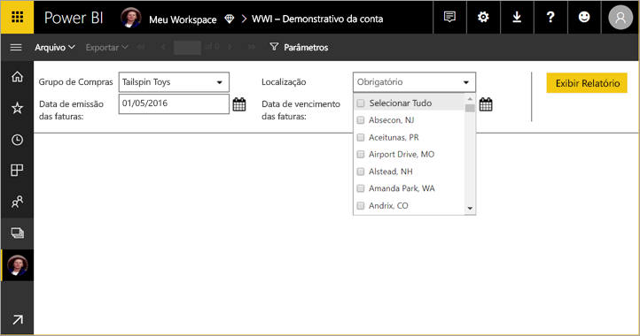

# Publicar um relatório paginado no serviço do Power BI (versão prévia)

Neste artigo, você aprende a publicar um relatório paginado no serviço do Power BI fazendo o upload do computador local. Você pode carregar relatórios paginados para o Meu Espaço de Trabalho ou qualquer outro espaço de trabalho, desde que o espaço de trabalho esteja em uma capacidade Premium. Localize o ícone de losango  ao lado do nome do espaço de trabalho. 

Se sua fonte de dados de relatório está no local, você precisará [criar um gateway](#create-a-gateway) depois de fazer upload do relatório.

## Adicionar um espaço de trabalho a uma capacidade Premium

Se o espaço de trabalho não tem o ícone de losango  ao lado do nome, você precisará adicionar o espaço de trabalho a uma capacidade Premium. 

1. Selecione **Espaços de Trabalho**, selecione as reticências ( **...** ) ao lado do nome do espaço de trabalho e, em seguida, selecione **Editar Espaço de Trabalho**.

    

1. Na caixa de diálogo **Editar Espaço de Trabalho**, expanda **Avançado** e, em seguida, deslize **Capacidade dedicada** para **Ativado**.

    

   Talvez não seja possível alterá-la. Caso contrário, entre em contato com o administrador da capacidade do Power BI Premium para conceder a você direitos de atribuição para adicionar seu espaço de trabalho a uma capacidade Premium.

## Fazer upload de um relatório paginado

1. Crie seu relatório paginado no Construtor de Relatórios e salve-o em seu computador local.

1. Abra o serviço do Power BI em um navegador e navegue até a área de trabalho Premium onde deseja publicar o relatório. Observe o ícone de losango  ao lado do nome. 

1. Selecione **Obter Dados**.

    

1. Na caixa **Arquivos** , selecione **Obter**.

    

1. Selecione **Arquivo Local** > navegue até o relatório paginado > **Abrir**.

    

1. Selecione **Continuar** > **Editar Credenciais**.

    

1. Configure suas credenciais > **Entrar**.

    

   Você vê seu relatório na lista de relatórios.

    

1. Selecione-o para abri-lo no serviço do Power BI. Se tiver parâmetros, você precisará selecioná-los antes de poder exibir o relatório.
 
    

## Criar um gateway

Assim como qualquer outro relatório do Power BI, se a fonte de dados do relatório estiver no local, você precisará criar ou conectar-se a um gateway para acessar os dados.

1. Ao lado do nome do relatório, selecione **Gerenciar**.

   

1. Veja o artigo de serviço do Power BI [Instalar um gateway](service-gateway-install.md) para obter detalhes e as próximas etapas.

### Limitações de gateway

Atualmente, os gateways não dão suporte a parâmetros de vários valores.

## Próximas etapas

- [Exibir um relatório paginado no serviço do Power BI](paginated-reports-view-power-bi-service.md)
- [O que são os relatórios paginados no Power BI Premium? (versão prévia)](paginated-reports-report-builder-power-bi.md)

