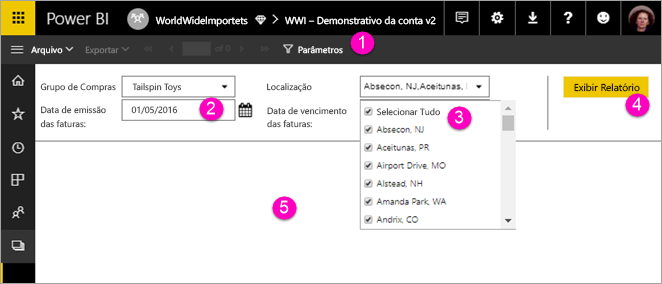

# Exibir parâmetros de relatórios paginados no serviço do Power BI

Neste artigo, você aprenderá a interagir com os parâmetros de relatórios paginados no serviço do Power BI.  Um parâmetro de relatório oferece uma maneira de filtrar dados em relatórios. Os parâmetros oferecem uma lista de valores disponíveis da qual você pode escolher um ou vários valores. Às vezes, os parâmetros têm um valor padrão e pode ser preciso escolher um valor antes de poder ver o relatório.  

Ao exibir um relatório que tenha parâmetros, a barra de ferramentas visualizador de relatório exibe cada parâmetro para que você possa especificar valores de forma interativa. A ilustração a seguir apresenta a área de parâmetros de um relatório com parâmetros de **Grupo de Compras**, **Localização**, um de **Data de Início**e um de **Data de Término**.  

## Painel de parâmetros no serviço do Power BI

  
1.  **Painel de parâmetros** A barra de ferramentas visualizador de relatório exibe um aviso do tipo "Obrigatório" ou um valor padrão para cada parâmetro.    
  
2.  **Parâmetros de Data de Início/Data de Término de Faturas** Os dois parâmetros de dados têm valores padrão. Para alterar a data, digite uma data na caixa de texto ou escolha uma no calendário.  
  
3.  **Parâmetro de localização** O parâmetro de localização é definido para permitir que você selecione um, vários ou todos os valores. 
  
4.  **Exibir Relatório** Após inserir ou alterar os valores de parâmetro, clique em **Exibir Relatório** para executar o relatório. 

5. **Valores padrão** Se todos os parâmetros tiverem valores padrão, o relatório será executado automaticamente na primeira exibição. Alguns parâmetros neste relatório não tinham valores padrão, por isso você não vê o relatório até selecionar os valores.  

## Próximas etapas

[Criar parâmetros para relatórios paginados no serviço do Power BI](paginated-reports-parameters.md)
