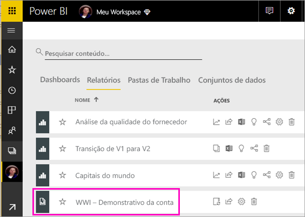
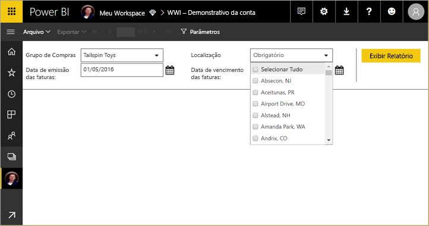
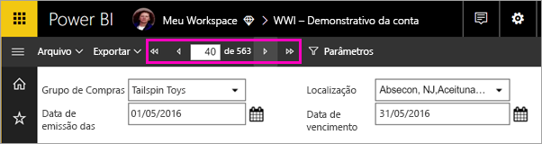
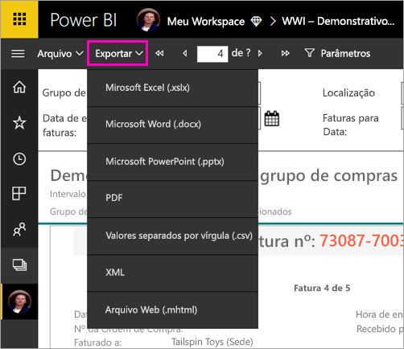

# Exibir um relatório paginado no serviço do Power BI (versão prévia)

Neste artigo, você verá como exibir um relatório paginado no serviço do Power BI. Os relatórios paginados são relatórios criados no Construtor de Relatórios e carregados para qualquer espaço de trabalho em uma capacidade Premium. Localize o ícone de losango  ao lado do nome do espaço de trabalho. 

Os relatórios paginados têm um ícone próprio, .

Você também pode exportar relatórios paginados para vários formatos: 

- Microsoft Excel
- Microsoft Word
- Microsoft PowerPoint
- PDF
- Valores separados por vírgula
- XML
- Arquivo da Web (.mhtml)

## Exibir um relatório paginado

1. Selecione o relatório paginado no espaço de trabalho.workspace.

    

2. Se o relatório tiver parâmetros, como este, talvez você não veja o relatório quando o abrir pela primeira vez. Selecione os parâmetros e depois **Exibir relatório**. 

     

    Também é possível alterar os parâmetros a qualquer momento.

1. Percorra o relatório selecionando as setas na parte superior da página ou digitando um número de página na caixa.
    
   

4. Selecione **Exportar** para localizar um formato de exportação para seus relatórios paginados.

    

## Próximas etapas

[O que são os relatórios paginados no Power BI Premium? (versão prévia)](paginated-reports-report-builder-power-bi.md)
