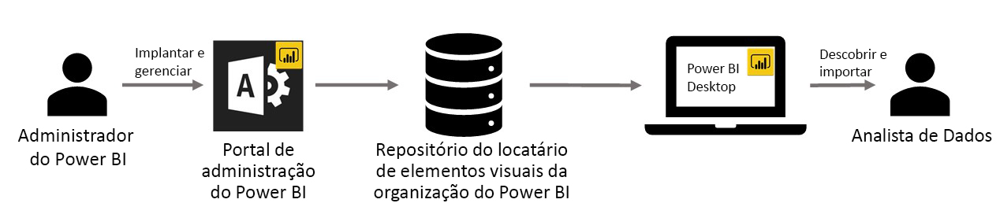

# Uso dos visuais personalizados da organização no Power BI

Você pode usar visuais personalizados no Power BI para criar um tipo exclusivo de visual que seja adequado para você ou as informações de dados que você está tentando transmitir. Geralmente, esses elementos visuais personalizados são criados por desenvolvedores e criados quando a variedade de visuais que estão incluídos no Power BI não atende a sua necessidade. 

Em algumas organizações, os elementos visuais personalizados são ainda mais importantes. Eles podem ser necessários para transmitir dados específicos ou insights exclusivos para a organização, podem ter requisitos de dados especiais ou dar destaque a métodos particulares de negócios. Essas organizações precisam desenvolver elementos visuais personalizados, compartilhá-los em toda a organização e garantir que eles sejam mantidos corretamente. Os elementos visuais personalizados do Power BI permitem que as organizações façam exatamente isso.

A imagem a seguir mostra o processo pelo qual os visuais personalizados da organização no Power BI fluem do administrador, passando pelo desenvolvimento e manutenção, para ao fim chegar ao analista de dados.

Os elementos visuais de organização são implantados e gerenciados pelo administrador do Power BI no portal de administração. Uma vez implantado no repositório organizacional, os usuários da organização podem facilmente descobri-los e importar os elementos visuais personalizados da organização em seus relatórios diretamente do Power BI Desktop.

Para saber mais sobre como usar elementos visuais personalizados da organização nos relatórios que você criou, confira o seguinte artigo: [Saber mais sobre como importar elementos visuais organizacionais em seus relatórios](power-bi-custom-visuals.md).

## Administração de visuais personalizados da organização

Para saber mais sobre como administrar, implantar e gerenciar elementos visuais personalizados organizacionais na sua organização, confira o seguinte artigo: [Saber mais sobre implantação e gerenciamento de elementos visuais personalizados da organização](https://go.microsoft.com/fwlink/?linkid=866790).

> [!WARNING]
> Um elemento visual personalizado pode conter código com riscos de segurança ou privacidade. É importante confiar no autor e na origem de qualquer elemento visual personalizado antes de implantá-lo no repositório da organização.

## Considerações e limitações

Há várias considerações e limitações das quais você precisa estar ciente.

Administrador:

* Não há suporte para elementos visuais personalizados herdados (como elementos visuais personalizados que não são criados sobre as novas APIs com controle de versão)

* Se um elemento visual personalizado é excluído do repositório, os relatórios existentes que usam o elemento visual excluído param de renderizar. A operação de exclusão do repositório não é reversível. Para desabilitar temporariamente um visual personalizado, use o recurso "Desabilitar".

Usuário final:

* Os visuais personalizados da organização são visuais privados importados do repositório da organização. Como todo visual privado, eles não podem ser [exportados para o PowerPoint](https://docs.microsoft.com/power-bi/consumer/end-user-powerpoint) nem exibidos em emails recebidos quando um usuário [assina as páginas do relatório](https://docs.microsoft.com/power-bi/consumer/end-user-subscribe). Apenas os [visuais personalizados certificados](https://docs.microsoft.com/power-bi/power-bi-custom-visuals-certified) importados diretamente do marketplace oferecem suporte a esses recursos.

* Os visuais do Visio, do PowerApps, do Map box e do GlobeMap do marketplace do AppSource não serão renderizados se forem implantados por meio do repositório da organização.

## Solucionar problemas

Para saber mais sobre a solução de problemas, acesse [Troubleshooting your Power BI custom visuals](power-bi-custom-visuals-troubleshoot.md) (Solucionar problemas dos visuais personalizados do Power BI).

## PERGUNTAS FREQUENTES

Para saber mais e solucionar suas dúvidas, acesse [Frequently asked questions about Power BI custom visuals](power-bi-custom-visuals-faq.md#organizational-custom-visuals) (Perguntas frequentes sobre os visuais personalizados do Power BI).

Mais perguntas? [Experimente a Comunidade do Power BI](http://community.powerbi.com/).
