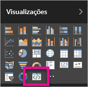

# Solucionar problemas dos visuais personalizados do Power BI

## Depurar

**Comando Pbiviz não encontrado (ou erros semelhantes)**

Se você executar `pbiviz` na linha de comando do seu terminal, a tela de ajuda será exibida. Caso contrário, ele não está instalado corretamente. Verifique se no mínimo a versão 4.0 do NodeJS está instalada.

**Não é possível localizar o visual de depuração na guia Visualizações**

O visual de depuração é semelhante a um ícone de aviso dentro da guia **Visualizações**.

Se ele não estiver visível, verifique se você o habilitou nas configurações do Power BI.

> [!NOTE]
> No momento, o visual de depuração somente está disponível no serviço do Power BI, mas não no Power BI Desktop nem no aplicativo móvel. O visual empacotado ainda funcionará em todos os lugares.

**Não é possível contatar o servidor de elemento visual**

Execute o servidor de visual com o comando `pbiviz start` na linha de comando do terminal na raiz do projeto de visual. Se o servidor não estiver em execução, provavelmente os certificados SSL não foram instalados corretamente.

Fique à vontade para contatar a equipe de suporte de visuais personalizados: *pbicvsupport@microsoft.com*  caso tenha perguntas, comentários ou problemas.

## Próximas etapas

Para saber mais, acesse [Frequently asked questions about Power BI custom visuals](power-bi-custom-visuals-faq.md#organizational-custom-visuals) (Perguntas frequentes sobre os visuais personalizados do Power BI).
