# Visuais personalizados no Power BI

Ao criar ou editar um relatório do Power BI, você pode usar muitos tipos diferentes de elementos visuais. Os ícones para esses elementos visuais são exibidos na **visualizações** painel. Esses elementos visuais são previamente fornecidas quando você baixa [Power BI Desktop](https://powerbi.microsoft.com/desktop/) ou abrir o [serviço do Power BI](https://app.powerbi.com).

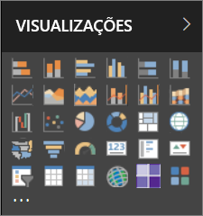

No entanto, você não está limitado a esse conjunto de visuais. Se você selecionar as reticências (...) na parte inferior, outra fonte de visuais do relatório se torna disponível -*visuais personalizados*.

Os desenvolvedores criar visuais personalizados usando os SDK de visuais personalizados. Esses elementos visuais que os usuários vejam os dados de uma maneira que melhor se adapta às suas empresas. Os autores de relatório, em seguida, podem importar os arquivos do visual personalizado em seus relatórios e usá-los como quaisquer outros visuais do Power BI. Elementos visuais personalizados são cidadãos de primeira classe no Power BI e podem ser filtrados, realçados, editados, compartilhados e assim por diante.

Elementos visuais personalizados são implantados de três maneiras:

* Arquivos de elementos visuais personalizados
* Elementos visuais organizacionais
* Elementos visuais do Marketplace

## Arquivos de elementos visuais personalizados

Elementos visuais personalizados são pacotes que incluem o código para renderizar os dados fornecidos a eles. Qualquer pessoa pode criar um visual personalizado e empacotá-lo como um único `.pbiviz` arquivo, que pode então ser importado para um relatório do Power BI.

> [!WARNING]
> Um visual personalizado pode conter código com riscos de segurança ou privacidade. Verifique se que você confia no autor e o código-fonte visual personalizado antes de importá-lo em seu relatório.

## Elementos visuais organizacionais

Administradores do Power BI aprovar e implantar visuais personalizados em sua organização, o que os autores de relatório podem facilmente descobrir, atualizar e usar. Os administradores podem gerenciar facilmente (por exemplo, atualize a versão, desabilitar/habilitar) esses elementos visuais.

 [Leia mais sobre os elementos visuais organizacionais](power-bi-custom-visuals-organization.md).

## Elementos visuais do Marketplace

Membros da comunidade e a Microsoft tem contribuiu com seus elementos visuais personalizados para o benefício do público e publicado-los para o [AppSource](https://appsource.microsoft.com/marketplace/apps?product=power-bi-visuals) marketplace. Você pode baixar esses elementos visuais adicioná-los para relatórios do Power BI. A Microsoft testou e aprovada esses visuais personalizados para funcionalidade e qualidade.

O que é o [AppSource](developer/office-store.md)? É o local em que você pode encontrar aplicativos, suplementos e extensões para o seu software da Microsoft. [AppSource](https://appsource.microsoft.com/) conecta milhões de usuários de produtos como o Office 365, Azure, Dynamics 365, Cortana e Power BI, soluções que ajudam a realizar seu trabalho mais eficiente, insightfully e perfeitamente que antes.

### Elementos visuais certificados

Power BI certified visuais são elementos visuais que passaram por testes adicional qualidade rigorosa e têm suporte em cenários adicionais, como [assinaturas de email](https://docs.microsoft.com/power-bi/service-report-subscribe), e [exportar para o PowerPoint](https://docs.microsoft.com/power-bi/service-publish-to-powerpoint).
Para ver a lista de visuais personalizados certificados ou para enviar seus próprios, consulte [Certified custom visuals (Visuais personalizados certificados)](https://docs.microsoft.com/power-bi/power-bi-custom-visuals-certified).

Você é um desenvolvedor da Web e está interessado em criar suas próprias visualizações e adicioná-las ao AppSource? Ver [desenvolvendo um visual personalizado do Power BI](developer/custom-visual-develop-tutorial.md) e saiba como [publicar visuais personalizados no AppSource](https://docs.microsoft.com/power-bi/developer/office-store).

### Importar um visual personalizado de um arquivo

1. Selecione as reticências na parte inferior da **visualizações** painel.

    

2. No menu suspenso, selecione **Importar do arquivo**.

    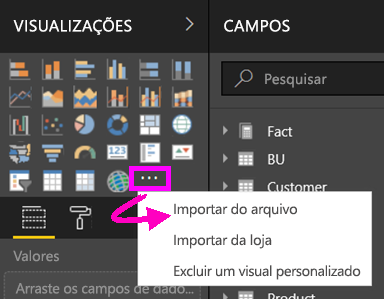

3. No menu Abrir arquivo, selecione a `.pbiviz` arquivo que você deseja importar e, em seguida, selecione **aberto**. Ícone do visual personalizado é adicionado à parte inferior da sua **visualizações** painel e agora está disponível para uso em seu relatório.

    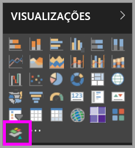

### Importar elementos visuais organizacionais

1. Selecione as reticências na parte inferior da **visualizações** painel.

    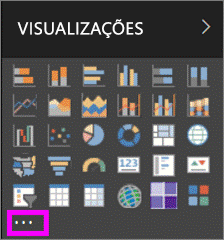

2. No menu suspenso, selecione **Importar do marketplace**.

    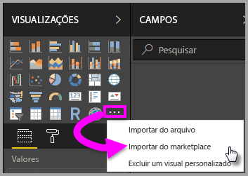

3. Selecione **MINHA ORGANIZAÇÃO** no menu da guia superior.

    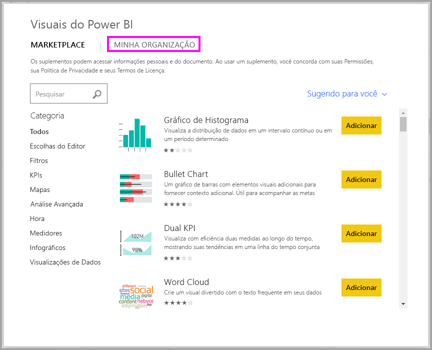

4. Role a lista para localizar o visual para importar.

    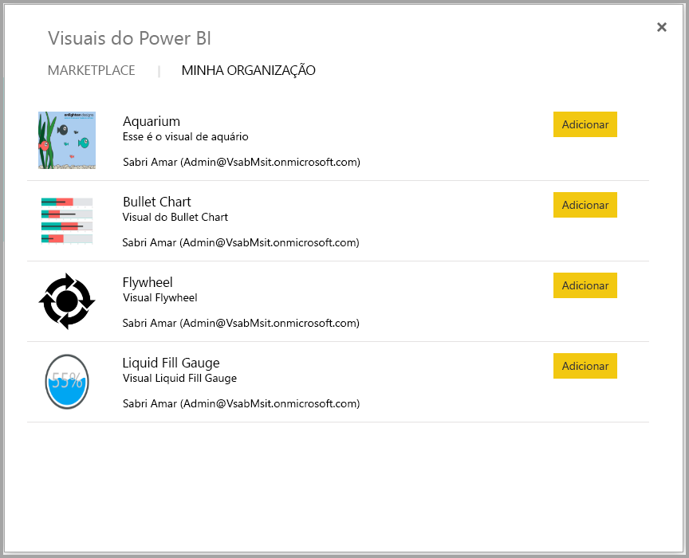

5. Selecione **adicionar** para importar o visual personalizado. Seu ícone é adicionado à parte inferior da sua **visualizações** painel e agora está disponível para uso em seu relatório.

    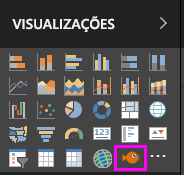

## Baixar ou importar visuais personalizados do Microsoft AppSource

Você tem duas opções para baixar e importar visuais personalizados: de dentro do Power BI e dos [site do AppSource](https://appsource.microsoft.com/).

### Importar visuais personalizados do Power BI

1. Selecione as reticências na parte inferior da **visualizações** painel.

    

2. No menu suspenso, selecione **Importar do marketplace**.

    

3. Role a lista para localizar o visual para importar.

    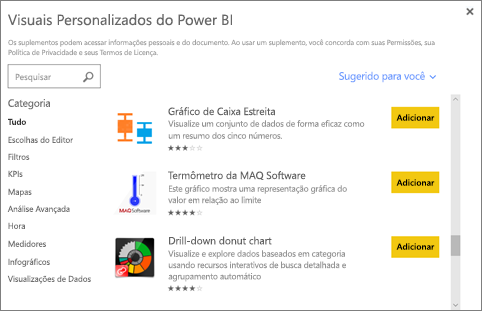

4. Para saber mais sobre um dos visuais, realce e selecione-o.

    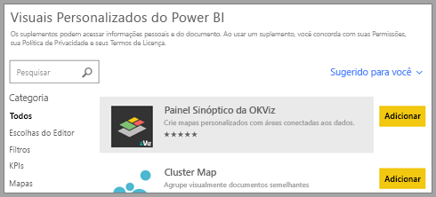

5. Na página de detalhes, você pode exibir capturas de tela, vídeos, descrições detalhadas e muito mais.

    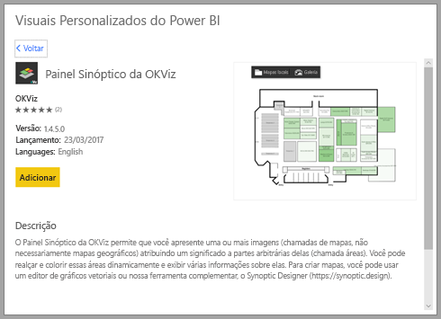

6. Role para baixo para ver as análises.

    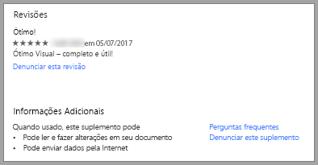

7. Selecione **adicionar** para importar o visual personalizado. Seu ícone é adicionado à parte inferior da sua **visualizações** painel e agora está disponível para uso em seu relatório.

    

### Baixar e importar visuais personalizados do Microsoft AppSource

1. Inicie em [Microsoft AppSource](https://appsource.microsoft.com) e selecione a guia para **Aplicativos**.

    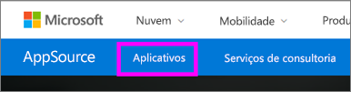

2. Acesse a [página de resultados de Aplicativos](https://appsource.microsoft.com/marketplace/apps), em que é possível exibir os principais aplicativos em cada categoria, incluindo *Aplicativos do Power BI*. Estamos procurando visuais personalizados, portanto, vamos selecionados **visuais do Power BI** da lista de navegação à esquerda para restringir os resultados.

    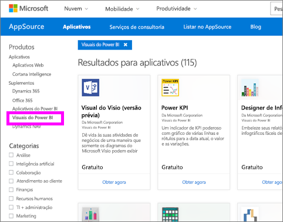

3. O AppSource exibe um bloco para cada visual personalizado.  Cada bloco tem um instantâneo de visual personalizado com uma breve descrição e um link de download. Para ver mais detalhes, selecione o bloco.

    

4. Na página de detalhes, você pode exibir capturas de tela, vídeos, descrições detalhadas e muito mais. Selecione **obtê-lo agora** para baixar o visual personalizado e, em seguida, aceite os termos de uso.

    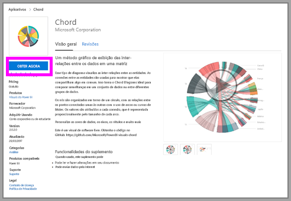

5. Selecione o link para baixar o visual personalizado.

    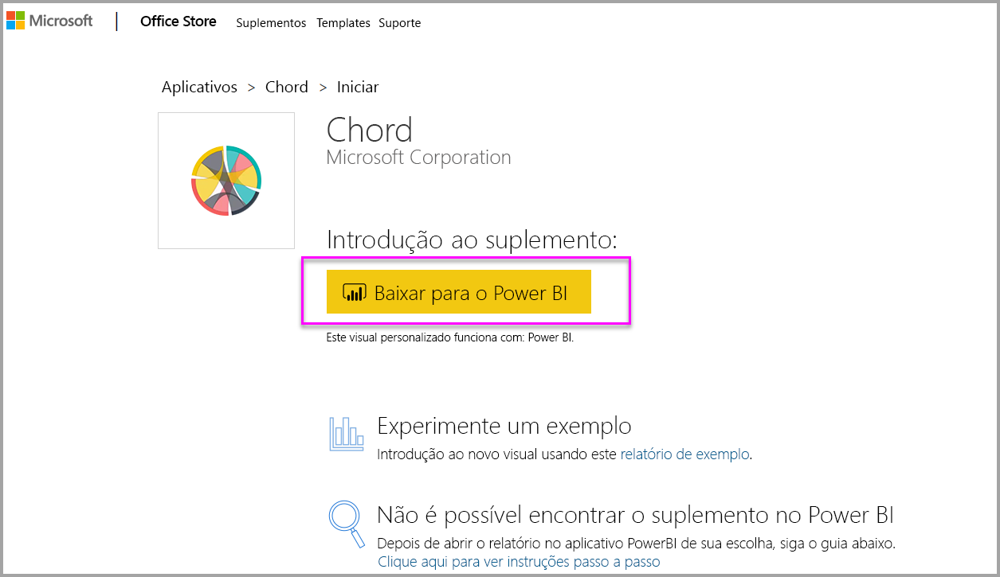

    A página de download também inclui instruções sobre como importar o visual personalizado para o Power BI Desktop e o serviço do Power BI.

    Você também pode baixar um relatório de exemplo que inclua o visual personalizado e apresente suas funcionalidades.

    

6. Salve o `.pbiviz` de arquivo e, em seguida, abra o Power BI.

7. Importar o `.pbiviz` arquivo em seu relatório. (Confira a seção acima [Importar um visual personalizado de um arquivo](#import-a-custom-visual-from-a-file)).

## Considerações e limitações

* Um visual personalizado é adicionado a um relatório específico quando importado. Se você desejar usar o visual em outro relatório, você precisará importá-lo nesse relatório também. Quando um relatório com um visual personalizado é salvo com a opção **Salvar como** , uma cópia do visual personalizado será salva com o novo relatório.

* Se você não vir uma **visualizações** painel, o que significa que você não tem relatório editar permissões.  Você só pode adicionar visuais personalizados para relatórios que você pode editar, não para relatórios que foram compartilhados com você.

## Solucionar problemas

Para solucionar problemas, consulte [solução de problemas de seus visuais personalizados do Power BI](power-bi-custom-visuals-troubleshoot.md).

## PERGUNTAS FREQUENTES

Para saber mais e solucionar suas dúvidas, acesse [Frequently asked questions about Power BI custom visuals](power-bi-custom-visuals-faq.md#organizational-custom-visuals) (Perguntas frequentes sobre os visuais personalizados do Power BI).

## Próximas etapas

* [Visualizações em relatórios do Power BI](visuals/power-bi-report-visualizations.md)

Mais perguntas? [Experimente a Comunidade do Power BI](http://community.powerbi.com/).
