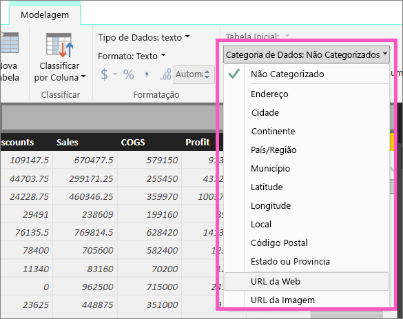
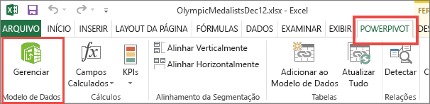
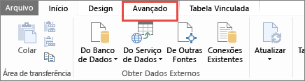
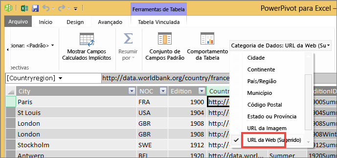

# Adicionar hiperlinks a uma tabela
Este tópico ensina como usar o Power BI Desktop para criar hiperlinks. Depois, use o serviço do Power BI ou Power BI Desktop para adicioná-los às suas tabelas e matrizes de relatório. 

> [!NOTE]
> Você pode criar hiperlinks em [blocos nos painéis](service-dashboard-edit-tile.md) e [caixas de texto nos painéis](service-dashboard-add-widget.md) em dinamicamente usando o serviço do Power BI. Você pode criar hiperlinks em [nas caixas de texto em relatórios](service-add-hyperlink-to-text-box.md) em dinamicamente usando o serviço do Power BI e Power BI Desktop.
> 

## Para criar um hiperlink em uma tabela ou matriz usando o Power BI Desktop
Você pode criar hiperlinks em tabelas e matrizes no Power BI Desktop, mas não no serviço do Power BI. Você também pode criar hiperlinks no Excel Power Pivot antes de importar a pasta de trabalho no Power BI. Ambos os métodos são descritos abaixo.

## Criar um hiperlink de tabela ou matriz no Power BI Desktop
O procedimento para adicionar um hiperlink depende se você importou os dados ou os conectou usando DirectQuery. Ambos os cenários são descritos abaixo.

### Para dados importados para o Power BI
1. Se o hiperlink ainda não existir como uma coluna no conjunto de dados, use o Desktop para adicioná-la como uma [coluna personalizada](desktop-common-query-tasks.md).
2. Na exibição Dados, selecione a coluna e, na guia **Modelagem**, escolha **Categoria de Dados** no menu suspenso.
   
    
3. Selecione **URL da Web**.
4. Mude para o modo de exibição de relatório e crie uma tabela ou matriz usando o campo categorizado como uma URL da Web. Os hiperlinks estarão em azul e sublinhados.

    

    > [!NOTE]
    > As URLS devem começar com **http:// , https://** ou **www**.
    >
   
1. Se não quiser exibir uma URL longa em uma tabela, você poderá exibir um ícone de hiperlink   em vez disso. Observe que você não consegue exibir ícones em matrizes.
   
    Selecione o gráfico para torná-lo ativo.

    Selecionar o ícone Formato  para abrir a guia Formatação.

    Expanda **Valores**, localize o **ícone de URL** e altere-o para **Ativado**.

    

1. (Opcional) [Publique o relatório do Power BI Desktop no serviço do Power BI](guided-learning/publishingandsharing.yml?tutorial-step=2) e abra o relatório no serviço do Power BI. Os hiperlinks funcionarão lá também.

### Para dados conectados com DirectQuery
Você não pode criar uma coluna no modo DirectQuery.  No entanto, se seus dados já contêm URLs, você pode transformá-los em hiperlinks.

1. Na exibição Relatório, crie uma tabela usando um campo que contém as URLs.
2. Selecione a coluna e, na guia **Modelagem**, escolha **Categoria de Dados**no menu suspenso.
3. Selecione **URL da Web**. Os hiperlinks estarão em azul e sublinhados.
4. (Opcional) [Publique o relatório do Power BI Desktop no serviço do Power BI](guided-learning/publishingandsharing.yml?tutorial-step=2) e abra o relatório no serviço do Power BI. Os hiperlinks funcionarão lá também.

## Criar um hiperlink de tabela ou matriz no Excel Power Pivot
Outra maneira de adicionar hiperlinks às tabelas e matrizes do Power BI é criar hiperlinks no conjunto de dados antes de importar/conectar-se ao conjunto de dados no Power BI. Este exemplo usa uma pasta de trabalho do Excel.

1. Abra sua pasta de trabalho no Excel.
2. Selecione a guia **PowerPivot** e, em seguida, escolha **Gerenciar**.
   
   
1. Quando o PowerPivot for aberto, selecione a guia **Avançado**.
   
   
4. Coloque o cursor na coluna que contém as URLs que você deseja transformar em hiperlinks nas tabelas do Power BI.
   
   > [!NOTE]
   > As URLS devem começar com **http:// , https://** ou **www**.
   > 
5. No grupo **Propriedades de relatório** , selecione na lista suspensa **Categoria de dados** e escolha **URL do Web**. 
   
   

6. No serviço do Power BI ou no Power BI Desktop, conecte-se ou importe essa pasta de trabalho.
7. Crie uma visualização de tabela que contém o campo de URL.
   
   

## Considerações e solução de problemas
P: Posso usar uma URL personalizada como um hiperlink em uma tabela ou matriz?    
R: Não. Você pode usar um ícone de link. Se precisar de texto personalizado para os hiperlinks e a lista de URLs for pequena, use uma caixa de texto.

## Próximas etapas
[Visualizações em relatórios do Power BI](visuals/power-bi-report-visualizations.md)

[Power BI – conceitos básicos](consumer/end-user-basic-concepts.md)

Mais perguntas? [Experimente a Comunidade do Power BI](http://community.powerbi.com/)

