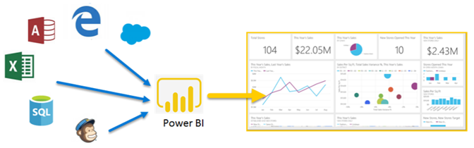
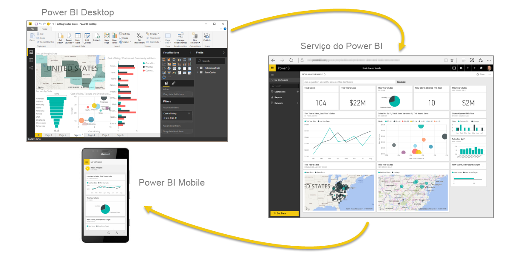
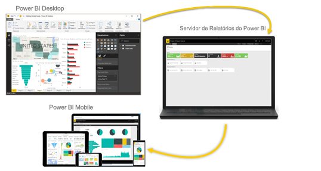

# O que é Power BI?
O **Power BI** é uma coleção de serviços de software, aplicativos e conectores que trabalham juntos para transformar suas fontes de dados não relacionadas em informações coerentes, visualmente envolventes e interativas. Os dados podem estar em uma planilha do Excel ou em uma coleção de data warehouses híbridos locais ou baseados na nuvem. Com o **Power BI** você pode se conectar facilmente a fontes de dados, visualizar e descobrir conteúdo importante, e compartilhá-lo com todas as pessoas que você desejar.

O **Power BI** pode ser simples e rápido – tem a capacidade de criar análises rápidas com base em uma planilha do Excel ou em um banco de dados local. Mas o **Power BI** também é robusto e de nível empresarial, pronto para ampla modelagem e análise em tempo real, bem como para um desenvolvimento personalizado. Portanto, ele pode ser uma ferramenta de visualização e geração de relatórios pessoal. Ele pode servir também como mecanismo de análise e tomada de decisão para projetos de grupo, divisões ou corporações inteiras.

## As partes do Power BI
O Power BI consiste em um aplicativo da área de trabalho do Windows chamado **Power BI Desktop**, um serviço de SaaS (*Software como Serviço*) online chamado **serviço do Power BI**, e os **aplicativos móveis** do Power BI para dispositivos com Windows, iOS e Android.

Esses três elementos (**Power BI Desktop**, **serviço** e **aplicativos móveis**) foram projetados para que as pessoas possam criar, compartilhar e consumir Informações de Negócios da maneira que seja mais proveitosa para elas ou para as respectivas funções.

O quarto elemento, o **Servidor de Relatórios do Power BI**, permite publicar relatórios do Power BI em um servidor de relatórios local, depois de criá-los no Power BI Desktop. Leia mais sobre o [Servidor de Relatório do Power BI](#on-premises-reporting-with-power-bi-report-server).

## Como o Power BI corresponde à sua função
A forma de uso do Power BI pode depender de sua função em um projeto ou uma equipe. Além disso, outras pessoas, em outras funções, podem usar o Power BI de modo diferente, o que é aceitável.

Por exemplo, você pode usar principalmente o **serviço do Power BI**, mas seu colega que trabalha com cálculos de grandes dados numéricos e com a criação de relatórios de negócios pode usar extensivamente o **Power BI Desktop** para criar relatórios e publicá-los no serviço do Power BI, onde é possível exibi-los. E outro colega da área de vendas, talvez use principalmente o aplicativo de telefone do Power BI para monitorar o progresso das cotas de vendas e analisar detalhes de novas vendas potenciais.

Caso seja um desenvolvedor, você pode usar APIs do Power BI para efetuar push dos dados para conjuntos de dados ou para inserir relatórios e dashboards em seus próprios aplicativos personalizados. Ter uma ideia de um novo visual? Crie-o você mesmo e compartilhe-o com outras pessoas.  

Você pode, inclusive, usar cada elemento do **Power BI** em momentos diferentes, dependendo do objetivo ou da função em determinado projeto.

Talvez você use o **Power BI Desktop** para criar relatórios para a própria equipe sobre estatísticas de envolvimento com os clientes, ou para exibir o andamento da fabricação e do estoque em tempo real, em um painel do serviço. A maneira de usar o Power BI depende do respectivo recurso ou serviço que seja mais adequado como ferramenta para o caso. Todos os elementos do Power BI estão disponíveis para você. Por isso, ele é um programa tão versátil e interessante.

Explore os documentos pertinentes à sua função:
- Power BI para [***designers***](desktop-what-is-desktop.md)
- Power BI para [***consumidores***](consumer/end-user-consumer.md)
- Power BI para [***desenvolvedores***](developer/what-can-you-do.md)
- Power BI para [***administradores***](service-admin-administering-power-bi-in-your-organization.md)

## O fluxo de trabalho no Power BI
Um fluxo de trabalho comum no Power BI começa pela conexão com fontes de dados e pela criação de um relatório no **Power BI Desktop**. Em seguida, publique esse relatório do **Power BI Desktop** no **serviço do Power BI** e compartilhe-o para que os usuários finais no **serviço** e nos **dispositivos móveis** possam exibir e interagir com o relatório.
Esse fluxo de trabalho é comum e mostra como os três principais elementos do Power BI se complementam.

Veja uma [comparação detalhada entre o Power BI Desktop e o serviço do Power BI](service-service-vs-desktop.md).

Mas e se você não estiver pronto para ir para a nuvem e quiser manter seus relatórios atrás de um firewall corporativo?  Continue lendo.

## Relatórios locais com o Servidor de Relatório do Power BI
Crie, implante e gerencie os relatórios paginados, móveis e do Power BI localmente com a variedade de ferramentas e serviços prontos para uso fornecidos pelo Servidor de Relatório do Power BI.

O Servidor de Relatórios do Power BI é uma solução que você implanta atrás do firewall e, em seguida, fornece relatórios para os usuários corretos de diferentes maneiras, seja exibindo-os em um navegador da Web, em um dispositivo móvel ou como um email. E, como o Servidor de Relatórios do Power BI é compatível com o Power BI na nuvem, você pode ir para a nuvem quando estiver pronto. 

Leia mais sobre o [Servidor de Relatório do Power BI](report-server/get-started.md).

## Próximas etapas
[Entre, obtenha alguns dados e aprenda a usar o serviço do Power BI](service-the-new-power-bi-experience.md)   
[Tutorial: Introdução ao serviço do Power BI](service-get-started.md)
[Início Rápido: conectar-se a dados no Power BI Desktop](desktop-quickstart-connect-to-data.md)