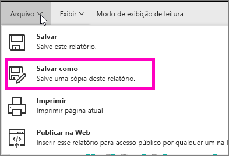
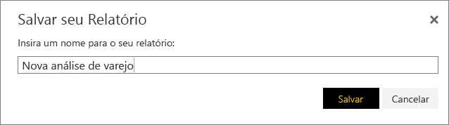
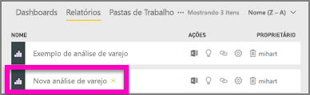

# Crie um novo relatório por meio de um relatório existente (copiar um relatório)
Talvez você tenha um relatório que já se conecta ao seu conjunto de dados e tenha alguns visuais que deseja reutilizar ou modificar.  Por que não simplesmente copiar esse relatório como base de um novo relatório?  Para fazer isso:

1. [Abrir um relatório](consumer/end-user-report-open.md).
2. No menu **arquivo** , selecione **Salvar como**.
   
   
3. Digite um nome para o novo relatório e selecione **Salvar**.
   
   
   
   Uma mensagem de Êxito permite que você saiba que o novo relatório foi salvo em seu espaço de trabalho atual no Power BI.
   
   
4. Abra a guia **Relatórios** do seu espaço de trabalho e selecione o novo relatório para abri-lo. Opcionalmente, exclua os visuais que você não deseja manter, modifique outros visuais e adicione novos.
   
   
5. Divirta-se atualizando e editando seu novo relatório.

## Próximas etapas:
[Criar novas visualizações](visuals/power-bi-report-add-visualizations-ii.md)

[Excluir visualizações](consumer/end-user-delete.md) que não são necessárias

[Criar um relatório usando o Power BI Desktop](desktop-report-view.md)
