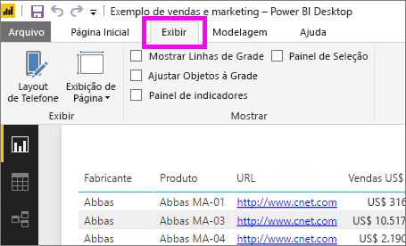
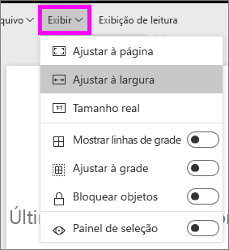
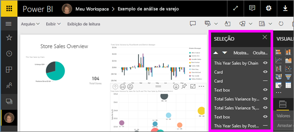

# A página exibe as configurações em um relatório do Power BI
Compreendemos que é essencial para manter o pixel de layout de relatório perfeito. Às vezes, pode ser um desafio, porque você e seus colegas podem exibir esses relatórios em telas com taxas de proporção diferentes e tamanhos. 

O modo de exibição padrão é **Ajustar à página** e o tamanho de exibição padrão é **16:9**. Se você quiser bloquear uma taxa de proporção diferente ou quiser ajustar seu relatório de outra forma, há duas ferramentas para ajudá-lo: ***Exibição de página*** as configurações e ***tamanho da página*** configurações.

<iframe width="560" height="315" src="https://www.youtube.com/embed/5tg-OXzxe2g" frameborder="0" allowfullscreen></iframe>

## Onde encontrar as configurações de exibição de página no serviço do Power BI e Power BI Desktop
Configurações de exibição de página estão disponíveis no serviço do Power BI e Power BI Desktop, mas a interface é um pouco diferente. As seções a seguir explicam onde você pode encontrar as configurações de exibição em cada ferramenta do Power BI.

### No Power BI Desktop
No Modo de Exibição de Relatório, selecione a guia **Exibição** para abrir as Configurações de exibição de página, bem como as configurações de layout do telefone.

  

### No serviço do Power BI (app.powerbi.com)
No serviço do Power BI, abra um relatório e selecione **exibição** na barra de menus à esquerda superior.

Configurações de exibição de página estão disponíveis em ambas [exibição de leitura e modo de edição](consumer/end-user-reading-view.md). Na exibição de edição, proprietário de um relatório pode atribuir configurações de exibição de página para páginas de relatório individual, e essas configurações são salvas com o relatório. Quando os colegas abrirem o relatório no Modo de Exibição de Leitura, verão a exibição das páginas do relatório usando as configurações do proprietário. No modo de exibição de leitura, colegas podem alterar *algumas* da **exibição de página** configurações, mas as alterações não são salvas quando sair do relatório.

## Configurações de exibição de página
O primeiro conjunto de configurações do modo de exibição de página controla a exibição da página relatório relativa à janela do navegador. Escolha entre:

* **Ajustar à página** (padrão): Conteúdo é dimensionado para um melhor ajuste à página
* **Ajustar à largura**: Conteúdo é dimensionado para se ajustarem a largura da página
* **Tamanho real**: Conteúdo é exibido em tamanho normal

O segundo conjunto de controles de configurações de exibição de página, o posicionamento de objetos na tela de relatório. Escolha entre:

* **Mostrar linhas de grade**: Ativar a grade para ajudar a posicionar objetos na tela de relatório.
* **Ajustar à grade**: Usar com **Mostrar linhas de grade** para posicionar e alinhar os objetos na tela de relatório. 
* **Bloquear objetos**: Bloquear todos os objetos na tela de forma que não pode ser movidas ou redimensionadas.
* **Painel seleção**: O **seleção** painel lista todos os objetos na tela. Você pode decidir quais mostrar e quais ocultar.

    

## Configurações de tamanho de página

**Tamanho da página** configurações estão disponíveis apenas para os proprietários de relatório. O serviço do Power BI (app.powerbi.com), isso significa poder abrir o relatório no [exibição de edição](consumer/end-user-reading-view.md). **Tamanho da página** as configurações estão em de **visualizações** painel e a taxa de exibição de controle e o tamanho real (em pixels) da tela do relatório:   

* proporção de 4:3
* proporção de 16:9 (padrão)
* Cortana
* Letra
* Personalizado (altura e largura em pixels)

## Próximas etapas
[Modo de exibição de relatório no Power BI Desktop](desktop-report-view.md)

[Alterar o modo de exibição de página e as configurações de tamanho de página em seus relatórios do Power BI](consumer/end-user-report-view.md)

Leia mais sobre [relatórios no Power BI](consumer/end-user-reports.md)

[Conceitos básicos para os consumidores de serviço do Power BI](consumer/end-user-basic-concepts.md)

Mais perguntas? [Experimente a Comunidade do Power BI](http://community.powerbi.com/)

