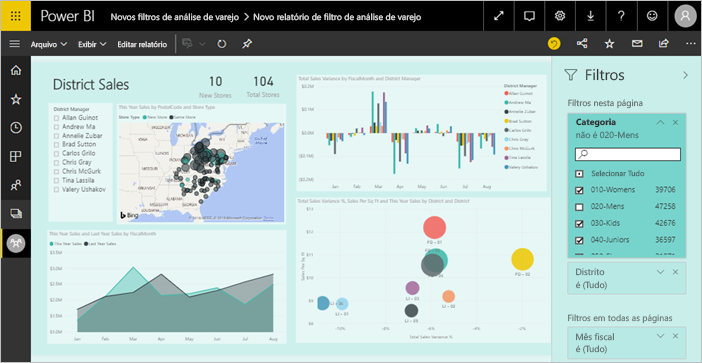
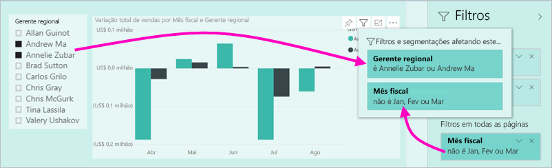
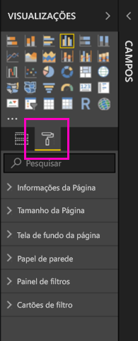
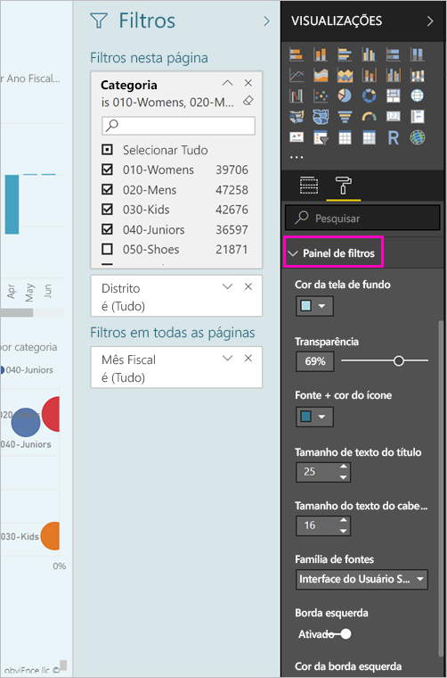
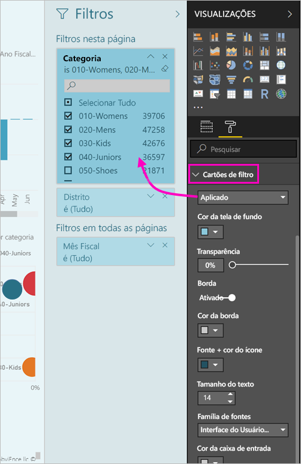

# <a name="the-new-filter-experience-in-power-bi-reports-preview"></a>A nova experiência de filtro em relatórios do Power BI (versão prévia)

Os filtros no Power BI têm novas funcionalidades e um novo design. Quando você escolhe para a nova experiência de filtro, você pode formatar o painel filtros para se parecer com o restante do relatório. Você pode bloquear e ocultar até mesmo filtros. Ao criar seu relatório, você não verá mais o painel filtros antigo em todos os no painel de visualizações. Você fazer todos os seu filtro de edição e formatação em um único painel de filtros. 



> [!NOTE]
> A nova experiência de filtro está em versão prévia. Os novos builds podem substituir a formatação já definida.

Como um designer de relatórios, aqui está o que você pode fazer no novo painel de filtros único:

- Adicionar e remover campos para filtrar. 
- Altere o estado do filtro.
- Formatar e personalizar o painel filtros, de modo que é o processo faz parte do seu relatório.
- Definir se o painel Filtros fica aberto ou recolhido por padrão quando um consumidor abre o relatório.
- Oculte o painel de filtros de todo ou filtros específicos que você não deseja que os consumidores do relatório para ver.
- Indicador até mesmo a visibilidade e controle abra e recolhido do estado do novo painel de filtros.
- Bloquear filtros os quais você não deseja que os consumidores editem.

Com a nova experiência de filtro, os consumidores do relatório podem também passe o mouse sobre qualquer elemento visual para ver uma lista somente leitura de todos os filtros ou segmentações de dados que afetam esse elemento visual.


## <a name="turn-on-the-new-filter-experience"></a>Ativar a nova experiência de filtro 

Habilite a nova experiência no Power BI Desktop. Depois, você pode modificar os filtros nele ou no serviço do Power BI (https://app.powerbi.com). Como essa nova experiência de filtro está em versão prévia, primeiro você precisa habilitá-la no Power BI Desktop. Se você iniciar criando um relatório no serviço do Power BI, ele não poderá ter os novos filtros.

### <a name="turn-on-new-filters-for-all-new-reports"></a>Ativar novos filtros para todos os relatórios novos

1. No Power BI Desktop, selecione **Arquivo** > **Opções e Configurações** > **Opções** > **Recursos de Visualização** e marque a caixa de seleção **Nova experiência de filtro**. 
2. Reinicie o Power BI Desktop para ver a nova experiência de filtro em todos os relatórios novos.

Depois de reiniciar o Power BI Desktop, ela fica habilitada por padrão para todos os novos relatórios criados.  

### <a name="turn-on-new-filters-for-an-existing-report"></a>Ativar novos filtros para um relatório existente

Você também pode habilitar os novos filtros para relatórios existentes.

1. No Power BI Desktop, em um relatório existente, selecione **Arquivo** > **Opções e Configurações** > **Opções**
2. Na barra de navegação esquerdo, sob **arquivo atual**, selecione **configurações de relatório**.
3. Sob **filtragem experiência**, selecione **habilitar o painel de filtro atualizado e Mostrar filtros no cabeçalho de visual para este relatório**.

## <a name="view-filters-for-a-visual-in-reading-mode"></a>Ver filtros para um visual no modo Leitura

No Modo de Leitura, você pode passar o mouse sobre o ícone de filtro em um visual para ver um pop-up com todos os filtros, segmentações, etc., que afetam esse visual. A formatação de pop-up é o mesmo que a formatação de painel de filtros. 



Estes são os tipos de filtros mostrados por essa exibição: 
- Filtros básicos
- Segmentações
- Realce cruzado 
- Filtragem cruzada
- Filtros avançados
- Primeiros N filtros
- Filtros de Data Relativa
- Sincronizar segmentadores
- Incluir/Excluir filtros
- Filtros passados por uma URL

## <a name="build-the-new-filters-pane"></a>Criar o novo painel de filtros

Depois de habilitar o novo painel de filtros, você pode vê-lo para a direita da página do relatório, formatada por padrão com base em suas configurações de relatório. Você pode usar o novo painel de filtros para configurar quais filtros para incluir e atualizar os filtros existentes no novo painel. O novo painel filtros mostra os leitores do relatório serão exibida quando você publica seu relatório. 

1. Por padrão, os leitores do relatório podem ver o painel filtros. Se não quiser que eles vê-lo, selecione o ícone de olho lado **filtros**.

    

2. Para começar a criar seu novo painel de filtros, arraste os campos de interesse para o novo painel de filtros como visual, página ou filtros de nível de relatório.

Quando você adiciona um elemento visual a uma tela de relatório, o Power BI adiciona automaticamente um filtro para o painel de filtros para cada campo no visual. 

## <a name="lock-or-hide-filters"></a>Bloquear ou ocultar filtros

Você pode bloquear ou ocultar os cartões de filtro individuais. Se você bloquear um filtro, os consumidores do relatório poderão vê-lo, mas não alterá-lo. Se você ocultá-lo, eles não poderão nem vê-lo. Ocultar os cartões de filtro é útil se você precisar ocultar filtros de limpeza de dados que excluem valores nulos ou inesperados. 

- No novo painel de filtros, marque ou desmarque a **Zamknout Filtr** ou **ocultar filtro** ícones em um cartão de filtro.

   

Quanto você desativar essas configurações de logon e logoff no novo painel de filtros, você verá as alterações refletidas no relatório. Filtros ocultos não aparecem na janela pop-up de filtro de um visual.

Você também pode configurar o novo estado do painel de filtros para fluir com seus indicadores de relatório. Os estados aberto, fechado e de visibilidade do painel podem ser marcados como indicadores.
 
## <a name="format-the-new-filters-pane"></a>Formatar o novo painel Filtros

Uma grande parte dessa nova experiência é que você pode formatar o painel de filtros de acordo com a aparência do seu relatório. Você pode formatar o painel filtros diferentes para cada página do relatório. Estes são os elementos que você pode formatar: 

- Cor da tela de fundo
- Transparência da tela de fundo
- Borda ativada ou desativada
- Cor da borda
- Tamanho de fonte, cor e texto de título e o cabeçalho

Você também pode formatar esses elementos para cartões de filtro, dependendo se eles forem aplicados (configurados para algo) ou disponíveis (desmarcados): 

- Cor da tela de fundo
- Transparência da tela de fundo
- Borda: ativada ou desativada
- Cor da borda
- Fonte, cor e tamanho do texto
- Cor da caixa de entrada

### <a name="format-the-filters-pane-and-cards"></a>O painel filtros e cartões de formato

1. No relatório, clique no próprio relatório ou na tela de fundo (*papel de parede*), em seguida, no painel **Visualizações**, selecione **Formato**. 
    Você verá opções para formatar a página do relatório, o papel de parede e também o painel filtros e cartões de filtro.

        

1. Expanda o **painel Filtro** para definir a cor do plano de fundo, o ícone e a borda esquerda, a fim de complementar a página do relatório.

    

1. Expanda **Cartões de filtro** para definir a cor e a borda **Disponível** e **Aplicada**. Se você escolher cores diferentes para os cartões disponível e aplicado, ficará óbvio quais filtros serão aplicados. 
  
    

## <a name="theming-for-filter-pane"></a>Temas para o painel de filtro
Agora você pode modificar as configurações padrão do painel de filtro com o arquivo de tema. Aqui está um trecho de código do tema de exemplo para você começar:

 
```
"outspacePane": [{ 

"backgroundColor": {"solid": {"color": "#0000ff"}}, 

"foregroundColor": {"solid": {"color": "#00ff00"}}, 

"transparency": 50, 

"titleSize": 35, 

"headerSize": 8, 

"fontFamily": "Georgia", 

"border": true, 

"borderColor": {"solid": {"color": "#ff0000"}} 

}], 

"filterCard": [ 

{ 

"$id": "Applied", 

"transparency": 0, 

"backgroundColor": {"solid": {"color": "#ff0000"}}, 

"foregroundColor": {"solid": {"color": "#45f442"}}, 

"textSize": 30, 

"fontFamily": "Arial", 

"border": true, 

"borderColor": {"solid": {"color": "#ffffff"}}, 

"inputBoxColor": {"solid": {"color": "#C8C8C8"}} 

}, 

{ 

"$id": "Available", 

"transparency": 40, 

"backgroundColor": {"solid": {"color": "#00ff00"}}, 

"foregroundColor": {"solid": {"color": "#ffffff"}}, 

"textSize": 10, 

"fontFamily": "Times New Roman", 

"border": true, 

"borderColor": {"solid": {"color": "#123456"}}, 

"inputBoxColor": {"solid": {"color": "#777777"}} 

}] 
```

## <a name="sort-the-filter-pane"></a>Classificar o painel de filtro

Funcionalidade de classificação personalizada é parte da nova experiência de painel de filtro. Criadores de relatório podem arrastar e soltar os filtros para reorganizá-las na ordem desejada.


A ordem de classificação padrão é alfabética para filtros. Para iniciar o modo de classificação personalizada, arraste qualquer filtro para uma nova posição. Você só pode classificar os filtros no nível que se aplicam a – por exemplo, um filtro de nível visual, nível de página ou nível de relatório.

## <a name="filters-pane-scaling"></a>Dimensionamento do painel de filtros

O novo painel de filtros pode ser dimensionado com a página de relatório e elementos visuais, portanto, a página de relatório e filtra painel mantenha-se na proporção entre si.

## <a name="improved-filters-pane-accessibility"></a>Acessibilidade aprimorada de painel de filtros

Melhoramos a navegação de teclado para o novo painel de filtros. Você pode percorrer todas as partes do painel de filtros e use a chave de contexto no teclado ou Shift + F10 para abrir o menu de contexto.


## <a name="rename-filters"></a>Renomear filtros
Quando você está editando o painel filtros, você pode clicar duas vezes no título para editá-lo. Renomear é útil se você quiser atualizar o cartão de filtro para fazer mais sentido para seus usuários finais. Lembre-se de renomear o cartão de filtro faz *não* renomear o nome de exibição do campo na lista de campos. Ela apenas altera o nome de exibição usado no cartão de filtro.


## <a name="restrict-changes-to-filter-type"></a>Restringir alterações para o tipo de filtro

Seção das configurações de relatório que você tem a opção para controlar se os usuários podem alterar o tipo de filtro de experiência na filtragem.


## <a name="next-steps"></a>Próximas etapas

Experimente a nova experiência de filtro. Envie seus comentários para esse recurso e como podemos continuar a melhorá-lo, na [site de ideias do Power BI](https://ideas.powerbi.com/forums/265200-power-bi). 

- [Como usar filtros de relatório](consumer/end-user-report-filter.md)
- [Filtros e realce em relatórios](power-bi-reports-filters-and-highlighting.md)

Mais perguntas? [Experimente a Comunidade do Power BI](http://community.powerbi.com/)

