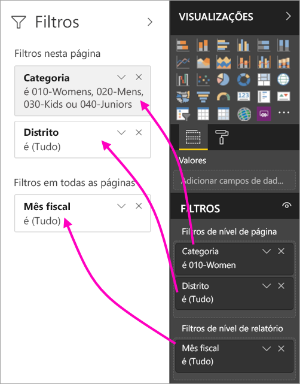
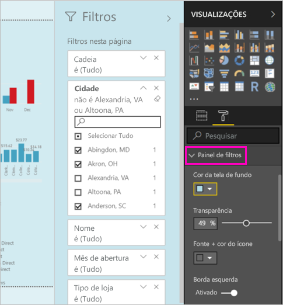
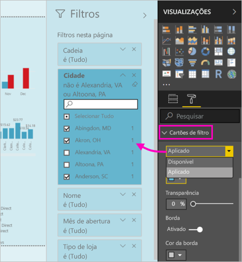

# A nova experiência de filtro em relatórios do Power BI (versão prévia)

Este artigo explica a nova experiência de filtro: Os filtros no Power BI estão recebendo novas funcionalidades e um novo design. Ao criar relatórios no Power BI Desktop ou no serviço do Power BI, você pode fazer o painel Filtros parecer e agir igual a todo o relatório. Na nova experiência, o painel Filtros antigo age como um painel de edição de filtro, e o novo painel Filtro é o único visto pelos consumidores do seu relatório. 
 

Veja a seguir o que você pode fazer com os novos filtros enquanto cria um relatório:

- Mostrar uma exibição somente leitura dos filtros no cabeçalho visual, para que os consumidores saibam exatamente quais filtros ou segmentadores estão afetando o visual.
- Formatar e personalizar o painel de filtro para que ele se integre ao relatório.
- Definir se o painel Filtros fica aberto ou recolhido por padrão quando um consumidor abre o relatório.
- Ocultar todo o painel de filtros ou filtros específicos que você não deseja exibir aos consumidores do relatório.
- Controlar e até mesmo marcar o estado de visibilidade aberto e recolhido do novo painel de filtros.
- Bloquear filtros os quais você não deseja que os consumidores editem.

## Ativar a nova experiência de filtro 

Habilite a nova experiência no Power BI Desktop. Depois, você pode modificar os filtros nele ou no serviço do Power BI (https://app.powerbi.com). Como essa nova experiência de filtro está em versão prévia, primeiro você precisa habilitá-la no Power BI Desktop. Se você iniciar criando um relatório no serviço do Power BI, ele não poderá ter os novos filtros.

### Ativar novos filtros para todos os relatórios novos

1. No Power BI Desktop, selecione **Arquivo** > **Opções e Configurações** > **Opções** > **Recursos de Visualização** e marque a caixa de seleção **Nova experiência de filtro**. 
2. Reinicie o Power BI Desktop para ver a nova experiência de filtro em todos os relatórios novos.

Depois de reiniciar o Power BI Desktop, ela fica habilitada por padrão para todos os novos relatórios criados.  

### Ativar novos filtros para um relatório existente

Você também pode habilitar os novos filtros para relatórios existentes.

1. No Power BI Desktop, em um relatório existente, selecione **Arquivo** > **Opções e Configurações** > **Opções**
2. Em **Configurações do relatório**, selecione **Habilitar o painel de filtro atualizado e mostrar filtros no cabeçalho visual para este relatório**.

## Criar o novo painel de filtros

Depois de habilitar o novo painel de filtros, você pode vê-lo à direita da página do relatório, formatado por padrão com base nas configurações de relatório atuais. O painel de filtro anterior agora atua como o painel de edição de filtro. O novo painel de filtros mostra o que os consumidores do relatório verão quando você publicar o relatório. Atualize os filtros existentes no novo painel, mas use o painel de filtros anterior para configurar os filtros incluídos.

1. Primeiro, decida se deseja que os consumidores do relatório vejam o painel de filtros. Se quiser permitir, selecione o ícone de olho  ao lado de Filtros.

2. Para começar a criar o novo painel de filtros, arraste os campos de interesse para o painel de edição de filtro, como filtros de nível visual, de página ou de relatório. Eles estão no novo painel Filtros.

    

Quando você adiciona um visual a uma tela de relatório, o Power BI adiciona automaticamente um filtro para cada campo no visual. O Power BI não adiciona esses filtros automáticos ao painel de filtros somente leitura. Você precisa selecionar o ícone de olho para adicioná-los explicitamente.

 
## Bloquear ou ocultar filtros

Você pode bloquear ou ocultar os cartões de filtro individuais. Se você bloquear um filtro, os consumidores do relatório poderão vê-lo, mas não alterá-lo. Se você ocultá-lo, eles não poderão nem vê-lo. Ocultar os cartões de filtro é útil se você precisar ocultar filtros de limpeza de dados que excluem valores nulos ou inesperados. 

- No painel de edição de filtro, marque ou desmarque os ícones **Bloquear filtro** ou **Ocultar filtro** em um cartão de filtro.

   

À medida que você ativa ou desativa essas configurações no painel de edição de filtros, pode ver as alterações refletidas no novo painel de filtros. Filtros ocultos não aparecem na janela pop-up de filtro de um visual.

Você também pode configurar o estado do painel de filtros para fluir com os indicadores de relatório. Os estados aberto, fechado e de visibilidade do painel podem ser marcados como indicadores.
 
## Formatar o novo painel Filtros

Uma grande destaque dessa nova experiência é que, agora, você pode formatar o painel de filtros para combiná-lo com a aparência do relatório. Você pode formatar o painel de filtros de acordo com cada página no relatório. Estes são os elementos que você pode formatar: 

- Cor da tela de fundo
- Transparência da tela de fundo
- Ativar ou desativar a borda do painel de filtros
- Cor da borda do painel de filtros

Você também pode formatar esses elementos para cartões de filtro, dependendo se eles forem aplicados (configurados para algo) ou disponíveis (desmarcados): 

- Cor da tela de fundo
- Transparência da tela de fundo
- Borda: ativada ou desativada
- Cor da borda

### Definir o formato para o painel Filtros e cartões

1. No relatório, clique no próprio relatório ou na tela de fundo (*papel de parede*), em seguida, no painel **Visualizações**, selecione **Formato**. 
    Você verá as opções de formatação da página do relatório, o papel de parede e também o painel Filtro e Cartões de filtro.

        

1. Expanda o **painel Filtro** para definir a cor do plano de fundo, o ícone e a borda esquerda, a fim de complementar a página do relatório.

    

1. Expanda **Cartões de filtro** para definir a cor e a borda **Disponível** e **Aplicada**. Se você escolher cores diferentes para os cartões disponível e aplicado, ficará óbvio quais filtros serão aplicados. 
  
    

## Ver filtros para um visual no modo Leitura

No Modo de Leitura, você pode passar o mouse sobre o ícone de filtro em um visual para ver um pop-up com todos os filtros, segmentações, etc., que afetam esse visual. A formatação de pop-up é igual à formatação do painel de filtros. 

Estes são os tipos de filtros mostrados por essa exibição: 
- Filtros básicos
- Segmentações
- Realce cruzado 
- Filtragem cruzada
- Filtros avançados
- Primeiros N filtros
- Filtros de Data Relativa
- Sincronizar segmentadores
- Incluir/Excluir filtros
- Filtros passados por uma URL

## Em breve

Nos próximos meses, planejamos incorporar os seguintes aprimoramentos:
- Capacidade de alterar a ordem dos cartões de filtro
- Experiência de painel único de filtro para os criadores de relatório 
- Mais opções de formatação

Experimente a nova experiência de filtro. Forneça seus comentários sobre esse recurso e como podemos continuar melhorando essa experiência. 

## Próximas etapas
[Como usar filtros de relatório](consumer/end-user-report-filter.md)

[Filtros e realce em relatórios](power-bi-reports-filters-and-highlighting.md)

[Interação com os filtros e realce no relatório de exibição de leitura](consumer/end-user-reading-view.md)

[Alterar como elementos visuais de relatórios executam filtro cruzado e realce cruzado entre si](consumer/end-user-interactions.md)

Mais perguntas? [Experimente a Comunidade do Power BI](http://community.powerbi.com/)

