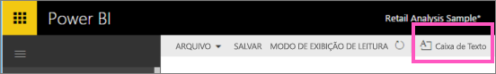
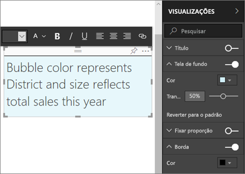
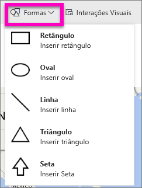
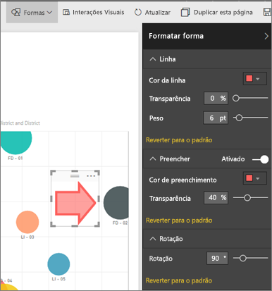

# Caixas de texto e formas nos relatórios do Power BI
É possível adicionar caixas de texto e formas a relatórios usando o serviço do Power BI e o Power BI Desktop. Em ambos os casos, você deve ter permissões de edição para o relatório. Se um relatório tiver sido compartilhado com você no serviço do Power BI, você não terá permissões de edição. 

Veja como Pedro usa o Power BI Desktop para [adicionar imagens estáticas a um relatório](guided-learning/visualizations.yml?tutorial-step=11) e, em seguida, siga as etapas abaixo para testá-lo por conta própria usando o serviço do Power BI.
> 
> <iframe width="560" height="315" src="https://www.youtube.com/embed/_3q6VEBhGew" frameborder="0" allowfullscreen></iframe>
> 

## Adicionar uma caixa de texto a um relatório
1. Abra um relatório no modo de exibição de Edição.

2. Coloque o cursor em qualquer área em branco na tela do relatório e selecione **Caixa de texto** no menu superior.
   
   
3. Digite o texto na caixa de texto e, opcionalmente, defina a fonte da formatação, a cor e o alinhamento do texto. 
   
   
4. Para posicionar a caixa de texto, selecione a área cinza na parte superior e arraste. Para redimensionar a caixa de texto, selecione e arraste uma das alças do contorno. 
   
   

5. Com a caixa de texto ainda selecionada, adicione uma formatação adicional no painel **Visualizações**. Neste exemplo, formatamos a tela de fundo e a borda. Você também pode criar um tamanho exato e uma posição para uma caixa de texto.  

   

6. Para fechar a caixa de texto, selecione qualquer espaço em branco na tela de relatório. 

7. Selecione o ícone fixar   para fixar a caixa de texto em um dashboard. 

## Adicionar uma forma a um relatório
1. Posicione seu cursor em qualquer lugar na tela do relatório e selecione **Formas**.
   
   
2. No menu suspenso, selecione uma forma para adicioná-la à tela do seu relatório. Neste exemplo, adicione uma seta para direcionar a atenção para a bolha com a maior variação total de vendas. 
   
   No painel **Formatar forma**, personalize sua forma. Neste exemplo, criamos uma seta vermelha com uma borda vermelho escuro, girada em 90 graus.
   
   
3. Para posicionar a forma, selecione a área cinza na parte superior e arraste. Para redimensionar a forma, selecione e arraste uma das alças do contorno. Assim como acontece com a caixa de texto, você também poderá criar um tamanho exato e uma posição para uma forma.

   > [!NOTE]
   > formas não podem ser anexadas a um dashboard, exceto como um dos elementos visuais quando você [fixa uma página dinâmica](service-dashboard-pin-live-tile-from-report.md). 
   > 
   > 

## Próximas etapas
[Adicionar um hiperlink a uma caixa de texto](service-add-hyperlink-to-text-box.md)

[Conceitos básicos para designers no serviço do Power BI](service-basic-concepts.md)

Mais perguntas? [Experimente a Comunidade do Power BI](http://community.powerbi.com/)
